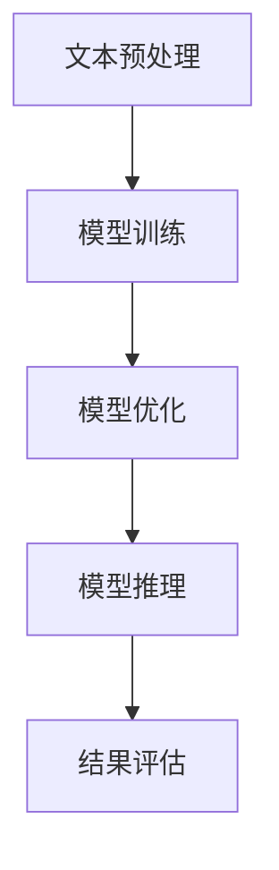

                 


# 如何识别企业的深度学习自然语言生成技术优势

> 关键词：自然语言生成技术、深度学习、NLP、企业优势、技术评估

> 摘要：本文将从深度学习自然语言生成技术的核心概念、算法原理、系统架构、项目实战等多维度进行详细分析，帮助读者全面了解如何识别和评估企业中的深度学习自然语言生成技术优势。文章结合实际案例，深入剖析技术原理，并提供实用的评估方法和建议，以帮助企业在实际应用中更好地利用深度学习自然语言生成技术。

---

# 第一部分: 深度学习自然语言生成技术概述

## 第1章: 自然语言生成技术的背景与现状

### 1.1 自然语言生成技术的背景
#### 1.1.1 自然语言生成技术的定义
自然语言生成（Natural Language Generation, NGL）是指通过计算机技术生成符合人类语言习惯的文本，使其能够与人类进行自然的交流。NGL的核心目标是让计算机能够理解并生成与人类语言相似的文本。

#### 1.1.2 深度学习对自然语言生成技术的推动
随着深度学习技术的发展，NGL技术取得了显著的进步。深度学习通过神经网络模型，能够自动学习文本中的语义信息，生成更加自然的文本。

#### 1.1.3 企业级应用中的自然语言生成技术
在企业级应用中，NGL技术被广泛应用于聊天机器人、智能客服、内容生成、自动报告等领域。这些应用能够显著提升企业的效率和用户体验。

### 1.2 深度学习自然语言生成技术的发展现状
#### 1.2.1 从传统NLP到深度学习NLP的演变
传统的NLP技术依赖于规则和统计方法，而深度学习通过神经网络模型，能够更好地捕捉文本中的语义信息，从而实现更高效的文本生成。

#### 1.2.2 当前主流的自然语言生成模型
目前，主流的自然语言生成模型包括GPT系列、BERT、Transformer等。这些模型在文本生成、问答系统、机器翻译等领域取得了显著的成果。

#### 1.2.3 企业应用中的自然语言生成技术趋势
随着技术的不断发展，企业级应用中的NGL技术正在向更加智能化、个性化和实时化的方向发展。企业越来越依赖NGL技术来提升其业务效率和用户体验。

## 第2章: 深度学习自然语言生成技术的核心概念

### 2.1 自然语言生成技术的核心概念
#### 2.1.1 自然语言生成技术的基本原理
自然语言生成技术的核心原理是通过神经网络模型，将输入的文本信息转化为输出的自然语言文本。这一过程涉及到文本的编码、解码和生成等步骤。

#### 2.1.2 深度学习在自然语言生成中的作用
深度学习通过神经网络模型，能够自动学习文本中的语义信息，生成更加自然的文本。深度学习的引入使得NGL技术的生成效果和效率都得到了显著提升。

#### 2.1.3 自然语言生成技术的关键指标
在评估自然语言生成技术时，需要关注生成文本的准确率、流畅度、相关性等关键指标。这些指标能够帮助企业更好地评估NGL技术的优势和不足。

### 2.2 深度学习自然语言生成技术的核心算法
#### 2.2.1 变压器（Transformer）模型
Transformer模型是一种基于自注意力机制的深度学习模型，广泛应用于自然语言处理领域。其核心思想是通过自注意力机制，捕捉文本中的语义信息，从而实现高效的文本生成。

#### 2.2.2 GPT系列模型
GPT（Generative Pre-trained Transformer）是一种基于Transformer架构的预训练模型，具有强大的文本生成能力。GPT模型通过自回归的方式生成文本，能够生成连贯且自然的文本。

#### 2.2.3 BERT模型
BERT（Bidirectional Encoder Representations from Transformers）是一种基于Transformer架构的预训练模型，主要用于文本理解和生成。BERT模型通过双向编码，能够更好地捕捉文本中的语义信息。

## 第3章: 企业的深度学习自然语言生成技术优势

### 3.1 企业深度学习自然语言生成技术的优势
#### 3.1.1 数据优势
企业通常拥有大量的内部数据，包括客户咨询、业务文档、交易记录等。这些数据为企业级NGL技术提供了丰富的训练材料，能够显著提升模型的生成效果。

#### 3.1.2 场景优势
企业通常具备特定的业务场景，例如智能客服、内容生成等。NGL技术能够根据企业的具体需求，生成符合企业特色的文本，从而提升用户体验和业务效率。

#### 3.1.3 技术优势
企业通常拥有强大的技术团队和计算资源，能够对NGL技术进行深度优化和定制化开发。这使得企业在NGL技术的应用中更具竞争力。

### 3.2 企业深度学习自然语言生成技术的劣势
#### 3.2.1 数据隐私问题
企业级NGL技术的应用通常需要处理大量的内部数据，这可能导致数据隐私问题。企业需要在数据使用和隐私保护之间找到平衡点。

#### 3.2.2 计算资源限制
深度学习模型的训练和推理需要大量的计算资源，这可能会给企业带来较高的成本和资源消耗。

#### 3.2.3 模型泛化能力不足
企业级NGL技术通常是针对特定场景进行优化，这可能导致模型在其他场景下的泛化能力不足。企业需要在模型的定制化和通用性之间进行权衡。

## 第4章: 深度学习自然语言生成技术的数学模型与算法原理

### 4.1 变压器（Transformer）模型的数学原理
#### 4.1.1 注意力机制的数学公式
注意力机制通过计算输入序列中每个位置的权重，生成一个加权后的输出序列。其数学公式如下：
$$
\text{Attention}(Q, K, V) = \text{softmax}\left(\frac{QK^T}{\sqrt{d_k}}\right)V
$$
其中，$Q$、$K$、$V$分别是查询、键和值向量，$d_k$是向量的维度。

#### 4.1.2 编码器-解码器结构
Transformer模型的编码器负责将输入序列编码为一个上下文向量，解码器则根据编码器输出的上下文向量生成输出序列。

#### 4.1.3 多头注意力机制
多头注意力机制通过并行计算多个注意力头，能够更好地捕捉文本中的语义信息。其数学公式如下：
$$
\text{Multi-head}(Q, K, V) = \text{Concat}(\text{head}_1, \text{head}_2, \dots, \text{head}_n)
$$
其中，$n$是注意力头的数量。

### 4.2 GPT系列模型的数学原理
#### 4.2.1 自回归语言模型
GPT模型是一种自回归语言模型，通过逐个生成文本中的字符或单词，生成连贯的文本。其数学公式如下：
$$
P(\text{y}_{i}) = \text{softmax}(W_{h} h_{i-1})
$$
其中，$h_{i-1}$是前一个位置的隐藏状态，$W_{h}$是权重矩阵。

#### 4.2.2 梯度下降优化算法
GPT模型通常使用梯度下降优化算法，例如Adam优化器，来优化模型的参数。其数学公式如下：
$$
\theta_{t+1} = \theta_t - \eta \frac{\partial L}{\partial \theta_t}
$$
其中，$\theta_t$是当前的参数，$\eta$是学习率，$L$是损失函数。

#### 4.2.3 模型训练的数学公式
GPT模型的训练目标是最小化生成文本的负对数似然。其数学公式如下：
$$
\text{Loss} = -\sum_{i=1}^{n} \log P(\text{y}_i | y_{<i})
$$
其中，$n$是文本的长度，$P(\text{y}_i | y_{<i})$是第$i$个位置的条件概率。

### 4.3 BERT模型的数学原理
#### 4.3.1 预训练目标函数
BERT模型通过预训练任务（如遮蔽词预测、下文句预测）来优化模型的参数。其预训练目标函数如下：
$$
\text{Loss} = \text{Loss}_{\text{ MLM}} + \text{Loss}_{\text{ NSP}}
$$
其中，$\text{Loss}_{\text{MLM}}$是遮蔽词预测的损失，$\text{Loss}_{\text{NSP}}$是下文句预测的损失。

#### 4.3.2 掩码自注意力机制
BERT模型使用掩码自注意力机制，确保模型在生成过程中只能看到之前的文本内容。其数学公式如下：
$$
\text{Masked-Attention}(Q, K, V) = \text{softmax}\left(\frac{QK^T}{\sqrt{d_k}} \cdot \text{Mask}\right)V
$$
其中，$\text{Mask}$是掩码矩阵。

#### 4.3.3 模型训练的数学公式
BERT模型的训练目标是最小化预训练任务的损失函数。其数学公式如下：
$$
\text{Loss} = \text{Loss}_{\text{ MLM}} + \text{Loss}_{\text{ NSP}}
$$

## 第5章: 企业的深度学习自然语言生成技术优势

### 5.1 企业深度学习自然语言生成技术的优势
#### 5.1.1 数据优势
企业通常拥有大量的内部数据，包括客户咨询、业务文档、交易记录等。这些数据为企业级NGL技术提供了丰富的训练材料，能够显著提升模型的生成效果。

#### 5.1.2 场景优势
企业通常具备特定的业务场景，例如智能客服、内容生成等。NGL技术能够根据企业的具体需求，生成符合企业特色的文本，从而提升用户体验和业务效率。

#### 5.1.3 技术优势
企业通常拥有强大的技术团队和计算资源，能够对NGL技术进行深度优化和定制化开发。这使得企业在NGL技术的应用中更具竞争力。

### 5.2 企业深度学习自然语言生成技术的劣势
#### 5.2.1 数据隐私问题
企业级NGL技术的应用通常需要处理大量的内部数据，这可能导致数据隐私问题。企业需要在数据使用和隐私保护之间找到平衡点。

#### 5.2.2 计算资源限制
深度学习模型的训练和推理需要大量的计算资源，这可能会给企业带来较高的成本和资源消耗。

#### 5.2.3 模型泛化能力不足
企业级NGL技术通常是针对特定场景进行优化，这可能导致模型在其他场景下的泛化能力不足。企业需要在模型的定制化和通用性之间进行权衡。

## 第6章: 深度学习自然语言生成技术的系统架构与实现

### 6.1 系统架构设计
#### 6.1.1 系统模块划分
NGL系统通常包括文本预处理模块、模型训练模块、模型推理模块和结果评估模块。

#### 6.1.2 系统功能设计
NGL系统需要具备文本生成、文本评估、模型优化等功能。

#### 6.1.3 系统架构图


### 6.2 系统实现
#### 6.2.1 环境安装
NGL系统的实现需要安装Python、TensorFlow、Keras等开发工具。

#### 6.2.2 核心实现代码
```python
import tensorflow as tf
from tensorflow.keras import layers

def build_model(max_length):
    model = tf.keras.Sequential()
    model.add(layers.Embedding(input_dim=10000, output_dim=100, input_length=max_length))
    model.add(layers.LSTM(64, return_sequences=True))
    model.add(layers.Dense(20, activation='relu'))
    model.add(layers.Dense(1, activation='sigmoid'))
    return model
```

#### 6.2.3 代码解读与分析
上述代码定义了一个简单的NGL模型，包括嵌入层、LSTM层和全连接层。模型通过嵌入层将输入文本转换为向量，通过LSTM层捕捉文本的序列信息，最后通过全连接层生成输出结果。

## 第7章: 项目实战

### 7.1 项目背景
本项目旨在开发一个智能客服系统，利用NGL技术生成自然的回复文本。

### 7.2 项目实现
#### 7.2.1 环境安装
安装Python、TensorFlow、Keras等开发工具。

#### 7.2.2 核心代码实现
```python
import tensorflow as tf
from tensorflow.keras import layers

def build_model(max_length):
    model = tf.keras.Sequential()
    model.add(layers.Embedding(input_dim=10000, output_dim=100, input_length=max_length))
    model.add(layers.LSTM(64, return_sequences=True))
    model.add(layers.Dense(20, activation='relu'))
    model.add(layers.Dense(1, activation='sigmoid'))
    return model
```

#### 7.2.3 系统实现与测试
通过训练数据对模型进行训练，并在测试数据上评估模型的生成效果。

### 7.3 案例分析
通过对实际案例的分析，验证NGL技术在智能客服系统中的应用效果。

## 第8章: 总结与展望

### 8.1 总结
本文详细介绍了深度学习自然语言生成技术的核心概念、算法原理、系统架构和项目实战。通过对企业级NGL技术的优势和劣势的分析，帮助企业更好地识别和评估NGL技术的应用价值。

### 8.2 展望
未来，随着深度学习技术的不断发展，企业级NGL技术将更加智能化和个性化。企业需要在技术优化和应用创新方面不断努力，以更好地利用NGL技术提升业务效率和用户体验。

### 8.3 最佳实践 Tips
- 在选择NGL技术时，需要综合考虑企业的数据资源、技术能力和业务需求。
- 在模型训练和推理过程中，需要合理配置计算资源，以确保模型的高效运行。
- 在实际应用中，需要注重数据隐私保护，避免因数据泄露而引发的风险。

### 8.4 小结
通过本文的分析和指导，读者能够更好地识别和评估企业中的深度学习自然语言生成技术优势，从而为企业级NGL技术的应用提供有力的支持。

### 8.5 注意事项
- 在使用NGL技术时，需要确保模型的生成结果符合企业的业务规范和法律法规。
- 在模型优化和部署过程中，需要注意模型的稳定性和可扩展性。

### 8.6 拓展阅读
- 《Deep Learning for Natural Language Processing》
- 《Transformers: State-of-the-art Natural Language Processing》
- 《BERT: Pre-training of Deep Bidirectional Transformers for

