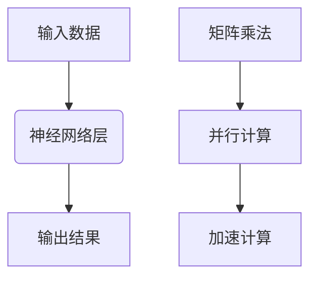
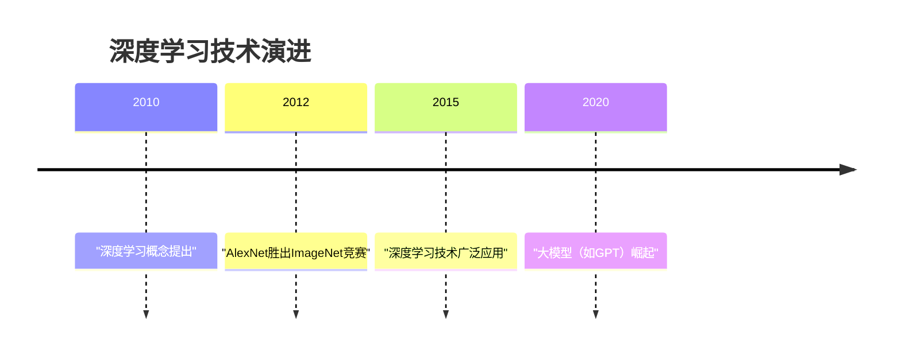
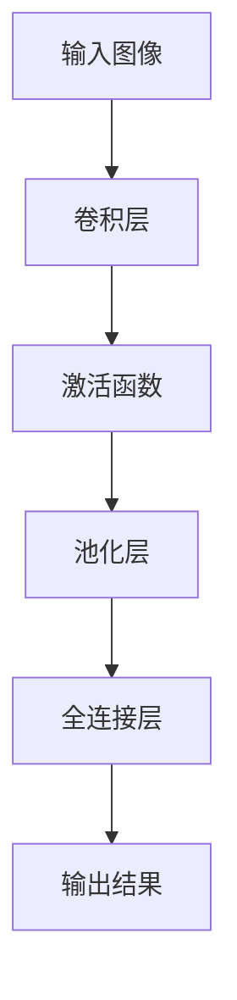
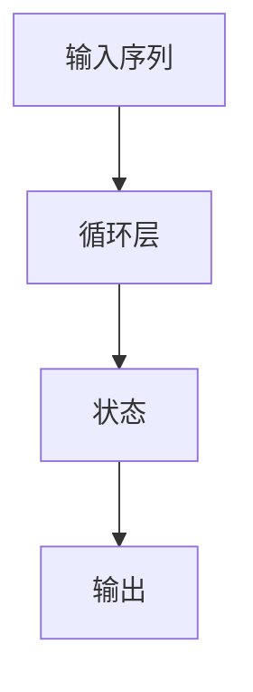
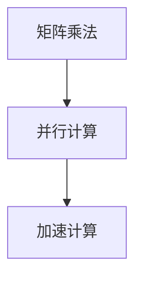
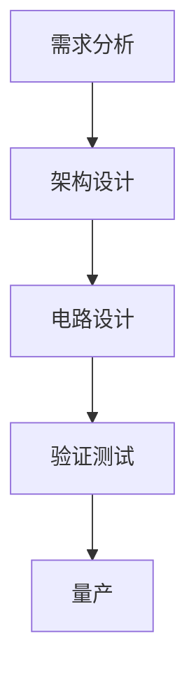
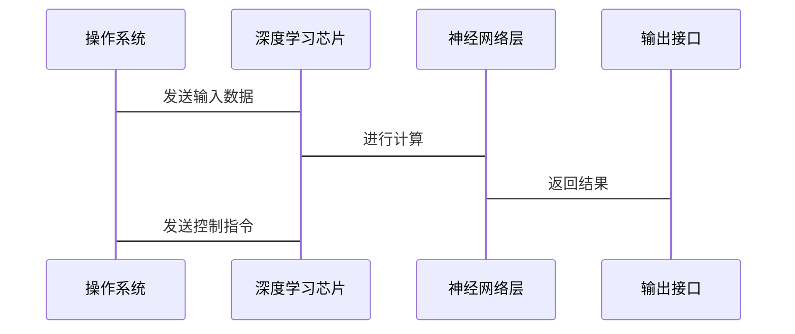

                 


# 如何识别企业的深度学习芯片设计优势

> 关键词：深度学习芯片、芯片设计、企业优势、技术分析、系统架构

> 摘要：本文将深入分析企业的深度学习芯片设计优势，涵盖背景、技术原理、设计方法、系统架构以及实战案例，帮助读者识别和理解深度学习芯片设计的核心要素，从而在企业实践中应用这些优势。

---

# 第一部分: 深度学习芯片设计背景与概念

# 第1章: 深度学习芯片设计的背景与现状

## 1.1 深度学习芯片的定义与核心概念

### 1.1.1 深度学习芯片的基本定义
深度学习芯片，也称为AI芯片或深度学习加速器，是一种专为加速深度学习算法计算而设计的硬件。它通过并行计算能力，显著提升了神经网络模型的训练和推理效率。

**mermaid图：深度学习芯片的计算模型**



深度学习芯片的核心在于优化神经网络的计算过程，特别是矩阵运算。这些运算通常在GPU、TPU（张量处理单元）或自定义ASIC（专用集成电路）上进行加速。

### 1.1.2 深度学习芯片的核心属性

| 属性 | 描述 |
|------|------|
| 并行计算能力 | 支持大规模并行计算，加速神经网络推理 |
| 能效比 | 在单位功耗下提供更高的计算性能 |
| 灵活性 | 支持多种深度学习模型和架构 |

### 1.1.3 深度学习芯片的分类与应用场景

| 类型 | 描述 | 应用场景 |
|------|------|----------|
| GPU | 通用性强，适合多种任务 | 数据中心训练、图形渲染 |
| TPU | 专为深度学习优化 | 大规模模型推理 |
| ASIC | 为特定任务设计 | 专用AI设备、边缘计算 |

## 1.2 深度学习技术的演进与挑战

### 1.2.1 深度学习技术的演进历程



深度学习从2010年的概念提出，经历了AlexNet的突破，到2015年的广泛应用，再到2020年大模型的崛起，逐步成为AI领域的核心。

### 1.2.2 当前深度学习技术的核心挑战

| 挑战 | 描述 |
|------|------|
| 计算效率 | 模型训练和推理耗时长 |
| 能耗问题 | 高能耗限制了应用场景 |
| 模型复杂度 | 复杂模型难以部署 |

### 1.2.3 深度学习芯片在企业中的价值

深度学习芯片通过加速计算，显著降低了企业的计算成本，提升了模型训练和推理的效率，为企业在AI领域的竞争中提供了优势。

## 1.3 企业深度学习芯片设计的优势与劣势

### 1.3.1 企业深度学习芯片设计的核心优势

| 优势 | 描述 |
|------|------|
| 业务需求匹配 | 企业可以根据自身需求定制芯片 |
| 技术积累 | 企业通常具备丰富的芯片设计经验 |
| 资源支持 | 企业可以投入更多资源进行研发 |

### 1.3.2 企业深度学习芯片设计的主要劣势

| 劣势 | 描述 |
|------|------|
| 成本高昂 | 芯片设计和生产成本高 |
| 周期长 | 从设计到量产周期较长 |
| 技术难度高 | 芯片设计需要高精尖技术 |

### 1.3.3 企业深度学习芯片设计的未来趋势

随着AI技术的不断发展，企业对定制化深度学习芯片的需求将增加，尤其是在边缘计算和实时处理场景中。

---

# 第二部分: 深度学习芯片设计的核心技术

# 第2章: 深度学习芯片的计算模型与架构

## 2.1 深度学习芯片的计算模型

### 2.1.1 深度学习芯片的计算模型概述

深度学习芯片的计算模型主要基于矩阵运算，特别是卷积神经网络（CNN）和循环神经网络（RNN）。

### 2.1.2 常见的深度学习计算模型

#### 卷积神经网络（CNN）



#### 循环神经网络（RNN）



### 2.1.3 深度学习模型的并行计算特点

深度学习模型的并行计算可以通过数据并行和模型并行实现，显著提升了计算效率。

## 2.2 深度学习芯片的架构设计

### 2.2.1 深度学习芯片的架构类型

| 架构类型 | 描述 |
|------|------|
| GPU | 通用性强，适合多种任务 |
| TPU | 专为深度学习优化 |
| ASIC | 为特定任务设计 |

### 2.2.2 基于矩阵运算的芯片架构设计



深度学习芯片通过优化矩阵乘法的并行计算，显著提升了计算效率。

### 2.2.3 芯片架构对性能的影响

芯片架构设计直接影响计算性能、功耗和成本。优化的架构设计可以在性能和成本之间找到平衡点。

## 2.3 深度学习芯片的制程工艺

### 2.3.1 芯片制程工艺的基本概念

制程工艺是指芯片制造的最小线宽，通常以纳米为单位。更小的线宽意味着更高的集成度和更低的功耗。

### 2.3.2 先进制程工艺对芯片性能的提升

先进制程工艺（如5nm、3nm）显著提升了芯片的计算能力和能效比。

### 2.3.3 制程工艺与成本的平衡

虽然先进制程工艺性能优越，但成本高昂，企业需要在性能和成本之间找到平衡。

## 2.4 本章小结

深度学习芯片的设计需要综合考虑计算模型、架构设计和制程工艺。优化的架构设计和先进的制程工艺可以显著提升芯片的性能和能效比。

---

# 第三部分: 深度学习芯片设计的方法论

# 第3章: 企业深度学习芯片设计的方法论

## 3.1 深度学习芯片设计的需求分析

### 3.1.1 企业深度学习芯片设计的目标

企业深度学习芯片设计的目标是通过优化芯片架构和制程工艺，提升模型训练和推理的效率。

### 3.1.2 需求分析的关键步骤

| 步骤 | 描述 |
|------|------|
| 明确目标 | 确定芯片的设计目标 |
| 分析场景 | 了解芯片的应用场景 |
| 确定性能指标 | 设定芯片的性能目标 |

### 3.1.3 需求分析中的常见误区

| 误区 | 描述 |
|------|------|
| 过度追求性能 | 忽略了成本和实际需求 |
| 忽略实际场景 | 设计不符合实际应用需求 |
| 低估技术难度 | 对芯片设计的技术难度估计不足 |

## 3.2 深度学习芯片的设计流程

### 3.2.1 芯片设计的基本流程



### 3.2.2 深度学习芯片设计的独特性

深度学习芯片设计需要考虑并行计算、低功耗和高能效等因素。

### 3.2.3 设计流程中的关键节点

| 关键节点 | 描述 |
|------|------|
| 架构设计 | 确定芯片的计算架构 |
| 电路设计 | 实现芯片的逻辑电路 |
| 验证测试 | 验证芯片的功能和性能 |

## 3.3 深度学习芯片的优化策略

### 3.3.1 芯片架构优化策略

| 优化策略 | 描述 |
|------|------|
| 并行计算 | 提升计算效率 |
| 稀疏化 | 减少计算量 |
| 深度量化 | 降低计算精度 |

### 3.3.2 模型压缩与量化技术

#### 模型压缩

模型压缩通过剪枝和知识蒸馏等技术，减少模型的参数量，降低计算复杂度。

#### 量化技术

量化技术通过降低数据精度（如从32位浮点数降到8位整数），减少计算量和存储需求。

### 3.3.3 芯片能效优化方法

| 方法 | 描述 |
|------|------|
| 动态电压调节 | 根据计算负载调整电压 |
| 任务调度优化 | 优化任务的调度策略 |
| 睡眠模式 | 在空闲时关闭不必要的模块 |

## 3.4 本章小结

企业深度学习芯片的设计需要从需求分析、架构设计到优化策略的全生命周期进行优化，以实现高性能和低能耗的目标。

---

# 第四部分: 深度学习芯片系统架构与实现

# 第4章: 企业深度学习芯片的系统架构与实现

## 4.1 深度学习芯片的系统设计

### 4.1.1 系统设计的背景介绍

深度学习芯片的系统设计需要考虑硬件和软件的协同优化，以实现高效的计算性能。

### 4.1.2 系统功能设计

#### 领域模型

```mermaid
classDiagram
    class 深度学习芯片 {
        输入接口
        输出接口
        计算单元
        控制单元
    }
    深度学习芯片 <-- 关联> 神经网络模型
    深度学习芯片 <-- 关联> 软件框架
```

深度学习芯片需要与神经网络模型和软件框架进行交互，实现高效的计算。

### 4.1.3 系统架构设计

#### 系统架构图


### 4.1.4 系统接口设计

| 接口 | 描述 |
|------|------|
| 输入接口 | 接收输入数据 |
| 输出接口 | 输出计算结果 |
| 控制接口 | 接收控制指令 |

### 4.1.5 系统交互设计



## 4.2 深度学习芯片的实现

### 4.2.1 环境搭建

#### 硬件环境

- 开发板：如NVIDIA Jetson Nano
- 软件环境：Linux系统、深度学习框架（如TensorFlow、PyTorch）

### 4.2.2 系统核心实现源代码

#### 矩阵乘法优化代码

```python
import numpy as np

def matrix_mult(a, b):
    return np.dot(a, b)

# 示例输入
a = np.array([[1, 2], [3, 4]])
b = np.array([[5, 6], [7, 8]])
result = matrix_mult(a, b)
print(result)
```

#### 并行计算实现代码

```python
import multiprocessing

def compute_chunk(chunk):
    return chunk * 2

def parallel_computation(data):
    with multiprocessing.Pool() as pool:
        results = pool.map(compute_chunk, data)
        return results

data = [1, 2, 3, 4, 5]
print(parallel_computation(data))
```

### 4.2.3 代码应用解读与分析

上述代码展示了如何在Python中实现矩阵乘法和并行计算。矩阵乘法通过numpy的dot函数实现，而并行计算则利用了multiprocessing模块。

### 4.2.4 案例分析与详细讲解

以图像分类任务为例，深度学习芯片可以加速卷积神经网络的计算，显著提升分类效率。

### 4.2.5 项目小结

通过实际项目，我们可以看到深度学习芯片在加速计算中的巨大优势。然而，芯片设计的复杂性和高成本也带来了不小的挑战。

---

# 第五部分: 深度学习芯片设计的拓展与总结

# 第5章: 深度学习芯片设计的总结与展望

## 5.1 项目总结

### 5.1.1 项目成果

通过本项目，我们深入理解了深度学习芯片的设计流程和技术要点，掌握了矩阵运算优化和并行计算的实现方法。

### 5.1.2 经验总结

| 经验 | 描述 |
|------|------|
| 早期规划 | 设计阶段需充分考虑芯片的应用场景 |
| 资源分配 | 合理分配硬件和软件资源 |
| 团队协作 | 强调跨团队协作的重要性 |

## 5.2 深度学习芯片设计的未来展望

### 5.2.1 技术趋势

- **新材料应用**：如石墨烯和碳纳米管在芯片制造中的应用。
- **新架构设计**：如量子计算和类脑计算的兴起。
- **AI芯片生态**：构建完善的芯片生态系统，推动技术的普及和应用。

### 5.2.2 企业的角色与责任

企业应继续加大在深度学习芯片设计领域的投入，推动技术创新和应用落地。同时，企业需要关注芯片设计的成本、性能和能效比，找到最佳的平衡点。

## 5.3 最佳实践 tips

- **选择合适的工具链**：根据项目需求选择合适的开发工具和框架。
- **注重团队协作**：深度学习芯片设计需要多部门协作，强调沟通与协调。
- **持续优化**：在设计过程中不断优化架构和算法，提升性能和能效比。

## 5.4 本章小结

深度学习芯片设计是一项复杂而重要的任务，企业需要在技术、成本和性能之间找到最佳平衡点。未来，随着技术的进步和需求的增长，深度学习芯片将在更多领域发挥重要作用。

---

通过以上分析，我们可以看到深度学习芯片设计的复杂性和重要性。企业需要综合考虑技术、成本和性能等多方面因素，才能设计出具有竞争力的深度学习芯片。未来，随着技术的进步和需求的增长，深度学习芯片将在更多领域发挥重要作用。

