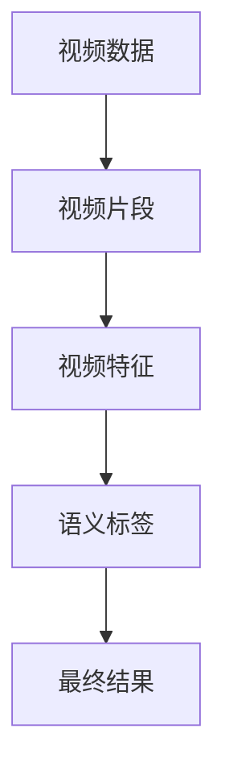
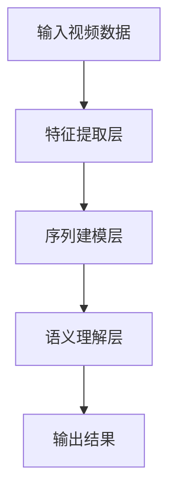
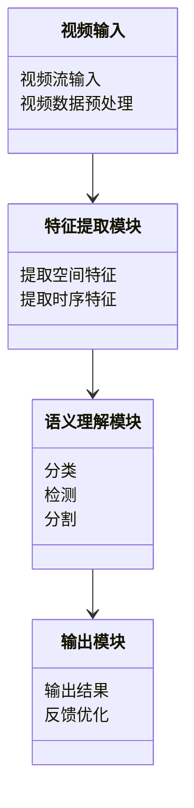
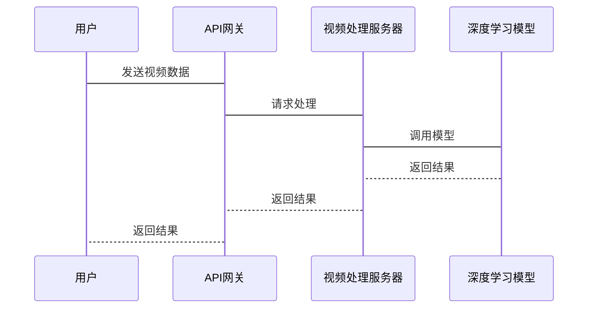

                 


# 如何识别企业的深度学习视频理解技术优势

## 关键词：深度学习，视频理解，企业应用，技术优势，算法原理，系统架构

## 摘要：  
深度学习视频理解技术正在改变企业处理视频数据的方式。本文将详细分析如何识别和评估企业的深度学习视频理解技术优势，涵盖技术背景、核心概念、算法原理、系统架构以及实际项目应用，帮助读者全面理解该技术的优势及应用场景。

---

# 第一部分: 深度学习视频理解技术背景与核心概念

## 第1章: 深度学习视频理解技术的背景与问题定义

### 1.1 深度学习与视频理解的背景
#### 1.1.1 深度学习的定义与技术演进
- **深度学习**是一种人工智能技术，通过多层神经网络模拟人脑的学习方式。
- 技术演进：从CNN到Transformer，深度学习在图像和视频处理中的应用不断扩展。

#### 1.1.2 视频理解技术的定义与应用领域
- **视频理解**：通过深度学习模型对视频内容进行识别、分类、语义分析等。
- 应用领域：安防监控、智能客服、自动驾驶、医疗影像分析等。

#### 1.1.3 企业视频理解技术的现状与趋势
- 现状：企业 increasingly采用深度学习技术处理视频数据。
- 趋势：实时性、准确性、可解释性成为未来发展的重点。

### 1.2 企业视频理解技术的核心问题
#### 1.2.1 视频数据的特点与挑战
- **特点**：高维、时序性、异构性。
- **挑战**：计算资源消耗大，数据标注难，模型训练复杂。

#### 1.2.2 深度学习在视频理解中的优势
- **优势**：自动特征提取、端到端学习、处理复杂模式。

#### 1.2.3 企业视频理解技术的边界与外延
- **边界**：专注于视频数据的处理，不涉及音频或文本。
- **外延**：与计算机视觉、自然语言处理等技术的结合。

## 第2章: 深度学习视频理解技术的核心概念与联系

### 2.1 核心概念原理
#### 2.1.1 深度学习模型在视频理解中的作用
- **作用**：自动提取视频中的时空特征，进行分类、检测和分割。

#### 2.1.2 视频特征提取与语义理解的原理
- **特征提取**：通过CNN提取空间特征，通过RNN提取时序特征。
- **语义理解**：基于上下文和语义关联，进行视频内容的理解和推理。

#### 2.1.3 深度学习与传统计算机视觉的结合
- **结合点**：将传统方法的定位技术与深度学习的特征提取能力结合。

### 2.2 核心概念属性特征对比表
| 特性         | 深度学习模型         | 传统视频处理方法 |
|--------------|---------------------|------------------|
| **特征提取** | 自动学习，端到端     | 手工设计，规则驱动 |
| **计算效率** | 高，但资源消耗大     | 低，但实现简单 |
| **适应性**   | 强，能处理复杂场景   | 弱，依赖人工设计 |

### 2.3 ER实体关系图架构


### 2.4 本章小结
本章通过对比分析，明确了深度学习视频理解技术的核心概念及其优势。

---

# 第二部分: 深度学习视频理解技术的算法原理

## 第3章: 深度学习视频理解技术的算法原理

### 3.1 常见深度学习算法及其在视频理解中的应用
#### 3.1.1 CNN在视频特征提取中的应用
- **应用**：通过CNN提取视频帧的空间特征。
- **示例**：使用Inception模型提取视频中的物体特征。

#### 3.1.2 RNN在视频序列建模中的应用
- **应用**：通过RNN建模视频的时间序列，捕捉动态信息。
- **示例**：使用LSTM预测视频的未来帧。

#### 3.1.3 Transformer在视频理解中的应用
- **应用**：通过Transformer的注意力机制，捕捉全局关联。
- **示例**：在视频分类任务中，利用Transformer进行跨帧关联。

### 3.2 算法原理的数学模型与公式
#### 3.2.1 CNN的卷积操作公式
$$f(x) = \sum_{i=1}^{n} w_i x_i$$

#### 3.2.2 RNN的循环神经网络公式
$$s_t = \tanh(W_{hh} s_{t-1} + W_{xh} x_t)$$

#### 3.2.3 Transformer的注意力机制公式
$$\text{Attention}(Q, K, V) = \text{softmax}(\frac{QK^T}{\sqrt{d_k}})V$$

### 3.3 算法实现的mermaid流程图


### 3.4 本章小结
本章详细讲解了深度学习算法在视频理解中的具体应用及数学原理。

---

# 第三部分: 深度学习视频理解技术的系统架构设计

## 第4章: 深度学习视频理解技术的系统架构

### 4.1 问题场景介绍
- **场景**：企业需要实时处理大量视频数据，进行实时监控和智能分析。

### 4.2 系统功能设计


### 4.3 系统架构设计mermaid架构图


### 4.4 系统接口设计
- **输入接口**：视频流输入。
- **输出接口**：分类结果、检测结果、分割结果。

### 4.5 系统交互mermaid序列图


### 4.6 本章小结
本章通过系统架构设计，展示了如何将深度学习视频理解技术应用于企业场景。

---

# 第四部分: 深度学习视频理解技术的项目实战

## 第5章: 深度学习视频理解技术的项目实战

### 5.1 环境搭建
- **工具**：Python 3.8+, PyTorch 1.9+, CUDA 11.3+
- **依赖安装**：`pip install numpy torch torchvision`

### 5.2 系统核心实现源代码
```python
import torch
import torch.nn as nn
import torch.nn.functional as F

class VideoModel(nn.Module):
    def __init__(self):
        super(VideoModel, self).__init__()
        self cnn = nn.Conv2d(3, 64, kernel_size=3, stride=1, padding=1)
        self.rnn = nn.LSTM(64, 128, num_layers=2, batch_first=True)
        self.fc = nn.Linear(128, 10)

    def forward(self, x):
        # 假设x的形状为 (batch_size, 3, H, W)
        x = F.relu(self.cnn(x))  # (batch_size, 64, H, W)
        x = x.permute(0, 2, 3, 1)  # (batch_size, H, W, 64)
        x = x.view(x.size(0), -1, x.size(3))  # (batch_size, H*W, 64)
        x, _ = self.rnn(x)  # (batch_size, H*W, 128)
        x = x[:, -1, :]  # (batch_size, 128)
        x = self.fc(x)  # (batch_size, 10)
        return x

model = VideoModel()
```

### 5.3 代码应用解读与分析
- **代码功能**：实现一个简单的视频分类模型，结合CNN和RNN进行特征提取和序列建模。

### 5.4 实际案例分析
- **案例1**：视频分类任务，训练模型识别视频类别。
- **案例2**：视频目标检测，定位视频中的特定物体。

### 5.5 项目小结
通过实际案例，展示了深度学习视频理解技术在企业中的应用潜力。

---

# 第五部分: 总结与展望

## 第6章: 总结与展望

### 6.1 本章总结
- 深度学习视频理解技术在企业中具有广泛的应用前景。
- 通过系统架构设计和算法优化，可以显著提升视频处理效率和准确性。

### 6.2 未来展望
- **技术发展**：模型轻量化、实时性优化、可解释性增强。
- **应用场景**：扩展至更多领域，如元宇宙、虚拟现实等。

---

# 参考文献
1. 《Deep Learning》, Ian Goodfellow
2. 《Convolutional Neural Networks for Video Understanding》, 单芃等
3. 《Transformer: A New Architecture for Language AI》, Vaswani等

---

通过以上目录结构和内容安排，您可以逐步展开撰写完整的技术博客文章，确保每部分内容详实、逻辑清晰，并符合专业技术人员的阅读习惯。

