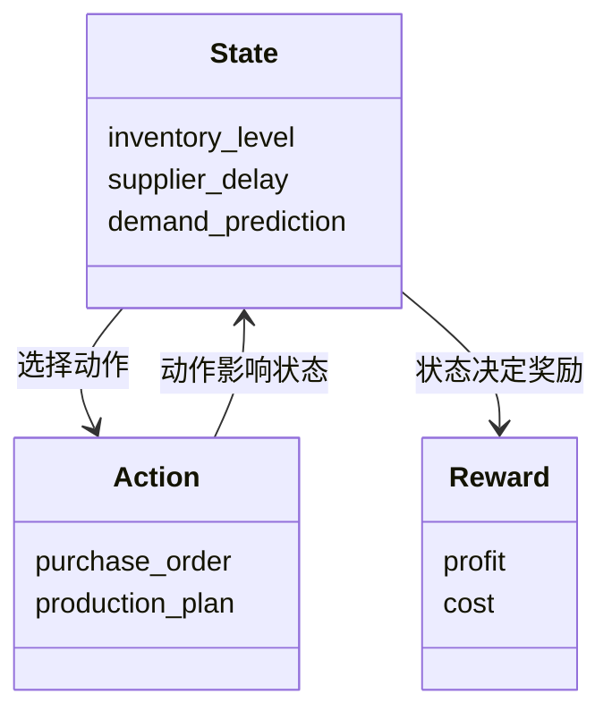

                 


# 如何识别企业的深度强化学习技术优势

> 关键词：深度强化学习，企业技术优势，算法原理，系统架构，项目实战

> 摘要：深度强化学习是一种结合深度学习与强化学习的新兴技术，能够在复杂决策问题中表现出色。本文从背景、核心概念、算法原理、系统架构、项目实战等多方面，详细阐述如何识别和应用企业的深度强化学习技术优势。

---

# 第1章: 深度强化学习技术的背景与问题背景

## 1.1 问题背景
### 1.1.1 从监督学习到强化学习的演进
- 监督学习的局限性：仅依赖样本标注，难以处理动态环境和复杂决策。
- 强化学习的兴起：通过与环境交互，学习最优策略。
- 深度强化学习的结合：深度学习的强大表示能力与强化学习的决策优势结合。

### 1.1.2 企业级应用中的强化学习需求
- 企业面临的复杂决策问题：资源分配、供应链优化、风险管理等。
- 强化学习在企业中的应用潜力：动态决策、多智能体协作、实时反馈优化。
- 深度强化学习的优势：处理高维复杂状态，非线性关系建模。

### 1.1.3 深度强化学习的核心优势
- 强大学习能力：通过神经网络自动提取特征，无需人工特征工程。
- 动态适应性：能够根据环境反馈实时调整策略。
- 多步决策能力：适合需要长期规划和优化的场景。

## 1.2 深度强化学习的定义与特点
### 1.2.1 深度强化学习的定义
- 结合深度学习与强化学习的技术，通过神经网络近似最优策略。
- 突破传统强化学习的计算限制，适用于高维复杂环境。

### 1.2.2 深度强化学习的核心特点
- 高维状态空间处理能力。
- 强化学习与深度学习的结合。
- 在动态环境中的自适应性。

### 1.2.3 深度强化学习与传统机器学习的区别
| 对比维度 | 深度强化学习 | 监督学习 |
|----------|--------------|----------|
| 数据类型 | 序列数据，有反馈 | 标签数据 |
| 学习目标 | 最大化累积奖励 | 分类或回归 |
| 决策方式 | 基于策略网络 | 基于模型预测 |

## 1.3 企业深度强化学习技术的应用场景
### 1.3.1 金融领域的深度强化学习应用
- 股票交易：动态调整投资组合，捕捉市场波动。
- 风险管理：实时评估风险，优化资产配置。
- 信用评分：基于行为数据，预测信用风险。

### 1.3.2 游戏AI中的深度强化学习应用
- 游戏智能：训练AI进行游戏决策，实现超人类水平。
- 多智能体协作：模拟团队合作，优化游戏策略。

### 1.3.3 工业自动化中的深度强化学习应用
- 生产优化：实时调整生产参数，降低能耗。
- 设备维护：预测设备故障，优化维护计划。

## 1.4 深度强化学习技术的边界与外延
### 1.4.1 深度强化学习的适用范围
- 复杂动态环境：适合处理非线性、高维状态空间的问题。
- 需要实时决策：适用于需要快速反馈的场景。

### 1.4.2 深度强化学习的局限性
- 训练效率低：需要大量交互数据，训练时间长。
- 稳定性问题：策略可能在某些情况下表现不稳定。
- 解释性差：黑箱模型，难以解释决策过程。

### 1.4.3 深度强化学习与其他技术的结合
- 与强化学习结合：通过策略迁移，提升学习效率。
- 与生成对抗网络结合：利用GAN生成多样化的数据，增强学习效果。

## 1.5 本章小结
- 深度强化学习在企业中的应用潜力巨大，尤其在金融、游戏和工业领域。
- 了解其核心优势和应用场景，能够帮助企业选择合适的技术方案。

---

# 第2章: 深度强化学习的核心概念与联系

## 2.1 深度强化学习的原理
### 2.1.1 强化学习的基本原理
- 环境、智能体、状态、动作、奖励：强化学习的基本构成。
- Q-learning：通过经验回放学习最优策略。
- 策略梯度方法：直接优化策略的参数。

### 2.1.2 深度神经网络在强化学习中的应用
- 状态表示：神经网络将高维状态压缩为低维特征。
- 动作选择：网络输出概率分布，选择最优动作。
- 奖励建模：利用神经网络预测奖励函数。

### 2.1.3 深度强化学习的数学模型
- 状态价值函数：\( V(s) = \max_{a} Q(s,a) \)
- 动作价值函数：\( Q(s,a) = r + \gamma \max_{a'} Q(s',a') \)

## 2.2 深度强化学习与监督学习的对比
### 2.2.1 监督学习的特点
- 数据来源：有标签的数据集。
- 学习目标：预测准确率最大化。
- 应用场景：分类、回归等问题。

### 2.2.2 强化学习的特点
- 数据来源：与环境交互产生的数据。
- 学习目标：累积奖励最大化。
- 应用场景：游戏、机器人控制等需要决策的场景。

### 2.2.3 深度强化学习的独特优势
- 能够处理高维复杂状态。
- 在动态环境中自适应调整策略。
- 适合需要长期规划和优化的任务。

## 2.3 深度强化学习的ER实体关系图
```mermaid
er
    actor(用户)
    system(深度强化学习系统)
    action(动作)
    reward(奖励)
    state(状态)
    actor --> action: 发出动作
    action --> state: 动作影响状态
    state --> reward: 状态决定奖励
    actor <-- reward: 收到奖励，调整策略
```

---

# 第3章: 深度强化学习的算法原理

## 3.1 基于Q-learning的深度强化学习算法
### 3.1.1 算法流程
1. 初始化Q表或神经网络。
2. 在环境中执行动作，观察新状态和奖励。
3. 更新Q值或神经网络参数，以最大化累积奖励。

### 3.1.2 算法实现
```python
import numpy as np
import tensorflow as tf

# 定义神经网络模型
class DQN:
    def __init__(self, state_space, action_space):
        self.state_space = state_space
        self.action_space = action_space
        self.model = self.build_model()

    def build_model(self):
        model = tf.keras.Sequential([
            tf.keras.layers.Dense(64, activation='relu', input_dim=self.state_space),
            tf.keras.layers.Dense(64, activation='relu'),
            tf.keras.layers.Dense(self.action_space, activation='linear')
        ])
        return model

    def get_action(self, state, epsilon=0.1):
        if np.random.random() < epsilon:
            return np.random.randint(self.action_space)
        predictions = self.model.predict(state)
        return np.argmax(predictions[0])

    def update_model(self, state, action, reward, next_state, gamma=0.99):
        target = reward + gamma * np.max(self.model.predict(next_state)[0])
        target_vec = self.model.predict(state)
        target_vec[0][action] = target
        self.model.fit(state, target_vec, epochs=1, verbose=0)
```

### 3.1.3 数学公式
- 状态价值函数：\( Q(s,a) = r + \gamma \max_{a'} Q(s',a') \)
- 神经网络更新：最小化预测Q值与目标Q值的差。

## 3.2 基于策略梯度的深度强化学习算法
### 3.2.1 算法流程
1. 采样动作，收集轨迹。
2. 计算策略梯度，更新参数。

### 3.2.2 算法实现
```python
import numpy as np
import tensorflow as tf

class PolicyGradient:
    def __init__(self, state_space):
        self.state_space = state_space
        self.model = self.build_model()

    def build_model(self):
        model = tf.keras.Sequential([
            tf.keras.layers.Dense(64, activation='relu', input_dim=self.state_space),
            tf.keras.layers.Dense(1, activation='sigmoid')
        ])
        return model

    def get_action(self, state):
        probs = self.model.predict(state)
        return 1 if np.random.random() < probs[0][0] else 0

    def update_model(self, states, actions, rewards, gamma=0.99):
        discounted_rewards = []
        running_reward = 0
        for reward in reversed(rewards):
            running_reward = reward + gamma * running_reward
            discounted_rewards.insert(0, running_reward)
        self.model.fit(states, discounted_rewards, epochs=1, verbose=0)
```

### 3.2.3 数学公式
- 动作概率：\( P(a|s) = \sigma(w^T s) \)
- 梯度更新：\( \nabla J = \sum \nabla \log P(a|s) \cdot R \)

---

# 第4章: 深度强化学习的系统分析与架构设计

## 4.1 项目背景与需求分析
### 4.1.1 项目背景
- 某企业需要优化供应链管理，降低库存成本。
- 传统方法难以应对需求波动和供应商延迟。

### 4.1.2 项目需求
- 实时监控库存和供应链状态。
- 自动调整采购和生产计划。
- 最大化利润，最小化成本。

## 4.2 系统功能设计
### 4.2.1 领域模型类图


### 4.2.2 系统架构设计


### 4.2.3 接口设计
- 输入接口：库存、延迟、需求预测。
- 输出接口：采购订单、生产计划。
- 反馈接口：利润、成本。

## 4.3 系统实现与优化
### 4.3.1 系统实现
```python
class Agent:
    def __init__(self, environment):
        self.environment = environment
        self.model = self.build_model()

    def build_model(self):
        model = tf.keras.Sequential([
            tf.keras.layers.Dense(64, activation='relu'),
            tf.keras.layers.Dense(2, activation='linear')
        ])
        return model

    def get_action(self, state):
        prediction = self.model.predict(np.array([state]))[0]
        return np.argmax(prediction)

    def update_model(self, state, action, reward, next_state, gamma=0.99):
        target = reward + gamma * np.max(self.model.predict(np.array([next_state]))[0])
        target_vec = self.model.predict(np.array([state]))
        target_vec[0][action] = target
        self.model.fit(np.array([state]), np.array([target_vec[0]]), epochs=1, verbose=0)
```

### 4.3.2 性能优化
- 状态压缩：利用PCA或AE降维。
- 动作选择：结合贪心策略，减少探索次数。
- 奖励函数：引入延迟折扣，适应长期目标。

---

# 第5章: 深度强化学习的项目实战

## 5.1 环境安装与配置
### 5.1.1 安装依赖
- 安装Python、TensorFlow、Keras、OpenAI Gym。

### 5.1.2 配置环境
- 设置虚拟环境，安装所需库。

## 5.2 核心代码实现
### 5.2.1 状态空间与动作空间定义
```python
class Environment:
    def __init__(self):
        self.state = [inventory, delay, demand]
        self.reward = 0

    def get_state(self):
        return self.state

    def get_reward(self):
        return self.reward

    def step(self, action):
        # 执行动作，更新状态和奖励
        pass

    def reset(self):
        # 初始化环境
        pass
```

### 5.2.2 智能体实现
```python
class Agent:
    def __init__(self, environment):
        self.environment = environment
        self.model = self.build_model()

    def build_model(self):
        model = tf.keras.Sequential([
            tf.keras.layers.Dense(64, activation='relu'),
            tf.keras.layers.Dense(2, activation='linear')
        ])
        return model

    def get_action(self, state):
        prediction = self.model.predict(np.array([state]))[0]
        return np.argmax(prediction)

    def update_model(self, state, action, reward, next_state, gamma=0.99):
        target = reward + gamma * np.max(self.model.predict(np.array([next_state]))[0])
        target_vec = self.model.predict(np.array([state]))
        target_vec[0][action] = target
        self.model.fit(np.array([state]), np.array([target_vec[0]]), epochs=1, verbose=0)
```

## 5.3 代码解读与分析
### 5.3.1 环境类实现
- `get_state`：返回当前状态。
- `step`：执行动作，更新状态和奖励。
- `reset`：重置环境。

### 5.3.2 智能体类实现
- `get_action`：基于当前状态选择动作。
- `update_model`：更新神经网络参数，基于当前和下一个状态。

## 5.4 实际案例分析
### 5.4.1 案例背景
- 某企业需要优化供应链管理，降低库存成本。

### 5.4.2 案例实现
```python
env = Environment()
agent = Agent(env)
for _ in range(1000):
    state = env.get_state()
    action = agent.get_action(state)
    next_state, reward, done = env.step(action)
    agent.update_model(state, action, reward, next_state)
    if done:
        env.reset()
```

### 5.4.3 案例分析
- 状态空间：库存、延迟、需求预测。
- 动作空间：采购订单、生产计划。
- 奖励函数：利润最大化，成本最小化。

## 5.5 项目小结
- 深度强化学习能够有效优化企业供应链管理。
- 通过实战案例，验证了算法的有效性和实用性。

---

# 第6章: 深度强化学习的最佳实践与小结

## 6.1 最佳实践
### 6.1.1 数据预处理
- 状态空间降维：使用PCA或AE。
- 动作空间简化：减少动作选择空间。
- 奖励函数设计：引入延迟折扣，适应长期目标。

### 6.1.2 模型优化
- 网络结构优化：增加隐藏层或调整激活函数。
- 超参数调优：学习率、折扣因子、探索率。
- 多智能体协作：实现分布式训练，提升效率。

### 6.1.3 系统部署
- 部署环境选择：云平台或边缘计算。
- 系统监控：实时监控模型性能，及时调整。
- 模型更新：定期重新训练，适应环境变化。

## 6.2 小结
- 深度强化学习在企业中的应用潜力巨大。
- 通过本文的分析和实战，读者可以掌握识别和应用深度强化学习技术优势的方法。

## 6.3 注意事项
- 深度强化学习的训练效率较低，需要优化算法和硬件。
- 模型解释性差，难以满足某些行业的需求。
- 需要结合具体场景，选择合适的技术方案。

## 6.4 拓展阅读
- 《Deep Reinforcement Learning: Theory and Algorithms》
- 《Hands-on Machine Learning with Scikit-Learn, Keras, and TensorFlow》

---

# 附录: 深度强化学习相关工具与资源

## 附录A: 深度强化学习工具
- OpenAI Gym：强化学习环境库。
- TensorFlow：深度学习框架。
- PyTorch：另一种深度学习框架。
- Gymnasium：Gym的维护版本。

## 附录B: 深度强化学习资源
- 官方文档：TensorFlow、PyTorch、Gym。
- 在线课程：Coursera、Udemy相关课程。
- 论文推荐：Deep Q-Network、Actor-Critic方法、PPO算法。

---

# 结语

通过本文的系统介绍和实战分析，读者可以深入理解深度强化学习的核心概念和算法原理，并能够识别和应用企业的深度强化学习技术优势。希望本文能够为企业技术决策者和开发人员提供有价值的参考。

