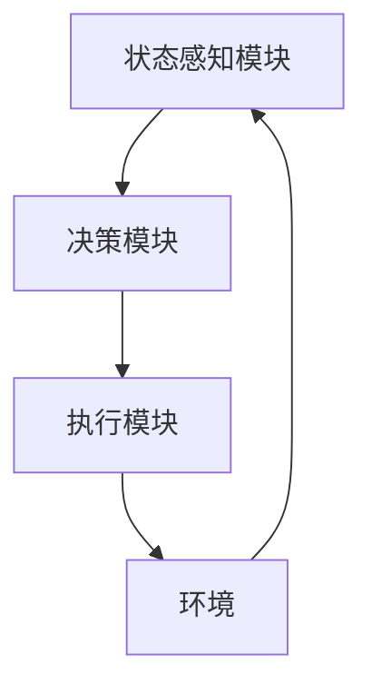
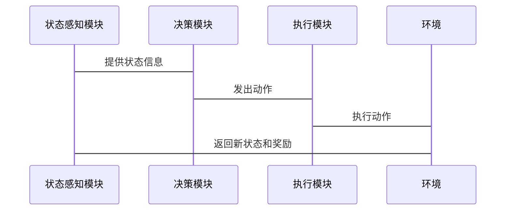

                 


# 如何识别企业的深度强化学习控制系统优势

> **关键词**：深度强化学习、控制系统、企业应用、算法原理、系统架构  
> **摘要**：深度强化学习是一种结合深度学习与强化学习的技术，能够通过与环境交互来优化控制策略。本文从企业应用场景出发，详细分析深度强化学习控制系统的原理、算法、系统架构，并通过实际案例说明其优势与实现过程。

---

# 第1章: 深度强化学习控制系统概述

## 1.1 深度强化学习的基本概念

### 1.1.1 深度强化学习的定义

深度强化学习（Deep Reinforcement Learning, DRL）是一种结合深度学习和强化学习的技术。强化学习通过智能体与环境的交互，学习最优策略以最大化累积奖励。深度学习则通过神经网络来近似复杂的策略或值函数，从而提高强化学习的表达能力和处理复杂问题的能力。

$$
\text{奖励函数} = f(s, a) \rightarrow r
$$

其中，$s$ 是状态，$a$ 是动作，$r$ 是奖励。

### 1.1.2 深度强化学习的核心特点

- **端到端学习**：深度强化学习可以直接从原始数据中学习策略，无需手动设计特征。
- **自适应性**：智能体能够根据环境变化动态调整策略。
- **高维度状态处理**：深度学习能够处理高维、非结构化的状态空间。

### 1.1.3 深度强化学习与传统控制系统的区别

| 特性 | 传统控制系统 | 深度强化学习控制系统 |
|------|--------------|---------------------|
| 策略设计 | 基于专家经验 | 基于数据驱动学习 |
| 状态空间 | 低维、结构化 | 高维、非结构化 |
| 调整能力 | 需要人工干预 | 自动调整优化 |

### 1.1.4 深度强化学习在企业中的应用场景

企业中的许多问题都可以转化为强化学习问题，例如：

- **资源调度**：如任务调度、供应链管理。
- **设备控制**：如工业自动化、智能设备控制。
- **决策优化**：如金融投资、市场营销策略。

## 1.2 深度强化学习控制系统的优势

### 1.2.1 高效性

深度强化学习能够通过数据驱动的方式快速找到最优策略，避免了传统方法中需要大量人工经验的缺点。

### 1.2.2 灵活性

深度强化学习能够适应动态变化的环境，无需频繁人工调整策略。

### 1.2.3 自适应性

深度强化学习系统能够根据环境反馈自动优化策略，适应不同的场景需求。

### 1.2.4 可扩展性

深度强化学习能够处理复杂的问题，适用于企业中的多种应用场景。

## 1.3 深度强化学习控制系统在企业中的具体应用

### 1.3.1 智能供应链管理

深度强化学习可以通过优化库存、物流和生产调度，提高供应链的效率和降低成本。

### 1.3.2 工业自动化控制

深度强化学习可以用于优化生产设备的运行参数，提高生产效率和产品质量。

### 1.3.3 金融投资决策

深度强化学习可以用于股票交易、风险管理等领域，帮助企业在金融市场中做出更优决策。

## 1.4 本章小结

本章介绍了深度强化学习的基本概念、核心特点以及在企业中的具体应用。通过对比传统控制系统，突出了深度强化学习在企业中的优势。

---

# 第2章: 深度强化学习的数学模型

## 2.1 强化学习的基本数学模型

### 2.1.1 状态空间的定义

状态空间是智能体所处环境的所有可能状态的集合，通常用 $S$ 表示。

### 2.1.2 行动空间的定义

行动空间是智能体在每个状态下可以执行的所有动作的集合，通常用 $A$ 表示。

### 2.1.3 奖励函数的定义

奖励函数 $r: S \times A \rightarrow \mathbb{R}$ 是一个函数，它根据当前状态和动作返回一个标量奖励。

## 2.2 深度强化学习的数学公式

### 2.2.1 Q-learning算法的数学公式

Q-learning算法的目标是学习一个值函数 $Q(s, a)$，表示在状态 $s$ 下执行动作 $a$ 的期望奖励。

$$
Q(s, a) \leftarrow Q(s, a) + \alpha \left[ r + \gamma \max_{a'} Q(s', a') - Q(s, a) \right]
$$

其中，$\alpha$ 是学习率，$\gamma$ 是折扣因子。

### 2.2.2 DQN算法的数学公式

DQN算法通过神经网络近似值函数，优化目标是最小化预测值与实际值的差。

$$
\min_{\theta} \mathbb{E}\left[ (r + \gamma Q(s', a'; \theta') - Q(s, a; \theta))^2 \right]
$$

其中，$\theta$ 是神经网络的参数。

## 2.3 深度强化学习的优化目标

### 2.3.1 最大化累积奖励

智能体的目标是通过最大化累积奖励来学习最优策略。

$$
\arg\max_{\pi} \mathbb{E}\left[ \sum_{t=0}^{\infty} \gamma^t r(s_t, a_t) \right]
$$

### 2.3.2 最小化损失函数

在深度强化学习中，通常通过最小化损失函数来优化神经网络参数。

$$
\min_{\theta} \mathbb{E}\left[ (y - Q(s, a; \theta))^2 \right]
$$

## 2.4 本章小结

本章从数学角度介绍了深度强化学习的基本模型和优化目标，为后续章节的算法实现奠定了理论基础。

---

# 第3章: 深度强化学习算法的原理

## 3.1 Q-learning算法

### 3.1.1 算法流程

Q-learning算法的流程如下：

1. 初始化值函数 $Q(s, a)$。
2. 在当前状态下选择动作 $a$。
3. 执行动作并观察下一个状态和奖励。
4. 更新值函数：
   $$
   Q(s, a) \leftarrow Q(s, a) + \alpha (r + \gamma \max Q(s', a') - Q(s, a))
   $$
5. 重复步骤 2-4 直到收敛。

### 3.1.2 算法优缺点

- **优点**：简单易实现，适合离线学习。
- **缺点**：在连续状态空间中表现不佳，收敛速度慢。

## 3.2 DQN算法

### 3.2.1 算法流程

DQN算法的流程如下：

1. 初始化两个神经网络 $Q$ 和 $Q'$。
2. 在当前状态下选择动作 $a$。
3. 执行动作并观察下一个状态和奖励。
4. 训练神经网络：
   $$
   \min_{\theta} \mathbb{E}\left[ (y - Q(s, a; \theta))^2 \right]
   $$
5. 偶尔将 $Q$ 的参数复制到 $Q'$。
6. 重复步骤 2-5 直到收敛。

### 3.2.2 算法优缺点

- **优点**：能够处理高维状态空间，适合在线学习。
- **缺点**：训练过程复杂，需要设计合适的网络结构。

## 3.3 其他强化学习算法

### 3.3.1 A3C算法

A3C算法通过同时评估多个策略来加速训练，适用于分布式计算环境。

### 3.3.2 PPO算法

PPO算法通过限制策略更新的幅度来保持稳定性，适用于复杂的控制任务。

## 3.4 深度强化学习算法的比较

| 算法 | Q-learning | DQN | A3C | PPO |
|------|-------------|------|-----|-----|
| 场景 | 离线学习 | 在线学习 | 分布式 | 复杂任务 |
| 优势 | 简单 | 高维状态 | 并行训练 | 稳定性 |
| 劣势 | 低效 | 复杂 | 需要分布式环境 | 收敛慢 |

## 3.5 本章小结

本章详细介绍了几种常见的深度强化学习算法，并从理论和实践角度分析了它们的优缺点。

---

# 第4章: 深度强化学习控制系统的系统架构

## 4.1 系统功能模块划分

### 4.1.1 状态感知模块

状态感知模块负责接收环境的状态信息，并将其传递给决策模块。

### 4.1.2 行为决策模块

行为决策模块通过强化学习算法生成最优动作。

### 4.1.3 执行控制模块

执行控制模块将决策模块生成的动作转化为实际操作。

## 4.2 系统架构图



## 4.3 系统接口设计

### 4.3.1 输入接口

- 状态信息：来自环境的输入。
- 动作信息：决策模块输出的动作。

### 4.3.2 输出接口

- 状态更新：环境对动作的反馈。
- 奖励信号：环境对动作的评价。

## 4.4 系统交互序列图



## 4.5 本章小结

本章从系统架构的角度分析了深度强化学习控制系统的组成和交互流程，为后续的实现提供了参考。

---

# 第5章: 深度强化学习控制系统的优势与实现

## 5.1 深度强化学习控制系统的优势

### 5.1.1 高效性

深度强化学习能够快速找到最优策略，减少人工干预。

### 5.1.2 灵活性

深度强化学习能够适应不同的环境和场景需求。

### 5.1.3 自适应性

深度强化学习系统能够根据环境反馈动态调整策略。

## 5.2 深度强化学习控制系统的实现

### 5.2.1 环境建模

根据具体应用场景构建环境模型，例如供应链管理中的库存、物流等参数。

### 5.2.2 策略选择

选择合适的强化学习算法，例如DQN、PPO等。

### 5.2.3 网络设计

设计适合的神经网络结构，例如卷积神经网络、循环神经网络等。

### 5.2.4 训练过程

通过大量数据训练神经网络，优化策略。

## 5.3 企业应用案例

### 5.3.1 供应链管理

通过深度强化学习优化库存、生产和物流调度。

### 5.3.2 工业自动化

通过深度强化学习优化生产设备的运行参数。

### 5.3.3 金融投资

通过深度强化学习优化股票交易策略。

## 5.4 本章小结

本章总结了深度强化学习控制系统的优势，并通过具体案例说明了其在企业中的实现过程。

---

# 第6章: 深度强化学习控制系统的最佳实践

## 6.1 小结

深度强化学习控制系统在企业中的应用前景广阔，能够显著提高企业的运营效率和决策能力。

## 6.2 注意事项

- **数据质量**：确保训练数据的多样性和代表性。
- **算法选择**：根据具体场景选择合适的算法。
- **系统稳定性**：确保系统的稳定性和可扩展性。

## 6.3 未来趋势

- **多智能体协作**：深度强化学习在多智能体协作中的应用。
- **实时决策**：深度强化学习在实时决策中的应用。
- **跨领域应用**：深度强化学习在更多领域的应用探索。

## 6.4 拓展阅读

- 《Deep Reinforcement Learning: Theory and Algorithms》
- 《Reinforcement Learning: An Introduction》

## 6.5 本章小结

本章总结了深度强化学习控制系统的优势，并提出了未来的发展方向和注意事项。

---

# 附录: 深度强化学习控制系统实现的代码示例

## 附录A: 环境安装

```bash
pip install gym numpy tensorflow
```

## 附录B: 核心代码实现

```python
import numpy as np
import gym
import tensorflow as tf

class DQN:
    def __init__(self, state_space, action_space):
        self.state_space = state_space
        self.action_space = action_space
        self.model = self.build_model()
    
    def build_model(self):
        model = tf.keras.Sequential([
            tf.keras.layers.Dense(64, activation='relu'),
            tf.keras.layers.Dense(32, activation='relu'),
            tf.keras.layers.Dense(self.action_space, activation='linear')
        ])
        return model
    
    def act(self, state):
        prediction = self.model.predict(state)
        return np.argmax(prediction[0])
    
    def train(self, state, action, reward, next_state):
        target = self.model.predict(state)
        target[0][action] = reward + 0.95 * np.max(self.model.predict(next_state)[0])
        self.model.fit(state, target, epochs=1, verbose=0)
```

## 附录C: 工具资源

- **Gym库**：OpenAI Gym 是一个强化学习的开源工具包。
- **TensorFlow**：Google的深度学习框架。
- **PyTorch**：Facebook的深度学习框架。

---

# 本文小结

本文从企业应用场景出发，详细分析了深度强化学习控制系统的原理、算法、系统架构，并通过实际案例说明其优势与实现过程。通过本文的介绍，读者可以全面了解深度强化学习控制系统的优势，并能够将其应用到实际的企业场景中。

