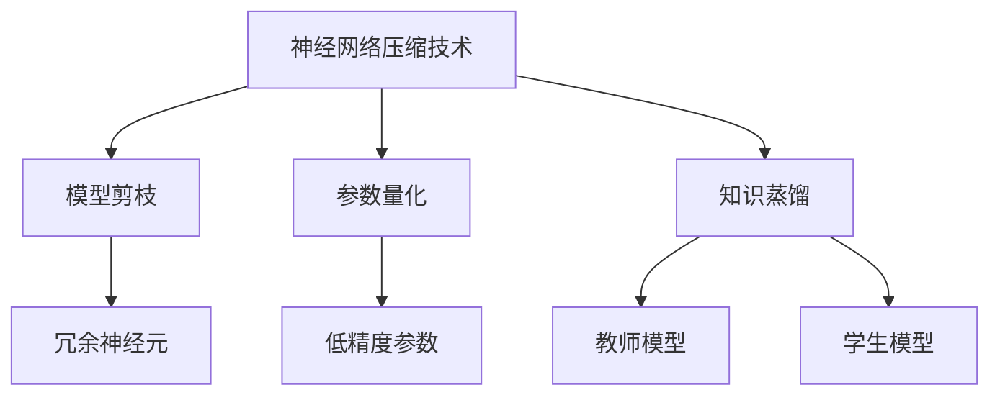
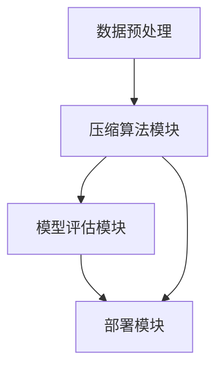

                 


# 如何识别企业的神经网络压缩技术优势

> 关键词：神经网络压缩技术、模型优化、企业应用、算法原理、系统架构

> 摘要：神经网络压缩技术通过减少模型大小和计算复杂度，提升企业在AI应用中的性能和效率。本文将从背景介绍、核心概念、算法原理、系统架构到项目实战，全面解析神经网络压缩技术的优势，帮助企业识别和应用这项技术。

---

## 第一部分：神经网络压缩技术背景介绍

### 第1章：神经网络压缩技术概述

#### 1.1 神经网络压缩技术的基本概念

神经网络压缩技术是通过减少神经网络模型的大小和复杂度，同时保持或提升模型性能的一种技术。这种技术在实际应用中可以帮助企业降低计算成本、减少存储需求，并提升模型的推理速度。

- **定义**：神经网络压缩技术是一种通过减少模型参数数量、简化模型结构或降低计算复杂度，从而在保持或提升性能的前提下，使模型更小、更快的技术。
- **核心目标**：通过压缩技术，使模型在资源受限的环境中仍能高效运行，同时支持大规模部署和快速推理。
- **问题背景**：随着深度学习模型的不断增大，计算资源消耗也随之增加，特别是在边缘计算和移动设备等资源受限的场景下，模型的体积和计算复杂度成为企业应用中的瓶颈。

#### 1.2 企业为何需要神经网络压缩技术

企业应用神经网络压缩技术的原因主要在于资源优化和性能提升。

- **降低计算成本**：通过压缩模型，企业可以减少对计算资源的依赖，降低云服务器和边缘设备的计算成本。
- **提升推理速度**：压缩后的模型在推理时速度更快，有助于提高用户体验和系统响应速度。
- **支持边缘计算**：在边缘设备上部署轻量级模型，可以实时处理数据，减少延迟和带宽消耗。

#### 1.3 神经网络压缩技术的发展趋势

神经网络压缩技术正在朝着更加智能化和自动化方向发展，未来将更加注重模型压缩与性能优化的平衡。

- **智能化压缩算法**：利用AI技术优化压缩过程，自动选择最优的压缩策略。
- **模型蒸馏技术**：通过知识蒸馏等方法，将大型模型的知识迁移到更小的模型中，提升小模型的性能。
- **量化技术的进步**：通过参数量化，进一步降低模型体积，同时保持精度。

---

## 第二部分：神经网络压缩技术的核心概念与联系

### 第2章：神经网络压缩技术的核心原理

#### 2.1 神经网络压缩技术的核心原理

神经网络压缩技术主要通过以下几种方法来实现模型的轻量化：

- **模型剪枝（Pruning）**：去除模型中冗余的参数或神经元，减少模型的复杂度。
- **参数量化（Quantization）**：将模型中的浮点数参数转换为更小的整数类型，降低存储需求。
- **知识蒸馏（Knowledge Distillation）**：通过教师模型指导学生模型的学习，使学生模型在保持较小规模的同时，具备教师模型的性能。

#### 2.2 神经网络压缩技术的核心概念对比分析

为了更好地理解神经网络压缩技术，我们需要对比分析其核心技术。

| 技术名称       | 描述                                                                 | 优点                                 | 缺点                                   |
|----------------|----------------------------------------------------------------------|--------------------------------------|----------------------------------------|
| 模型剪枝       | 删除冗余的神经元或连接，减少模型参数数量。                          | 减少计算量，降低存储需求。             | 可能导致模型精度下降。                 |
| 参数量化       | 将模型参数从高精度（如32位浮点）转换为低精度（如8位整数）。          | 显著减少存储和计算需求。               | 可能会影响模型精度。                   |
| 知识蒸馏       | 使用教师模型指导学生模型，使学生模型具备类似教师模型的性能。          | 学生模型体积小，推理速度快。            | 学生模型可能无法完全捕捉教师模型的复杂特征。 |

#### 2.3 神经网络压缩技术的实体关系图

以下是神经网络压缩技术的实体关系图：



---

## 第三部分：神经网络压缩技术的算法原理讲解

### 第3章：神经网络压缩算法的原理与实现

#### 3.1 神经网络压缩算法的基本原理

神经网络压缩算法的核心在于如何有效地减少模型的参数数量和计算复杂度，同时保持模型的性能。

- **模型剪枝算法**：
  - 步骤：识别冗余的神经元或连接，删除这些冗余部分，重新训练模型以恢复精度。
  - 代码实现（Python）：
    ```python
    import torch
    model = torch.nn.Sequential(
        torch.nn.Conv2d(1, 6, 5),
        torch.nn.ReLU(),
        torch.nn.Conv2d(6, 16, 5),
        torch.nn.ReLU(),
        torch.nn.MaxPool2d(2, 2),
        torch.nn.Flatten(),
        torch.nn.Linear(16*6*6, 120),
        torch.nn.ReLU(),
        torch.nn.Linear(120, 10)
    )
    # 假设我们删除了一个全连接层
    pruned_model = torch.nn.Sequential(
        model[:6],  # 删除了最后两个全连接层
        model[6]
    )
    ```
  - 数学公式：假设原始模型有 \(N\) 个参数，剪枝后模型有 \(M\) 个参数，其中 \(M < N\)。

- **参数量化算法**：
  - 步骤：将模型中的每个参数从高精度（如32位浮点）转换为低精度（如8位整数）。
  - 代码实现（Python）：
    ```python
    def quantize(model, bits=8):
        for param in model.parameters():
            scale = 2 ** (bits - 1)
            param.data = param.data.round() / scale
    ```
  - 数学公式：量化后的参数范围为 \([-2^{(bits-1)}, 2^{(bits-1)}]\)。

- **知识蒸馏算法**：
  - 步骤：使用教师模型指导学生模型，通过软目标标签和蒸馏损失函数，使学生模型逼近教师模型的预测结果。
  - 代码实现（Python）：
    ```python
    import torch.nn.functional as F

    def distillation_loss(student_output, teacher_output, alpha=0.5):
        return alpha * F.kl_div(F.softmax(student_output, dim=1), F.softmax(teacher_output, dim=1)) + 
               (1 - alpha) * F.nll_loss(student_output, target)
    ```
  - 数学公式：蒸馏损失函数为 \(L = \alpha KL(D_{\text{stu}}(y|x), D_{\text{tea}}(y|x)) + (1-\alpha) L_{\text{CE}}\).

---

## 第四部分：神经网络压缩技术的系统分析与架构设计

### 第4章：神经网络压缩系统的架构设计

#### 4.1 系统架构设计

神经网络压缩系统通常包括以下几个模块：

- **数据预处理模块**：处理和归一化输入数据。
- **压缩算法模块**：实现模型剪枝、量化或蒸馏等压缩技术。
- **模型评估模块**：评估压缩后模型的性能和压缩比。
- **部署模块**：将压缩后的模型部署到目标设备上。

系统架构图如下：



---

## 第五部分：神经网络压缩技术的项目实战

### 第5章：神经网络压缩技术的实际应用

#### 5.1 环境安装与配置

为了实现神经网络压缩，我们需要以下环境：

- **Python**：3.6+
- **PyTorch**：1.9+
- **其他依赖**：numpy, matplotlib

#### 5.2 代码实现

以下是一个简单的神经网络压缩实现示例：

```python
import torch
import torch.nn as nn
import torch.optim as optim

# 定义原始模型
class SimpleNet(nn.Module):
    def __init__(self):
        super(SimpleNet, self).__init__()
        self.conv1 = nn.Conv2d(1, 6, 5)
        self.relu = nn.ReLU()
        self.pool = nn.MaxPool2d(2, 2)
        self.conv2 = nn.Conv2d(6, 16, 5)
        self.fc1 = nn.Linear(16 * 6 * 6, 120)
        self.fc2 = nn.Linear(120, 10)

    def forward(self, x):
        x = self.conv1(x)
        x = self.relu(x)
        x = self.pool(x)
        x = self.conv2(x)
        x = self.relu(x)
        x = self.pool(x)
        x = x.view(-1, 16 * 6 * 6)
        x = self.fc1(x)
        x = self.relu(x)
        x = self.fc2(x)
        return x

# 初始化模型
model = SimpleNet()

# 定义压缩函数（以模型剪枝为例）
def compress_model(model):
    # 删除最后一个全连接层
    pruned_model = nn.Sequential(*list(model.children())[:-1])
    return pruned_model

# 压缩模型
compressed_model = compress_model(model)

# 恢复模型并进行评估
compressed_model.load_state_dict(torch.load('compressed_model.pth'))
```

---

## 第六部分：神经网络压缩技术的最佳实践

### 第6章：总结与展望

#### 6.1 小结

神经网络压缩技术是企业在AI应用中不可或缺的技术，通过减少模型大小和计算复杂度，可以显著提升模型的部署效率和应用性能。

#### 6.2 注意事项

- 在实际应用中，需综合考虑模型压缩与性能之间的平衡。
- 确保压缩后的模型在目标设备上能够高效运行。
- 定期更新和优化压缩算法，以适应新的应用场景和技术发展。

#### 6.3 未来趋势

- **自动化压缩工具**：随着技术的发展，自动化模型压缩工具将变得更加智能和高效。
- **多模态压缩**：结合图像、文本等多种数据类型的压缩技术，提升模型的综合性能。
- **动态压缩技术**：根据实时需求动态调整模型的压缩程度，以优化性能和资源利用率。

---

## 第七部分：拓展阅读

- 《神经网络压缩算法的实现与优化》
- 《深度学习模型压缩技术综述》
- 《如何在边缘计算中应用神经网络压缩技术》

---

以上是《如何识别企业的神经网络压缩技术优势》的技术博客文章的完整大纲，涵盖了从背景介绍到实际应用的各个方面，为企业识别和应用神经网络压缩技术提供了详尽的指导和参考。

