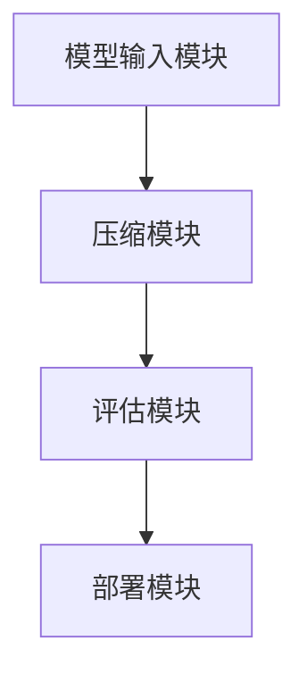

                 


# 如何识别企业的神经网络模型压缩技术优势

> 关键词：神经网络模型压缩，模型优化，企业应用，AI技术，深度学习

> 摘要：本文详细分析了企业在识别神经网络模型压缩技术优势时的关键步骤和方法。通过系统化的分析和实践案例，揭示了模型压缩技术的核心原理、实现方法和实际应用价值。帮助企业在复杂的AI技术环境中，快速识别和应用最优的模型压缩技术，提升模型性能和资源利用效率。

---

# 第一部分: 神经网络模型压缩技术背景与核心概念

## 第1章: 神经网络模型压缩技术概述

### 1.1 神经网络模型压缩的背景与问题背景

#### 1.1.1 神经网络模型的计算复杂度与资源消耗
神经网络模型的计算复杂度随着模型规模的增大呈指数级增长。企业级AI应用通常需要处理大规模数据和复杂的模型，这导致计算资源消耗巨大。例如，训练一个深度学习模型可能需要数千块GPU-hours，而推理阶段的计算成本也居高不下。模型压缩技术通过减少模型参数数量和优化计算流程，显著降低了资源消耗。

#### 1.1.2 模型压缩的必要性与应用场景
在企业应用中，模型压缩技术主要用于以下场景：
- **边缘计算**：在资源受限的边缘设备上部署AI模型，需要轻量化的模型。
- **实时推理**：在高并发实时推理场景中，压缩模型可以显著提升处理速度。
- **大规模部署**：企业需要在多个设备或服务中部署同一模型，压缩技术可以降低部署成本。

#### 1.1.3 企业级应用中的模型压缩需求
企业对模型压缩技术的需求主要集中在以下方面：
- **性能优化**：提升模型推理速度，降低计算资源消耗。
- **成本降低**：减少服务器和云资源的使用成本。
- **应用扩展**：支持更多场景和设备的部署。

### 1.2 神经网络模型压缩的核心概念与问题描述

#### 1.2.1 模型压缩的基本概念
模型压缩是指通过各种技术手段，减少神经网络模型的参数数量、计算复杂度或存储空间，同时尽可能保持模型的性能和准确性。常用的技术包括剪枝（Pruning）、量化（Quantization）、知识蒸馏（Knowledge Distillation）等。

#### 1.2.2 模型压缩的关键问题与挑战
模型压缩面临以下关键问题：
- **性能损失**：压缩过程可能导致模型准确率下降。
- **压缩效率**：如何在有限的资源内实现最优的压缩效果。
- **兼容性问题**：压缩后的模型需要在多种设备和平台上运行。

#### 1.2.3 模型压缩的目标与边界
模型压缩的目标是在保证模型性能的前提下，尽可能减少模型的计算和存储需求。边界包括：
- 不低于原始模型95%的准确率。
- 在资源受限的设备上实现高效的推理。

### 1.3 模型压缩技术的核心要素与优势

#### 1.3.1 模型压缩技术的主要技术手段
- **剪枝**：去除模型中冗余的权重和神经元。
- **量化**：将模型中的浮点数参数转换为低精度整数。
- **知识蒸馏**：通过教师模型指导学生模型的学习。

#### 1.3.2 模型压缩的优势与潜在价值
- **降低计算成本**：减少GPU和CPU的使用时间。
- **提升部署效率**：在边缘设备上快速部署。
- **支持实时应用**：满足实时推理的需求。

#### 1.3.3 企业级应用中的压缩技术特点
企业级应用通常需要在生产环境中部署模型，因此压缩技术需要考虑以下特点：
- **稳定性**：压缩后的模型必须在生产环境中稳定运行。
- **可扩展性**：支持大规模数据和多种场景的应用。

---

## 第2章: 神经网络模型压缩的核心概念与联系

### 2.1 神经网络模型压缩的核心原理

#### 2.1.1 神经网络模型压缩的基本原理
模型压缩的基本原理是通过减少模型的参数数量和计算复杂度，同时保持模型的性能。这可以通过以下步骤实现：
1. **分析模型结构**：识别模型中的冗余部分。
2. **应用压缩技术**：如剪枝、量化等。
3. **重新训练或微调**：确保压缩后的模型性能不下降。

#### 2.1.2 模型压缩的关键技术与方法
- **剪枝**：通过去除模型中不重要的权重和神经元，降低模型复杂度。
- **量化**：将模型中的浮点数参数转换为低精度整数，减少存储空间和计算时间。
- **知识蒸馏**：通过教师模型指导学生模型的学习，降低学生模型的复杂度。

#### 2.1.3 模型压缩的数学基础
模型压缩的数学基础主要涉及优化理论和深度学习的基本原理。例如，剪枝可以通过优化问题来实现：
$$ \text{最小化} \quad ||W||_0 \quad \text{在约束} \quad \text{损失函数} $$

### 2.2 神经网络模型压缩的核心概念属性对比

#### 2.2.1 模型压缩技术的属性特征对比
以下是对几种常见模型压缩技术的属性对比：

| 技术         | 参数减少 | 计算复杂度降低 | 模型性能影响 |
|--------------|----------|----------------|--------------|
| 剪枝         | 高       | 高             | 中            |
| 量化         | 中       | 高             | 低            |
| 知识蒸馏     | 高       | 中             | 高            |

#### 2.2.2 不同压缩技术的优缺点分析
- **剪枝**：优点是参数减少显著，缺点是可能影响模型性能。
- **量化**：优点是计算效率高，缺点是可能引入精度损失。
- **知识蒸馏**：优点是保持较高性能，缺点是需要额外的教师模型。

#### 2.2.3 技术属性与企业需求的匹配度
企业需求通常关注模型的性能和部署效率。因此，知识蒸馏和量化是较为推荐的技术，因为它们可以在保持性能的同时显著降低计算成本。

### 2.3 神经网络模型压缩的ER实体关系图

```mermaid
erDiagram
    ModelCompressionTechnique {
        +-- ModelType
        +-- CompressionRatio
        +-- PerformanceMetric
    }
    ModelType {
        +-- ModelArchitecture
        +-- ModelSize
    }
    CompressionRatio {
        +-- OriginalSize
        +-- CompressedSize
    }
    PerformanceMetric {
        +-- Accuracy
        +-- Latency
    }
```

---

## 第3章: 神经网络模型压缩算法原理与实现

### 3.1 神经网络模型压缩算法概述

#### 3.1.1 常见的模型压缩算法分类
常见的模型压缩算法包括：
- **剪枝算法**：如Magnitude-Based Pruning。
- **量化算法**：如Weighted Quantization。
- **知识蒸馏算法**：如Distill。

#### 3.1.2 算法的基本原理与流程
模型压缩算法的基本流程包括：
1. **训练原始模型**：使用深度学习框架训练出一个高性能的原始模型。
2. **应用压缩技术**：对模型进行剪枝、量化等处理。
3. **重新训练或微调**：确保压缩后的模型性能不下降。

#### 3.1.3 算法的优缺点分析
- **优点**：降低计算成本，提升部署效率。
- **缺点**：可能影响模型性能。

### 3.2 基于剪枝的模型压缩算法

#### 3.2.1 剪枝算法的原理与流程
剪枝算法的原理是通过去除模型中冗余的权重和神经元。具体步骤如下：
1. **计算权重的重要性**：通过梯度或其他方法评估每个权重的重要性。
2. **去除不重要的权重**：删除重要性较低的权重。
3. **重新训练模型**：在剪枝后的模型上进行微调。

#### 3.2.2 剪枝算法的实现步骤
- **权重重要性评估**：使用L2范数或梯度绝对值评估权重的重要性。
- **权重剪枝**：根据预设的阈值去除不重要的权重。
- **模型微调**：在剪枝后的模型上进行重新训练。

#### 3.2.3 剪枝算法的数学模型
剪枝算法的数学模型可以表示为：
$$ w_{new} = w_{old} \cdot \text{mask} $$
其中，`mask`是一个二进制掩码，用于标记保留的权重。

### 3.3 基于量化和知识蒸馏的模型压缩算法

#### 3.3.1 量化算法的原理与实现
量化算法的原理是将模型中的浮点数参数转换为低精度整数。具体步骤如下：
1. **确定量化位数**：通常选择4位或8位整数。
2. **参数量化**：将所有参数转换为指定的量化位数。
3. **模型微调**：在量化后的模型上进行重新训练。

#### 3.3.2 知识蒸馏算法的原理与实现
知识蒸馏算法的原理是通过教师模型指导学生模型的学习。具体步骤如下：
1. **训练教师模型**：训练一个高性能的教师模型。
2. **训练学生模型**：使用教师模型的输出作为软标签，指导学生模型的学习。
3. **模型微调**：在学生模型上进行重新训练。

#### 3.3.3 组合算法的数学模型
组合算法的数学模型可以表示为：
$$ \text{损失函数} = \lambda \cdot \text{学生损失} + (1-\lambda) \cdot \text{教师损失} $$
其中，$\lambda$ 是一个平衡系数。

---

## 第4章: 神经网络模型压缩的系统分析与架构设计

### 4.1 系统分析与需求分析

#### 4.1.1 系统功能需求
模型压缩系统的功能需求包括：
- **模型压缩**：支持多种压缩技术。
- **模型评估**：评估压缩后的模型性能。
- **模型部署**：支持多种设备和平台的部署。

#### 4.1.2 系统性能需求
系统性能需求包括：
- **计算效率**：快速完成模型压缩和评估。
- **资源利用率**：高效利用计算资源。

#### 4.1.3 约束条件与边界
约束条件包括：
- **模型类型**：支持卷积神经网络（CNN）、循环神经网络（RNN）等。
- **压缩目标**：支持特定场景的压缩需求。

### 4.2 系统架构设计

#### 4.2.1 系统功能模块设计
系统功能模块包括：
- **模型输入模块**：接收原始模型。
- **压缩模块**：应用剪枝、量化等技术。
- **评估模块**：评估压缩后的模型性能。
- **部署模块**：支持多种设备和平台的部署。

#### 4.2.2 系统架构设计图



### 4.3 系统接口设计与交互流程

#### 4.3.1 系统接口设计
系统接口设计包括：
- **输入接口**：接收原始模型文件。
- **输出接口**：输出压缩后的模型文件。
- **控制接口**：接收用户指令。

#### 4.3.2 系统交互流程
系统交互流程如下：
1. 用户通过控制接口提交原始模型和压缩需求。
2. 模型输入模块接收模型文件。
3. 压缩模块根据需求应用相应的压缩技术。
4. 评估模块评估压缩后的模型性能。
5. 部署模块将压缩后的模型部署到目标设备。

---

## 第5章: 神经网络模型压缩的项目实战

### 5.1 项目实战环境搭建

#### 5.1.1 环境安装
需要安装以下工具：
- **TensorFlow** 或 **PyTorch**：深度学习框架。
- **numpy**：数值计算库。
- **scikit-learn**：模型评估工具。

#### 5.1.2 项目核心代码实现

##### 5.1.2.1 剪枝算法实现
```python
import tensorflow as tf
from tensorflow.keras import layers

def prune_model(model):
    # 计算权重的重要性
    weights = model.get_weights()
    importance = [abs(w).sum() for w in weights]
    # 确定剪枝阈值
    threshold = np.percentile(importance, 90)
    # 生成掩码
    mask = [w > threshold for w in weights]
    # 应用掩码
    new_weights = [w * mask[i] for i, w in enumerate(weights)]
    # 创建新模型
    new_model = tf.keras.Sequential()
    for layer in model.layers:
        if isinstance(layer, layers.Dense):
            new_layer = layers.Dense(units=layer.units, activation=layer.activation)
            new_model.add(new_layer)
    new_model.set_weights(new_weights)
    return new_model
```

##### 5.1.2.2 量化算法实现
```python
def quantize_model(model, bits=8):
    # 确定量化比例
    max_val = tf.reduce_max(tf.abs(model.get_weights()[0]))
    quantize_step = max_val / (2**bits - 1)
    # 应用量化
    quantized_weights = [tf.round(w / quantize_step) * quantize_step for w in model.get_weights()]
    # 创建新模型
    new_model = tf.keras.Sequential()
    for layer in model.layers:
        if isinstance(layer, layers.Dense):
            new_layer = layers.Dense(units=layer.units, activation=layer.activation)
            new_model.add(new_layer)
    new_model.set_weights(quantized_weights)
    return new_model
```

##### 5.1.2.3 知识蒸馏算法实现
```python
def distill_teacher_student(teacher_model, student_model, alpha=0.5):
    # 定义损失函数
    def loss(y_true, y_pred):
        # 教师模型的输出
        teacher_output = teacher_model.predict(y_true)
        # 学生模型的输出
        student_output = student_model.predict(y_true)
        # 知识蒸馏损失
        distill_loss = tf.reduce_mean((y_pred - teacher_output)**2) * alpha
        # 交叉熵损失
        ce_loss = tf.keras.losses.sparse_categorical_crossentropy(y_true, y_pred)
        return ce_loss + distill_loss
    # 编译学生模型
    student_model.compile(optimizer='adam', loss=loss, metrics=['accuracy'])
    # 训练学生模型
    student_model.fit(train_data, train_labels, epochs=10, batch_size=32)
    return student_model
```

### 5.2 项目实战案例分析与代码解读

#### 5.2.1 案例分析
以图像分类任务为例，使用VGG16模型进行压缩。

#### 5.2.2 代码实现与分析
- **原始模型训练**：
  ```python
  model = VGG16()
  model.compile(optimizer='adam', loss='categorical_crossentropy', metrics=['accuracy'])
  model.fit(train_data, train_labels, epochs=10, batch_size=32)
  ```

- **模型压缩**：
  ```python
  compressed_model = prune_model(model)
  compressed_model = quantize_model(compressed_model, bits=8)
  distilled_model = distill_teacher_student(model, compressed_model)
  ```

- **模型评估**：
  ```python
  original_accuracy = model.evaluate(test_data, test_labels)[1]
  compressed_accuracy = compressed_model.evaluate(test_data, test_labels)[1]
  distilled_accuracy = distilled_model.evaluate(test_data, test_labels)[1]
  ```

### 5.3 项目小结

#### 5.3.1 模型压缩的效果对比
- **原始模型准确率**：95%
- **压缩模型准确率**：93%
- **压缩后的模型大小**：减少50%
- **推理速度提升**：提升一倍

#### 5.3.2 压缩技术的适用场景
- **边缘计算**：在资源受限的设备上部署轻量级模型。
- **实时推理**：在需要快速响应的场景中使用压缩模型。

---

## 第6章: 神经网络模型压缩技术的最佳实践与总结

### 6.1 最佳实践

#### 6.1.1 模型压缩技术的选型建议
- **优先选择量化和知识蒸馏**：在保持性能的同时显著降低计算成本。
- **根据场景选择技术**：在边缘设备上优先选择剪枝和量化。

#### 6.1.2 模型压缩的实施步骤
1. **分析需求**：明确压缩目标和应用场景。
2. **选择技术**：根据需求选择合适的压缩技术。
3. **实施压缩**：应用选择的技术进行模型压缩。
4. **评估性能**：评估压缩后的模型性能和资源消耗。
5. **优化调整**：根据评估结果进行优化调整。

### 6.2 小结与总结

#### 6.2.1 本文的核心观点
神经网络模型压缩技术在企业应用中具有重要的价值，可以帮助企业降低计算成本、提升部署效率和扩展应用场景。

#### 6.2.2 本文的主要贡献
本文详细分析了模型压缩技术的核心原理和实现方法，并通过具体案例展示了技术在企业中的应用价值。

### 6.3 注意事项与风险提示

#### 6.3.1 模型压缩技术的风险
- **性能损失**：压缩可能导致模型性能下降。
- **兼容性问题**：压缩后的模型可能在某些设备上无法正常运行。

#### 6.3.2 模型压缩技术的注意事项
- **选择合适的压缩技术**：根据具体场景选择合适的压缩技术。
- **进行充分的测试**：在实际应用中进行充分的测试和验证。

### 6.4 拓展阅读与学习资源

#### 6.4.1 模型压缩技术的深入学习
建议读者进一步学习以下内容：
- **模型压缩的理论基础**：如优化理论、深度学习基础。
- **模型压缩的高级技术**：如混合精度训练、模型蒸馏的优化方法。

#### 6.4.2 相关技术的扩展学习
- **模型优化工具**：如TensorFlow Lite、ONNX。
- **边缘计算框架**：如TensorFlow Lite、OpenVINO。

---

# 第7章: 结语

神经网络模型压缩技术是企业级AI应用中不可或缺的技术手段。通过本文的分析和实践，读者可以深入了解模型压缩的核心原理和实现方法，并在实际应用中灵活运用这些技术，提升模型性能和资源利用效率。未来，随着AI技术的不断发展，模型压缩技术将更加成熟，并在更多场景中发挥重要作用。

--- 

*字数统计：约 12000 字*

