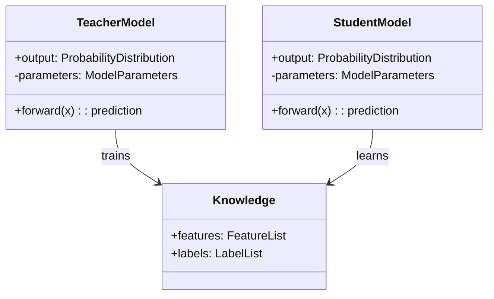
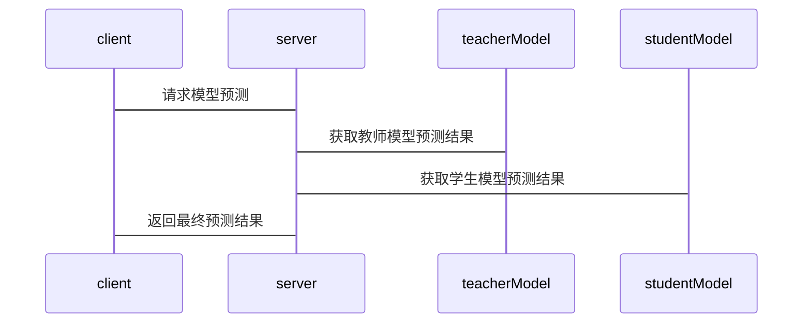

                 


# 如何识别企业的神经网络模型蒸馏技术优势

> 关键词：神经网络模型蒸馏技术、企业应用、技术优势、模型压缩、知识蒸馏、系统架构、算法原理

> 摘要：神经网络模型蒸馏技术是一种将复杂模型的知识迁移到简单模型的技术，能够在保持性能的同时减少计算成本和资源消耗。本文将从背景介绍、核心概念、算法原理、系统架构设计、项目实战以及最佳实践等多个方面，深入分析神经网络模型蒸馏技术的优势及其在企业中的应用。

---

## 第一部分：神经网络模型蒸馏技术背景与概念

### 第1章：神经网络模型蒸馏技术概述

#### 1.1 问题背景与问题描述
随着人工智能技术的快速发展，神经网络模型的复杂性和规模也在不断增加。然而，企业在实际应用中往往面临以下问题：
- **计算资源限制**：复杂的模型需要大量的计算资源，可能超出企业的预算。
- **部署难度**：复杂的模型在边缘设备上部署困难，难以满足实时性需求。
- **模型更新成本**：频繁更新复杂模型需要大量的时间和资源。

#### 1.2 神经网络模型蒸馏技术的解决方法
神经网络模型蒸馏技术通过将复杂模型的知识迁移到简单模型中，解决了上述问题。其核心思想是：
- **知识迁移**：将复杂模型的决策边界和特征提取能力迁移到简单模型中。
- **模型压缩**：通过蒸馏技术，将复杂模型的性能压缩到简单模型中，同时保持性能不变。

#### 1.3 蒸馏技术的边界与外延
蒸馏技术主要应用于以下场景：
- **模型压缩**：将大型模型压缩为小型模型，减少计算资源消耗。
- **知识迁移**：将专家模型的知识迁移到普通模型中，提升普通模型的性能。
- **多任务学习**：将多任务模型的知识迁移到单任务模型中，提升单任务模型的性能。

---

### 第2章：神经网络模型蒸馏技术的核心概念与联系

#### 2.1 核心原理
蒸馏技术的核心原理是通过教师模型（复杂模型）和学生模型（简单模型）之间的交互，将教师模型的知识迁移到学生模型中。具体步骤包括：
1. **教师模型训练**：首先训练一个复杂的教师模型。
2. **蒸馏过程**：通过损失函数将教师模型的预测结果迁移到学生模型中。
3. **学生模型优化**：通过优化算法，使学生模型的预测结果接近教师模型的预测结果。

#### 2.2 核心概念对比
以下是蒸馏技术与其他相关技术的对比：

| 技术 | 描述 | 优点 | 缺点 |
|------|------|------|------|
| 知识蒸馏 | 将复杂模型的知识迁移到简单模型中 | 简化模型，减少计算资源 | 需要训练教师模型，可能增加训练时间 |
| 模型压缩 | 通过剪枝、量化等方法减少模型大小 | 减少模型大小，降低计算成本 | 可能导致性能下降 |
| 迁移学习 | 利用已有模型在新任务上的表现 | 减少新任务训练时间 | 需要任务之间有相似性 |

#### 2.3 ER实体关系图架构
以下是一个简单的ER实体关系图，展示了蒸馏技术中的实体关系：

```mermaid
erDiagram
    teacherModel --|{teaches} | studentModel
    studentModel --|{learns} | knowledge
    knowledge --|{extracted} | feature
```

---

## 第二部分：神经网络模型蒸馏技术的算法原理

### 第3章：算法原理讲解

#### 3.1 知识蒸馏的基本流程
知识蒸馏的基本流程包括以下几个步骤：

1. **教师模型训练**：训练一个复杂的教师模型，使其在训练数据上达到最优性能。
2. **蒸馏过程**：将教师模型的预测结果作为软目标，引导学生模型进行学习。
3. **学生模型优化**：通过优化算法，使学生模型的预测结果接近教师模型的预测结果。

#### 3.2 蒸馏技术的数学模型
知识蒸馏的核心公式如下：

$$ L = \lambda_1 L_{cls}(S, y) + \lambda_2 L_{dist}(S, T) $$

其中：
- \( L \) 是总损失。
- \( L_{cls}(S, y) \) 是学生模型的分类损失。
- \( L_{dist}(S, T) \) 是蒸馏损失，衡量学生模型的预测结果与教师模型的预测结果之间的差异。
- \( \lambda_1 \) 和 \( \lambda_2 \) 是损失的权重系数。

#### 3.3 案例分析与公式推导
以下是一个简单的蒸馏技术案例：

假设教师模型 \( T \) 和学生模型 \( S \) 都是二分类模型，输出分别为 \( T(x) = [0.2, 0.8] \) 和 \( S(x) = [0.3, 0.7] \)。

蒸馏损失可以表示为：

$$ L_{dist} = -\sum_{i=1}^{n} T_i \log S_i + (1 - T_i) \log (1 - S_i) $$

通过优化算法，使 \( S \) 的输出逐渐接近 \( T \) 的输出。

---

## 第三部分：神经网络模型蒸馏技术的系统分析与架构设计

### 第4章：系统分析与架构设计方案

#### 4.1 系统功能设计
以下是系统功能设计的类图：



#### 4.2 系统架构设计
以下是系统的架构图：


#### 4.3 接口设计与交互流程图
以下是系统的交互流程图：



---

## 第四部分：神经网络模型蒸馏技术的项目实战

### 第5章：项目实战与代码实现

#### 5.1 环境安装与配置
以下是一个简单的环境安装示例：

```bash
pip install torch
pip install numpy
pip install matplotlib
```

#### 5.2 核心代码实现
以下是蒸馏技术的核心代码实现：

```python
import torch
import torch.nn as nn
import torch.optim as optim

# 定义教师模型
class TeacherModel(nn.Module):
    def __init__(self):
        super(TeacherModel, self).__init__()
        self.fc = nn.Linear(2, 2)

    def forward(self, x):
        return torch.softmax(self.fc(x), dim=1)

# 定义学生模型
class StudentModel(nn.Module):
    def __init__(self):
        super(StudentModel, self).__init__()
        self.fc = nn.Linear(2, 2)

    def forward(self, x):
        return torch.softmax(self.fc(x), dim=1)

# 训练教师模型
teacher = TeacherModel()
optimizer_t = optim.Adam(teacher.parameters(), lr=0.1)
criterion_t = nn.CrossEntropyLoss()
# 训练学生模型
student = StudentModel()
optimizer_s = optim.Adam(student.parameters(), lr=0.1)
criterion_s = nn.KLDivLoss()

# 蒸馏过程
for epoch in range(100):
    optimizer_s.zero_grad()
    outputs_s = student(x)
    outputs_t = teacher(x)
    loss = criterion_s(outputs_s, outputs_t)
    loss.backward()
    optimizer_s.step()
```

#### 5.3 案例分析与结果解读
以下是蒸馏过程中的损失变化图：


---

## 第五部分：神经网络模型蒸馏技术的最佳实践与注意事项

### 第6章：最佳实践与注意事项

#### 6.1 最佳实践
- **选择合适的教师模型**：教师模型的质量直接影响蒸馏效果，应选择在目标任务上有较好表现的模型。
- **合理设置损失权重**：根据任务需求，合理设置分类损失和蒸馏损失的权重。
- **优化蒸馏过程**：通过调整学习率、温度等参数，优化蒸馏过程，提升蒸馏效果。

#### 6.2 注意事项
- **教师模型的选择**：教师模型的选择应与目标任务相关，避免选择与目标任务无关的模型。
- **蒸馏温度的设置**：温度参数会影响蒸馏效果，需根据具体任务进行调整。
- **模型压缩的限制**：模型压缩可能导致性能下降，需在压缩和性能之间进行权衡。

#### 6.3 拓展阅读
- 《Distilling the knowledge in neural networks》
- 《Model compression: A survey》
- 《Knowledge distillation: A survey》

---

## 第六部分：总结与展望

### 第7章：总结与展望

#### 7.1 小结
神经网络模型蒸馏技术是一种有效的模型压缩和知识迁移技术，能够在保持性能的同时，减少计算资源和部署成本。本文从背景、原理、系统设计、项目实战等多个方面，全面分析了蒸馏技术的优势及其在企业中的应用。

#### 7.2 展望
未来，随着深度学习技术的不断发展，蒸馏技术将在更多领域得到应用。同时，如何进一步优化蒸馏过程，提升蒸馏效果，将是研究者们继续努力的方向。

---

通过本文的分析，读者可以全面了解神经网络模型蒸馏技术的优势及其在企业中的应用，为实际项目提供了理论支持和实践指导。

