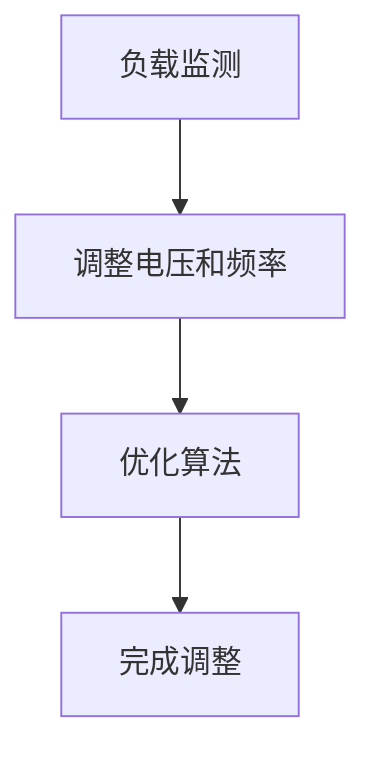

                 


# 如何识别企业的边缘AI芯片低功耗设计优势

> 关键词：边缘AI芯片，低功耗设计，功耗优化，动态电压频率调整，系统架构设计

> 摘要：本文将详细探讨如何识别企业的边缘AI芯片在低功耗设计方面的优势。通过分析边缘AI芯片的背景与核心概念、低功耗设计的关键技术、动态电压频率调整算法、系统架构设计、项目实战与最佳实践，帮助读者全面理解低功耗设计在边缘AI芯片中的重要性，并掌握如何在实际项目中应用这些技术。

---

# 第一部分: 边缘AI芯片低功耗设计的背景与核心概念

## 第1章: 边缘AI芯片与低功耗设计的背景

### 1.1 边缘计算的兴起与发展

#### 1.1.1 边缘计算的定义与特点
边缘计算是一种分布式计算范式，将数据处理从中心化的云端转移到靠近数据源的边缘设备。其特点包括低延迟、高实时性、高效的数据处理能力以及本地化的数据管理。

#### 1.1.2 边缘AI芯片的出现与重要性
边缘AI芯片是边缘计算的核心硬件，专门用于在边缘设备上运行AI算法。其重要性体现在其能够支持本地化的智能决策，减少对云端的依赖，提高系统的可靠性和响应速度。

#### 1.1.3 低功耗设计在边缘计算中的意义
边缘设备通常运行在资源受限的环境中，功耗过高会导致设备寿命缩短、运行成本增加。因此，低功耗设计是边缘AI芯片的核心优势之一，能够延长设备的续航时间，降低成本，并提高系统的可持续性。

---

### 1.2 边缘AI芯片的应用场景

#### 1.2.1 智能物联网设备
边缘AI芯片广泛应用于智能家居、工业物联网等领域，支持本地化的数据处理和智能决策。

#### 1.2.2 移动端AI应用
在智能手机、平板电脑等移动设备上，边缘AI芯片能够提供高效的AI推理能力，支持实时语音识别、图像处理等任务。

#### 1.2.3 边缘服务器与云计算的结合
边缘AI芯片可以作为边缘服务器的核心，与云端协同工作，实现数据的高效处理和智能分析。

---

### 1.3 低功耗设计的核心挑战

#### 1.3.1 芯片功耗的主要来源
芯片功耗主要来自计算单元、存储单元和I/O模块的功耗。在边缘AI芯片中，AI算法的执行（如矩阵运算）是功耗的主要来源。

#### 1.3.2 边缘计算环境的特殊要求
边缘设备通常需要在高温、高湿度、强震动等恶劣环境中运行，对芯片的功耗和可靠性提出了更高的要求。

#### 1.3.3 低功耗设计的技术难点
低功耗设计需要在芯片架构、电路设计、算法优化等多个方面进行综合优化，确保在性能和功耗之间找到最佳平衡点。

---

## 第2章: 边缘AI芯片低功耗设计的核心概念

### 2.1 低功耗设计的关键技术

#### 2.1.1 动态电压频率调整技术
动态电压频率调整（DVFS）是一种通过调整芯片的工作电压和频率来优化功耗的技术。在低负载情况下，芯片可以降低电压和频率，从而减少功耗。

#### 2.1.2 睿智电源管理策略
睿智电源管理（Smart Power Management）是一种通过智能控制电源开关状态，减少闲置状态下的功耗的技术。例如，可以通过关闭不使用的模块或核心来降低整体功耗。

#### 2.1.3 芯片架构优化方法
芯片架构优化包括采用低功耗工艺、减少寄生电容、优化电路设计等方法，从而降低芯片的整体功耗。

---

### 2.2 边缘AI芯片的性能与功耗平衡

#### 2.2.1 性能与功耗的权衡分析
在边缘AI芯片设计中，性能和功耗是两个相互制约的指标。高性能需要更高的功耗，而低功耗设计可能会牺牲部分性能。因此，需要在两者之间找到最佳平衡点。

#### 2.2.2 边缘计算场景下的性能需求
边缘AI芯片需要在实时性、响应速度、处理能力等方面满足特定场景的需求。例如，在自动驾驶中，芯片需要在极短的时间内完成复杂的计算任务。

#### 2.2.3 功耗优化对芯片性能的影响
通过低功耗设计，可以在不影响性能的前提下，显著降低芯片的功耗。例如，通过动态电压频率调整技术，可以在不影响计算结果的情况下，动态调整芯片的电压和频率。

---

### 2.3 低功耗设计的量化评估指标

#### 2.3.1 功耗效率（Power Efficiency）的定义
功耗效率是指单位时间内完成的计算任务与功耗的比值。功耗效率越高，说明芯片的能效比越高。

#### 2.3.2 功耗与性能的量化对比
通过量化对比不同设计方法下的功耗和性能，可以更好地评估低功耗设计的有效性。例如，可以对比动态电压频率调整技术下的功耗与性能变化。

#### 2.3.3 行业基准与对比分析
通过对比行业基准和实际应用中的数据，可以更直观地评估边缘AI芯片的低功耗设计优势。例如，可以通过对比不同芯片的功耗效率和性能指标，选择最优的设计方案。

---

# 第二部分: 低功耗设计的核心原理与算法实现

## 第3章: 低功耗设计的算法原理

### 3.1 动态电压频率调整算法

#### 3.1.1 动态电压频率调整的原理
动态电压频率调整（DVFS）是一种通过动态调整芯片的工作电压和频率来优化功耗的技术。其基本原理是：在低负载情况下，降低电压和频率可以显著减少功耗；在高负载情况下，提高电压和频率以满足计算需求。

#### 3.1.2 调整策略

**步骤1：监测负载变化**
通过监测系统的负载变化，动态调整电压和频率。例如，可以通过CPU利用率、任务队列长度等指标来判断系统的负载状态。

**步骤2：调整电压和频率**
根据负载状态，动态调整电压和频率。例如，在低负载情况下，将电压降低至最低水平，频率降至最低频率；在高负载情况下，将电压和频率调整至最高水平。

**步骤3：优化算法**
通过优化算法，减少调整过程中的功耗浪费。例如，采用智能预测算法，提前预判负载变化，优化调整策略。

---

#### 3.1.3 动态电压频率调整算法的实现

**Mermaid流程图：**


**Python代码示例：**
```python
def dynamic_vf_adjustment():
    while True:
        load = monitor_load()  # 监测负载
        voltage, frequency = get_vf_profile(load)  # 获取电压和频率配置
        set_vf(voltage, frequency)  # 设置电压和频率
        optimize_algorithm(load, voltage, frequency)  # 优化算法
```

---

### 3.2 睿智电源管理策略

#### 3.2.1 睿智电源管理的原理
睿智电源管理（Smart Power Management）是一种通过智能控制电源开关状态，减少闲置状态下的功耗的技术。其基本原理是：在设备闲置时，关闭不使用的模块或核心，减少功耗；在需要时，快速唤醒设备，恢复正常使用。

#### 3.2.2 睿智电源管理的实现步骤

**步骤1：设备状态监测**
监测设备的使用状态，判断是否处于闲置状态。

**步骤2：电源管理决策**
根据设备状态，决策是否需要关闭不使用的模块或核心。

**步骤3：快速唤醒机制**
在需要恢复使用时，快速唤醒设备，恢复正常使用。

---

### 3.3 算法实现与优化

#### 3.3.1 算法实现
动态电压频率调整和睿智电源管理的结合，可以通过以下步骤实现：

1. **监测负载状态**：通过传感器或系统监控工具，实时监测设备的负载状态。
2. **调整电压和频率**：根据负载状态，动态调整电压和频率。
3. **优化算法**：通过优化算法，减少调整过程中的功耗浪费。

#### 3.3.2 算法优化
1. **智能预测算法**：通过机器学习等技术，预测未来的负载状态，提前调整电压和频率。
2. **高效唤醒机制**：通过优化唤醒算法，减少设备在闲置状态下的功耗。

---

## 第4章: 低功耗设计的系统架构与实现

### 4.1 系统架构设计

#### 4.1.1 系统功能设计
边缘AI芯片的系统功能设计包括数据采集、AI推理、结果输出等模块。每个模块需要进行详细的功耗分析和优化。

#### 4.1.2 系统架构优化
通过优化系统架构，减少不必要的模块和接口，降低整体功耗。例如，采用模块化设计，减少模块之间的通信开销。

#### 4.1.3 系统接口设计
系统接口设计需要考虑功耗优化。例如，采用低功耗通信协议，减少数据传输过程中的功耗。

---

### 4.2 系统实现

#### 4.2.1 系统实现步骤
1. **环境搭建**：搭建开发环境，安装必要的开发工具和库。
2. **核心代码实现**：实现动态电压频率调整和睿智电源管理的核心代码。
3. **系统集成与测试**：将核心代码集成到系统中，进行全面的功能测试和功耗测试。

#### 4.2.2 核心代码实现
```python
def system_architecture():
    modules = ["data_capture", "AI_inference", "result_output"]
    for module in modules:
        if module == "data_capture":
            capture_data()  # 数据采集模块
        elif module == "AI_inference":
            perform_inference()  # AI推理模块
        elif module == "result_output":
            output_result()  # 结果输出模块
    optimize_architecture(modules)  # 系统架构优化
```

---

## 第5章: 项目实战与案例分析

### 5.1 项目实战

#### 5.1.1 环境安装
1. 安装必要的开发工具和库，例如Python、TensorFlow、PyCharm等。
2. 配置开发环境，确保所有依赖项安装正确。

#### 5.1.2 核心代码实现
```python
def main():
    import os
    import time

    def monitor_load():
        # 监测系统负载
        return os.popen("top -n 1 | grep %Cpu").read()

    def get_vf_profile(load):
        # 根据负载返回电压和频率配置
        if load < 10:
            return (1.2, 1.0)
        elif 10 <= load < 30:
            return (1.3, 1.2)
        else:
            return (1.4, 1.4)

    def set_vf(voltage, frequency):
        # 设置电压和频率
        print(f"Voltage: {voltage}V, Frequency: {frequency}GHz")

    while True:
        load = monitor_load()
        voltage, frequency = get_vf_profile(load)
        set_vf(voltage, frequency)
        time.sleep(1)
```

---

### 5.2 案例分析

#### 5.2.1 案例背景
假设我们正在开发一款边缘AI芯片，用于智能家居中的智能门锁。该芯片需要在低功耗状态下运行，支持人脸识别和指纹识别功能。

#### 5.2.2 功耗优化方案
1. **动态电压频率调整**：在低负载情况下，降低电压和频率，减少功耗。
2. **睿智电源管理**：在设备闲置时，关闭不使用的模块，减少功耗。

---

## 第6章: 最佳实践与注意事项

### 6.1 最佳实践

#### 6.1.1 动态电压频率调整的最佳实践
1. **实时监测负载状态**：通过传感器或监控工具，实时监测系统负载。
2. **智能预测算法**：采用机器学习等技术，预测未来的负载状态，提前调整电压和频率。

#### 6.1.2 睿智电源管理的最佳实践
1. **快速唤醒机制**：在需要恢复使用时，快速唤醒设备，恢复正常使用。
2. **低功耗通信协议**：采用低功耗通信协议，减少数据传输过程中的功耗。

---

### 6.2 小结

通过本文的详细讲解，我们可以看出，边缘AI芯片的低功耗设计是实现高效、可靠边缘计算的核心优势之一。通过动态电压频率调整、睿智电源管理等技术，可以在不牺牲性能的前提下，显著降低芯片的功耗，延长设备的续航时间，降低成本，提高系统的可持续性。

---

### 6.3 注意事项

1. **负载监测的准确性**：动态电压频率调整的效果依赖于负载监测的准确性。如果负载监测不准确，可能导致电压和频率调整不合理，增加功耗浪费。
2. **算法优化的复杂性**：动态电压频率调整和睿智电源管理的优化算法较为复杂，需要结合具体应用场景进行调整和优化。
3. **系统架构设计的合理性**：系统架构设计需要综合考虑功耗、性能、成本等多方面的因素，确保设计的合理性。

---

### 6.4 拓展阅读

1. **《动态电压频率调整技术在边缘计算中的应用》**
2. **《低功耗系统设计：原理与实践》**
3. **《边缘AI芯片开发指南》**

通过以上内容的详细讲解，我们希望能够帮助读者更好地理解边缘AI芯片的低功耗设计优势，并在实际项目中应用这些技术，实现高效的边缘计算。

---

