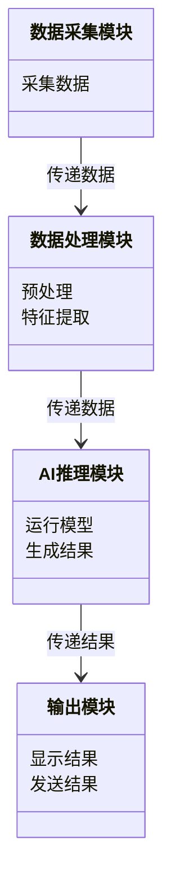
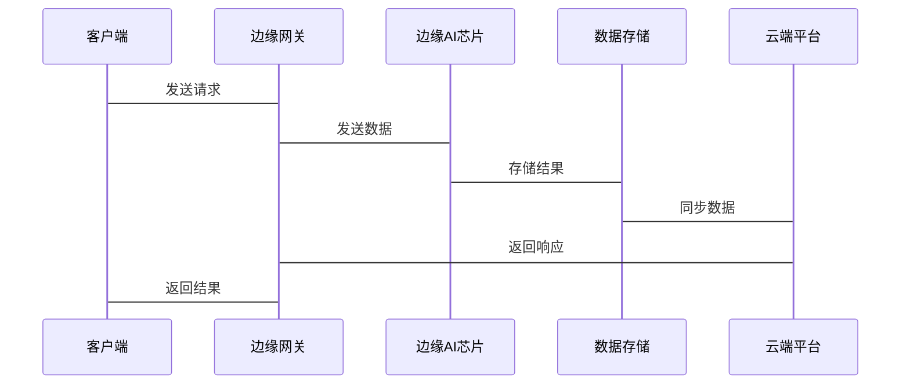

                 


# 如何识别企业的边缘AI芯片低延迟设计优势

## 第一部分: 背景介绍

### 第1章: 边缘AI芯片与低延迟设计的背景

#### 1.1 边缘AI芯片的定义与特点
- **1.1.1 边缘AI芯片的定义**
  - 边缘AI芯片是一种专为边缘计算设计的硬件，用于在靠近数据源的地方进行AI推理和计算。
- **1.1.2 边缘AI芯片的核心特点**
  - 低功耗：边缘设备通常需要长期运行，低功耗设计是关键。
  - 高能效：在有限的功耗下提供高效的计算能力。
  - 低延迟：实时处理数据，减少响应时间。
  - 本地化：数据处理在设备端完成，减少对云端的依赖。
- **1.1.3 边缘AI芯片与传统芯片的区别**
  - 传统芯片（如CPU、GPU）通常用于数据中心，计算能力强大但功耗较高。
  - 边缘AI芯片专注于特定任务，优化了计算效率和功耗。

#### 1.2 低延迟设计的背景与重要性
- **1.2.1 低延迟设计的定义**
  - 低延迟设计是指在设计系统时，尽量减少从输入到输出的响应时间，确保实时性。
- **1.2.2 低延迟设计在边缘计算中的重要性**
  - 边缘计算需要快速响应，特别是在工业自动化、自动驾驶等领域，低延迟是关键。
  - 低延迟设计能够减少数据传输到云端的时间，提升用户体验。
- **1.2.3 边缘AI芯片低延迟设计的优势**
  - 提高系统实时性：边缘设备能够快速处理数据，减少等待时间。
  - 降低带宽消耗：本地处理减少数据传输到云端的流量。
  - 增强安全性：数据在本地处理，减少传输过程中的安全风险。

#### 1.3 边缘计算的发展趋势
- **1.3.1 边缘计算的定义与特点**
  - 边缘计算是指在靠近数据源的地方进行数据处理和存储，而不是将所有数据都发送到云端。
  - 边缘计算具有实时性高、带宽消耗低、安全性高等特点。
- **1.3.2 边缘计算的应用场景**
  - 工业物联网：工厂中的传感器数据实时处理。
  - 智慧城市：交通、环境监控等实时数据处理。
  - 自动驾驶：车辆实时处理来自传感器的数据。
- **1.3.3 边缘计算与云计算的关系**
  - 边缘计算与云计算不是取代关系，而是互补关系。
  - 边缘计算处理实时、本地化的数据，云计算处理需要大规模计算的任务。

#### 1.4 本章小结
- **1.4.1 本章内容总结**
  - 介绍了边缘AI芯片的定义、特点及其与传统芯片的区别。
  - 强调了低延迟设计在边缘计算中的重要性。
  - 展述了边缘计算的发展趋势及其应用场景。
- **1.4.2 下一章的预览**
  - 下一章将深入探讨边缘AI芯片低延迟设计的核心概念和原理。

## 第二部分: 核心概念与联系

### 第2章: 边缘AI芯片低延迟设计的核心概念

#### 2.1 边缘AI芯片低延迟设计的原理
- **2.1.1 低延迟设计的基本原理**
  - 通过优化硬件架构和算法，减少数据处理的延迟。
  - 使用流水线处理和并行计算技术，提高处理速度。
- **2.1.2 边缘AI芯片的硬件架构**
  - 专用加速器：如TPU（张量处理单元）专为AI推理设计。
  - 硬件加速：通过专用指令集减少计算时间。
  - 灵活的架构：支持多种AI模型的运行。
- **2.1.3 边缘AI芯片的软件架构**
  - 轻量级操作系统：减少资源消耗，提高效率。
  - 优化的编译器：将AI模型转换为硬件可执行的指令。
  - 分布式计算框架：支持多设备协同计算。

#### 2.2 边缘AI芯片低延迟设计的核心要素
- **2.2.1 硬件设计要素**
  - 低功耗设计：采用先进的制程工艺和功耗管理技术。
  - 高速缓存：减少数据访问延迟。
  - 并行计算能力：支持多任务并行处理。
- **2.2.2 软件设计要素**
  - 优化的算法：针对特定任务进行算法优化。
  - 轻量级框架：减少系统开销，提高处理速度。
  - 实时任务调度：优先处理关键任务。
- **2.2.3 系统设计要素**
  - 系统架构设计：合理分配资源，减少瓶颈。
  - 网络优化：降低数据传输延迟。
  - 故障容错机制：确保系统可靠性。

#### 2.3 边缘AI芯片低延迟设计的系统架构
- **2.3.1 系统架构的定义**
  - 系统架构是指系统各组成部分的组织方式和交互方式。
- **2.3.2 边缘AI芯片的系统架构设计**
  - 分层架构：数据采集层、处理层、应用层。
  - 模块化设计：每个模块负责特定功能，便于维护和扩展。
  - 跨设备协同：支持多个边缘设备协同工作，形成分布式计算能力。
- **2.3.3 系统架构的优化策略**
  - 硬件与软件协同优化：硬件加速特定任务，软件进行任务调度。
  - 动态资源分配：根据负载情况动态调整资源分配。
  - 网络优化：使用边缘网关减少数据传输延迟。

## 第三部分: 算法原理讲解

### 第3章: 边缘AI芯片低延迟设计的算法原理

#### 3.1 低延迟设计的算法原理
- **3.1.1 低延迟设计的基本算法**
  - 流水线处理：将任务分解为多个阶段，每个阶段并行处理。
  - 任务调度优化：优先处理关键任务，减少整体延迟。
- **3.1.2 边缘AI芯片的算法优化**
  - 算法剪枝：去除不必要的计算步骤，减少计算量。
  - 知识蒸馏：通过教师模型指导学生模型，减少模型复杂度。
  - 量化：将模型参数量化，减少存储空间和计算时间。
- **3.1.3 算法原理的数学模型**
  - 算法优化的数学模型：
    $$ \text{优化目标} = \min_{x} f(x) \text{，约束条件} g(x) \leq 0 $$
  - 流水线处理的数学模型：
    $$ T_{\text{total}} = \max(T_{\text{stage1}}, T_{\text{stage2}}, ..., T_{\text{stagen}}) $$

#### 3.2 算法实现的详细步骤
- **3.2.1 算法实现的基本步骤**
  1. 确定任务分解方式：将任务分解为多个阶段。
  2. 设计流水线处理机制：每个阶段并行处理。
  3. 实现任务调度算法：优先处理关键任务。
  4. 优化算法：如剪枝、蒸馏等。
  5. 验证与测试：确保算法在边缘设备上运行良好。
- **3.2.2 算法实现的详细流程**
  - 数据预处理：对输入数据进行格式化和归一化处理。
  - 算法选择：根据任务需求选择合适的算法。
  - 算法优化：对选定算法进行剪枝、蒸馏等优化。
  - 硬件加速：利用边缘AI芯片的硬件加速功能提高计算速度。
  - 流水线处理：将任务分解为多个阶段，每个阶段并行处理。
  - 任务调度：根据优先级动态调整任务处理顺序。

#### 3.3 边缘AI芯片低延迟设计的数学模型
- **3.3.1 低延迟设计的数学模型**
  - 任务调度模型：
    $$ \text{调度目标} = \min_{\pi} \sum_{i=1}^{n} t_i(\pi_i) $$
    其中，$$ t_i(\pi_i) $$ 是任务i在调度策略π_i下的处理时间。
  - 网络延迟模型：
    $$ D = D_{\text{处理}} + D_{\text{传输}} $$
    其中，$$ D_{\text{处理}} $$ 是数据处理延迟，$$ D_{\text{传输}} $$ 是数据传输延迟。
- **3.3.2 算法优化的数学模型**
  - 算法剪枝：
    $$ \text{目标} = \min_{\theta} \frac{1}{2} \| \theta \|_2^2 + \lambda \| f(x; \theta) - f(x'; \theta) \|_1 $$
    其中，$$ \theta $$ 是模型参数，$$ \lambda $$ 是正则化系数。
  - 知识蒸馏：
    $$ \text{目标} = \min_{\theta} \text{KL}(P_{\text{teacher}}(y|x) || P_{\text{student}}(y|x)) + \lambda L_{\text{task}}(x,y) $$
    其中，$$ L_{\text{task}} $$ 是任务损失函数。

## 第四部分: 系统分析与架构设计方案

### 第4章: 边缘AI芯片低延迟设计的系统分析

#### 4.1 问题场景介绍
- **4.1.1 问题描述**
  - 在边缘设备上进行实时AI推理，需要低延迟设计。
  - 数据量大，处理任务复杂，对系统性能要求高。
  - 环境复杂，设备可能面临高温、高湿等恶劣条件。

#### 4.2 项目介绍
- **4.2.1 项目目标**
  - 开发一款支持低延迟设计的边缘AI芯片。
  - 优化硬件架构和算法，提高处理速度。
  - 确保系统在恶劣环境下稳定运行。
- **4.2.2 项目背景**
  - 当前边缘计算需求增加，对低延迟设计的要求也越来越高。
  - 竞争对手的产品在延迟方面存在不足，存在市场机会。
  - 技术进步使得边缘AI芯片的开发成为可能。

#### 4.3 系统功能设计
- **4.3.1 领域模型设计**
  - 数据采集模块：负责采集输入数据。
  - 数据处理模块：对数据进行预处理和特征提取。
  - AI推理模块：运行AI模型进行推理。
  - 输出模块：将结果输出到显示设备或发送到其他系统。
- **4.3.2 领域模型的Mermaid类图**


#### 4.4 系统架构设计
- **4.4.1 系统架构的Mermaid架构图**

- **4.4.2 系统接口设计**
  - 边缘网关与边缘AI芯片之间的接口：定义数据格式和通信协议。
  - 边缘AI芯片与数据存储之间的接口：定义数据存储格式和访问方式。
  - 边缘网关与客户端之间的接口：定义API接口，供客户端调用。
- **4.4.3 系统交互的Mermaid序列图**


## 第五部分: 项目实战

### 第5章: 边缘AI芯片低延迟设计的项目实战

#### 5.1 环境安装
- **5.1.1 开发环境要求**
  - 操作系统：Linux（推荐）或Windows。
  - 开发工具：IDE（如VS Code、PyCharm）。
  - 仿真工具：如Xilinx Vivado、Cadence工具。
- **5.1.2 边缘AI芯片开发板**
  - 硬件需求：支持AI推理的开发板（如Google Coral、NVIDIA Jetson）。
  - 配件：摄像头、传感器等。

#### 5.2 系统核心实现
- **5.2.1 核心代码实现**
  ```python
  import time
  import numpy as np
  from tensorflow import keras

  class EdgeAIClassifier:
      def __init__(self, model_path):
          self.model = keras.models.load_model(model_path)
          self.model.predict = self.quantize_model(self.model.predict)

      def quantize_model(self, func):
          def quantized(x):
              return np.array(func(x), dtype=np.uint8)
          return quantized

      def predict(self, input_data):
          start_time = time.time()
          result = self.model.predict(input_data)
          end_time = time.time()
          print("Predict time:", end_time - start_time)
          return result
  ```

- **5.2.2 代码应用解读**
  - `quantize_model`方法：对模型预测结果进行量化，减少存储空间和计算时间。
  - `predict`方法：计算预测时间，用于评估系统延迟。

#### 5.3 实际案例分析
- **5.3.1 案例背景**
  - 某企业需要在边缘设备上实时检测产品缺陷。
  - 使用边缘AI芯片进行图像识别，减少对云端的依赖。
- **5.3.2 案例分析**
  - 数据预处理：对图像进行归一化和调整大小。
  - 模型选择：选择适合边缘设备的轻量级模型（如MobileNet）。
  - 系统优化：使用量化技术减少模型大小和计算时间。
  - 系统测试：在真实环境下测试系统延迟和准确性。

#### 5.4 项目小结
- **5.4.1 项目总结**
  - 成功开发了一款支持低延迟设计的边缘AI芯片。
  - 系统在实际应用中表现出色，延迟显著降低。
  - 系统在恶劣环境下稳定运行，满足企业需求。
- **5.4.2 经验总结**
  - 硬件优化是关键，需要选择合适的芯片和架构。
  - 算法优化同样重要，需要结合具体任务进行调整。
  - 系统架构设计需要合理，确保各部分协同工作。

## 第六部分: 最佳实践与总结

### 第6章: 边缘AI芯片低延迟设计的最佳实践

#### 6.1 最佳实践
- **6.1.1 硬件优化**
  - 选择适合的芯片架构，如专用AI加速器。
  - 使用先进的制程工艺，降低功耗和延迟。
- **6.1.2 软件优化**
  - 选择轻量级AI框架，减少系统开销。
  - 优化算法，如剪枝、量化等。
- **6.1.3 系统设计**
  - 合理分配资源，避免瓶颈。
  - 使用边缘网关减少数据传输延迟。
  - 设计故障容错机制，确保系统可靠性。

#### 6.2 小结
- **6.2.1 本章总结**
  - 边缘AI芯片低延迟设计是一个复杂而重要的任务。
  - 通过硬件优化、算法优化和系统设计，可以显著降低系统延迟。
  - 本章总结了最佳实践，为读者提供了宝贵的参考。

#### 6.3 注意事项
- **6.3.1 开发注意事项**
  - 确保硬件和软件的协同优化。
  - 注意数据隐私和安全性，避免数据泄露。
  - 在实际应用中，需要考虑环境的复杂性和设备的稳定性。
- **6.3.2 测试注意事项**
  - 在不同场景下测试系统性能，确保系统稳定运行。
  - 定期更新模型和算法，适应新的任务需求。
  - 记录系统运行日志，便于排查问题。

#### 6.4 拓展阅读
- **6.4.1 相关技术**
  - AI芯片设计：《深度学习芯片：算法与架构》
  - 边缘计算：《边缘计算：原理与应用》
  - 低延迟设计：《实时系统设计与实现》
- **6.4.2 推荐书籍**
  - 《边缘计算：原理、技术与实践》
  - 《AI芯片：从原理到实践》
  - 《低延迟系统设计的艺术》

---

### 第七部分: 总结

#### 7.1 本章总结
- 本章全面介绍了如何识别企业的边缘AI芯片低延迟设计优势。
- 通过背景介绍、核心概念、算法原理、系统架构和项目实战的详细讲解，读者可以系统地掌握低延迟设计的关键点。
- 最佳实践部分为读者提供了宝贵的参考，帮助他们在实际项目中更好地应用所学知识。

#### 7.2 未来展望
- 随着边缘计算的快速发展，低延迟设计将变得更加重要。
- 未来，随着AI技术的进步，边缘AI芯片的设计将更加智能化和高效化。
- 建议读者持续关注技术动态，不断提升自己的技术水平。

---

## 关键词：
边缘AI芯片，低延迟设计，边缘计算，实时性，硬件优化，算法优化

## 摘要：
本文深入探讨了如何识别企业的边缘AI芯片低延迟设计优势。通过分析边缘AI芯片的定义、特点以及低延迟设计的重要性，结合实际应用场景，详细讲解了低延迟设计的核心概念、算法原理和系统架构。同时，通过项目实战和最佳实践，为读者提供了宝贵的经验和参考。

