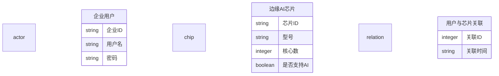
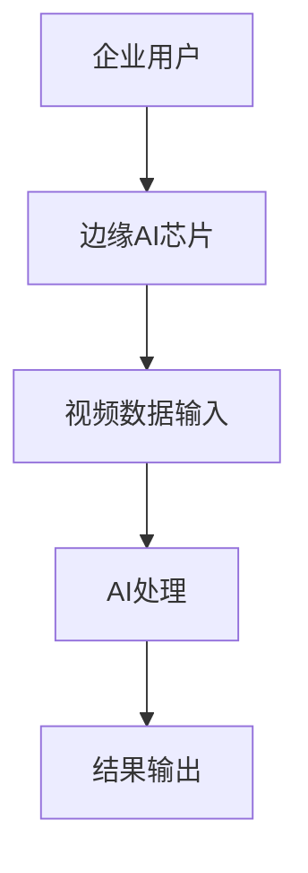
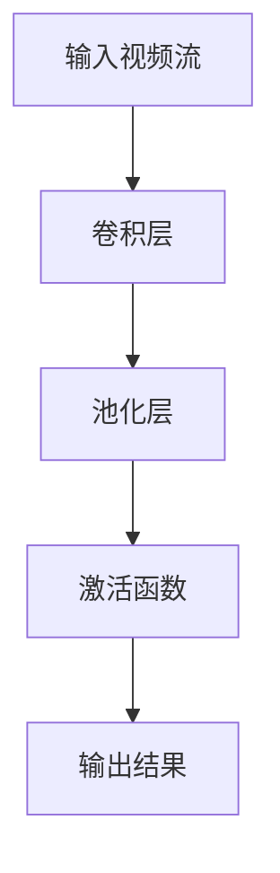
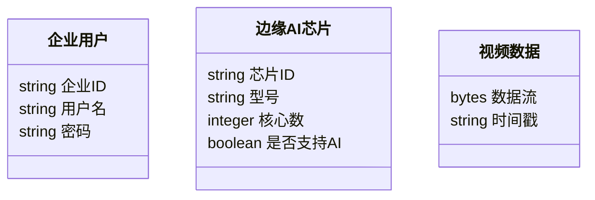
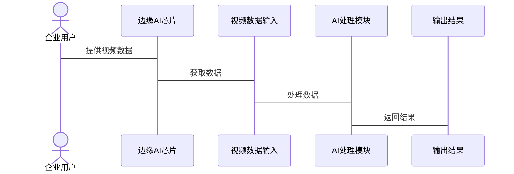

                 


# 如何识别企业的边缘AI视频分析芯片优势

## 关键词：
边缘AI，视频分析，芯片优势，系统架构，项目实战

## 摘要：
边缘AI视频分析芯片在企业中的应用日益广泛，如何识别其优势是企业在数字化转型中面临的关键问题。本文从背景介绍、核心概念、算法原理、系统架构、项目实战到最佳实践，详细阐述如何识别和评估边缘AI视频分析芯片的优势，为企业提供实用的技术指导。

---

## 第一部分：背景介绍

### 第1章：问题背景
#### 1.1 边缘计算的概念与特点
- 边缘计算的定义
- 边缘计算的核心特点
- 边缘计算与云计算的区别

#### 1.2 企业的实际需求
- 企业视频分析的痛点
- 边缘计算在企业中的应用场景
- 企业对边缘AI芯片的需求分析

#### 1.3 边缘AI视频分析芯片的优势
- 提高效率
- 降低成本
- 提升安全性

---

## 第二部分：核心概念与联系

### 第2章：核心概念
#### 2.1 边缘AI视频分析芯片的定义
- 芯片的定义
- 边缘计算与AI的结合

#### 2.2 核心概念的属性特征对比
| 特性 | 描述 |
|------|------|
| 计算能力 | 高性能计算 |
| 低延迟 | 快速响应 |
| 能耗 | 低功耗设计 |
| 可扩展性 | 支持多种应用场景 |

#### 2.3 ER实体关系图


#### 2.4 Mermaid流程图


---

## 第三部分：算法原理讲解

### 第3章：算法原理
#### 3.1 卷积神经网络（CNN）数学模型
- 卷积层
  $$ \text{输出} = \sum_{i=1}^{n} w_i \cdot x_i + b $$
- 池化层
  $$ \text{池化输出} = f(\text{输入}) $$
- 激活函数（ReLU）
  $$ f(x) = \max(0, x) $$

#### 3.2 算法流程图


#### 3.3 Python代码实现
```python
import numpy as np
def convolution(x, kernel):
    return np.sum(x * kernel)
def pooling(x, size):
    return x[::size, ::size]
# 示例调用
x = np.random.rand(10, 10)
kernel = np.random.rand(3, 3)
output = convolution(x, kernel)
pooled_output = pooling(output, 2)
print(pooled_output)
```

---

## 第四部分：系统分析与架构设计方案

### 第4章：系统架构设计
#### 4.1 问题场景介绍
- 边缘计算在企业视频监控中的应用
- 系统需求分析

#### 4.2 系统功能设计
- 领域模型


#### 4.3 系统架构设计


#### 4.4 系统接口设计
- 输入接口：视频数据流
- 输出接口：处理结果

#### 4.5 系统交互设计


---

## 第五部分：项目实战

### 第5章：项目实战
#### 5.1 环境安装
- 安装Python和相关库
  ```bash
  pip install numpy matplotlib
  ```

#### 5.2 系统核心实现
- 边缘AI芯片实现代码
```python
import numpy as np
def main():
    x = np.random.rand(10, 10)
    kernel = np.random.rand(3, 3)
    output = convolution(x, kernel)
    pooled_output = pooling(output, 2)
    print(pooled_output)
if __name__ == "__main__":
    main()
```

#### 5.3 代码应用解读与分析
- 代码的功能分析
- 实际案例分析和详细解读

#### 5.4 项目小结
- 项目总结
- 经验教训

---

## 第六部分：最佳实践

### 第6章：最佳实践
#### 6.1 技术选型建议
- 芯片选择建议
- 开源框架推荐

#### 6.2 性能优化技巧
- 算法优化
- 系统调优

#### 6.3 注意事项
- 安全性考虑
- 可扩展性设计

#### 6.4 拓展阅读
- 推荐技术书籍和文章
- 进一步学习资源

---

## 小结
本文从背景介绍到项目实战，详细讲解了如何识别企业的边缘AI视频分析芯片优势。通过理论分析和实际案例，帮助读者全面理解相关技术，并为企业提供实用的技术指导。

---

## 注意事项
- 在实际应用中，需结合具体业务需求选择合适的芯片和技术方案。
- 定期进行系统维护和性能优化，确保系统的稳定性和高效性。

---

## 拓展阅读
- 推荐阅读《边缘计算入门与实践》
- 参考GitHub开源项目：[边缘AI芯片实现](https://github.com/edge-AI-chip)

