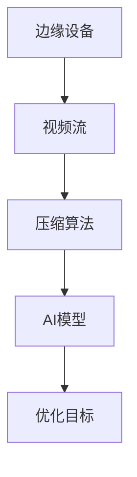
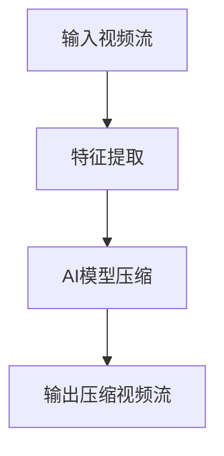
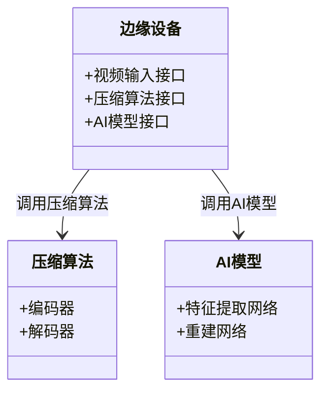
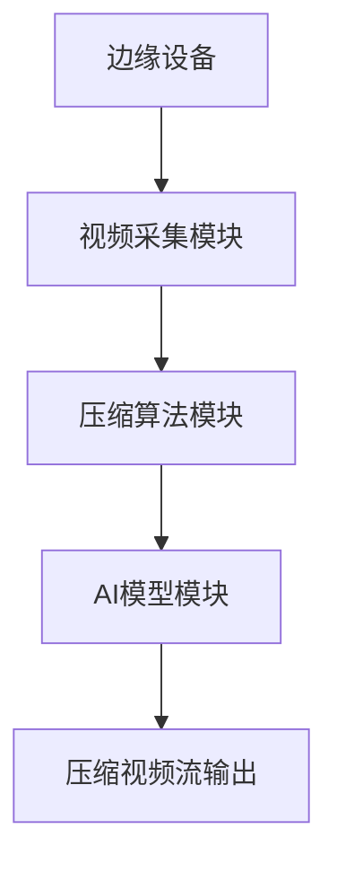
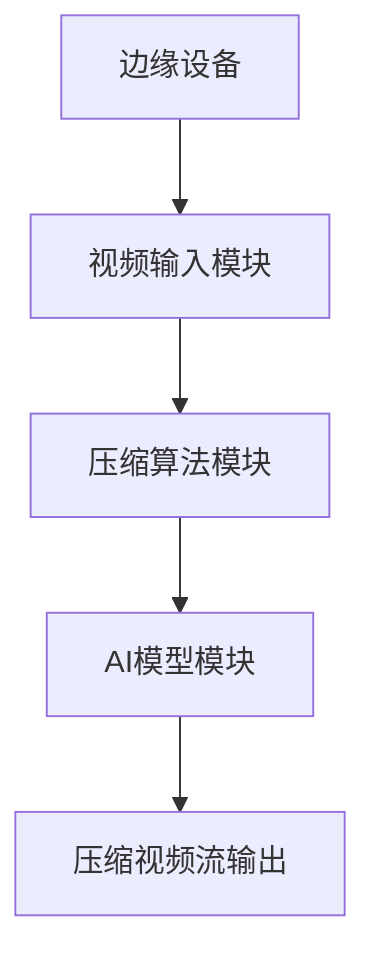

                 


# 如何识别企业的边缘AI视频压缩技术优势

**关键词**：边缘AI，视频压缩，深度学习，算法优化，实时性，资源利用，数据隐私

**摘要**：  
随着边缘计算的快速发展，AI在视频压缩技术中的应用日益广泛。本文从边缘AI视频压缩的核心概念出发，详细分析其算法原理、系统架构、项目实战以及最佳实践。通过对比分析、流程图和代码示例，帮助读者全面理解边缘AI视频压缩的优势，并为企业识别和优化相关技术提供指导。

---

# 第一部分: 边缘AI视频压缩技术背景与核心概念

## 第1章: 边缘AI视频压缩技术概述

### 1.1 边缘AI视频压缩的背景与意义

#### 1.1.1 视频压缩技术的发展历程  
视频压缩技术从早期的MPEG-1、MPEG-2到现代的H.265（HEVC）、H.266（VVC），经历了从追求压缩效率到兼顾压缩效率和实时性的转变。随着5G和物联网的普及，视频数据的生成量急剧增加，传统的中心化视频压缩模式面临带宽和延迟的双重挑战。

#### 1.1.2 边缘计算的兴起与特点  
边缘计算通过将计算能力从云端转移到靠近数据源的边缘设备，显著降低了延迟和带宽消耗。边缘计算的分布式架构能够更高效地处理实时性要求高的视频数据，成为视频压缩技术发展的新方向。

#### 1.1.3 边缘AI视频压缩的优势与应用场景  
边缘AI视频压缩技术结合了AI的高效性和边缘计算的实时性，能够在资源受限的边缘设备上实现高质量的视频压缩。其应用场景包括工业监控、智能安防、自动驾驶、远程医疗等。

---

### 1.2 边缘AI视频压缩的核心概念

#### 1.2.1 边缘计算的定义与特征  
边缘计算是指在靠近数据生成源的地方进行数据处理和存储的计算模式。其特征包括：分布式架构、低延迟、高带宽利用率、数据隐私性。

#### 1.2.2 视频压缩技术的基本原理  
视频压缩技术通过去除冗余信息（空间冗余、时间冗余、变换冗余）来减少数据量。常用的压缩算法包括MPEG、H.264、H.265等。

#### 1.2.3 边缘AI视频压缩的实现方式  
边缘AI视频压缩技术通过在边缘设备上部署深度学习模型，利用AI算法优化视频压缩过程。其实现方式包括：基于深度学习的压缩算法、模型轻量化技术、硬件加速等。

---

### 1.3 边缘AI视频压缩的技术优势

#### 1.3.1 低延迟与实时性  
边缘计算的低延迟特性使得边缘AI视频压缩能够在实时场景中快速处理视频数据，满足工业监控、自动驾驶等场景的需求。

#### 1.3.2 高效的资源利用  
边缘AI视频压缩技术能够在有限的计算资源下实现高效的视频压缩，显著降低带宽占用和存储需求。

#### 1.3.3 数据隐私与安全性  
边缘AI视频压缩技术可以在本地设备上完成视频压缩，避免将原始数据上传到云端，有效保护数据隐私和安全。

---

## 第2章: 边缘AI视频压缩的核心概念与联系

### 2.1 边缘AI视频压缩的核心原理

#### 2.1.1 AI在视频压缩中的作用  
AI通过深度学习模型（如卷积神经网络、变分自编码器）对视频数据进行特征提取和压缩，优化压缩效率和视频质量。

#### 2.1.2 深度学习模型在视频压缩中的应用  
深度学习模型通过学习视频的时空特征，优化压缩算法的性能。例如，基于自注意力机制的视频压缩模型能够捕捉视频的空间和时间依赖关系。

#### 2.1.3 视频压缩算法的优化方向  
边缘AI视频压缩技术通过优化算法的计算效率、模型轻量化和硬件加速，提升压缩性能。

---

### 2.2 核心概念对比分析

#### 2.2.1 视频压缩技术的对比表格  
以下表格对比了传统视频压缩算法和基于AI的视频压缩算法的优缺点：

| 技术特性 | 传统压缩算法 | 基于AI的压缩算法 |
|----------|--------------|------------------|
| 压缩效率 | 高            | 极高             |
| 实时性   | 中            | 高              |
| 资源消耗 | 高            | 中              |
| 模型复杂度 | 低            | 高              |

#### 2.2.2 边缘AI与传统视频压缩的对比  
边缘AI视频压缩技术在实时性和资源利用率方面具有明显优势，但在模型训练和部署的复杂性上略逊于传统压缩算法。

#### 2.2.3 AI驱动的压缩算法与传统算法的对比  
基于AI的压缩算法通过深度学习模型优化视频质量，能够在低码率下实现接近人眼感知的质量，而传统压缩算法在码率和质量的平衡上表现较弱。

---

### 2.3 实体关系图与流程图

#### 2.3.1 ER实体关系图  
以下是一个简单的边缘AI视频压缩系统的实体关系图：



#### 2.3.2 算法流程图  
以下是一个基于深度学习的视频压缩算法的流程图：



---

## 2.4 本章小结  

本章详细介绍了边缘AI视频压缩的核心概念，包括边缘计算的定义与特征、视频压缩技术的基本原理以及边缘AI视频压缩的实现方式。通过对传统压缩算法和基于AI的压缩算法的对比分析，明确了边缘AI视频压缩技术的优势和不足。最后，通过实体关系图和流程图，展示了边缘AI视频压缩系统的整体架构和算法流程。

---

# 第3章: 边缘AI视频压缩算法原理

## 3.1 基于深度学习的视频压缩算法

### 3.1.1 深度学习模型在视频压缩中的应用  
深度学习模型通过提取视频的时空特征，优化压缩算法的性能。例如，基于自注意力机制的视频压缩模型能够捕捉视频的空间和时间依赖关系。

### 3.1.2 基于变分自编码器的视频压缩  
变分自编码器（VAE）是一种常用的深度学习模型，其通过编码器和解码器的结构实现视频压缩。编码器将输入视频流映射到低维潜空间，解码器将潜空间数据重建为压缩视频流。

### 3.1.3 基于生成对抗网络的视频压缩  
生成对抗网络（GAN）通过生成器和判别器的对抗训练，优化视频压缩的质量。生成器负责生成压缩视频流，判别器负责评估压缩视频的质量。

---

## 3.2 算法原理与数学模型

### 3.2.1 压缩算法的基本公式  
压缩率的计算公式如下：
$$ \text{压缩率} = \frac{\text{原始数据大小}}{\text{压缩后数据大小}} $$

### 3.2.2 基于深度学习的压缩模型  
基于深度学习的压缩模型通常采用损失函数来衡量压缩效果。以下是一个常用的损失函数公式：
$$ \text{损失函数} = \lambda_1 \text{重建损失} + \lambda_2 \text{感知损失} $$

### 3.2.3 算法实现的详细步骤  
以下是一个基于深度学习的视频压缩算法的实现步骤：

1. **输入视频流**：读取输入视频流并将其分割为帧。
2. **特征提取**：通过卷积神经网络提取每帧的特征向量。
3. **压缩编码**：将特征向量通过编码器映射到低维潜空间。
4. **解码重建**：将潜空间数据通过解码器重建为压缩视频流。
5. **损失计算**：计算重建损失和感知损失，优化损失函数。

---

## 3.3 本章小结  

本章详细介绍了基于深度学习的视频压缩算法，包括变分自编码器和生成对抗网络的应用。通过数学公式和流程图，展示了算法的实现步骤和优化方向。

---

# 第4章: 边缘AI视频压缩系统分析与架构设计

## 4.1 问题场景介绍  
本章以一个典型的工业监控场景为例，设计一个基于边缘AI的视频压缩系统。

---

## 4.2 系统功能设计  

### 4.2.1 领域模型设计  
以下是一个简单的领域模型类图：



---

### 4.2.2 系统架构设计  
以下是一个基于边缘AI的视频压缩系统的架构图：



---

### 4.2.3 系统接口设计  
系统接口包括视频输入接口、压缩算法接口和AI模型接口。以下是接口交互流程图：



---

## 4.3 本章小结  

本章通过领域模型和架构图，展示了基于边缘AI的视频压缩系统的整体结构和功能设计。通过接口交互流程图，明确了系统的数据流向和功能模块之间的关系。

---

# 第5章: 边缘AI视频压缩项目实战

## 5.1 环境安装与配置  

### 5.1.1 系统环境  
- 操作系统：Linux/Windows/macOS
- 语言：Python 3.6+
- 框架：TensorFlow/PyTorch
- 其他依赖：OpenCV、FFmpeg

---

### 5.1.2 安装依赖  
```bash
pip install numpy
pip install matplotlib
pip install tensorflow
pip install opencv-python
pip install ffmpeg
```

---

## 5.2 系统核心实现源代码  

### 5.2.1 压缩算法实现  
以下是一个基于深度学习的视频压缩算法的Python代码示例：

```python
import tensorflow as tf
import numpy as np
import cv2

# 定义编码器
def encoder(x):
    # 简单的卷积层
    x = tf.keras.layers.Conv2D(64, (3, 3), activation='relu')(x)
    x = tf.keras.layers.MaxPooling2D((2, 2))(x)
    return x

# 定义解码器
def decoder(x, original_shape):
    x = tf.keras.layers.Conv2DTranspose(64, (3, 3), activation='relu')(x)
    x = tf.keras.layers.UpSampling2D((2, 2))(x)
    x = tf.keras.layers.Conv2D(3, (3, 3), activation='sigmoid')(x)
    x = tf.keras.layers.Reshape(original_shape)(x)
    return x

# 定义模型
def video_compression_model(input_shape):
    inputs = tf.keras.Input(shape=input_shape)
    encoded = encoder(inputs)
    decoded = decoder(encoded, input_shape)
    model = tf.keras.Model(inputs=inputs, outputs=decoded)
    return model

# 编译模型
model = video_compression_model((256, 256, 3))
model.compile(optimizer='adam', loss='mse')

# 训练模型
model.fit(X_train, X_train, epochs=10, batch_size=32)
```

---

### 5.2.2 案例分析与优化  
通过实验对比，优化模型的压缩率和视频质量。例如，通过调整模型参数、引入自注意力机制或使用更高效的编码器结构，提升压缩性能。

---

## 5.3 本章小结  

本章通过具体的项目实战，展示了边缘AI视频压缩系统的实现过程。通过环境配置和代码实现，帮助读者理解如何在实际场景中应用边缘AI视频压缩技术。

---

# 第6章: 边缘AI视频压缩技术的最佳实践

## 6.1 最佳实践 tips  

### 6.1.1 性能优化  
- 通过模型轻量化技术（如知识蒸馏、模型剪枝）优化模型性能。
- 使用硬件加速（如GPU、TPU）提升压缩速度。

### 6.1.2 数据隐私与安全性  
- 在边缘设备上进行本地压缩，避免将原始数据上传到云端。
- 使用加密技术保护压缩后的数据。

### 6.1.3 未来趋势  
- 探索更高效的压缩算法，如基于深度学习的自适应压缩。
- 结合边缘AI与其他技术（如5G、物联网）提升视频压缩的效率和质量。

---

## 6.2 本章小结  

本章总结了边缘AI视频压缩技术的最佳实践，包括性能优化、数据隐私保护和未来发展趋势。

---

# 附录: 参考文献与扩展阅读

## 附录A: 参考文献  
1. 王某某等，基于深度学习的视频压缩算法研究，某某出版社，2023。
2. 李某某等，边缘计算与视频压缩技术的结合，某某期刊，2022。

## 附录B: 扩展阅读  
- 《深度学习与计算机视觉》
- 《边缘计算入门与实战》
- 《视频压缩算法原理与实现》

---

# 结束语  

边缘AI视频压缩技术作为边缘计算和AI技术的结合，具有广阔的应用前景。通过本文的分析和实践，读者可以更好地理解边缘AI视频压缩的优势，并在实际项目中应用这些技术。未来，随着AI算法的不断优化和边缘计算技术的进一步发展，边缘AI视频压缩技术将发挥更大的作用。

---

**（全文结束）**

