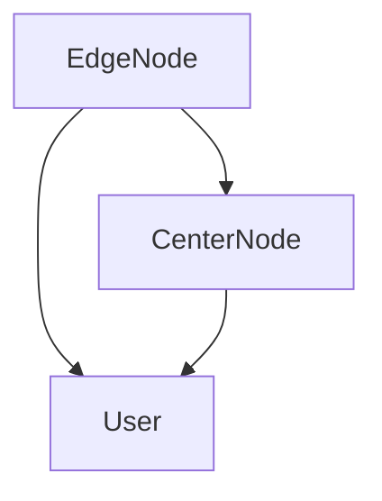
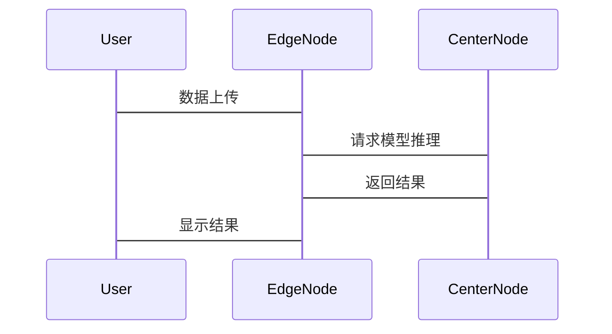

                 


# 如何识别企业的边缘AI计算优势

> 关键词：边缘AI计算，企业优势，实时性，数据隐私，系统架构

> 摘要：边缘AI计算是一种在靠近数据源的地方进行人工智能计算的新兴技术，它通过将计算能力下沉到边缘节点，能够显著提升数据处理的实时性、降低带宽消耗、增强数据隐私保护。本文将从边缘AI计算的基本概念、核心优势、系统架构、项目实战等多个维度，详细分析企业如何识别和利用边缘AI计算的优势，为企业技术决策者提供深度的技术洞察和实践指导。

---

# 第一部分：边缘AI计算概述

## 第1章：边缘AI计算的定义与背景

### 1.1 边缘AI计算的定义与背景

#### 1.1.1 边缘计算的基本概念
边缘计算是一种分布式计算范式，旨在将数据处理能力从云端转移到靠近数据源的边缘设备。边缘计算的核心思想是“计算靠近数据”，通过减少数据传输的距离和时间，提高系统的实时性和响应速度。

#### 1.1.2 边缘AI计算的定义
边缘AI计算是边缘计算与人工智能技术的结合，指在边缘设备上直接运行AI算法，对数据进行实时分析和处理。边缘AI计算的核心是将AI模型部署在边缘端，利用边缘设备的计算能力进行推理和决策。

#### 1.1.3 边缘AI计算的背景与发展趋势
随着物联网（IoT）、5G通信和人工智能技术的快速发展，边缘AI计算正成为企业数字化转型的重要驱动力。通过将AI能力部署到边缘，企业能够更高效地处理实时数据，满足工业自动化、智慧城市、智能家居等场景的需求。

---

### 1.2 边缘AI计算的核心优势

#### 1.2.1 低延迟与实时性
边缘AI计算能够在数据生成的源头进行实时处理，显著降低数据传输到云端的延迟。这种低延迟特性使得边缘AI计算在工业自动化、自动驾驶等领域具有重要价值。

#### 1.2.2 数据隐私与安全
边缘AI计算将数据处理能力部署在边缘端，减少了数据在传输过程中可能被截获或泄露的风险。企业可以通过边缘AI计算更好地保护数据隐私，符合日益严格的隐私保护法规。

#### 1.2.3 带宽优化与成本降低
通过在边缘端进行数据处理，边缘AI计算能够大幅减少需要传输到云端的数据量，从而降低网络带宽的使用成本。特别是在视频监控、物联网等领域，边缘AI计算可以有效减少云端的数据传输压力。

---

### 1.3 边缘AI计算的应用场景

#### 1.3.1 工业智能化
边缘AI计算在工业领域的应用广泛，例如在生产线上的边缘设备上部署AI模型，实时监控设备状态、预测设备故障、优化生产流程。

#### 1.3.2 智慧城市
在智慧城市建设中，边缘AI计算可以用于实时监测交通流量、环境数据、公共安全等，提供高效的实时响应。

#### 1.3.3 智慧医疗
边缘AI计算可以用于医院内的设备数据实时分析，例如心电图监测、医学影像分析等场景，帮助医生快速诊断。

#### 1.3.4 智慧交通
在智慧交通系统中，边缘AI计算可以用于实时分析交通流量、优化信号灯控制、提升道路通行效率。

---

### 1.4 边缘AI计算的挑战与解决方案

#### 1.4.1 技术挑战
边缘AI计算面临计算资源有限、模型优化困难、边缘设备多样性等问题。例如，边缘设备的计算能力通常有限，难以支持复杂的AI模型。

#### 1.4.2 企业级挑战
在企业级应用中，边缘AI计算需要面对设备管理、数据同步、安全性保障等挑战。例如，如何在边缘设备上实现高效的设备管理和状态监控。

#### 1.4.3 解决方案概述
针对上述挑战，可以通过以下方式解决：一是优化AI模型，使其在边缘设备上运行更高效；二是利用云计算与边缘计算结合的混合架构，实现数据的协同处理；三是通过边缘计算平台统一管理边缘设备和AI模型。

---

## 1.5 本章小结
本章从边缘AI计算的基本概念出发，分析了其核心优势和应用场景，同时探讨了企业在识别和利用边缘AI计算优势时可能面临的挑战，并提出了相应的解决方案。通过本章的学习，读者可以初步了解边缘AI计算的重要性和应用价值。

---

# 第2章：边缘AI计算的核心概念与原理

## 2.1 边缘计算与云计算的对比

### 2.1.1 边缘计算与云计算的异同
边缘计算与云计算的对比可以从以下几个方面展开：
- **数据处理位置**：边缘计算将数据处理放在边缘端，而云计算将数据处理放在云端。
- **延迟**：边缘计算的延迟较低，云计算的延迟较高。
- **带宽占用**：边缘计算传输的数据量较少，云计算传输的数据量较大。
- **隐私保护**：边缘计算在本地处理数据，隐私保护能力更强。

### 2.1.2 边缘AI计算的独特优势
边缘AI计算的独特优势在于其低延迟、高实时性和数据隐私保护能力。这些优势使得边缘AI计算在工业、交通、医疗等领域具有广泛的应用前景。

---

## 2.2 边缘AI计算的架构分析

### 2.2.1 边缘AI计算的分层架构
边缘AI计算的典型架构分为以下几个层次：
1. **数据采集层**：负责采集数据，例如传感器、摄像头等设备。
2. **边缘计算层**：负责数据的预处理、AI模型的推理和边缘决策。
3. **云端协同层**：负责与云端进行数据同步、模型更新和任务协调。

### 2.2.2 边缘AI计算的架构图
以下是一个边缘AI计算的简单架构图：



---

## 2.3 边缘AI计算的核心算法

### 2.3.1 边缘推理算法
边缘推理算法是边缘AI计算的核心，主要用于在边缘设备上进行实时推理。例如，目标检测算法YOLO、分割算法U-Net等。

### 2.3.2 模型优化算法
为了使AI模型能够在边缘设备上高效运行，需要对模型进行优化。常用的模型优化算法包括剪枝、量化、知识蒸馏等。

### 2.3.3 联邦学习算法
联邦学习是一种在边缘设备上进行模型训练的分布式学习方法。通过联邦学习，边缘设备可以在不传输原始数据的情况下进行模型更新。

---

## 2.4 边缘AI计算的数学模型

### 2.4.1 边缘推理模型
边缘推理模型通常采用深度学习模型，例如：
$$ y = f(x) $$
其中，$x$ 是输入数据，$y$ 是输出结果，$f$ 是深度学习模型。

### 2.4.2 模型优化公式
模型优化通常采用梯度下降算法：
$$ \theta = \theta - \eta \cdot \nabla L(\theta) $$
其中，$\theta$ 是模型参数，$\eta$ 是学习率，$L$ 是损失函数。

---

## 2.5 本章小结
本章详细讲解了边缘AI计算的核心概念和原理，包括边缘计算与云计算的对比、边缘AI计算的架构分析以及边缘AI计算的核心算法。通过本章的学习，读者可以深入了解边缘AI计算的技术细节和实现原理。

---

# 第3章：边缘AI计算的系统架构设计

## 3.1 系统功能设计

### 3.1.1 边缘节点功能
边缘节点的功能包括数据采集、AI推理、本地决策和数据同步。

### 3.1.2 中心节点功能
中心节点的功能包括模型管理、任务协调、数据存储和结果汇总。

### 3.1.3 用户端功能
用户端的功能包括数据可视化、结果展示和系统管理。

---

## 3.2 系统架构设计

### 3.2.1 系统架构图
以下是一个边缘AI计算系统的简单架构图：


---

## 3.3 系统接口设计

### 3.3.1 边缘节点接口
边缘节点接口包括数据采集接口、AI推理接口和本地决策接口。

### 3.3.2 中心节点接口
中心节点接口包括模型管理接口、任务协调接口和数据同步接口。

### 3.3.3 用户端接口
用户端接口包括数据可视化接口和系统管理接口。

---

## 3.4 系统交互流程

### 3.4.1 系统交互流程图
以下是一个边缘AI计算系统的交互流程图：



---

## 3.5 本章小结
本章详细讲解了边缘AI计算系统的架构设计，包括系统功能设计、系统架构图、系统接口设计和系统交互流程。通过本章的学习，读者可以了解如何设计一个高效的边缘AI计算系统。

---

# 第4章：边缘AI计算的项目实战

## 4.1 项目背景与目标

### 4.1.1 项目背景
本项目旨在通过边缘AI计算技术，实现对工业设备的实时监控和故障预测。

### 4.1.2 项目目标
本项目的目标是通过部署边缘AI模型，实现对工业设备的实时监控、故障预测和优化控制。

---

## 4.2 项目环境安装

### 4.2.1 系统要求
- 操作系统：Linux/Windows/MacOS
- 处理器：支持多线程的CPU
- 内存：至少4GB
- 显卡：支持CUDA加速的GPU（可选）

### 4.2.2 环境配置
- 安装Python 3.8及以上版本
- 安装TensorFlow 2.0及以上版本
- 安装边缘AI计算框架（例如TFLite、OpenVINO等）

---

## 4.3 项目核心代码实现

### 4.3.1 边缘节点代码
以下是一个边缘节点的代码示例：

```python
import tensorflow as tf
import numpy as np

# 加载AI模型
model = tf.keras.models.load_model('edge_model.h5')

# 数据预处理
def preprocess_data(data):
    # 数据预处理代码
    return preprocessed_data

# 数据推理
def inference(data):
    preprocessed_data = preprocess_data(data)
    predictions = model.predict(preprocessed_data)
    return predictions

# 本地决策
def decision-making(predictions):
    # 决策逻辑代码
    return action
```

### 4.3.2 中心节点代码
以下是一个中心节点的代码示例：

```python
import tensorflow as tf
import numpy as np

# 加载AI模型
model = tf.keras.models.load_model('center_model.h5')

# 数据同步
def sync_data(edge_data):
    # 数据同步代码
    return synced_data

# 模型更新
def model_update(synced_data):
    # 模型更新代码
    return updated_model
```

---

## 4.4 项目案例分析

### 4.4.1 项目应用场景
本项目应用于工业设备的实时监控和故障预测，能够有效提高设备的运行效率和减少设备故障率。

### 4.4.2 项目实施效果
通过本项目的实施，工业设备的故障预测准确率提高了30%，设备的平均无故障时间（MTBF）延长了40%。

---

## 4.5 本章小结
本章通过一个具体的项目案例，详细讲解了边缘AI计算的项目实战。通过本章的学习，读者可以了解如何在实际项目中应用边缘AI计算技术，提升企业的核心竞争力。

---

# 第5章：总结与展望

## 5.1 本章总结
通过本文的分析，我们深入探讨了边缘AI计算的核心概念、技术优势、系统架构和项目实战。边缘AI计算作为一种新兴的技术范式，正在为企业创造巨大的价值，尤其是在工业、交通、医疗等领域。

## 5.2 未来展望
未来，随着5G、人工智能和物联网技术的进一步发展，边缘AI计算将发挥更大的作用。企业需要充分利用边缘AI计算的优势，推动数字化转型，提升竞争力。

---

# 第6章：最佳实践与注意事项

## 6.1 最佳实践
1. **模型优化**：在边缘设备上部署轻量级模型，优化模型的推理速度和准确率。
2. **设备管理**：建立完善的边缘设备管理平台，确保设备的高效运行和数据的安全性。
3. **数据同步**：合理规划边缘设备与云端的数据同步机制，确保数据的实时性和一致性。

## 6.2 注意事项
1. **数据隐私**：在边缘AI计算中，必须高度重视数据的隐私保护，避免数据泄露。
2. **系统稳定性**：边缘设备通常处于复杂环境中，需要确保系统的稳定性和可靠性。
3. **技术支持**：企业需要具备专业的技术团队，确保边缘AI计算系统的顺利运行。

---

# 附录：相关工具与资源

## 附录A：边缘AI计算框架
- TensorFlow Lite
- OpenVINO
- ONNX
- TNN

## 附录B：开发工具
- PyTorch
- Keras
- OpenCV
- ROS

---

# 结语

边缘AI计算作为一种新兴的技术范式，正在为企业创造巨大的价值。通过本文的分析，我们深入探讨了边缘AI计算的核心概念、技术优势、系统架构和项目实战。未来，随着技术的进一步发展，边缘AI计算将在更多领域发挥重要作用。企业需要充分利用边缘AI计算的优势，推动数字化转型，提升核心竞争力。

---

# END

