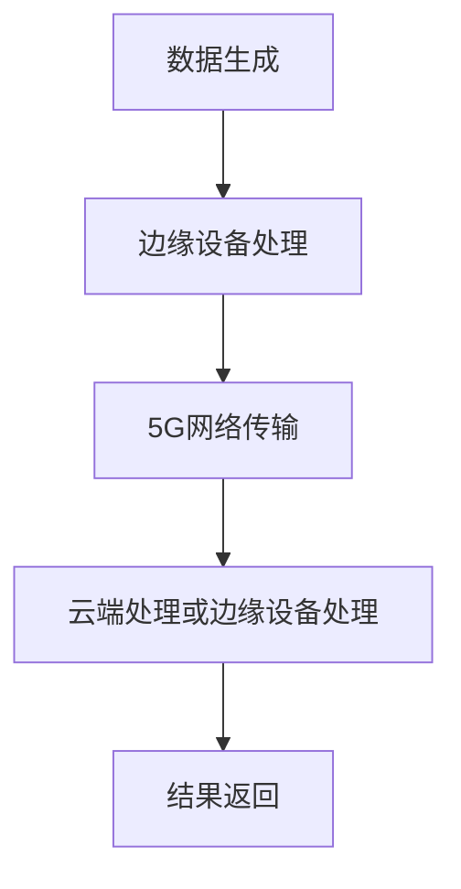
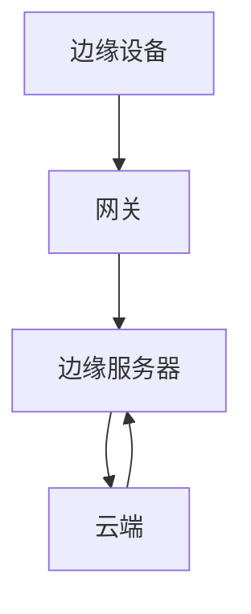
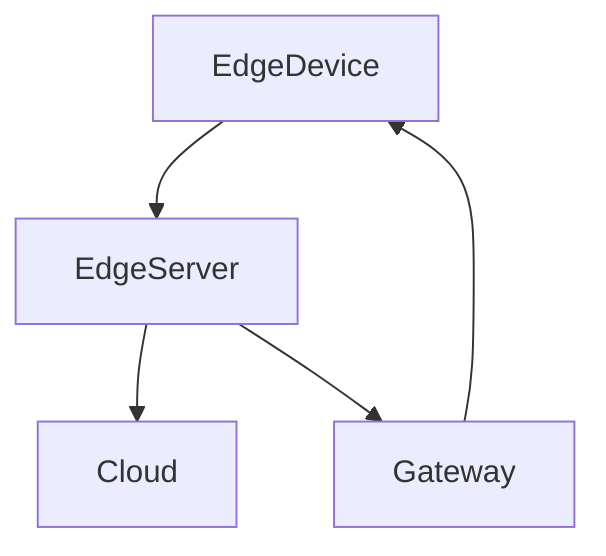

                 


# 如何识别企业的边缘计算5G优化优势

> 关键词：边缘计算，5G优化，企业优势，数据处理，网络架构

> 摘要：随着5G和边缘计算技术的快速发展，企业正在寻求优化其业务流程的方法。本文深入探讨了边缘计算与5G技术的协同作用，分析了它们如何优化企业的数据处理和网络架构，以提高效率和竞争力。文章从核心概念到系统设计，再到项目实战，全面解析了如何识别和利用边缘计算5G优化的优势。

---

## 第1章: 边缘计算与5G的基本概念

### 1.1 边缘计算的定义与特点

#### 1.1.1 边缘计算的定义
边缘计算是一种分布式计算范式，将数据处理和存储功能从云端转移到靠近数据源的边缘设备。这种方式减少了数据传输的距离和延迟，提高了实时性和响应速度。

#### 1.1.2 边缘计算的核心特点
- **分布式计算**：数据在生成地进行处理，减少对中心服务器的依赖。
- **低延迟**：边缘计算能够快速响应本地事件，适用于实时性要求高的场景。
- **带宽优化**：通过在边缘处理数据，减少向云端传输的数据量，节省带宽。

#### 1.1.3 边缘计算与云计算的区别
| 特性       | 边缘计算                 | 云计算                   |
|------------|--------------------------|--------------------------|
| 数据处理位置 | 边缘设备                 | 云端                     |
| 延迟         | 低延迟                   | 较高延迟                 |
| 网络依赖     | 边缘网络依赖             | 高速互联网依赖           |

### 1.2 5G技术的定义与特点

#### 1.2.1 5G技术的定义
5G是第五代移动通信技术，提供了更高的数据传输速度、更低的延迟和更大的网络容量，支持大规模设备连接和物联网应用。

#### 1.2.2 5G技术的核心特点
- **高速率**：理论下载速度达到1Gbps以上。
- **低延迟**：端到端延迟降低到1ms以下，支持实时应用。
- **大规模连接**：支持每平方公里数百万个连接。

#### 1.2.3 5G与4G的区别
| 特性       | 5G                          | 4G                          |
|------------|-----------------------------|-----------------------------|
| 数据传输速度 | 更高                         | 较低                         |
| 端到端延迟   | 更低                         | 较高                         |
| 连接密度     | 更高                         | 较低                         |

### 1.3 边缘计算与5G的结合

#### 1.3.1 边缘计算与5G的协同作用
边缘计算与5G的结合实现了数据的本地处理和快速传输，优化了网络资源利用，提升了应用性能。

#### 1.3.2 边缘计算在5G网络中的位置
边缘计算部署在5G基站或边缘服务器，作为5G网络的重要组成部分，负责本地数据的处理和分发。

#### 1.3.3 边缘计算与5G的未来发展
随着5G网络的普及和边缘计算技术的成熟，二者的结合将推动智能制造、智慧城市等领域的发展。

---

## 第2章: 企业边缘计算5G优化的背景与问题

### 2.1 企业边缘计算5G优化的背景

#### 2.1.1 数字化转型的驱动
企业通过数字化转型提升效率和竞争力，边缘计算和5G技术为其提供了新的工具和平台。

#### 2.1.2 5G技术的普及
5G的高速率和低延迟为企业提供了更好的网络支持，推动了边缘计算的应用。

#### 2.1.3 边缘计算的需求增长
随着物联网和实时应用的需求增加，边缘计算在企业中的应用需求日益增长。

### 2.2 企业边缘计算5G优化的问题

#### 2.2.1 网络延迟问题
传统云计算模式下，数据传输到云端处理，导致延迟较高，影响实时应用。

#### 2.2.2 数据传输成本问题
大量数据从边缘设备传输到云端，增加了带宽成本和传输延迟。

#### 2.2.3 安全性问题
边缘设备数量多，分布广，增加了安全管理的难度和风险。

---

## 第3章: 企业边缘计算5G优化的核心概念与联系

### 3.1 边缘计算与5G的原理

#### 3.1.1 边缘计算的原理
边缘计算通过在靠近数据源的设备上进行数据处理，减少对云端的依赖，提升实时响应能力。

#### 3.1.2 5G技术的原理
5G通过高频段和大规模天线阵列技术，提供了更高的传输速率和更低的延迟。

#### 3.1.3 边缘计算与5G的协同原理
边缘计算部署在5G网络的边缘节点，利用5G的高速和低延迟特性，实现数据的本地处理和快速传输。

### 3.2 边缘计算与5G的核心概念对比

#### 3.2.1 边缘计算与5G的对比表格
| 特性       | 边缘计算                 | 5G技术                   |
|------------|--------------------------|--------------------------|
| 数据处理位置 | 边缘设备                 | 网络节点                 |
| 延迟         | 低延迟                   | 极低延迟                 |
| 连接密度     | 高                     | 极高                     |

#### 3.2.2 边缘计算与5G的ER实体关系图

```mermaid
er
actor 边缘计算 {
  name
  id
}
actor 5G技术 {
  name
  id
}
边缘计算 --> 5G技术 : 依赖于
```

---

## 第4章: 边缘计算与5G优化的算法原理

### 4.1 边缘计算与5G优化的算法原理

#### 4.1.1 边缘计算与5G优化的算法流程



#### 4.1.2 边缘计算与5G优化的算法实现
在边缘设备上，算法优先处理本地数据，仅将关键数据传输到云端，减少带宽使用。

#### 4.1.3 边缘计算与5G优化的算法优化
通过本地缓存和分布式计算，优化算法的执行效率和数据传输量。

### 4.2 边缘计算与5G优化的数学模型

#### 4.2.1 边缘计算与5G优化的数学模型
优化目标：最小化数据传输延迟和带宽使用。

#### 4.2.2 边缘计算与5G优化的数学公式
$$ \text{延迟} = \frac{\text{数据量}}{\text{带宽}} $$
通过边缘计算，数据量减少，延迟降低。

#### 4.2.3 边缘计算与5G优化的数学模型应用
通过数学模型分析，确定边缘计算的最优部署位置和数据处理策略。

---

## 第5章: 边缘计算与5G优化的系统分析与架构设计

### 5.1 边缘计算与5G优化的系统分析

#### 5.1.1 边缘计算与5G优化的系统需求
- 高实时性
- 低延迟
- 高可用性

#### 5.1.2 边缘计算与5G优化的系统功能设计
- 数据采集与处理
- 本地决策与反馈
- 云端协同处理

#### 5.1.3 边缘计算与5G优化的系统架构设计



### 5.2 边缘计算与5G优化的架构图



---

## 第6章: 边缘计算与5G优化的项目实战

### 6.1 项目环境安装

#### 6.1.1 开发环境的搭建
安装Linux系统，配置必要的开发工具和依赖。

#### 6.1.2 依赖库的安装
安装Python、Docker、Kubernetes等工具。

#### 6.1.3 项目配置与初始化
配置边缘计算和5G优化的参数，初始化项目结构。

### 6.2 项目核心实现

#### 6.2.1 边缘计算与5G优化的核心代码实现
```python
import asyncio

async def edge_processing(data):
    # 处理数据
    return processed_data

async def main():
    # 获取数据
    data = await fetch_data()
    # 处理数据
    result = await edge_processing(data)
    # 传输到云端
    await send_to_cloud(result)

asyncio.run(main())
```

#### 6.2.2 边缘计算与5G优化的代码解读
代码实现边缘设备的数据采集、本地处理和云端传输，展示了边缘计算的优势。

#### 6.2.3 边缘计算与5G优化的代码优化
通过异步处理和本地缓存优化，提升数据处理效率。

### 6.3 项目案例分析

#### 6.3.1 边缘计算与5G优化的案例分析
以智能制造为例，展示边缘计算如何优化生产过程中的数据处理。

#### 6.3.2 边缘计算与5G优化的案例解读
通过具体案例分析，说明边缘计算与5G优化的实际应用效果。

#### 6.3.3 边缘计算与5G优化的案例总结
总结案例中的成功经验，为其他企业提供参考。

---

## 第7章: 边缘计算与5G优化的最佳实践与总结

### 7.1 边缘计算与5G优化的最佳实践

- **选择合适的边缘计算平台**
- **优化数据处理算法**
- **确保网络安全**

### 7.2 小结

边缘计算与5G的结合为企业提供了高效、实时的数据处理能力，帮助企业优化业务流程，提升竞争力。

### 7.3 注意事项

- **数据隐私**：确保数据在边缘设备和云端的安全。
- **设备管理**：制定有效的边缘设备管理策略。
- **网络稳定性**：确保5G网络的稳定性和覆盖范围。

### 7.4 拓展阅读

建议读者进一步阅读关于边缘计算和5G的专著，深入理解其技术细节和应用案例。

---

## 第8章: 常见问题解答（FAQ）

### 8.1 什么是边缘计算？

边缘计算是在靠近数据源的地方进行数据处理和存储的分布式计算范式。

### 8.2 5G技术的核心优势是什么？

5G提供了更高的数据传输速度、更低的延迟和更大的网络容量。

### 8.3 边缘计算与5G如何协同工作？

边缘计算部署在5G网络的边缘节点，利用其高速和低延迟特性，实现数据的本地处理和快速传输。

---

以上是《如何识别企业的边缘计算5G优化优势》的完整目录大纲和详细内容，确保每个部分都深入讲解，帮助读者全面理解边缘计算和5G优化的优势。

