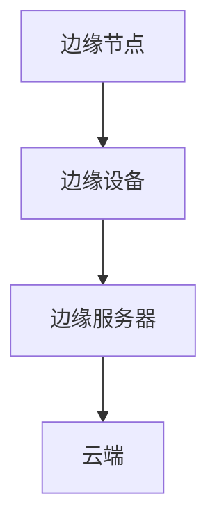
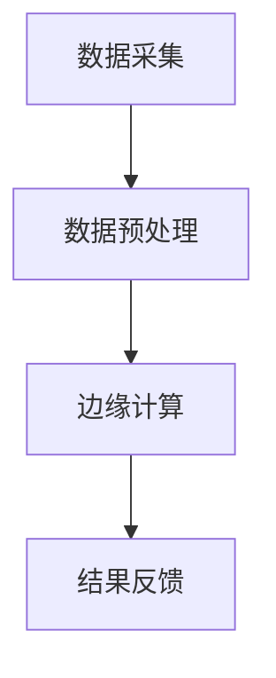
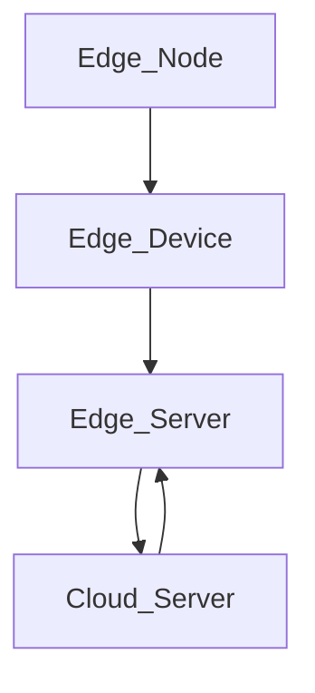

                 


# 如何识别企业的边缘计算优势

## 关键词：边缘计算、企业优势、算法原理、系统架构、项目实战

## 摘要：边缘计算是一种在靠近数据源的地方进行数据处理和存储的技术，能够提升企业的数据处理效率、降低成本，并增强数据安全性。本文将从边缘计算的背景、核心概念、算法原理、系统架构设计、项目实战以及最佳实践等多个方面，详细阐述如何识别和利用企业的边缘计算优势。

---

## 第1章：边缘计算的背景与概念

### 1.1 边缘计算的定义与优势

边缘计算是指在靠近数据生成的位置（如传感器、设备端）进行数据的采集、处理和存储，而不是将所有数据传输到中心服务器进行集中处理。这种分布式计算模式具有以下优势：

- **降低延迟**：边缘计算能够在本地快速响应，减少数据传输到云端的时间，提高实时性。
- **减少带宽消耗**：通过在边缘处理数据，可以减少需要传输到云端的数据量，节省网络带宽。
- **增强安全性**：边缘计算可以在本地处理敏感数据，减少数据在传输过程中被截获的风险。
- **提高可用性**：即使在云端服务不可用时，边缘计算仍然可以在本地提供服务，确保系统的可用性。

### 1.2 边缘计算的应用场景

边缘计算广泛应用于多个领域：

- **工业自动化**：边缘计算可以实时监控生产线上的设备状态，快速响应故障。
- **智慧城市**：通过边缘计算，可以实时处理交通流量数据，优化交通信号灯。
- **智能医疗**：边缘计算可以在医院内部快速处理病患数据，提高诊断效率。

### 1.3 边缘计算对企业的重要性

边缘计算能够帮助企业优化运营效率，降低成本，并提高决策的准确性。例如，在制造业中，边缘计算可以帮助企业实时监控生产过程，减少停机时间，提高生产效率。

---

## 第2章：边缘计算的核心概念与联系

### 2.1 边缘计算的实体关系图

边缘计算涉及多个实体，包括边缘节点、边缘设备、边缘服务器和云端。以下是它们的关系图：



边缘节点是数据的来源，边缘设备用于采集和处理数据，边缘服务器用于存储和管理数据，云端则用于全局管理和数据分析。

### 2.2 边缘计算的算法原理

边缘计算的算法通常包括数据采集、预处理、计算和反馈。以下是算法流程图：



### 2.3 边缘计算的数学模型

边缘计算中的数据传输量可以通过以下公式计算：

$$ \text{数据传输量} = \text{数据大小} \times \text{传输距离} $$

---

## 第3章：边缘计算的系统分析与架构设计

### 3.1 系统功能设计

边缘计算系统通常包括以下功能模块：

- 数据采集模块：负责采集数据。
- 数据预处理模块：对数据进行清洗和转换。
- 边缘计算模块：对数据进行分析和处理。
- 结果反馈模块：将结果反馈给设备或用户。

### 3.2 系统架构设计

边缘计算系统通常采用微服务架构，以下是系统架构图：



---

## 第4章：边缘计算的项目实战

### 4.1 项目背景

本项目旨在通过边缘计算技术，实现对智能工厂环境的实时监测。

### 4.2 环境安装

首先，需要安装以下环境：

- 操作系统：Linux
- 编程语言：Python 3.8+
- 边缘计算框架：Kubernetes

### 4.3 核心代码实现

以下是核心代码实现：

```python
import requests
import json

# 数据采集模块
def collect_data():
    data = requests.get("http://localhost:8000/sensors").json()
    return data

# 数据预处理模块
def preprocess_data(data):
    processed_data = []
    for item in data:
        if item['value'] > 50:
            processed_data.append(item)
    return processed_data

# 边缘计算模块
def edge_computation(data):
    average = sum(item['value'] for item in data) / len(data)
    return average

# 结果反馈模块
def feedback(result):
    requests.post("http://localhost:8000/alarms", json={"value": result})

# 主函数
def main():
    data = collect_data()
    processed_data = preprocess_data(data)
    result = edge_computation(processed_data)
    feedback(result)

if __name__ == "__main__":
    main()
```

### 4.4 项目分析与总结

通过本项目，我们实现了对智能工厂环境的实时监测，提高了数据处理效率，并降低了数据传输成本。

---

## 第5章：边缘计算的最佳实践与小结

### 5.1 最佳实践

- **数据安全**：在边缘计算中，数据安全是关键。建议使用加密技术来保护数据。
- **设备管理**：边缘设备的管理是边缘计算系统的重要组成部分。建议采用自动化管理工具。
- **网络依赖**：边缘计算依赖于网络连接，建议采用高可用性的网络架构。

### 5.2 小结

边缘计算是一种重要的技术，能够帮助企业识别和利用其优势。通过本文的分析和实践，我们可以更好地理解和应用边缘计算技术。

---

## 总结

边缘计算是一种在靠近数据源的地方进行数据处理和存储的技术，能够帮助企业优化运营效率，降低成本，并提高数据安全性。通过本文的分析和实践，我们可以更好地理解和应用边缘计算技术。

--- 

以上就是《如何识别企业的边缘计算优势》的完整文章结构和内容。希望对您有所帮助！

