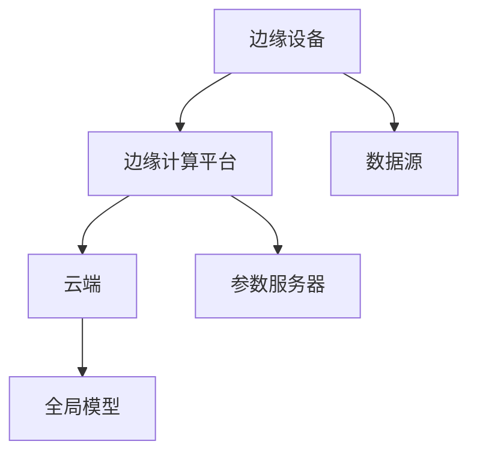
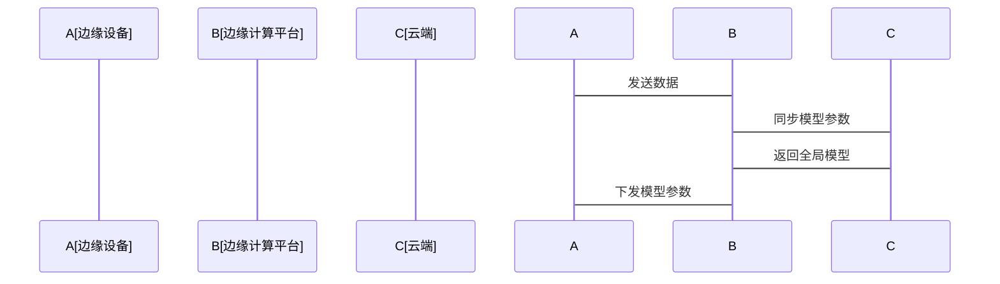

                 


# 如何识别企业的边缘计算分布式学习优势

> 关键词：边缘计算，分布式学习，企业数字化，数据隐私，实时性，协同优化

> 摘要：随着企业数字化转型的深入，边缘计算和分布式学习逐渐成为提升企业竞争力的关键技术。本文从边缘计算和分布式学习的基本概念出发，分析其在企业中的应用场景和优势，详细探讨如何识别和利用边缘计算分布式学习的优势，为企业在数字化转型中提供有力的技术支持。

---

## 第1章: 边缘计算与分布式学习的基本概念

### 1.1 边缘计算的定义与特点

#### 1.1.1 边缘计算的定义
边缘计算是一种分布式计算范式，将计算能力从传统的云端迁移到靠近数据源的边缘设备，如传感器、智能终端等。其核心思想是“数据不出门”，即在数据生成的地方进行处理和分析，减少数据传输的延迟和成本。

#### 1.1.2 边缘计算的核心特点
- **实时性**：边缘设备能够实时处理数据，减少云端响应时间。
- **低带宽需求**：通过在边缘处理数据，减少需要传输到云端的数据量。
- **隐私与安全**：边缘计算可以更好地保护数据隐私，避免数据在传输过程中被截获。

#### 1.1.3 边缘计算与云计算的区别
- **计算位置**：云计算集中在云端，边缘计算分布在边缘。
- **数据处理**：云计算处理的是集中数据，边缘计算处理的是局部数据。
- **应用场景**：云计算适合非实时性场景，边缘计算适合实时性场景。

### 1.2 分布式学习的定义与特点

#### 1.2.1 分布式学习的定义
分布式学习是一种将学习过程分布在多个节点上的技术，每个节点负责部分数据的训练，最终通过通信机制将各节点的学习成果汇总，形成全局模型。

#### 1.2.2 分布式学习的核心特点
- **数据 decentralization**：数据分布在多个节点上，避免数据集中存储的风险。
- **模型同步**：通过通信机制，将各节点的模型参数同步，形成全局最优模型。
- **容错性**：分布式学习能够容忍部分节点的故障，保证系统整体的稳定性。

#### 1.2.3 分布式学习与集中式学习的区别
- **数据存储**：集中式学习将所有数据集中存储，分布式学习将数据分散存储。
- **计算效率**：分布式学习通过并行计算提高效率，集中式学习依赖单点计算。
- **扩展性**：分布式学习更容易扩展，集中式学习受单点性能限制。

### 1.3 边缘计算与分布式学习的关系

#### 1.3.1 边缘计算与分布式学习的结合
边缘计算为分布式学习提供了硬件支持，将计算能力推送到边缘，使得分布式学习可以在更靠近数据源的地方进行。

#### 1.3.2 边缘计算在分布式学习中的优势
- **减少数据传输**：通过边缘计算，分布式学习可以直接在边缘设备上进行数据处理和模型训练，减少数据传输到云端的延迟和成本。
- **提高隐私性**：边缘计算能够更好地保护数据隐私，避免敏感数据在传输过程中被泄露。

#### 1.3.3 边缘计算与分布式学习的未来发展趋势
随着5G和物联网技术的发展，边缘计算和分布式学习的结合将更加紧密，应用场景也将更加广泛。

---

## 第2章: 企业边缘计算分布式学习的背景与需求

### 2.1 企业数字化转型的背景

#### 2.1.1 数字化转型的定义与目标
数字化转型是指企业通过信息技术的应用和创新，提升业务效率、优化运营模式、增强客户体验的过程。

#### 2.1.2 企业数字化转型中的技术挑战
- **数据量大**：企业数据量急剧增加，传统的集中式处理方式难以应对。
- **数据实时性要求高**：企业需要实时处理数据，以快速响应市场变化。
- **数据隐私与安全**：企业数据涉及隐私和安全，需要保护数据不被泄露。

#### 2.1.3 边缘计算在企业数字化转型中的作用
边缘计算能够帮助企业实现数据的实时处理和本地化存储，减少对云端的依赖，提升数据处理效率和安全性。

### 2.2 分布式学习在企业中的应用需求

#### 2.2.1 数据隐私与安全的需求
企业数据涉及核心业务和客户隐私，需要通过分布式学习保护数据的安全性。

#### 2.2.2 业务实时性的需求
企业需要实时处理数据，以快速响应客户需求和市场变化。

#### 2.2.3 跨地域、跨设备的数据协同需求
企业通常分布在全国甚至全球各地，需要通过分布式学习实现跨地域、跨设备的数据协同。

### 2.3 企业边缘计算分布式学习的痛点与挑战

#### 2.3.1 数据孤岛问题
企业内部可能存在多个数据孤岛，数据无法有效共享和协同。

#### 2.3.2 网络延迟与带宽限制
边缘设备通常分布广泛，网络延迟和带宽限制会影响数据传输和处理效率。

#### 2.3.3 边缘设备的资源限制
边缘设备的计算能力和存储空间有限，如何在有限资源下高效运行分布式学习算法是一个挑战。

---

## 第3章: 企业边缘计算分布式学习的核心概念与联系

### 3.1 边缘计算的核心概念

#### 3.1.1 边缘设备与边缘计算平台
- **边缘设备**：如传感器、智能终端等，负责数据的采集和初步处理。
- **边缘计算平台**：提供计算资源和通信能力，支持分布式学习的运行。

#### 3.1.2 边缘计算的架构与层次
- **边缘设备层**：数据采集和初步处理。
- **边缘计算平台层**：数据处理、模型训练和优化。
- **云端层**：提供全局模型管理和协调。

#### 3.1.3 边缘计算中的数据处理与传输
- **数据处理**：在边缘设备上进行数据清洗、特征提取等预处理。
- **数据传输**：通过边缘计算平台将处理后的数据传输到云端或其他边缘设备。

### 3.2 分布式学习的核心概念

#### 3.2.1 分布式学习的算法与模型
- **联邦学习**：多个边缘设备协同训练模型，保持数据隐私。
- **参数服务器**：通过参数服务器实现模型参数的同步和优化。

#### 3.2.2 分布式学习中的数据分片与同步
- **数据分片**：将数据分成多个部分，分别分配给不同的边缘设备进行训练。
- **模型同步**：通过通信机制，将各设备的模型参数同步到全局模型。

#### 3.2.3 分布式学习中的通信协议与机制
- **通信协议**：如gRPC、HTTP/2等，用于设备间的数据传输和通信。
- **同步机制**：如拉取（Pull）和推送（Push）机制，用于模型参数的同步。

### 3.3 边缘计算与分布式学习的结合

#### 3.3.1 边缘计算在分布式学习中的角色
- **数据源**：边缘设备提供分布式学习所需的数据。
- **计算资源**：边缘计算平台提供分布式学习所需的计算资源。
- **通信桥梁**：边缘计算平台作为设备间通信的桥梁，支持分布式学习的协同。

#### 3.3.2 分布式学习在边缘计算中的应用
- **实时数据分析**：通过分布式学习，边缘设备可以实时分析数据，快速响应客户需求。
- **模型优化**：通过边缘设备的协同训练，优化全局模型，提升模型性能。

#### 3.3.3 边缘计算与分布式学习的协同优化
- **资源分配优化**：合理分配计算资源，提升分布式学习的效率。
- **通信优化**：通过优化通信协议和机制，减少数据传输延迟和带宽占用。

---

## 第4章: 企业边缘计算分布式学习的算法原理

### 4.1 分布式学习算法概述

#### 4.1.1 分布式学习算法的分类
- **同步分布式学习**：所有设备同时进行训练，定期同步模型参数。
- **异步分布式学习**：设备可以异步进行训练，模型参数随时更新。

#### 4.1.2 常见的分布式学习算法
- **联邦学习**：多个设备协同训练模型，保护数据隐私。
- **参数服务器**：通过参数服务器实现模型参数的同步和优化。
- **分布式梯度下降**：通过分布式计算，加速梯度下降过程。

#### 4.1.3 分布式学习算法的优缺点
- **优点**：提高计算效率，保护数据隐私。
- **缺点**：需要复杂的通信机制，可能增加系统复杂性。

### 4.2 边缘计算中的分布式学习算法

#### 4.2.1 边缘联邦学习的原理
- **数据隐私保护**：通过加密和差分隐私技术，保护设备数据不被泄露。
- **模型协同训练**：设备之间通过安全通道协同训练模型，形成全局最优模型。

#### 4.2.2 边缘计算中的分布式优化算法
- **分布式梯度下降**：通过分布式计算，加速梯度下降过程。
- **分布式随机梯度下降**：通过随机采样数据，减少计算量和通信开销。

#### 4.2.3 边缘计算中的数据隐私保护机制
- **同态加密**：在加密状态下进行计算，保护数据隐私。
- **差分隐私**：通过添加噪声，保护数据隐私。

### 4.3 分布式学习算法的数学模型与公式

#### 4.3.1 分布式学习的优化目标
$$ \text{目标：} \min_{\theta} \frac{1}{N}\sum_{i=1}^{N} f_i(\theta) $$
其中，$\theta$是模型参数，$f_i$是第$i$个设备的损失函数。

#### 4.3.2 分布式学习的更新规则
$$ \theta_{t+1} = \theta_t - \eta \sum_{i=1}^{N} \frac{\partial f_i(\theta_t)}{\partial \theta} $$
其中，$\eta$是学习率。

#### 4.3.3 分布式学习中的同步与异步机制
- **同步机制**：所有设备在更新模型参数时，必须等待所有设备完成当前步的计算。
- **异步机制**：设备可以随时更新模型参数，不需要等待其他设备完成。

---

## 第5章: 企业边缘计算分布式学习的系统分析与架构设计

### 5.1 系统分析

#### 5.1.1 问题场景介绍
企业需要在多个边缘设备上进行分布式学习，同时保证数据隐私和实时性。

#### 5.1.2 项目目标与范围
- **目标**：实现边缘设备上的分布式学习，提升企业数据处理效率和隐私保护。
- **范围**：包括边缘设备、边缘计算平台、云端的协同设计。

#### 5.1.3 系统需求分析
- **功能需求**：支持分布式学习算法的运行，提供数据隐私保护机制。
- **性能需求**：实现实时数据分析，减少数据传输延迟。
- **安全需求**：保护数据隐私，防止数据泄露。

### 5.2 系统架构设计

#### 5.2.1 系统功能设计（领域模型）
- **数据采集**：边缘设备采集数据并进行预处理。
- **模型训练**：边缘设备协同训练模型，通过参数服务器实现模型同步。
- **数据存储**：边缘设备存储本地数据，云端存储全局模型。

#### 5.2.2 系统架构设计（Mermaid架构图）


#### 5.2.3 系统接口设计
- **设备接口**：边缘设备与边缘计算平台之间的通信接口。
- **云端接口**：边缘计算平台与云端之间的通信接口。
- **数据接口**：数据采集和传输的接口。

### 5.3 系统交互设计

#### 5.3.1 系统交互流程（Mermaid序列图）


---

## 第6章: 项目实战

### 6.1 环境安装

#### 6.1.1 环境需求
- **操作系统**：Linux或Windows。
- **编程语言**：Python 3.6以上。
- **框架**：TensorFlow、Keras等。

#### 6.1.2 安装依赖
```bash
pip install tensorflow==2.5.0
pip install numpy==1.21.0
pip install pandas==1.3.0
pip install matplotlib==3.4.0
```

### 6.2 系统核心实现源代码

#### 6.2.1 分布式学习算法实现
```python
import tensorflow as tf
import numpy as np

# 初始化模型
model = tf.keras.Sequential([
    tf.keras.layers.Dense(64, activation='relu'),
    tf.keras.layers.Dense(10, activation='softmax')
])

# 编译模型
model.compile(optimizer='adam', loss='sparse_categorical_crossentropy', metrics=['accuracy'])

# 分布式训练
model.fit(x_train, y_train, epochs=10, batch_size=32, validation_data=(x_test, y_test))
```

#### 6.2.2 边缘计算平台实现
```python
import zmq

# 创建上下文
context = zmq.Context()

# 创建接收器
receiver = context.socket(zmq.PULL)
receiver.bind("tcp://*:5555")

# 接收数据
data = receiver.recv_pyobj()

# 处理数据
processed_data = data['x_train'], data['y_train']

# 训练模型
model.fit(processed_data[0], processed_data[1], epochs=5, batch_size=16)

# 发送模型参数
sender = context.socket(zmq.PUSH)
sender.connect("tcp://*:5556")
sender.send_pyobj(model.get_weights())
```

### 6.3 案例分析与详细讲解

#### 6.3.1 案例分析
某企业希望通过边缘计算和分布式学习实现客户行为分析，提升客户体验。

#### 6.3.2 实施步骤
1. **数据采集**：边缘设备采集客户行为数据。
2. **数据预处理**：在边缘设备上进行数据清洗和特征提取。
3. **模型训练**：边缘设备协同训练客户行为分析模型。
4. **模型优化**：通过边缘计算平台优化全局模型。
5. **模型部署**：将优化后的模型部署到边缘设备，实时分析客户行为。

#### 6.3.3 实施效果
- **数据隐私**：通过分布式学习保护客户行为数据。
- **实时性**：边缘设备实时分析客户行为，提升客户体验。
- **扩展性**：模型可以轻松扩展到更多的边缘设备。

### 6.4 项目总结

#### 6.4.1 项目成果
通过边缘计算和分布式学习，企业能够实现实时数据分析，提升客户体验，同时保护数据隐私。

#### 6.4.2 项目经验
- **技术选型**：选择合适的分布式学习算法和边缘计算平台。
- **系统设计**：合理设计系统架构，确保系统的高效性和安全性。
- **团队协作**：分布式开发需要团队成员之间的良好协作。

---

## 第7章: 总结与展望

### 7.1 总结
本文详细探讨了企业边缘计算分布式学习的优势，从基本概念到算法原理，再到系统设计和项目实战，为企业在数字化转型中提供了有力的技术支持。

### 7.2 未来展望
随着5G和物联网技术的发展，边缘计算和分布式学习的应用场景将更加广泛。未来的研究方向包括：
- **更高效的分布式学习算法**：优化通信机制，减少计算资源消耗。
- **更强大的边缘设备**：提升边缘设备的计算能力和存储容量。
- **更安全的数据隐私保护机制**：通过技术创新，进一步提升数据安全性。

### 7.3 最佳实践 Tips

#### 7.3.1 技术选型建议
- **选择合适的分布式学习算法**：根据企业需求选择联邦学习或参数服务器等算法。
- **选择合适的边缘计算平台**：根据企业规模和需求选择合适的平台。

#### 7.3.2 系统设计建议
- **合理分配计算资源**：确保边缘设备和平台的计算能力满足需求。
- **优化通信机制**：通过优化通信协议和机制，提升系统效率。

#### 7.3.3 安全性建议
- **加强数据隐私保护**：通过加密和差分隐私等技术，保护数据隐私。
- **定期安全审计**：确保系统安全，防止数据泄露。

---

通过本文的详细讲解，企业可以更好地识别和利用边缘计算分布式学习的优势，为企业的数字化转型提供强有力的技术支持。

