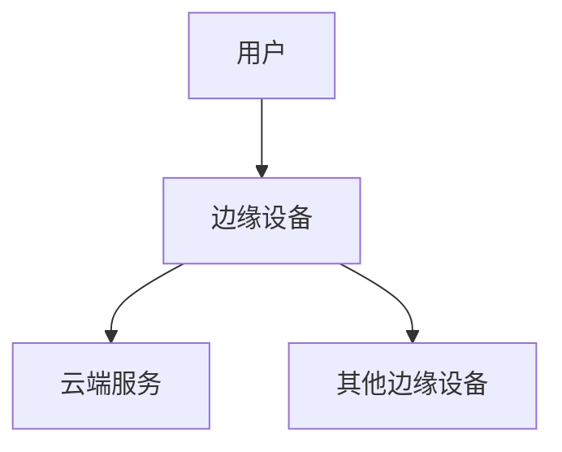
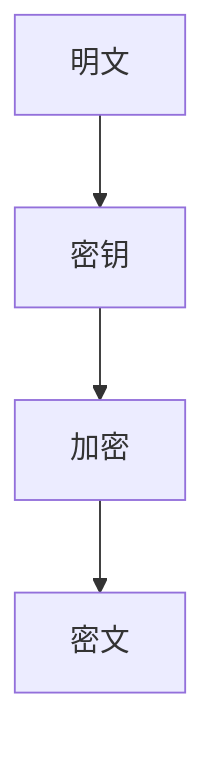
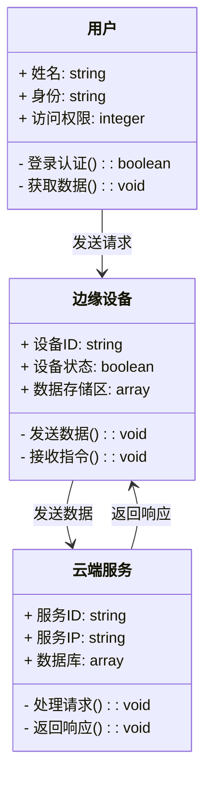
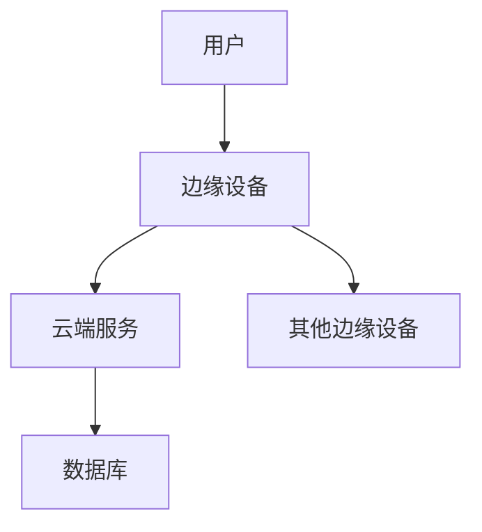
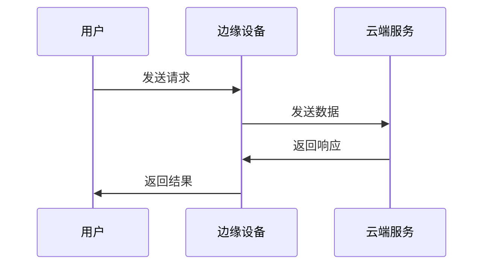

                 


# 如何识别企业的边缘计算安全优势

## 关键词：边缘计算，企业安全，安全优势，技术博客，安全算法，系统架构，最佳实践

## 摘要：  
在数字化转型的浪潮中，边缘计算作为一种新兴的技术架构，正在改变企业IT的基础设施和业务模式。然而，随着边缘设备和数据处理的普及，安全问题也随之而来。本文将从边缘计算的基本概念出发，逐步分析其安全优势，并结合实际案例，深入探讨如何识别和提升企业的边缘计算安全能力。文章内容涵盖边缘计算的安全体系结构、核心算法原理、系统架构设计、项目实战以及最佳实践等，旨在为企业IT人员和安全专家提供一份全面的技术指南。

---

## 第一部分: 边缘计算安全背景与概念

### 第1章: 边缘计算安全的背景与挑战

#### 1.1 边缘计算的基本概念
##### 1.1.1 什么是边缘计算
边缘计算（Edge Computing）是一种分布式计算范式，将计算能力从传统的中心化云数据中心扩展到网络的边缘，靠近数据源进行数据处理和分析。边缘计算的核心思想是将数据处理和存储尽可能地靠近数据生成的位置，减少数据传输延迟，提高响应速度和效率。

##### 1.1.2 边缘计算的特征与优势
- **低延迟**：数据在边缘处理，减少了数据传输到云端的时间。
- **带宽优化**：通过在边缘处理数据，可以减少需要传输到云端的数据量。
- **实时性**：边缘计算能够实现实时数据分析和决策，适用于工业自动化、物联网等场景。
- **隐私保护**：通过在边缘处理数据，可以在不将数据传输到云端的情况下进行分析，从而保护数据隐私。

##### 1.1.3 边缘计算的演进历程
边缘计算的概念可以追溯到分布式计算和雾计算的早期思想，随着物联网和5G技术的发展，边缘计算逐渐成为企业数字化转型的重要技术支撑。

#### 1.2 企业边缘计算安全的重要性
##### 1.2.1 边缘计算在企业中的应用场景
- **智能制造**：工厂中的传感器和设备通过边缘计算实现实时监控和预测性维护。
- **智慧城市**：交通管理系统、环境监测等场景中，边缘计算用于实时数据分析。
- **零售业**：通过边缘设备实时分析顾客行为数据，优化营销策略。

##### 1.2.2 边缘计算面临的独特安全挑战
- **物理安全风险**：边缘设备可能更容易受到物理攻击，例如设备被篡改或破坏。
- **数据完整性**：边缘设备可能面临数据篡改或丢失的风险。
- **通信安全**：边缘设备与云端或其他边缘设备之间的通信可能被截获或篡改。
- **身份认证**：边缘设备的多样化和分布性增加了身份认证的复杂性。

##### 1.2.3 企业边缘计算安全的商业价值
- 提高业务连续性：通过在边缘处理数据，企业可以在云端服务不可用时继续运行。
- 降低成本：通过减少数据传输量，企业可以降低带宽成本。
- 提升用户体验：低延迟和实时性可以提高用户的使用体验。

#### 1.3 本章小结
本章介绍了边缘计算的基本概念、特征与优势，以及企业在应用边缘计算时面临的独特安全挑战。边缘计算的安全性对于企业的业务连续性、成本优化和用户体验提升具有重要意义。

---

## 第二部分: 边缘计算安全的核心概念与原理

### 第2章: 边缘计算安全的核心概念

#### 2.1 边缘计算的安全体系结构
##### 2.1.1 边缘计算的安全层次划分
- **设备层**：包括边缘设备的物理安全、固件安全和驱动程序安全。
- **网络层**：包括边缘设备与云端或其他边缘设备之间的通信安全。
- **数据层**：包括数据的加密、存储安全和数据完整性保障。
- **应用层**：包括应用程序的身份认证、权限管理和安全通信。

##### 2.1.2 边缘计算安全的关键要素
- **身份认证**：确保边缘设备和用户的身份合法性。
- **访问控制**：限制对边缘设备和数据的访问权限。
- **数据加密**：保护数据在传输和存储过程中的机密性和完整性。
- **安全监控**：实时监控边缘设备的安全状态，及时发现和应对威胁。

##### 2.1.3 边缘计算安全的边界与外延
边缘计算的安全不仅涉及边缘设备本身，还包括与云端、其他边缘设备以及用户终端之间的协同安全。其外延包括网络安全、数据安全、应用安全等多个方面。

#### 2.2 边缘计算安全的核心技术
##### 2.2.1 身份认证与访问控制
- **多因素认证**：结合多种认证方式，提高身份认证的安全性。
- **基于角色的访问控制**：根据用户角色分配不同的访问权限，确保最小权限原则。

##### 2.2.2 数据加密与隐私保护
- **端到端加密**：确保数据在传输过程中的机密性和完整性。
- **同态加密**：在不解密数据的情况下进行数据处理和分析。

##### 2.2.3 安全监控与威胁检测
- **入侵检测系统（IDS）**：实时监控网络流量和设备行为，发现异常行为。
- **日志分析**：通过分析边缘设备和应用的日志，发现潜在的安全威胁。

#### 2.3 边缘计算安全的属性对比
##### 2.3.1 边缘计算安全属性对比表格
| 安全属性 | 描述 |
|----------|------|
| 机密性   | 数据在传输和存储过程中不被未经授权的第三方获取。 |
| 完整性   | 数据在传输和存储过程中不被篡改或丢失。 |
| 可用性   | 系统在需要时能够正常运行，提供服务。 |
| 身份认证 | 确保用户和设备的身份合法性。 |

##### 2.3.2 ER实体关系图架构


---

### 第3章: 边缘计算安全的核心算法原理

#### 3.1 常见边缘计算安全算法
##### 3.1.1 对称加密算法（如AES）
- **AES（高级加密标准）**：一种广泛使用的对称加密算法，支持128、192和256位密钥长度。
- **工作模式**：包括电子码本模式（ECB）、密码块链模式（CBC）等。

##### 3.1.2 非对称加密算法（如RSA）
- **RSA（Rivest-Shamir-Adleman）**：基于大整数分解的非对称加密算法，用于数字签名和密钥交换。
- **公钥和私钥**：公钥用于加密，私钥用于解密。

##### 3.1.3 哈希函数（如SHA-256）
- **SHA-256**：一种常用的哈希函数，用于生成数据的数字摘要，确保数据的完整性和真实性。

#### 3.2 算法原理的数学模型
##### 3.2.1 对称加密的数学模型
$$ C = E(K, P) $$
$$ P = D(K, C) $$
其中，$K$ 是密钥，$P$ 是明文，$C$ 是密文，$E$ 和 $D$ 分别是加密和解密函数。

##### 3.2.2 非对称加密的数学模型
$$ C = E(K_p, P) $$
$$ P = D(K_p, C) $$
$$ K_p = K_e \times K_d \mod N $$
其中，$K_e$ 和 $K_d$ 分别是公钥和私钥，$N$ 是模数。

#### 3.3 算法实现与流程图
##### 3.3.1 AES加密流程图


##### 3.3.2 Python实现示例
```python
from cryptography.hazmat.primitives.ciphers import Cipher, algorithms, modes
from cryptography.hazmat.primitives.asymmetric.rsa import RSAPublicKey, RSAPrivateKey
import hashlib

# 对称加密示例：AES
def aes_encrypt(plaintext, key):
    cipher = Cipher(algorithms.AES(key), modes.ECB())
    encryptor = cipher.encryptor()
    return encryptor.update(plaintext) + encryptor.finalize()

# 非对称加密示例：RSA
def rsa_encrypt(plaintext, public_key):
    encryptor = public_key.encryptor()
    return encryptor.update(plaintext) + encryptor.finalize()

# 哈希函数示例：SHA-256
def sha256_hash(text):
    return hashlib.sha256(text.encode()).hexdigest()
```

---

## 第三部分: 系统分析与架构设计方案

### 第4章: 系统分析与架构设计

#### 4.1 问题场景介绍
企业在应用边缘计算时，可能面临以下问题：
- 边缘设备的物理安全风险。
- 边缘设备与云端之间的通信安全。
- 边缘设备的数据存储安全。

#### 4.2 系统功能设计
##### 4.2.1 领域模型类图


#### 4.3 系统架构设计
##### 4.3.1 系统架构图


##### 4.3.2 系统接口设计
- 用户与边缘设备接口：REST API。
- 边缘设备与云端接口：MQTT协议。

##### 4.3.3 系统交互流程图


---

## 第四部分: 项目实战

### 第5章: 项目实战

#### 5.1 环境安装
- 操作系统：Linux Ubuntu 20.04
- 工具：Docker、Python 3.8+

#### 5.2 核心代码实现
##### 5.2.1 边缘设备安全模块
```python
class EdgeDeviceSecurity:
    def __init__(self, device_id, key):
        self.device_id = device_id
        self.key = key
        self.data = []

    def encrypt_data(self, data):
        # 使用AES加密数据
        cipher = Cipher(algorithms.AES(self.key), modes.ECB())
        encryptor = cipher.encryptor()
        return encryptor.update(data.encode()).hex()

    def decrypt_data(self, encrypted_data):
        # 使用AES解密数据
        cipher = Cipher(algorithms.AES(self.key), modes.ECB())
        decryptor = cipher.decryptor()
        return decryptor.update(bytes.fromhex(encrypted_data)).decode()

    def send_data(self, data):
        encrypted_data = self.encrypt_data(data)
        # 发送加密数据到云端
        return encrypted_data
```

##### 5.2.2 云端服务安全模块
```python
class CloudServiceSecurity:
    def __init__(self, public_key):
        self.public_key = public_key

    def receive_data(self, data):
        # 验证数据来源
        try:
            # 验证数据签名
            self.public_key.verify(hashlib.sha256(data.encode()).hexdigest(), data.sign)
            return True
        except:
            return False

    def process_data(self, data):
        # 处理数据并返回响应
        return "Data processed successfully"
```

#### 5.3 案例分析与详细讲解
##### 5.3.1 案例分析
假设我们有一个智能制造工厂，边缘设备实时采集生产线上的传感器数据。边缘设备使用AES加密算法对数据进行加密，然后通过MQTT协议发送到云端。云端服务验证数据签名后，进行数据分析和处理，并将结果返回给边缘设备。

##### 5.3.2 代码实现与解读
- 边缘设备将传感器数据加密后发送到云端。
- 云端服务验证数据签名后，进行数据分析。
- 处理结果通过加密通道返回给边缘设备。

#### 5.4 本章小结
本章通过一个智能制造工厂的案例，展示了边缘计算安全的实际应用场景。通过代码实现，读者可以理解如何在实际项目中应用边缘计算的安全技术。

---

## 第五部分: 最佳实践

### 第6章: 最佳实践

#### 6.1 小结
- 边缘计算的安全性对于企业的业务连续性、成本优化和用户体验提升具有重要意义。
- 在实际应用中，需要综合考虑设备安全、数据安全、通信安全和应用安全。

#### 6.2 注意事项
- **定期安全审计**：定期检查边缘设备和云端服务的安全性，发现潜在的安全漏洞。
- **多层次防护**：结合多种安全技术，构建多层次的安全防护体系。
- **人员培训**：加强对企业员工的安全意识培训，避免因人为错误导致的安全问题。

#### 6.3 拓展阅读
- 《边缘计算：架构与安全》
- 《网络安全：从零开始》
- 《Python安全编程》

---

## 结语

识别企业的边缘计算安全优势需要从背景、概念、算法、系统架构和实际项目等多个方面进行全面分析。通过本文的逐步讲解，读者可以深入了解边缘计算的安全优势，并能够将其应用到实际的企业场景中。未来，随着边缘计算的不断发展，企业需要更加注重边缘计算的安全性，以应对日益复杂的网络安全威胁。

