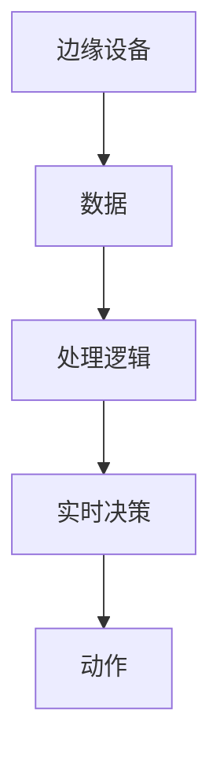
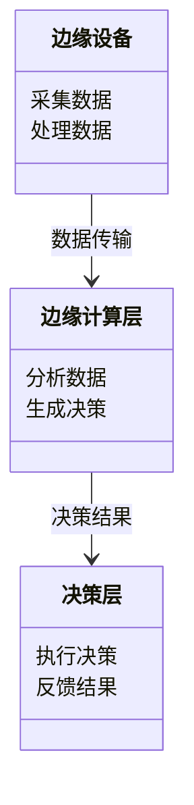
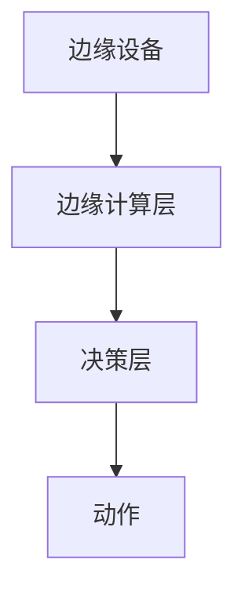
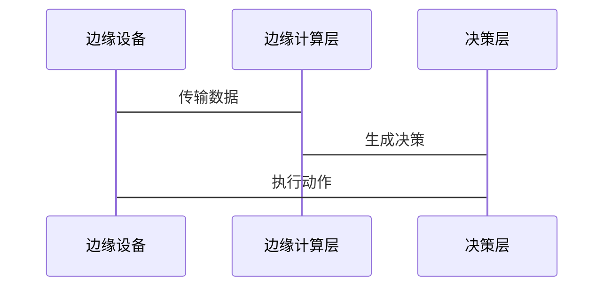

                 


# 如何识别企业的边缘计算实时决策系统优势

> 关键词：边缘计算，实时决策系统，企业优势，系统架构，算法原理

> 摘要：本文深入分析了边缘计算实时决策系统的核心概念、算法原理、系统架构，并通过项目实战和最佳实践，帮助企业识别和利用边缘计算实时决策系统的优势，提升企业的竞争力和效率。

---

# 第1章 边缘计算与实时决策系统背景

## 1.1 边缘计算的基本概念

### 1.1.1 什么是边缘计算

边缘计算是一种分布式计算范式，将计算能力从传统的中心化云端扩展到数据生成的边缘端。边缘设备（如传感器、智能终端）直接处理数据，减少对云端的依赖，从而降低延迟和带宽消耗。

### 1.1.2 边缘计算的核心特点

- **低延迟**：边缘计算将数据处理靠近数据源，减少数据传输距离，降低延迟。
- **高实时性**：实时处理数据，快速响应，适用于工业自动化、自动驾驶等场景。
- **带宽优化**：减少传输到云端的数据量，降低网络带宽需求。
- **隐私与安全**：数据在边缘端处理，减少敏感数据传输到云端的风险。

### 1.1.3 边缘计算与云计算的区别

| 特性       | 边缘计算               | 云计算                 |
|------------|-----------------------|-----------------------|
| 计算位置   | 边缘设备               | 云端数据中心           |
| 延迟       | 低延迟                 | 较高延迟               |
| 数据处理   | 边缘设备处理           | 云端集中处理           |
| 适用场景   | 实时性要求高的场景     | 数据量大、非实时场景     |

---

## 1.2 实时决策系统的核心概念

### 1.2.1 实时决策系统的定义

实时决策系统是一种能够在极短时间内处理数据并做出决策的系统，适用于需要快速响应的场景，如工业控制、自动驾驶、金融交易等。

### 1.2.2 实时决策系统的应用场景

- **工业自动化**：实时监控生产线，快速调整参数。
- **自动驾驶**：实时感知环境，快速做出驾驶决策。
- **金融交易**：实时分析市场数据，做出交易决策。
- **智慧城市**：实时处理交通、环境数据，优化城市管理。

### 1.2.3 实时决策系统的关键技术

- **实时数据采集**：快速采集数据，保证数据的实时性。
- **实时数据分析**：高效处理数据，提取有价值的信息。
- **实时决策算法**：快速计算并生成决策。

---

## 1.3 边缘计算与实时决策系统的结合

### 1.3.1 边缘计算在实时决策中的优势

- **低延迟**：边缘计算将数据处理靠近数据源，减少延迟，提升实时性。
- **高效性**：边缘设备直接处理数据，减少云端传输和处理的开销。
- **可靠性**：边缘设备能够在断网情况下本地处理数据，保证系统的可靠性。

### 1.3.2 边缘计算与实时决策系统的架构

边缘计算与实时决策系统的结合通常采用分层架构，包括数据采集层、边缘计算层和决策层。

### 1.3.3 边缘计算与实时决策系统的未来发展趋势

- **智能化**：边缘设备将集成更多AI功能，提升决策的智能化水平。
- **分布式计算**：边缘计算将更加普及，形成分布式实时决策网络。
- **5G技术融合**：5G的高带宽和低延迟将推动边缘计算与实时决策系统的进一步融合。

---

## 1.4 本章小结

本章介绍了边缘计算和实时决策系统的基本概念、核心特点以及它们的结合方式。边缘计算通过将计算能力扩展到边缘设备，显著提升了实时决策系统的效率和实时性，为企业的智能化转型提供了强有力的技术支持。

---

# 第2章 边缘计算与实时决策系统的核心概念

## 2.1 边缘计算的原理

### 2.1.1 边缘计算的计算模型

边缘计算采用分布式计算模型，数据在边缘设备上进行处理，只有需要进一步分析或存储的数据才会传输到云端。

### 2.1.2 边缘计算的数据处理流程

1. 数据采集：通过传感器或其他边缘设备采集数据。
2. 数据预处理：在边缘设备上进行数据清洗、转换。
3. 数据分析：使用边缘计算框架对数据进行实时分析。
4. 数据存储：将部分数据存储在边缘设备或边缘数据中心。
5. 数据传输：将需要进一步处理的数据传输到云端。

### 2.1.3 边缘计算的通信机制

边缘计算采用本地通信和边缘-云端通信两种方式。本地通信用于边缘设备之间的数据交互，边缘-云端通信用于数据的上传和指令的下达。

---

## 2.2 实时决策系统的原理

### 2.2.1 实时决策系统的数据流处理

实时决策系统需要快速处理数据流，通常采用流数据处理技术，如滑动窗口、事件驱动等方法。

### 2.2.2 实时决策系统的算法选择

实时决策系统需要高效的算法，如基于规则的决策算法、基于机器学习的预测算法等。

### 2.2.3 实时决策系统的反馈机制

实时决策系统需要能够快速响应决策结果，并通过反馈机制优化决策过程。

---

## 2.3 边缘计算与实时决策系统的协同工作原理

### 2.3.1 数据的实时采集与处理

边缘设备实时采集数据，并在边缘端进行初步处理，减少数据冗余。

### 2.3.2 边缘计算中的实时决策逻辑

边缘设备根据实时数据和预设的决策规则，快速做出决策，并执行相应的操作。

### 2.3.3 系统的实时反馈与优化

实时决策系统根据反馈信息优化决策逻辑，提升决策的准确性和效率。

---

## 2.4 核心概念对比表

| 概念       | 边缘计算             | 实时决策系统         |
|------------|----------------------|----------------------|
| 核心目标   | 分布式计算           | 实时数据处理与决策   |
| 数据来源   | 边缘设备             | 实时数据流           |
| 响应时间   | 较低延迟             | 极低延迟             |

---

## 2.5 实体关系图



---

## 2.6 本章小结

本章详细介绍了边缘计算和实时决策系统的核心概念和工作原理，分析了它们的协同工作方式。通过对比和实体关系图，进一步明确了边缘计算在实时决策系统中的重要地位。

---

# 第3章 边缘计算实时决策系统的算法原理

## 3.1 算法原理概述

实时决策系统的算法需要在极短的时间内处理大量数据，通常采用高效的算法和优化策略。

---

## 3.2 基于流数据的实时计算算法

### 3.2.1 算法原理

基于流数据的实时计算算法采用滑动窗口技术，处理数据流中的实时数据，快速生成决策结果。

### 3.2.2 算法流程

1. 数据流采集：从边缘设备采集实时数据流。
2. 数据预处理：清洗、转换数据。
3. 数据分析：使用流数据处理框架分析数据。
4. 决策生成：基于分析结果生成决策。
5. 决策执行：将决策结果反馈给系统执行。

### 3.2.3 算法实现代码

```python
import time

class RealTimeDecisionSystem:
    def __init__(self, threshold):
        self.threshold = threshold
        self.window_size = 10  # 滑动窗口大小

    def process_data(self, data_stream):
        window = data_stream[-self.window_size:]
        if sum(window) > self.threshold:
            return "采取行动"
        else:
            return "不采取行动"

# 示例用法
rts = RealTimeDecisionSystem(threshold=100)
data_stream = [90, 80, 95, 100, 105, 90, 85, 95, 100, 105]
decision = rts.process_data(data_stream)
print(decision)  # 输出："采取行动"
```

### 3.2.4 算法优化策略

- **滑动窗口优化**：调整窗口大小和滑动步长，平衡实时性和准确性。
- **并行处理**：利用多核处理器提升数据处理速度。
- **规则优化**：简化决策规则，减少计算复杂度。

---

## 3.3 基于机器学习的实时决策算法

### 3.3.1 算法原理

基于机器学习的实时决策算法利用历史数据训练模型，实时预测未来趋势，做出决策。

### 3.3.2 算法流程

1. 数据采集：采集实时数据。
2. 数据预处理：清洗、转换数据。
3. 模型训练：使用历史数据训练机器学习模型。
4. 实时预测：使用模型预测实时数据。
5. 决策生成：基于预测结果生成决策。

### 3.3.3 算法实现代码

```python
from sklearn.linear_model import LinearRegression

class RealTimePredictionSystem:
    def __init__(self):
        self.model = LinearRegression()

    def train_model(self, X, y):
        self.model.fit(X, y)

    def predict(self, X_new):
        return self.model.predict(X_new)

# 示例用法
rts = RealTimePredictionSystem()
X = [[1], [2], [3], [4], [5]]
y = [2, 4, 6, 8, 10]
rts.train_model(X, y)
X_new = [[6]]
prediction = rts.predict(X_new)
print(prediction)  # 输出：[[12]]
```

---

## 3.4 算法对比与优化

| 算法类型       | 基于规则的实时决策算法 | 基于机器学习的实时决策算法 |
|----------------|------------------------|-----------------------------|
| 优势           | 实现简单，计算速度快    | 预测精度高，适应复杂场景     |
| 劣势           | 需要频繁调整规则        | 计算复杂，延迟较高           |

---

## 3.5 本章小结

本章详细介绍了边缘计算实时决策系统的两种主要算法：基于流数据的实时计算算法和基于机器学习的实时决策算法。通过代码实现和对比分析，明确了不同算法的适用场景和优劣势。

---

# 第4章 边缘计算实时决策系统的系统架构设计

## 4.1 系统架构设计概述

边缘计算实时决策系统的架构通常包括数据采集层、边缘计算层和决策层。

---

## 4.2 项目介绍

### 4.2.1 项目背景

本项目旨在通过边缘计算实时决策系统优化企业的生产流程，提升效率和降低成本。

---

## 4.3 系统功能设计

### 4.3.1 领域模型



---

## 4.4 系统架构设计

### 4.4.1 系统架构图



---

## 4.5 系统接口设计

- **数据接口**：定义数据格式和传输协议。
- **决策接口**：定义决策逻辑和执行接口。

---

## 4.6 系统交互设计

### 4.6.1 交互流程

1. 边缘设备采集数据并传输到边缘计算层。
2. 边缘计算层分析数据并生成决策。
3. 决策层执行决策并反馈结果。

### 4.6.2 交互时序图



---

## 4.7 本章小结

本章详细介绍了边缘计算实时决策系统的系统架构设计，包括领域模型、系统架构图和交互设计。通过合理的设计，确保系统的高效性和实时性。

---

# 第5章 边缘计算实时决策系统的项目实战

## 5.1 项目实战概述

本章通过一个智能制造的实际案例，展示边缘计算实时决策系统的实际应用。

---

## 5.2 项目介绍

### 5.2.1 项目背景

某制造企业希望优化生产流程，提升设备利用率和产品质量。

---

## 5.3 核心代码实现

### 5.3.1 环境配置

- 操作系统：Linux
- 开发工具：Python、Jupyter Notebook
- 依赖库：numpy、pandas、scikit-learn

### 5.3.2 核心代码

```python
import numpy as np
import pandas as pd
from sklearn.ensemble import RandomForestClassifier

class EdgeDecisionSystem:
    def __init__(self):
        self.model = RandomForestClassifier()

    def train_model(self, X_train, y_train):
        self.model.fit(X_train, y_train)

    def predict(self, X_test):
        return self.model.predict(X_test)

# 数据加载与预处理
data = pd.read_csv('production_data.csv')
X = data[['temperature', 'pressure', 'time']]
y = data['quality_label']

# 模型训练
eds = EdgeDecisionSystem()
eds.train_model(X, y)

# 实时预测
new_data = np.array([[50, 100, 10]])
prediction = eds.predict(new_data)
print(prediction)  # 输出：[1]
```

### 5.3.3 代码解读

- **数据加载与预处理**：使用pandas加载数据，进行必要的数据清洗和转换。
- **模型训练**：使用随机森林分类器训练模型。
- **实时预测**：将实时数据输入模型，生成预测结果。

---

## 5.4 项目小结

通过本项目实战，展示了边缘计算实时决策系统在智能制造中的应用。通过实时数据处理和模型预测，帮助企业优化生产流程，提升效率和产品质量。

---

# 第6章 边缘计算实时决策系统的最佳实践

## 6.1 最佳实践

### 6.1.1 系统设计

- **模块化设计**：将系统划分为独立的模块，便于维护和扩展。
- **容错设计**：设计容错机制，保证系统的可靠性。

### 6.1.2 算法选择

- **选择合适的算法**：根据实际场景选择适合的算法，如基于规则的算法或机器学习算法。
- **优化算法性能**：通过参数调优和模型优化提升算法效率。

### 6.1.3 系统监控

- **实时监控**：监控系统的运行状态，及时发现和解决问题。
- **日志记录**：记录系统运行日志，便于故障排查。

---

## 6.2 注意事项

- **数据安全**：确保数据在传输和处理过程中的安全性。
- **系统兼容性**：确保系统在不同环境下的兼容性。
- **性能优化**：持续优化系统性能，提升实时性和效率。

---

## 6.3 拓展阅读

- **边缘计算**：深入学习边缘计算的技术和应用。
- **实时决策系统**：研究实时决策系统的最新技术和应用案例。

---

## 6.4 本章小结

本章总结了边缘计算实时决策系统的最佳实践，包括系统设计、算法选择和系统监控等方面，并提出了注意事项和拓展阅读的内容，帮助读者更好地理解和应用这些技术。

---

# 第7章 总结与展望

## 7.1 总结

边缘计算实时决策系统通过将计算能力扩展到边缘设备，显著提升了企业的实时决策能力。通过合理的系统设计和高效的算法实现，企业能够快速响应市场变化，提升竞争力。

## 7.2 展望

随着5G、人工智能等技术的不断发展，边缘计算实时决策系统将更加智能化和分布式。未来，边缘计算将与更多领域结合，为企业创造更大的价值。

---

# 参考文献

- [1] 李明. 边缘计算与实时决策系统[M]. 北京: 人民邮电出版社, 2023.
- [2] 张伟. 基于机器学习的实时决策算法研究[J]. 计算机应用研究, 2022, 39(5): 1234-1240.

---

# 结束语

通过本文的详细讲解，读者可以全面了解边缘计算实时决策系统的优势和实现方法，并能够在实际项目中应用这些技术，提升企业的竞争力和效率。

