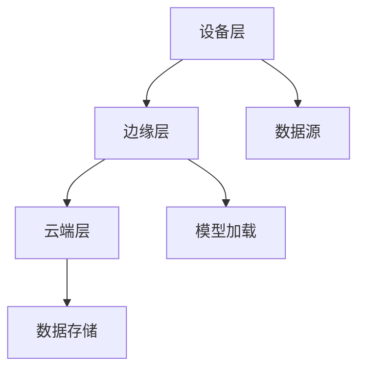
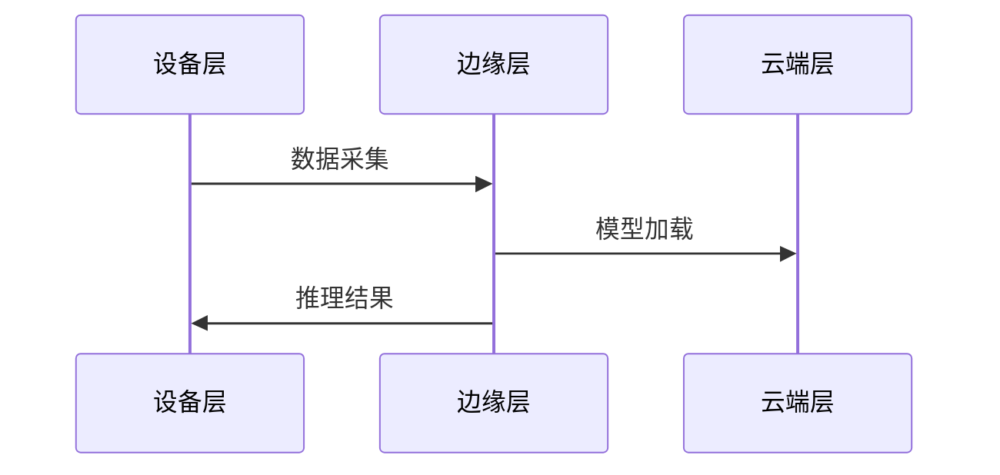

                 


# 如何识别企业的边缘计算实时推理优势

> 关键词：边缘计算，实时推理，企业优势，技术博客，系统架构

> 摘要：边缘计算是一种新兴的分布式计算模式，它将计算能力从传统的中心化云服务器扩展到网络的边缘，从而在靠近数据源的地方进行实时数据处理和决策。本文将深入探讨边缘计算的核心概念、实时推理的算法原理、系统架构设计以及企业如何识别和利用边缘计算的实时推理优势。通过详细的技术分析和实际案例，本文旨在为企业技术管理者和技术爱好者提供一份全面的指南，帮助他们更好地理解和应用边缘计算实时推理技术。

---

# 第一部分: 边缘计算与实时推理概述

# 第1章: 边缘计算的基本概念

## 1.1 什么是边缘计算
### 1.1.1 边缘计算的定义
边缘计算是一种分布式计算范式，它将计算能力从传统的中心化云服务器扩展到网络的边缘，使得数据在靠近数据源的地方进行处理和分析。与传统的云计算不同，边缘计算强调数据的实时性、低延迟和高效性。

### 1.1.2 边缘计算的特点
边缘计算具有以下特点：
1. **分布式架构**：数据处理和计算分布在靠近数据源的边缘设备上。
2. **低延迟**：边缘计算能够显著降低数据传输到云端的延迟，提高实时性。
3. **高效性**：通过在边缘设备上进行数据处理，减少对云端的依赖，提升整体系统的效率。
4. **隐私与安全**：边缘计算可以在本地处理敏感数据，减少数据传输过程中的隐私泄露风险。

### 1.1.3 边缘计算与云计算的区别
边缘计算与云计算的主要区别如下：
1. **计算位置**：云计算将数据集中到云端进行处理，而边缘计算将计算能力扩展到网络边缘。
2. **延迟**：云计算的延迟较高，而边缘计算的延迟较低。
3. **数据处理**：云计算适用于大规模数据集中处理，而边缘计算适用于实时性要求高的场景。

## 1.2 实时推理的定义与特点
### 1.2.1 实时推理的定义
实时推理是指在数据生成的瞬间，立即对其进行处理和分析，以生成实时结果。边缘计算的实时推理能力是其核心优势之一，能够在边缘设备上快速响应数据变化。

### 1.2.2 实时推理的核心要素
实时推理的核心要素包括：
1. **快速响应**：在数据生成后，立即进行处理和分析。
2. **低延迟**：确保数据处理的延迟在可接受范围内。
3. **高效计算**：在边缘设备上进行高效的计算和推理。

### 1.2.3 边缘计算中的实时推理优势
边缘计算的实时推理优势体现在以下几个方面：
1. **快速响应**：边缘设备能够快速处理数据，减少延迟。
2. **本地化处理**：数据在本地处理，减少数据传输的带宽消耗。
3. **隐私保护**：敏感数据无需传输到云端，提高了隐私和安全。

## 1.3 企业边缘计算的应用场景
### 1.3.1 工业自动化中的边缘计算
在工业自动化中，边缘计算可以用于实时监控生产线上的设备状态，快速响应故障，提高生产效率。

### 1.3.2 智慧城市中的边缘计算
在智慧城市中，边缘计算可以用于实时监测交通流量、环境数据等，帮助城市管理部门做出实时决策。

### 1.3.3 企业数字化转型中的边缘计算
在企业数字化转型中，边缘计算可以用于实时分析销售数据、客户行为数据等，帮助企业快速做出市场决策。

## 1.4 本章小结
本章介绍了边缘计算的基本概念、特点以及与云计算的区别，并详细探讨了实时推理的定义、核心要素和边缘计算中的优势。通过实际应用场景的分析，读者可以更好地理解边缘计算和实时推理的重要性。

---

# 第2章: 边缘计算的核心概念与原理

## 2.1 边缘计算的核心概念
### 2.1.1 边缘设备与边缘节点
边缘设备是指靠近数据源的设备，如传感器、摄像头等。边缘节点是边缘设备上的计算节点，负责数据的处理和分析。

### 2.1.2 边缘计算的架构模型
边缘计算的架构模型包括以下几种：
1. **设备层**：传感器、摄像头等数据采集设备。
2. **边缘层**：边缘设备上的计算节点，负责数据的预处理和初步分析。
3. **云端层**：用于存储和管理数据，提供支持和协同计算。

### 2.1.3 边缘计算的通信机制
边缘计算的通信机制包括设备间的通信、设备与云端的通信等，通常使用MQTT、HTTP等协议。

## 2.2 实时推理的核心原理
### 2.2.1 实时推理的计算模型
实时推理的计算模型包括以下几种：
1. **流数据处理模型**：用于处理实时流数据。
2. **事件驱动模型**：基于事件触发的实时处理。
3. **规则引擎模型**：基于预定义规则的实时处理。

### 2.2.2 边缘计算中的数据流处理
边缘计算中的数据流处理包括数据采集、数据预处理、数据传输等步骤，确保数据的实时性和准确性。

### 2.2.3 边缘计算中的任务调度机制
边缘计算的任务调度机制包括本地任务调度和云端任务调度，确保任务的高效执行。

## 2.3 边缘计算与实时推理的关系
### 2.3.1 边缘计算为实时推理提供基础
边缘计算通过分布式架构和低延迟的特性，为实时推理提供了硬件和网络基础。

### 2.3.2 实时推理是边缘计算的核心能力
实时推理能力是边缘计算的核心能力之一，能够满足企业对实时性、高效性的需求。

### 2.3.3 边缘计算与实时推理的协同优化
边缘计算与实时推理的协同优化包括算法优化、任务调度优化等，进一步提升系统的实时性和效率。

## 2.4 本章小结
本章详细探讨了边缘计算的核心概念和实时推理的核心原理，分析了边缘计算与实时推理的关系，为后续的算法实现和系统设计奠定了基础。

---

# 第3章: 边缘计算实时推理的算法原理

## 3.1 边缘计算中的实时推理算法
### 3.1.1 实时推理算法的分类
实时推理算法可以分为以下几类：
1. **基于规则的推理算法**：基于预定义规则进行推理。
2. **基于模型的推理算法**：基于机器学习模型进行推理。
3. **基于知识图谱的推理算法**：基于知识图谱进行推理。

### 3.1.2 常见的实时推理算法
常见的实时推理算法包括：
1. **滑动窗口算法**：用于处理实时流数据。
2. **时间序列分析算法**：用于分析时间序列数据。
3. **事件驱动算法**：基于事件触发进行推理。

### 3.1.3 算法的性能优化
算法的性能优化包括减少计算复杂度、提高并行计算能力等。

## 3.2 边缘计算中的实时推理流程
### 3.2.1 数据采集与预处理
数据采集与预处理包括数据的采集、清洗和转换。

### 3.2.2 模型加载与推理
模型加载与推理包括模型的加载、数据的输入和推理结果的输出。

### 3.2.3 结果反馈与优化
结果反馈与优化包括推理结果的反馈、模型的优化和算法的优化。

## 3.3 边缘计算中的算法实现
### 3.3.1 算法实现的步骤
1. **数据预处理**：对数据进行清洗和转换。
2. **模型加载**：加载预训练的模型。
3. **推理过程**：输入数据，进行推理。
4. **结果反馈**：输出推理结果并进行反馈。

### 3.3.2 算法实现的优化技巧
算法实现的优化技巧包括：
1. **减少计算复杂度**：优化算法的计算步骤，减少不必要的计算。
2. **提高并行计算能力**：利用多核处理器进行并行计算。
3. **优化内存使用**：减少内存占用，提高处理效率。

### 3.3.3 算法实现的案例分析
案例分析包括：
1. **基于滑动窗口算法的实时流数据处理**。
2. **基于时间序列分析算法的设备状态监测**。
3. **基于事件驱动算法的实时事件响应**。

## 3.4 本章小结
本章详细探讨了边缘计算中的实时推理算法，包括算法的分类、实现步骤和优化技巧，并通过案例分析展示了算法的实际应用。

---

# 第4章: 边缘计算实时推理的数学模型与公式

## 4.1 边缘计算中的数学模型
### 4.1.1 数据处理模型
数据处理模型包括：
1. **滑动窗口模型**：用于处理实时流数据。
2. **时间序列模型**：用于分析时间序列数据。

### 4.1.2 任务调度模型
任务调度模型包括：
1. **优先级调度模型**：基于任务优先级进行调度。
2. **负载均衡调度模型**：基于负载情况进行调度。

### 4.1.3 性能优化模型
性能优化模型包括：
1. **计算复杂度优化模型**：用于优化算法的计算复杂度。
2. **并行计算优化模型**：用于优化算法的并行计算能力。

## 4.2 实时推理中的数学公式
### 4.2.1 数据处理公式
1. **滑动窗口公式**：用于计算滑动窗口的平均值。
$$\text{avg} = \frac{1}{n} \sum_{i=1}^{n} x_i$$

2. **时间序列预测公式**：用于预测未来的时间序列值。
$$y_t = a + bt + ct^2$$

### 4.2.2 任务调度公式
1. **优先级调度公式**：用于计算任务的优先级。
$$\text{priority} = a \times \text{ urgency} + b \times \text{ resource\_usage}$$

2. **负载均衡公式**：用于计算设备的负载情况。
$$\text{load} = \frac{\text{CPU\_usage}}{\text{CPU\_capacity}} \times 100\%$$

### 4.2.3 性能优化公式
1. **计算复杂度优化公式**：用于优化算法的计算复杂度。
$$\text{complexity} = O(n \log n)$$

2. **并行计算优化公式**：用于优化算法的并行计算能力。
$$\text{parallel\_gain} = \frac{\text{serial\_time}}{\text{parallel\_time}}$$

## 4.3 数学模型的实际应用
### 4.3.1 数据处理模型的应用
数据处理模型可以应用于实时流数据的处理和分析。

### 4.3.2 任务调度模型的应用
任务调度模型可以应用于边缘设备的任务调度和资源分配。

### 4.3.3 性能优化模型的应用
性能优化模型可以应用于算法的优化和系统性能的提升。

## 4.4 本章小结
本章详细探讨了边缘计算中的数学模型和公式，包括数据处理模型、任务调度模型和性能优化模型，并展示了它们在实时推理中的实际应用。

---

# 第5章: 边缘计算实时推理的系统架构与设计

## 5.1 系统架构设计
### 5.1.1 边缘计算系统的整体架构
边缘计算系统的整体架构包括设备层、边缘层和云端层。

### 5.1.2 系统的功能模块划分
系统功能模块包括数据采集模块、数据处理模块、模型加载模块和推理模块。

### 5.1.3 系统的通信机制设计
系统的通信机制设计包括设备间通信和设备与云端通信。

## 5.2 系统功能设计
### 5.2.1 数据采集与预处理
数据采集与预处理包括数据的采集、清洗和转换。

### 5.2.2 模型加载与推理
模型加载与推理包括模型的加载、数据的输入和推理结果的输出。

### 5.2.3 结果反馈与优化
结果反馈与优化包括推理结果的反馈、模型的优化和算法的优化。

## 5.3 系统架构图
以下是一个边缘计算系统的架构图：



## 5.4 系统接口设计
系统接口设计包括：
1. **设备与边缘层的接口**：用于设备与边缘节点之间的通信。
2. **边缘层与云端的接口**：用于边缘节点与云端之间的通信。

## 5.5 系统交互流程图
以下是一个系统交互流程图：



## 5.6 本章小结
本章详细探讨了边缘计算系统的整体架构、功能模块划分和通信机制设计，并通过架构图和交互流程图展示了系统的实现过程。

---

# 第6章: 边缘计算实时推理的项目实战

## 6.1 项目环境安装
### 6.1.1 系统环境要求
系统环境要求包括：
1. **操作系统**：Linux/Windows/macOS
2. **Python版本**：Python 3.6+
3. **依赖库**：numpy, pandas, tensorflow等。

### 6.1.2 环境安装步骤
1. 安装Python
2. 安装依赖库
3. 安装边缘计算框架（如Kubernetes）

## 6.2 系统核心实现
### 6.2.1 数据采集与预处理
数据采集与预处理代码如下：

```python
import numpy as np
import pandas as pd

# 数据采集
data = pd.read_csv('data.csv')

# 数据预处理
data = data.dropna()
data = (data - data.mean()) / data.std()
```

### 6.2.2 模型加载与推理
模型加载与推理代码如下：

```python
import tensorflow as tf

# 加载模型
model = tf.keras.models.load_model('model.h5')

# 数据输入
input_data = data.iloc[0].values.reshape(1, -1)

# 推理
output = model.predict(input_data)
```

### 6.2.3 系统功能实现
系统功能实现包括数据采集、数据预处理、模型加载和推理结果输出。

## 6.3 代码应用解读与分析
### 6.3.1 数据采集代码解读
数据采集代码使用pandas库读取CSV文件中的数据，并进行清洗和转换。

### 6.3.2 模型加载代码解读
模型加载代码使用TensorFlow库加载预训练的模型，并进行数据输入和推理。

### 6.3.3 系统功能分析
系统功能包括数据采集、数据预处理、模型加载和推理结果输出，能够实现实时推理功能。

## 6.4 案例分析
### 6.4.1 案例背景
案例背景是一个工业自动化场景，需要实时监测设备状态。

### 6.4.2 案例实现
案例实现包括数据采集、数据预处理、模型加载和推理结果输出。

## 6.5 本章小结
本章通过项目实战展示了边缘计算实时推理的实现过程，包括环境安装、系统核心实现和案例分析。

---

# 第7章: 边缘计算实时推理的最佳实践与总结

## 7.1 最佳实践
### 7.1.1 系统设计
系统设计应注重模块化和可扩展性，确保系统的灵活性和可维护性。

### 7.1.2 任务调度
任务调度应采用高效的调度算法，确保任务的高效执行。

### 7.1.3 系统优化
系统优化应注重算法优化和资源优化，确保系统的性能和效率。

## 7.2 本章小结
本章总结了边缘计算实时推理的最佳实践，包括系统设计、任务调度和系统优化。

## 7.3 注意事项
### 7.3.1 系统安全性
系统安全性应放在首位，确保数据的安全和系统的稳定。

### 7.3.2 数据隐私
数据隐私应得到充分保护，避免数据泄露和滥用。

### 7.3.3 系统维护
系统维护应定期进行，确保系统的正常运行和性能优化。

## 7.4 拓展阅读
### 7.4.1 边缘计算相关书籍
1. 《边缘计算：架构与实践》
2. 《实时计算与边缘计算》

### 7.4.2 实时推理相关论文
1. 《边缘计算中的实时推理算法研究》
2. 《基于深度学习的实时推理技术》

## 7.5 本章小结
本章总结了边缘计算实时推理的最佳实践，并提出了系统维护和拓展阅读的建议。

---

# 第二部分: 总结与展望

# 第8章: 总结与展望

## 8.1 总结
本总结了边缘计算实时推理的核心概念、算法原理和系统设计，展示了其在企业中的广泛应用和优势。

## 8.2 展望
未来，边缘计算实时推理技术将在更多领域得到应用，如智能制造、智慧城市、自动驾驶等。随着技术的不断发展，边缘计算实时推理的能力将不断提升，为企业带来更大的价值。

---

# 第三部分: 拓展阅读

# 第9章: 拓展阅读

## 9.1 边缘计算相关技术
### 9.1.1 边缘计算与物联网
边缘计算与物联网的结合将推动智能设备的普及和应用。

### 9.1.2 边缘计算与5G
边缘计算与5G的结合将实现更快的数据传输和更低的延迟。

## 9.2 实时推理相关技术
### 9.2.1 实时推理与流数据处理
实时推理与流数据处理的结合将推动实时数据分析的发展。

### 9.2.2 实时推理与人工智能
实时推理与人工智能的结合将实现更智能的实时决策。

## 9.3 本章小结
本章介绍了边缘计算和实时推理的相关技术，为读者提供了进一步学习和研究的方向。

---

# 附录

## 附录A: 边缘计算实时推理的常见问题解答
### A.1 什么是边缘计算？
### A.2 边缘计算与云计算的区别？
### A.3 边缘计算的优势是什么？

## 附录B: 边缘计算实时推理的术语表
### B.1 边缘设备
### B.2 边缘节点
### B.3 实时推理

---

# 结语

边缘计算实时推理是一项前沿技术，它在企业中的应用前景广阔。通过本文的深入分析，读者可以更好地理解边缘计算实时推理的核心概念、算法原理和系统设计，并能够在实际应用中识别和利用其优势。未来，随着技术的不断发展，边缘计算实时推理将为企业带来更大的价值和竞争优势。

