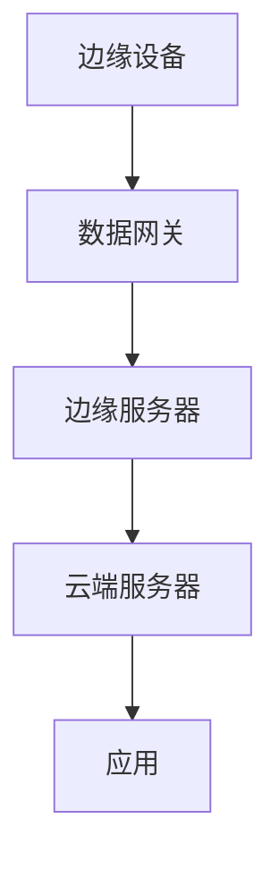

                 


# 如何识别企业的边缘计算实时数据分析优势

> 关键词：边缘计算、实时数据分析、企业优势、系统架构、算法原理

> 摘要：边缘计算与实时数据分析的结合为企业提供了显著的竞争优势。本文将深入探讨边缘计算在实时数据分析中的核心作用，分析其优势，并结合实际案例展示如何通过边缘计算优化企业的实时数据分析能力。

---

## 第一部分: 边缘计算与实时数据分析的背景

### 第1章: 问题背景与挑战

#### 1.1 问题背景
随着企业数字化转型的加速，实时数据分析的需求日益增长。传统的集中式数据分析模式存在延迟高、网络带宽占用大、单点故障风险高等问题，难以满足企业对实时性的要求。边缘计算的兴起为企业提供了一种新的解决方案，能够在数据生成的边缘节点进行实时处理，显著降低延迟并提高数据处理效率。

#### 1.2 核心概念
- **边缘计算**：一种分布式计算范式，将数据处理能力推向数据生成的边缘端，减少对云端的依赖。
- **实时数据分析**：在数据生成的瞬间进行处理和分析，以提供即时反馈和决策支持。

#### 1.3 问题解决
边缘计算通过在边缘端部署计算资源，能够在数据生成的源头进行实时处理，避免了数据传输到云端的延迟，同时减少了网络带宽的占用。这种模式特别适合需要快速响应的场景，如智能制造、物联网、自动驾驶等领域。

---

## 第2章: 核心概念与联系

### 2.1 边缘计算的核心原理
边缘计算通过在边缘端部署计算资源，将数据处理能力推向数据生成的源头。其核心原理包括：
1. **分布式架构**：数据在边缘端进行处理，减少对云端的依赖。
2. **低延迟**：边缘计算能够在数据生成的瞬间进行处理，显著降低延迟。
3. **本地化决策**：边缘设备能够独立进行决策，减少对云端的依赖。

### 2.2 实时数据分析的核心原理
实时数据分析是指在数据生成的瞬间对其进行处理和分析，以提供即时反馈和决策支持。其核心原理包括：
1. **流数据处理**：数据以流的形式不断生成，需要实时处理。
2. **事件驱动**：基于事件的触发机制，进行实时数据处理和分析。
3. **高效算法**：采用高效的算法和数据结构，确保实时处理的性能。

### 2.3 边缘计算与实时数据分析的联系
边缘计算与实时数据分析密切相关，边缘计算为实时数据分析提供了分布式计算的环境，而实时数据分析则是边缘计算的重要应用场景。通过边缘计算，实时数据分析能够在数据生成的源头进行处理，显著提高效率和响应速度。

---

## 第3章: 算法原理与实现

### 3.1 滑动窗口算法
滑动窗口算法是一种常用的数据处理算法，用于在实时数据分析中处理流数据。其基本原理是维护一个窗口，包含最近的一段时间或一定数量的数据点，通过滑动窗口的更新，实时计算窗口内的数据统计信息。

#### 3.1.1 算法流程
1. 初始化窗口：设置窗口的大小和滑动步长。
2. 数据输入：实时接收数据流。
3. 窗口更新：将新数据加入窗口，移除过期数据。
4. 数据处理：计算窗口内的统计信息，如平均值、最大值等。
5. 输出结果：将计算结果返回给应用。

#### 3.1.2 Python实现
```python
class MovingWindow:
    def __init__(self, window_size):
        self.window_size = window_size
        self.data = []

    def add_data(self, new_data):
        self.data.append(new_data)
        if len(self.data) > self.window_size:
            self.data.pop(0)

    def compute_average(self):
        return sum(self.data) / len(self.data)
```

### 3.2 事件驱动计算
事件驱动计算是一种基于事件的计算模式，适用于实时数据分析。其核心原理是通过事件触发数据处理，确保数据在生成时能够被及时处理和分析。

#### 3.2.1 事件驱动计算流程
1. 事件监听：实时监听数据生成事件。
2. 事件触发：当事件发生时，触发数据处理流程。
3. 数据处理：对触发的事件进行实时数据分析。
4. 反馈结果：将分析结果反馈给系统或用户。

#### 3.2.2 Python实现
```python
import time

class EventDrivenAnalyzer:
    def __init__(self):
        self.data = []

    def on_data_event(self, data):
        self.data.append(data)
        self.analyze()

    def analyze(self):
        # 实现实时数据分析逻辑
        pass
```

---

## 第4章: 系统分析与架构设计

### 4.1 系统架构设计
边缘计算实时数据分析系统的架构设计需要考虑以下几个方面：
1. **数据采集层**：负责从边缘设备采集实时数据。
2. **数据处理层**：对采集到的数据进行实时处理和分析。
3. **反馈层**：将分析结果反馈给边缘设备或应用。

### 4.2 系统功能设计
- **数据采集**：通过传感器或其他边缘设备采集实时数据。
- **数据处理**：对采集到的数据进行实时分析，生成有用的信息。
- **反馈与决策**：根据分析结果，生成反馈信号或决策指令。

### 4.3 系统架构图


### 4.4 接口设计
- **数据采集接口**：用于从边缘设备采集实时数据。
- **数据处理接口**：用于对实时数据进行处理和分析。
- **反馈接口**：用于将分析结果反馈给边缘设备或应用。

---

## 第5章: 项目实战

### 5.1 智能制造中的设备监控
在智能制造中，边缘计算可以用于设备的实时监控和故障预测。通过边缘设备采集设备的实时数据，利用边缘服务器进行实时分析，及时发现设备故障并进行预测性维护。

#### 5.1.1 环境安装
- 操作系统：Ubuntu 20.04
- 网络设备：边缘路由器、交换机
- 边缘计算平台：Kubernetes

#### 5.1.2 核心代码实现
```python
import numpy as np

def predict_failure(data):
    # 数据预处理
    processed_data = data.dropna()
    # 计算设备健康指标
    health_indicator = np.mean(processed_data)
    # 预测设备故障
    if health_indicator < 0.8:
        return "设备可能故障"
    else:
        return "设备正常"
```

#### 5.1.3 案例分析
通过对设备实时数据的分析，成功预测了设备的故障，避免了设备停机造成的损失。

---

## 第6章: 最佳实践与总结

### 6.1 最佳实践
- **技术选型**：选择适合的边缘计算平台和实时数据分析工具。
- **性能优化**：通过优化算法和架构设计，提高系统的实时处理能力。
- **安全防护**：确保边缘设备和数据的安全性，防止数据泄露和设备被攻击。

### 6.2 小结
边缘计算与实时数据分析的结合为企业提供了显著的竞争优势。通过边缘计算，企业能够实现数据的实时处理和分析，提高响应速度和决策能力。同时，边缘计算的分布式架构也提高了系统的可靠性和安全性。

### 6.3 注意事项
- **数据同步**：确保边缘设备与云端的数据同步，避免数据不一致。
- **系统容错**：设计容错机制，确保系统的稳定运行。
- **性能监控**：实时监控系统的性能，及时发现和解决问题。

### 6.4 拓展阅读
- 《边缘计算：原理与实践》
- 《实时数据分析：算法与应用》

---

通过以上内容，我们可以清晰地识别企业的边缘计算实时数据分析优势，并为企业提供有效的解决方案，助力企业在数字化转型中获得更大的竞争优势。

