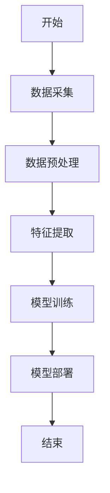
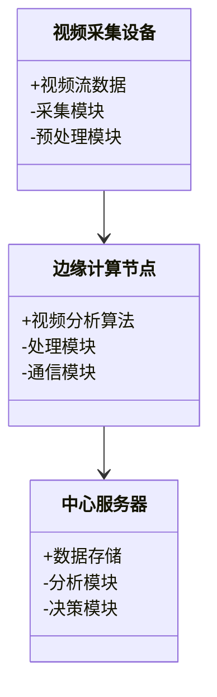
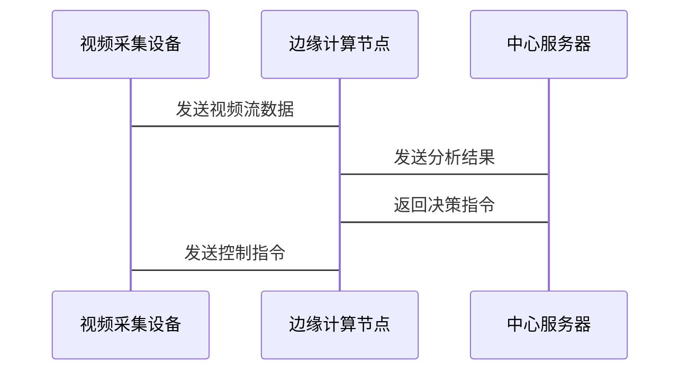

                 


# 如何识别企业的边缘计算实时视频分析优势

## 关键词：边缘计算，实时视频分析，企业应用，算法优化，系统架构

## 摘要：边缘计算在实时视频分析中的优势，涉及算法优化、系统架构设计以及企业实际应用场景的深度分析。本文旨在帮助企业识别和最大化边缘计算在实时视频分析中的优势。

---

# 第一部分: 背景介绍

## 第1章: 边缘计算与实时视频分析概述

### 1.1 边缘计算的基本概念

#### 1.1.1 边缘计算的定义与特点

边缘计算是一种分布式计算范式，将计算能力从中心服务器迁移到数据生成的边缘设备，具有低延迟、高实时性和高效数据处理的特点。

#### 1.1.2 实时视频分析的定义与特点

实时视频分析是对视频流进行实时处理和分析，主要用于目标检测、行为识别和异常事件预警。

### 1.2 企业边缘计算实时视频分析的背景与问题

#### 1.2.1 企业视频分析的需求背景

企业对实时视频分析的需求主要集中在安全监控、生产流程优化和客户行为分析等方面。

#### 1.2.2 边缘计算在视频分析中的优势

边缘计算能够减少数据传输延迟，降低带宽消耗，并提高数据处理的实时性。

#### 1.2.3 当前视频分析的主要问题与挑战

现有视频分析系统存在延迟高、计算资源不足和数据传输成本高等问题。

### 1.3 边缘计算与实时视频分析的结合

#### 1.3.1 边缘计算在视频分析中的应用场景

边缘计算在视频监控、智能制造和智慧城市等领域具有广泛应用。

#### 1.3.2 实时视频分析的核心需求

实时视频分析需要快速响应、高准确性和低资源消耗。

#### 1.3.3 边缘计算与实时视频分析的结合优势

边缘计算能够满足实时视频分析对低延迟和高实时性的要求。

## 1.4 本章小结

---

# 第二部分: 核心概念与联系

## 第2章: 边缘计算与实时视频分析的核心概念

### 2.1 边缘计算的核心原理

#### 2.1.1 边缘计算的体系结构

边缘计算采用分布式架构，包括边缘设备、边缘节点和中心服务器。

#### 2.1.2 边缘计算的主要技术特点

边缘计算具有低延迟、高实时性、数据隐私保护和高效资源利用等特点。

### 2.2 实时视频分析的核心原理

#### 2.2.1 视频数据的采集与处理

实时视频分析需要高效的数据采集、预处理和特征提取。

#### 2.2.2 实时视频分析的关键技术

关键技术包括目标检测、行为识别和视频压缩等。

### 2.3 边缘计算与实时视频分析的联系

#### 2.3.1 边缘计算如何提升视频分析效率

边缘计算通过本地处理和分布式计算提高视频分析的效率。

#### 2.3.2 边缘计算在实时视频分析中的优势

边缘计算能够减少数据传输延迟，降低计算成本，并提高系统的实时响应能力。

### 2.4 核心概念对比分析

#### 2.4.1 边缘计算与云计算的对比

| 特性       | 边缘计算       | 云计算         |
|------------|----------------|----------------|
| 计算位置    | 边缘设备       | 中心服务器     |
| 延迟        | 低            | 高            |
| 带宽消耗    | 低            | 高            |

#### 2.4.2 实时视频分析与非实时视频分析的对比

| 特性       | 实时视频分析   | 非实时视频分析 |
|------------|----------------|----------------|
| 响应时间   | 实时           | 非实时         |
| 数据处理   | 流式处理       | 批处理         |

### 2.5 本章小结

---

# 第三部分: 算法原理讲解

## 第3章: 边缘计算实时视频分析的核心算法

### 3.1 实时视频分析的主要算法

#### 3.1.1 基于CNN的目标检测算法

使用卷积神经网络（CNN）进行目标检测，如YOLO和Faster R-CNN。

#### 3.1.2 基于RNN的视频流分析算法

利用循环神经网络（RNN）进行视频流分析，如LRCN和C3D。

### 3.2 边缘计算中的算法优化

#### 3.2.1 算法的轻量化设计

优化模型参数，减少计算复杂度，如使用MobileNet和EfficientNet。

#### 3.2.2 算法的并行计算优化

利用多核处理器和GPU加速计算，如使用OpenCV和TensorFlow Lite。

### 3.3 算法实现流程

#### 3.3.1 数据采集与预处理



#### 3.3.2 算法模型训练与部署

使用Python训练模型并部署到边缘设备。

### 3.4 本章小结

---

# 第四部分: 系统分析与架构设计方案

## 第4章: 边缘计算实时视频分析的系统架构设计

### 4.1 问题场景介绍

#### 4.1.1 企业视频监控场景

企业需要实时监控生产过程和安全状况。

#### 4.1.2 实时视频分析的需求场景

需要快速检测异常事件并及时响应。

### 4.2 系统功能设计

#### 4.2.1 领域模型设计



### 4.3 系统架构设计

#### 4.3.1 系统架构图


### 4.4 系统接口设计

#### 4.4.1 系统接口设计

视频采集设备与边缘节点之间的接口设计。

#### 4.4.2 系统交互流程图



### 4.5 本章小结

---

# 第五部分: 项目实战

## 第5章: 边缘计算实时视频分析的项目实战

### 5.1 环境安装

#### 5.1.1 系统环境配置

安装Python、TensorFlow和OpenCV等依赖库。

#### 5.1.2 硬件设备配置

配置边缘计算设备，如Raspberry Pi和NVIDIA Jetson。

### 5.2 系统核心实现源代码

#### 5.2.1 视频采集与预处理代码

```python
import cv2

def video_capture():
    cap = cv2.VideoCapture(0)
    while cap.isOpened():
        ret, frame = cap.read()
        if not ret:
            break
        # 预处理代码
        cv2.imshow('frame', frame)
        if cv2.waitKey(1) & 0xFF == ord('q'):
            break
    cap.release()
    cv2.destroyAllWindows()

video_capture()
```

#### 5.2.2 算法实现代码

```python
import tensorflow as tf
import cv2

model = tf.keras.load_model('model.h5')

def detect_object(frame):
    img = cv2.resize(frame, (224, 224))
    img = img / 255.0
    prediction = model.predict(tf.expand_dims(img, axis=0))
    return prediction

while True:
    frame = video_stream.read()
    result = detect_object(frame)
    # 处理结果
```

### 5.3 代码应用解读与分析

详细解读上述代码的功能和实现逻辑。

### 5.4 实际案例分析

分析一个具体的实时视频分析案例，如工厂生产线的实时监控。

### 5.5 项目小结

总结项目实现的关键点和经验教训。

---

# 第六部分: 最佳实践与注意事项

## 第6章: 最佳实践与注意事项

### 6.1 最佳实践

#### 6.1.1 算法优化建议

使用轻量化模型和并行计算优化。

#### 6.1.2 系统架构优化建议

采用分布式架构和高效通信机制。

### 6.2 注意事项

#### 6.2.1 数据隐私与安全

确保视频数据的安全存储和传输。

#### 6.2.2 系统稳定性与容错设计

设计高效的容错机制和系统备份方案。

### 6.3 本章小结

---

# 第七部分: 小结与展望

## 第7章: 小结与展望

### 7.1 本文章总结

总结本文的主要内容和核心观点。

### 7.2 未来展望

探讨边缘计算实时视频分析的未来发展趋势和研究方向。

---

# 参考文献

（此处列出相关的技术文献和参考资料）

---

通过以上目录大纲和内容安排，您可以逐步展开每一部分的内容，撰写一篇详细的技术博客文章。

