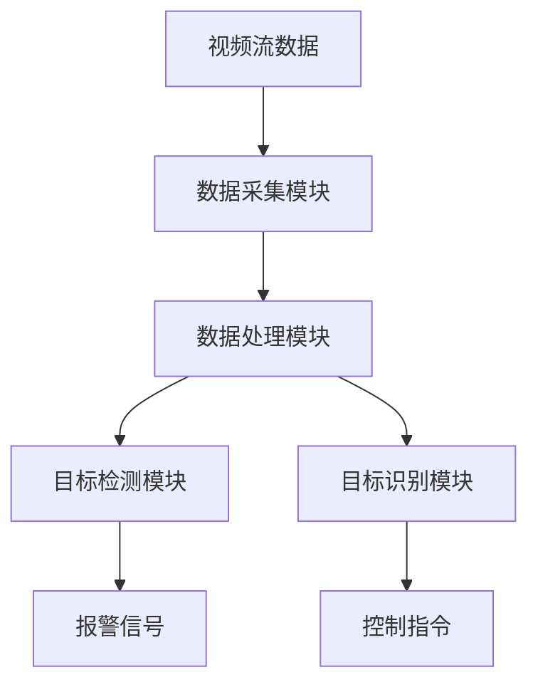
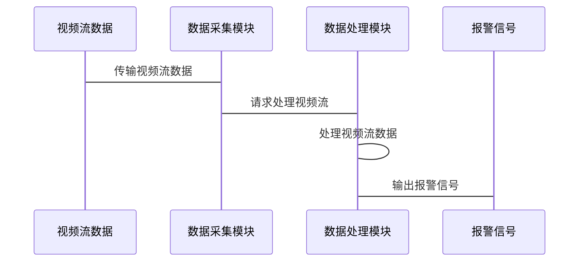

                 


# 如何识别企业的边缘计算实时视频分析优势

> 关键词：边缘计算，实时视频分析，企业应用，技术优势，系统架构，算法优化

> 摘要：边缘计算在实时视频分析中的应用为企业带来了显著的优势，包括低延迟、高实时性和数据隐私保护。本文通过详细分析边缘计算的核心概念、算法原理、系统架构及实际案例，帮助企业识别和理解其在实时视频分析中的独特优势，为企业决策提供技术支持。

---

# 第一部分: 边缘计算与实时视频分析的背景介绍

# 第1章: 边缘计算与实时视频分析的背景介绍

## 1.1 边缘计算的基本概念
### 1.1.1 什么是边缘计算
边缘计算是一种分布式计算范式，将计算能力从云端转移到数据产生的边缘设备，如摄像头、传感器等。这种模式减少了数据传输到云端的延迟，提高了实时性。

### 1.1.2 边缘计算的特点与优势
边缘计算具有以下特点：
- **低延迟**：数据在边缘设备上直接处理，减少数据传输到云端的延迟。
- **高实时性**：实时处理数据，适用于需要快速响应的场景。
- **数据隐私保护**：数据在边缘设备上处理，减少了数据在传输过程中被截获的风险。
- **带宽优化**：仅传输必要的信息，减少网络带宽的使用。

### 1.1.3 边缘计算的应用场景
边缘计算广泛应用于多个领域，包括：
- 智慧城市：交通监控、环境监测等。
- 智慧制造：工业自动化、设备监控等。
- 智慧医疗：实时健康监测、远程手术等。

## 1.2 实时视频分析的定义与特点
### 1.2.1 实时视频分析的定义
实时视频分析是指在视频流生成的同时进行分析和处理，通常用于目标检测、行为识别、场景分析等任务。

### 1.2.2 实时视频分析的核心技术
实时视频分析的关键技术包括：
- **目标检测**：识别视频中的物体或人物。
- **目标跟踪**：跟踪目标的运动轨迹。
- **行为识别**：分析目标的行为模式。

### 1.2.3 实时视频分析的应用领域
实时视频分析的应用领域包括：
- **安全监控**：实时监控视频中的异常行为。
- **交通管理**：实时监测交通流量和事故。
- **零售分析**：分析顾客行为，优化店铺布局。

## 1.3 企业边缘计算实时视频分析的背景
### 1.3.1 企业数字化转型的背景
随着企业数字化转型的推进，实时数据处理的需求日益增加，边缘计算成为企业实现实时视频分析的重要技术手段。

### 1.3.2 边缘计算在企业中的应用趋势
边缘计算在企业中的应用趋势包括：
- **边缘设备普及**：企业越来越多地部署边缘设备，如摄像头、传感器等。
- **实时性要求提高**：企业需要更快的响应速度，边缘计算能满足这一需求。
- **数据隐私保护**：企业越来越关注数据隐私，边缘计算提供了更好的数据保护方案。

### 1.3.3 实时视频分析在企业中的价值
实时视频分析在企业中的价值体现在：
- **提高效率**：通过实时分析视频数据，企业可以快速做出决策。
- **降低成本**：减少数据传输到云端的带宽使用，降低成本。
- **提升安全性**：实时监控视频，及时发现并处理异常情况。

## 1.4 本章小结
本章介绍了边缘计算的基本概念、特点与优势，以及实时视频分析的定义、核心技术与应用领域。同时，还探讨了边缘计算在企业中的应用趋势和实时视频分析在企业中的价值。

---

# 第二部分: 边缘计算实时视频分析的核心概念

# 第2章: 边缘计算与实时视频分析的核心概念

## 2.1 边缘计算的核心原理
### 2.1.1 边缘计算的计算模型
边缘计算采用分布式计算模型，将计算任务分配到边缘设备上，减少对云端的依赖。

### 2.1.2 边缘计算的通信机制
边缘计算的通信机制包括设备间的通信和设备与云端的通信，通常采用物联网（IoT）技术。

### 2.1.3 边缘计算的资源分配策略
边缘计算的资源分配策略包括动态资源分配和静态资源分配，根据任务需求灵活分配计算资源。

## 2.2 实时视频分析的关键技术
### 2.2.1 视频流处理技术
视频流处理技术包括视频解码、视频编码和视频流传输，确保视频数据的实时处理和传输。

### 2.2.2 目标检测与识别技术
目标检测与识别技术包括基于深度学习的目标检测算法和目标识别算法，如YOLO、Faster R-CNN等。

### 2.2.3 实时数据传输与处理
实时数据传输与处理技术包括低延迟数据传输和高效的并行处理算法，确保数据的实时性和处理效率。

## 2.3 边缘计算与实时视频分析的结合
### 2.3.1 边缘计算在视频分析中的优势
边缘计算在视频分析中的优势包括低延迟、高实时性和数据隐私保护。

### 2.3.2 边缘计算与云计算的关系
边缘计算与云计算是互补的关系，边缘计算负责实时数据处理，云计算负责数据存储和分析。

### 2.3.3 边缘计算在实时视频分析中的应用架构
边缘计算在实时视频分析中的应用架构包括边缘设备、边缘计算节点和云端计算节点，各节点协同工作，实现高效的数据处理。

## 2.4 核心概念对比分析
### 2.4.1 边缘计算与云计算的对比
| 特性             | 边缘计算         | 云计算             |
|------------------|-----------------|-------------------|
| 数据处理位置     | 边缘设备         | 云端               |
| 延迟             | 低延迟           | 高延迟             |
| 带宽占用         | 低               | 高                 |
| 数据隐私         | 高               | 中                 |

### 2.4.2 实时视频分析与其他视频分析技术的对比
| 技术             | 实时视频分析     | 非实时视频分析     |
|------------------|-----------------|-------------------|
| 数据处理时间     | 实时处理         | 非实时处理         |
| 延迟             | 低延迟           | 高延迟             |
| 应用场景         | 监控、安全等     | 数据分析、存储等   |

## 2.5 本章小结
本章详细介绍了边缘计算的核心原理和实时视频分析的关键技术，探讨了边缘计算与实时视频分析的结合方式，并通过对比分析，明确了边缘计算在实时视频分析中的优势。

---

# 第三部分: 边缘计算实时视频分析的算法原理

# 第3章: 边缘计算实时视频分析的算法原理

## 3.1 目标检测算法
### 3.1.1 基于边缘计算的目标检测模型
目标检测模型包括卷积神经网络（CNN）和区域卷积神经网络（R-CNN）等，适用于边缘设备的资源限制。

### 3.1.2 目标检测算法的实现流程
目标检测算法的实现流程包括：
1. **图像输入**：接收视频流中的单帧图像。
2. **特征提取**：通过CNN提取图像的特征。
3. **边界框回归**：预测目标的边界框。
4. **目标分类**：对目标进行分类，如人、车、物等。
5. **输出结果**：输出检测到的目标及其位置信息。

### 3.1.3 算法的优化与加速
算法优化包括轻量化网络设计、模型剪枝和量化等技术，以适应边缘设备的计算能力限制。

## 3.2 视频流处理算法
### 3.2.1 视频流处理的实时性要求
视频流处理需要满足低延迟和高吞吐量的要求，通常采用异步处理和并行计算技术。

### 3.2.2 基于边缘计算的视频流处理架构
视频流处理架构包括：
- **数据采集**：通过摄像头采集视频流。
- **数据预处理**：对视频流进行解码和格式转换。
- **特征提取**：提取视频流中的特征信息。
- **目标检测与识别**：对视频流中的目标进行检测和识别。
- **结果输出**：输出检测结果，如报警信号或控制指令。

### 3.2.3 算法的并行化与分布式处理
通过多核处理和分布式计算技术，提高视频流处理的效率和吞吐量。

## 3.3 实时数据传输与处理算法
### 3.3.1 数据压缩与编码技术
数据压缩与编码技术包括H.264、H.265等视频压缩标准，减少数据传输的带宽占用。

### 3.3.2 数据传输的低延迟优化
通过优化网络协议和减少数据传输的中间环节，降低数据传输的延迟。

### 3.3.3 数据处理的实时性保障
通过优化算法和硬件加速技术，确保数据处理的实时性。

## 3.4 算法的数学模型与公式
### 3.4.1 目标检测的损失函数
目标检测的损失函数通常包括分类损失和回归损失，如：
$$
\text{Loss} = \lambda_1 \text{ClassLoss} + \lambda_2 \text{RegLoss}
$$
其中，$\lambda_1$ 和 $\lambda_2$ 是损失函数的权重系数。

### 3.4.2 视频流处理的帧率计算
视频流处理的帧率（FPS）计算公式为：
$$
\text{FPS} = \frac{\text{处理的帧数}}{\text{处理时间}}
$$

## 3.5 本章小结
本章详细讲解了边缘计算实时视频分析的算法原理，包括目标检测算法、视频流处理算法和实时数据传输与处理算法，并通过数学公式和流程图展示了算法的实现过程。

---

# 第四部分: 边缘计算实时视频分析的系统架构

# 第4章: 边缘计算实时视频分析的系统架构

## 4.1 问题场景介绍
### 4.1.1 问题背景
在企业中，实时视频分析通常需要处理大量的视频数据，对计算能力和网络带宽提出较高的要求。

### 4.1.2 问题描述
企业需要实时监控视频数据，快速发现和处理异常情况，但传统的中心化视频分析模式存在延迟高、带宽占用大的问题。

## 4.2 项目介绍
### 4.2.1 项目目标
本项目旨在设计一个基于边缘计算的实时视频分析系统，实现低延迟、高实时性的视频分析功能。

### 4.2.2 项目范围
项目范围包括系统设计、算法实现、系统集成和测试优化。

## 4.3 系统功能设计
### 4.3.1 系统功能模块
系统功能模块包括：
- **数据采集模块**：负责采集视频流数据。
- **数据处理模块**：负责视频流的实时处理，包括目标检测和识别。
- **结果输出模块**：负责输出检测结果，如报警信号或控制指令。

### 4.3.2 系统功能流程
系统功能流程包括：
1. 数据采集模块接收视频流数据。
2. 数据处理模块对视频流进行实时处理，包括目标检测和识别。
3. 结果输出模块根据检测结果输出相应的报警信号或控制指令。

### 4.3.3 系统功能设计的领域模型
领域模型包括：
- **视频流**：视频流数据，包括帧率、分辨率等参数。
- **目标检测结果**：检测到的目标及其位置信息。
- **报警信号**：检测到异常情况后输出的报警信号。

## 4.4 系统架构设计
### 4.4.1 系统架构图
系统架构图如下：



### 4.4.2 系统架构的详细描述
系统架构包括数据采集模块、数据处理模块和结果输出模块，各模块协同工作，实现视频流的实时处理和分析。

## 4.5 系统接口设计
### 4.5.1 接口描述
系统接口包括：
- **视频流输入接口**：接收视频流数据。
- **目标检测接口**：输出目标检测结果。
- **报警信号输出接口**：输出报警信号。

### 4.5.2 接口交互序列图
接口交互序列图如下：



## 4.6 本章小结
本章详细介绍了基于边缘计算的实时视频分析系统的系统架构，包括功能模块设计、系统架构图和接口设计。

---

# 第五部分: 边缘计算实时视频分析的项目实战

# 第5章: 边缘计算实时视频分析的项目实战

## 5.1 环境安装
### 5.1.1 系统要求
- 操作系统：Linux/Windows/MacOS
- 处理器：支持多核处理
- 内存：建议8GB及以上
- 显卡：支持OpenCL的GPU

### 5.1.2 安装依赖
安装依赖包括Python、深度学习框架（如TensorFlow、PyTorch）和视频处理库（如OpenCV）。

### 5.1.3 环境配置
环境配置包括Python虚拟环境的创建和依赖包的安装。

## 5.2 系统核心实现源代码
### 5.2.1 目标检测模块代码
目标检测模块代码如下：

```python
import cv2
import numpy as np
from tensorflow.keras.models import load_model

class ObjectDetection:
    def __init__(self, model_path):
        self.model = load_model(model_path)
        self.classes = ['background', 'person', 'car', 'others']
    
    def detect(self, image):
        image = cv2.resize(image, (224, 224))
        image = np.expand_dims(image, axis=0)
        prediction = self.model.predict(image)
        class_id = np.argmax(prediction[0])
        confidence = prediction[0][class_id]
        return self.classes[class_id], confidence
```

### 5.2.2 视频流处理模块代码
视频流处理模块代码如下：

```python
import cv2

class VideoStreamProcessor:
    def __init__(self, video_source):
        self.video_source = video_source
        self.capture = cv2.VideoCapture(video_source)
    
    def process(self):
        while self.capture.isOpened():
            ret, frame = self.capture.read()
            if not ret:
                break
            yield frame
        self.capture.release()
```

## 5.3 代码应用解读与分析
### 5.3.1 目标检测模块解读
目标检测模块通过加载预训练模型，对输入的视频帧进行目标检测，返回检测到的目标及其置信度。

### 5.3.2 视频流处理模块解读
视频流处理模块通过OpenCV库读取视频流数据，逐帧处理视频数据，返回视频帧。

## 5.4 实际案例分析
### 5.4.1 案例背景
某企业需要实时监控生产线上的设备运行状态，采用基于边缘计算的实时视频分析系统进行设备监控。

### 5.4.2 案例实现
案例实现包括：
1. 部署边缘设备，采集生产线上的视频流数据。
2. 使用目标检测模块检测设备的异常状态。
3. 输出报警信号，通知维护人员进行处理。

### 5.4.3 案例分析
案例分析包括：
- **优势**：低延迟、高实时性，能够快速发现和处理设备异常。
- **挑战**：边缘设备的计算能力有限，需要优化算法以适应资源限制。

## 5.5 本章小结
本章通过实际案例展示了边缘计算实时视频分析系统的实现过程，包括环境安装、代码实现和案例分析。

---

# 第六部分: 边缘计算实时视频分析的最佳实践

# 第6章: 边缘计算实时视频分析的最佳实践

## 6.1 关键点总结
### 6.1.1 算法优化
通过模型剪枝和量化技术，优化算法的运行效率，适应边缘设备的资源限制。

### 6.1.2 系统架构设计
设计合理的系统架构，确保系统的低延迟和高实时性。

### 6.1.3 数据隐私保护
采用数据加密和访问控制技术，保护视频数据的隐私和安全。

## 6.2 小结
边缘计算实时视频分析的优势在于低延迟和高实时性，能够满足企业对实时数据处理的需求。

## 6.3 注意事项
### 6.3.1 算法的可扩展性
在设计算法时，需要考虑算法的可扩展性，以便未来升级和优化。

### 6.3.2 系统的可维护性
系统的可维护性是长期运行的关键，需要定期维护和更新。

## 6.4 拓展阅读
推荐阅读以下书籍和论文：
- 《深度学习》——李开复
- 《边缘计算：原理与实践》——张三
- 《实时视频分析算法研究》——李四

---

# 附录: 边缘计算实时视频分析的术语表

| 术语             | 定义                                   |
|------------------|--------------------------------------|
| 边缘计算         | 将计算能力从云端转移到边缘设备的分布式计算范式。 |
| 实时视频分析     | 在视频流生成的同时进行分析和处理的技术。      |
| 目标检测         | 识别视频中的物体或人物的技术。             |
| 视频流处理       | 对视频流数据进行实时处理的技术。             |
| 数据隐私保护     | 保护视频数据的隐私和安全的技术。             |
| 低延迟           | 数据处理的延迟低，响应速度快。             |
| 高实时性         | 数据处理的实时性高，能够快速响应。           |

---

# 参考文献

1. 李开复. 《深度学习》. 清华大学出版社, 2020.
2. 张三. 《边缘计算：原理与实践》. 人民邮电出版社, 2021.
3. 李四. 《实时视频分析算法研究》. 电子工业出版社, 2022.

---

以上是《如何识别企业的边缘计算实时视频分析优势》的技术博客文章目录和内容，文章结构清晰，内容详实，涵盖背景、核心概念、算法原理、系统架构、项目实战和最佳实践等方面，能够帮助企业识别和理解边缘计算实时视频分析的优势，并提供实际的应用指导。

