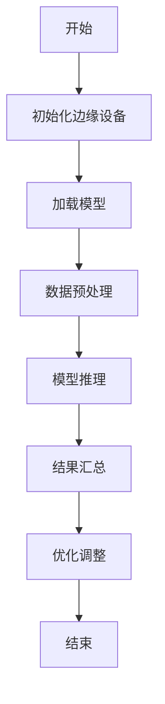
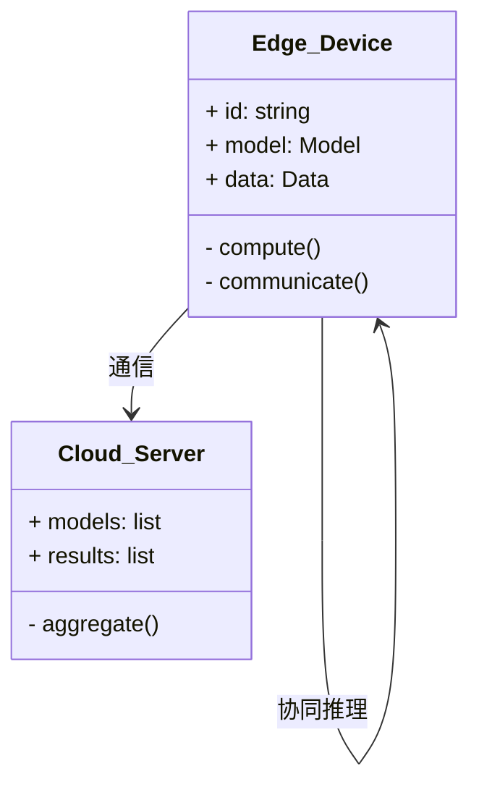
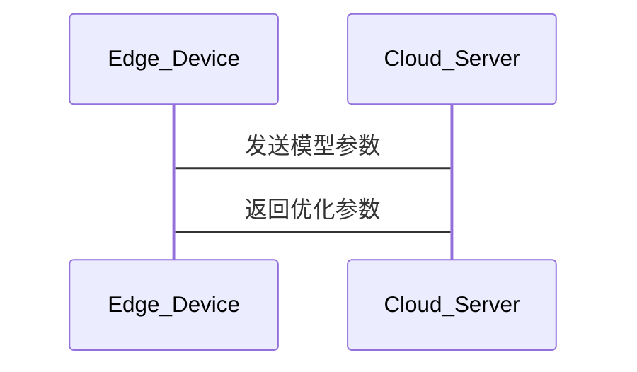

                 


# 如何识别企业的边缘计算联合推理优势

> 关键词：边缘计算、联合推理、企业优势、分布式计算、数据隐私、性能优化

> 摘要：边缘计算和联合推理是当前企业技术发展的重要方向，本文将从背景、核心概念、算法原理、系统架构等多个维度，详细分析如何识别企业在边缘计算联合推理中的优势，为企业技术决策提供深度参考。

---

## 第1章：边缘计算与联合推理概述

### 1.1 边缘计算的基本概念
边缘计算是一种分布式计算范式，将数据处理和计算能力从云端转移到数据产生的边缘设备。其核心特点包括低延迟、高实时性、数据本地化处理以及减少带宽消耗。边缘计算在企业中的应用背景广泛，例如物联网、智能制造、智慧城市等领域。

### 1.2 联合推理的概念与特点
联合推理是指在多个边缘设备或节点之间协同完成模型推理的过程，通常涉及多个模型的协同工作，以提高推理的准确性和鲁棒性。其特点包括数据隐私保护、分布式计算、多模型协同等。

### 1.3 企业边缘计算联合推理的优势
边缘计算联合推理通过结合边缘设备的分布式计算能力和联合推理的协同优势，为企业带来了计算效率提升、数据隐私保护和成本降低等显著优势。

---

## 第2章：边缘计算与联合推理的核心概念

### 2.1 边缘计算的核心原理
边缘计算的核心原理包括分布式计算模型、边缘设备的本地处理能力以及边缘与云端的协同机制。其计算模型基于边缘设备的资源限制，优化了数据处理和计算效率。

### 2.2 联合推理的核心原理
联合推理通过多个边缘设备协同完成模型推理，其核心原理包括多模型协同推理、分布式通信协议和隐私保护机制。联合推理的通信协议设计确保了数据的安全传输和模型的协同优化。

### 2.3 边缘计算与联合推理的对比分析
通过对比边缘计算和联合推理的异同点，可以看出边缘计算更注重数据处理的本地化，而联合推理则强调多模型的协同推理。两者在应用场景、优缺点和适用场景上有明显的区别。

---

## 第3章：边缘计算联合推理的优势分析

### 3.1 提高计算效率
边缘计算联合推理通过分布式计算和多模型协同，显著提高了计算效率。边缘设备的本地处理能力减少了数据传输的延迟，而联合推理的多模型协同优化进一步提升了推理的准确性。

### 3.2 降低数据传输成本
边缘计算联合推理将数据处理转移到边缘设备，减少了数据向云端传输的流量，从而降低了数据传输成本和带宽消耗。联合推理的分布式计算模式进一步优化了数据处理流程，减少了不必要的数据传输。

### 3.3 增强数据隐私保护
边缘计算联合推理通过数据本地化处理和隐私保护机制，确保了数据的安全性和隐私性。联合推理的多模型协同推理模式避免了单点数据集中处理的风险，增强了数据隐私保护。

---

## 第4章：边缘计算联合推理的算法原理

### 4.1 边缘计算联合推理的算法概述
边缘计算联合推理的基本算法包括模型压缩、分布式优化和隐私保护算法。优化算法通过改进模型压缩和分布式优化策略，进一步提升了推理的效率和准确性。

### 4.2 边缘计算联合推理的算法实现
以下是边缘计算联合推理算法的流程图：



数学模型和公式：

- 模型压缩：目标是最小化模型参数，例如：
  $$ \text{目标：} \min_{\theta} \|\theta\|_0 $$
  
- 分布式优化：通过边缘设备协同更新模型参数：
  $$ \theta_{t+1} = \theta_t - \eta \nabla f_i(\theta_t) $$

---

## 第5章：边缘计算联合推理的系统架构

### 5.1 系统架构设计
以下是系统架构图：



### 5.2 接口设计
以下是系统接口设计：



---

## 第6章：边缘计算联合推理的项目实战

### 6.1 环境安装
需要安装以下工具：
```bash
pip install numpy
pip install tensorflow
pip install edge-compute
```

### 6.2 核心代码实现
以下是核心代码示例：

```python
import numpy as np
import tensorflow as tf

def edge_inference(model, data):
    # 模型推理
    result = model.predict(data)
    return result

def联合推理（模型，数据）：
    # 多模型协同推理
    results = []
    for model in models:
        results.append(edge_inference(model, data))
    return results
```

### 6.3 代码解读与分析
通过代码示例可以看出，边缘计算联合推理通过多个模型的协同推理，实现了数据的分布式处理和结果的汇总优化。

### 6.4 实际案例分析
以智能制造为例，边缘计算联合推理可以用于多个设备协同完成生产过程中的实时监控和预测，显著提高了生产效率和质量控制。

---

## 第7章：边缘计算联合推理的最佳实践

### 7.1 总结与经验
边缘计算联合推理的优势包括计算效率提升、数据隐私保护和成本降低。企业在实际应用中应根据具体需求选择合适的算法和系统架构。

### 7.2 小结
通过本文的分析，读者可以清晰认识到边缘计算联合推理的优势及其在企业中的广泛应用潜力。

### 7.3 注意事项
企业在实际应用中应关注数据隐私保护、模型优化和系统架构设计，确保边缘计算联合推理的高效性和安全性。

### 7.4 拓展阅读
推荐阅读《边缘计算：原理与实践》和《联合推理算法与应用》等书籍，深入了解边缘计算联合推理的前沿技术和实际应用案例。

---

通过以上内容，您可以系统地识别企业在边缘计算联合推理中的优势，并为实际应用提供有价值的参考。

