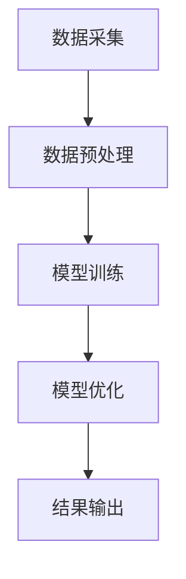
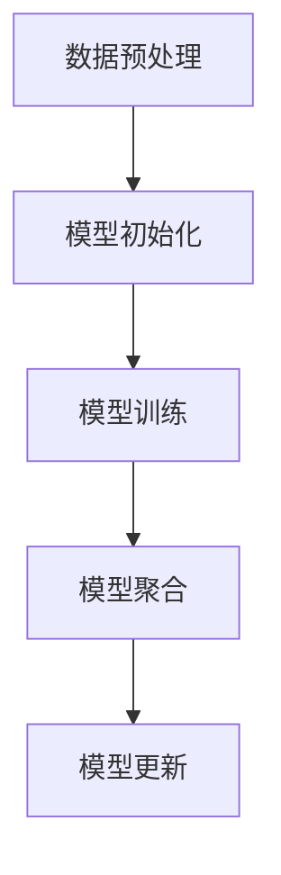
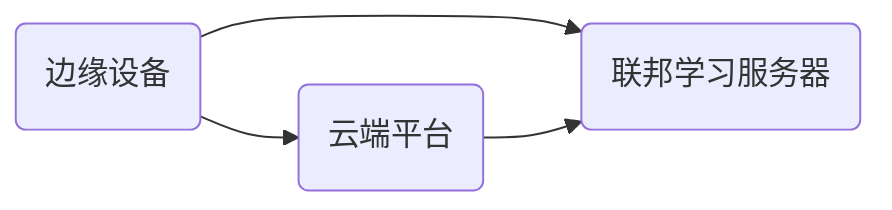
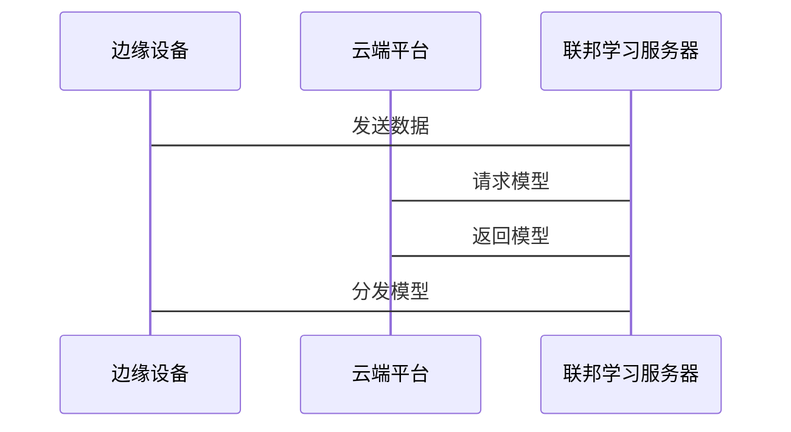

                 


# 如何识别企业的边缘计算联邦学习优势

## 关键词：边缘计算、联邦学习、企业优势、技术原理、项目实战

## 摘要：本文将详细探讨边缘计算和联邦学习在企业中的应用，分析其核心概念、算法原理、系统架构，并通过项目实战展示其优势。通过本文，读者将能够识别边缘计算和联邦学习为企业带来的实际利益，并掌握相关技术的实现方法。

---

## 第1章：边缘计算与联邦学习概述

### 1.1 边缘计算的基本概念

#### 1.1.1 边缘计算的定义
边缘计算是一种分布式计算范式，数据在靠近数据源的边缘设备上进行处理，减少对云端的依赖。

#### 1.1.2 边缘计算的特点
- 分布式计算
- 低延迟
- 高实时性
- 高隐私性

#### 1.1.3 边缘计算与传统云计算的区别
| 特性         | 边缘计算         | 传统云计算        |
|--------------|------------------|-------------------|
| 数据处理     | 边缘设备处理     | 云端集中处理     |
| 延迟         | 低延迟           | 高延迟           |
| 网络依赖     | 边缘设备依赖本地网络 | 高速网络依赖     |

### 1.2 联邦学习的基本概念

#### 1.2.1 联邦学习的定义
联邦学习是一种分布式机器学习技术，允许多个机构在不共享数据的情况下进行模型训练。

#### 1.2.2 联邦学习的特点
- 数据本地化
- 联合建模
- 数据隐私保护

#### 1.2.3 联邦学习与传统数据共享的区别
| 特性         | 联邦学习         | 传统数据共享      |
|--------------|------------------|-------------------|
| 数据共享     | 数据不共享，模型共享 | 数据共享          |
| 隐私保护     | 高隐私保护       | 低隐私保护        |
| 通信效率     | 低通信量         | 高通信量          |

### 1.3 边缘计算与联邦学习的结合

#### 1.3.1 边缘计算与联邦学习的协同工作原理
- 数据在边缘设备上进行预处理和加密
- 边缘设备通过联邦学习协议进行模型训练
- 模型在边缘设备上进行推理和优化

#### 1.3.2 边缘计算与联邦学习的优势
- 降低数据传输成本
- 提高模型训练效率
- 保护数据隐私

#### 1.3.3 边缘计算与联邦学习的应用场景
- 智能制造
- 智慧医疗
- 智慧交通

### 1.4 本章小结
边缘计算和联邦学习的结合为企业提供了高效、安全的数据处理方式，适用于多种行业场景。

---

## 第2章：边缘计算与联邦学习的核心概念

### 2.1 边缘计算的原理

#### 2.1.1 边缘计算的计算模型
边缘计算采用分布式计算模型，数据在边缘设备上进行处理。

#### 2.1.2 边缘计算的数据处理流程
1. 数据采集
2. 数据预处理
3. 数据分析
4. 数据存储

#### 2.1.3 边缘计算的通信机制
- 边缘设备之间的通信
- 边缘设备与云端的通信

### 2.2 联邦学习的原理

#### 2.2.1 联邦学习的算法流程
1. 数据预处理
2. 模型初始化
3. 模型训练
4. 模型聚合
5. 模型更新

#### 2.2.2 联邦学习的数学模型
$$ \text{损失函数} = \sum_{i=1}^{n} \text{损失}_i $$
$$ \text{模型更新} = \sum_{i=1}^{n} \text{梯度}_i $$

#### 2.2.3 联邦学习的通信协议
- 安全通信协议
- 数据加密传输

### 2.3 边缘计算与联邦学习的联系

#### 2.3.1 边缘计算与联邦学习的协同工作
- 数据在边缘设备上进行预处理
- 联邦学习在边缘设备上进行模型训练

#### 2.3.2 边缘计算与联邦学习的实体关系图
```mermaid
erDiagram
    participant 边缘设备 {
        <属性>
        id : 整数
        数据 : 字符串
        模型 : 字符串
    }
    participant 云端平台 {
        <属性>
        id : 整数
        模型版本 : 整数
    }
    edge from 边缘设备到云端平台
```

---

## 第3章：边缘计算与联邦学习的算法原理

### 3.1 边缘计算的算法原理

#### 3.1.1 边缘计算的算法流程


#### 3.1.2 边缘计算的数学模型
$$ \text{损失函数} = \sum_{i=1}^{n} (y_i - \hat{y}_i)^2 $$

#### 3.1.3 边缘计算的Python实现
```python
import numpy as np

def edge_computation(data):
    # 数据预处理
    processed_data = data.preprocess()
    # 模型训练
    model = train(processed_data)
    # 模型优化
    optimized_model = optimize(model)
    return optimized_model
```

### 3.2 联邦学习的算法原理

#### 3.2.1 联邦学习的算法流程


#### 3.2.2 联邦学习的数学模型
$$ \text{模型参数} = \sum_{i=1}^{n} \theta_i $$

#### 3.2.3 联邦学习的Python实现
```python
import numpy as np

def fed_learning(data_list):
    # 数据预处理
    processed_data = [data.preprocess() for data in data_list]
    # 模型初始化
    model = initialize_model()
    # 模型训练
    trained_models = [train(model, data) for data in processed_data]
    # 模型聚合
    aggregated_model = aggregate(trained_models)
    return aggregated_model
```

---

## 第4章：边缘计算与联邦学习的系统架构设计

### 4.1 边缘计算与联邦学习的系统架构

#### 4.1.1 系统架构设计


#### 4.1.2 系统功能设计
- 数据采集与处理
- 模型训练与优化
- 模型部署与推理

#### 4.1.3 系统交互流程


---

## 第5章：边缘计算与联邦学习的项目实战

### 5.1 项目环境安装

#### 5.1.1 安装依赖
```bash
pip install numpy
pip install tensorflow
pip install mermaid
```

#### 5.1.2 环境配置
```bash
export PATH=$PATH:/path/to/mermaid/bin
```

### 5.2 项目核心代码实现

#### 5.2.1 边缘计算代码
```python
import numpy as np

def edge_computation(data):
    # 数据预处理
    processed_data = data.preprocess()
    # 模型训练
    model = train(processed_data)
    # 模型优化
    optimized_model = optimize(model)
    return optimized_model
```

#### 5.2.2 联邦学习代码
```python
import numpy as np

def fed_learning(data_list):
    # 数据预处理
    processed_data = [data.preprocess() for data in data_list]
    # 模型初始化
    model = initialize_model()
    # 模型训练
    trained_models = [train(model, data) for data in processed_data]
    # 模型聚合
    aggregated_model = aggregate(trained_models)
    return aggregated_model
```

### 5.3 项目案例分析

#### 5.3.1 案例背景
假设我们有一个智能制造企业，需要在边缘设备上进行实时数据分析和模型训练。

#### 5.3.2 案例实现
1. 数据采集：从边缘设备采集传感器数据。
2. 数据预处理：清洗和归一化数据。
3. 模型训练：在边缘设备上进行联邦学习，训练预测模型。
4. 模型部署：将训练好的模型部署到边缘设备上进行实时预测。

### 5.4 项目小结
通过项目实战，我们验证了边缘计算和联邦学习在企业中的可行性，提升了系统的实时性和安全性。

---

## 第6章：边缘计算与联邦学习的最佳实践

### 6.1 最佳实践

#### 6.1.1 数据隐私保护
- 使用加密技术保护数据传输
- 实施访问控制策略

#### 6.1.2 系统性能优化
- 优化数据处理流程
- 提高模型训练效率

#### 6.1.3 系统维护与更新
- 定期更新模型
- 监控系统性能

### 6.2 小结
边缘计算和联邦学习为企业提供了高效、安全的数据处理方式，但需要企业在实践中不断优化和改进。

### 6.3 注意事项

#### 6.3.1 数据隐私
确保数据在传输和处理过程中的隐私性。

#### 6.3.2 网络稳定性
保证边缘设备与云端平台之间的网络稳定性。

#### 6.3.3 模型更新
定期更新模型以适应数据分布的变化。

### 6.4 拓展阅读

#### 6.4.1 推荐书籍
- 《边缘计算：原理与实践》
- 《联邦学习：算法与应用》

#### 6.4.2 推荐博客
- [边缘计算博客](https://example.com/edge-computing)
- [联邦学习博客](https://example.com/federated-learning)

---

## 结语
通过本文，读者可以全面了解边缘计算和联邦学习的核心概念、算法原理和实际应用。希望本文能够帮助企业识别边缘计算和联邦学习的优势，并在实际应用中取得成功。

--- 

**全文完**

