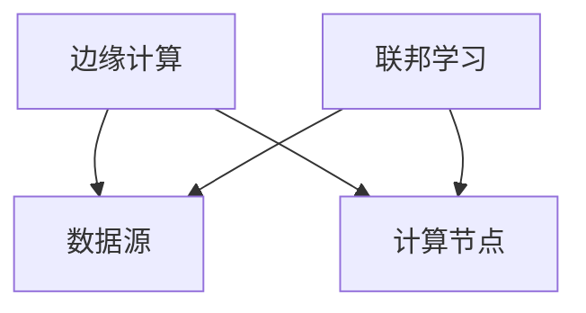

                 


# 如何识别企业的边缘计算联邦学习优势

---

## 关键词
边缘计算、联邦学习、数据隐私、企业优势、分布式计算、协同优化

---

## 摘要
边缘计算和联邦学习是两项前沿技术，分别在数据处理和模型训练方面展现了巨大的潜力。将两者结合，可以在保护数据隐私的同时，实现高效的数据分析和模型优化。本文将从概念、原理、应用场景、系统架构等多个维度，详细分析如何识别企业在边缘计算联邦学习中的优势，帮助企业更好地利用这些技术提升竞争力。

---

## 目录
1. [边缘计算与联邦学习概述](#边缘计算与联邦学习概述)
2. [边缘计算与联邦学习的核心概念与联系](#边缘计算与联邦学习的核心概念与联系)
3. [边缘计算联邦学习的算法原理讲解](#边缘计算联邦学习的算法原理讲解)
4. [企业边缘计算联邦学习机会识别](#企业边缘计算联邦学习机会识别)
5. [边缘计算联邦学习系统分析与架构设计](#边缘计算联邦学习系统分析与架构设计)
6. [边缘计算联邦学习的项目实战](#边缘计算联邦学习的项目实战)
7. [总结与未来展望](#总结与未来展望)

---

## 第1章: 边缘计算与联邦学习概述

### 1.1 边缘计算的基本概念
边缘计算是一种分布式计算范式，将数据处理从云端移到数据生成的边缘设备（如传感器、手机、摄像头等）。其核心特点包括低延迟、高实时性、数据隐私保护和减少带宽消耗。

### 1.2 联邦学习的基本概念
联邦学习是一种在分布式数据源上联合训练模型的技术。其核心特点包括数据不出域、模型参数共享、隐私保护和高效的模型更新。

### 1.3 边缘计算与联邦学习的结合
边缘计算与联邦学习的结合可以充分发挥两者的优点，例如在边缘设备上进行数据预处理和模型训练，然后通过联邦学习实现多设备之间的模型协同优化。这种结合在智能制造、智慧医疗等领域有广泛应用。

---

## 第2章: 边缘计算与联邦学习的核心概念与联系

### 2.1 核心概念原理
- **边缘计算的原理**：数据在边缘设备上进行采集、处理和存储，减少对云端的依赖。
- **联邦学习的原理**：多个参与方在不共享数据的情况下，通过加密通信和分布式算法协同训练模型。

### 2.2 概念属性特征对比
以下是一个对比表格：

| 属性          | 边缘计算                | 联邦学习              |
|---------------|------------------------|----------------------|
| 数据存储位置  | 边缘设备                | 分布式数据源          |
| 数据共享方式  | 可选择本地存储或部分共享 | 不共享原始数据，只共享模型参数 |
| 计算能力      | 边缘设备的计算资源有限  | 可利用多个设备的计算资源 |
| 适用场景      | 实时数据处理、本地服务  | 联合建模、分布式协作  |

### 2.3 边缘计算与联邦学习的ER实体关系图


---

## 第3章: 边缘计算联邦学习的算法原理讲解

### 3.1 算法原理
- **边缘计算的算法流程**：
  1. 数据采集：在边缘设备上采集实时数据。
  2. 数据预处理：对数据进行清洗、归一化等处理。
  3. 模型训练：在边缘设备上训练本地模型。
  4. 结果反馈：将模型结果反馈给边缘设备或上传到云端。

  ```mermaid
  graph TD
      A[数据采集] --> B[数据预处理]
      B --> C[模型训练]
      C --> D[结果反馈]
  ```

- **联邦学习的算法流程**：
  1. 数据源在本地训练模型。
  2. 模型聚合：将各参与方的模型参数进行聚合，形成全局模型。
  3. 模型更新：将全局模型分发给各参与方，进行下一轮训练。

  ```mermaid
  graph TD
      A[数据源] --> B[本地模型训练]
      B --> C[模型聚合]
      C --> D[全局模型更新]
  ```

### 3.2 数学模型与公式
- **边缘计算的数学模型**：$y = f(x)$，其中$x$是输入数据，$y$是输出结果，$f$是模型函数。
- **联邦学习的数学模型**：$\theta_{new} = \frac{1}{n}\sum_{i=1}^{n}\theta_i$，其中$\theta_i$是各参与方的模型参数，$n$是参与方的数量。

---

## 第4章: 企业边缘计算联邦学习机会识别

### 4.1 企业需求分析
- **数据隐私保护需求**：企业希望在不泄露原始数据的情况下进行数据分析和建模。
- **数据孤岛问题**：企业内部或不同部门之间存在数据孤岛，难以高效利用。
- **高效数据处理需求**：企业需要快速响应和处理实时数据。

### 4.2 边缘计算联邦学习机会识别方法
- **数据分布分析**：评估企业数据的分布情况，确定是否适合分布式计算和联邦学习。
- **业务场景匹配**：选择适合边缘计算和联邦学习的业务场景，例如实时监控、联合建模等。
- **技术可行性评估**：评估企业的技术能力和资源，确保能够支持边缘计算和联邦学习的实施。

### 4.3 典型应用场景
- **智能制造**：在生产线上的边缘设备上实时监控生产状态，通过联邦学习实现多个工厂之间的协同优化。
- **智慧医疗**：在医院的边缘设备上处理患者数据，通过联邦学习实现多个医院之间的联合诊断模型训练。

---

## 第5章: 边缘计算联邦学习系统分析与架构设计

### 5.1 系统分析
- **问题场景介绍**：企业需要在边缘设备上进行数据处理，同时在多个设备之间进行模型协同训练。
- **项目介绍**：开发一个基于边缘计算和联邦学习的系统，实现数据隐私保护和高效模型训练。

### 5.2 系统架构设计
- **领域模型（类图）**：
  ```mermaid
  graph TD
      A[数据源] --> B[本地模型训练]
      B --> C[模型聚合]
      C --> D[全局模型更新]
  ```

- **系统架构图**：
  ```mermaid
  graph TD
      A[边缘设备] --> B[本地数据处理]
      B --> C[模型训练]
      C --> D[模型聚合服务]
      D --> E[全局模型]
  ```

### 5.3 系统交互设计
- **交互流程**：
  1. 边缘设备采集数据并进行本地数据处理。
  2. 各边缘设备进行本地模型训练。
  3. 模型聚合服务接收各参与方的模型参数，进行模型聚合。
  4. 分发更新后的全局模型给各参与方，进行下一轮训练。

  ```mermaid
  graph TD
      A[用户] --> B[边缘设备]
      B --> C[本地数据处理]
      C --> D[模型训练]
      D --> E[模型聚合服务]
      E --> F[全局模型]
  ```

---

## 第6章: 边缘计算联邦学习的项目实战

### 6.1 环境安装
- 安装Python和必要的库（如TensorFlow、Flask）。
- 配置边缘设备和云端服务环境。

### 6.2 核心代码实现
- **边缘设备数据处理代码**：
  ```python
  import numpy as np

  def preprocess(data):
      return data / 255.0  # 示例数据归一化处理
  ```

- **联邦学习模型训练代码**：
  ```python
  def aggregate(models):
      return np.mean(models, axis=0)  # 示例模型参数聚合
  ```

### 6.3 实际案例分析
- 某制造企业通过边缘计算联邦学习技术，在多个工厂之间实现了生产数据的协同优化，提高了生产效率和产品质量。

---

## 第7章: 总结与未来展望

### 7.1 总结
边缘计算联邦学习结合了边缘计算的实时性和联邦学习的隐私保护优势，为企业提供了高效、安全的数据处理和模型训练方式。企业在识别边缘计算联邦学习优势时，应结合自身需求和资源，选择适合的场景和技术方案。

### 7.2 未来展望
随着技术的不断发展，边缘计算联邦学习将在更多领域得到应用。未来的研究方向包括更高效的模型聚合算法、更强的隐私保护机制以及更智能的系统架构设计。

---

## 最佳实践 Tips
- 在实施边缘计算联邦学习之前，企业需要充分评估自身的数据特点、业务需求和技术能力。
- 选择适合的边缘设备和云端服务，确保系统的稳定性和高效性。
- 定期更新和优化模型，以适应业务变化和数据分布的变化。

---

通过以上步骤，企业可以更好地识别和利用边缘计算联邦学习的优势，提升数据处理和模型训练的效率，同时保护数据隐私，增强竞争力。

