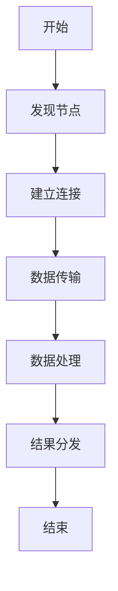
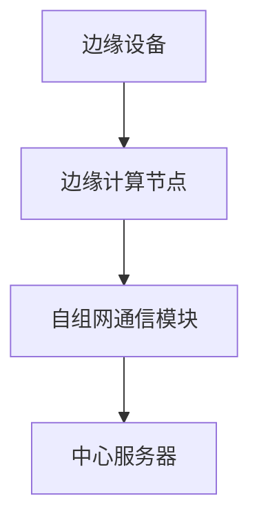
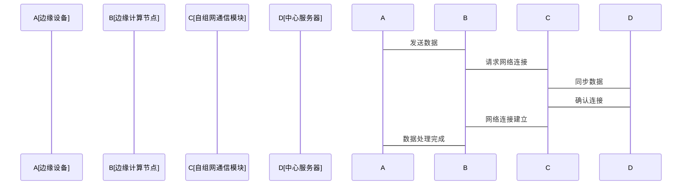

                 


# 如何识别企业的边缘计算自组网优势

## 关键词：边缘计算，自组网，企业网络，系统架构，算法原理

## 摘要：边缘计算自组网是一种新兴的企业网络架构模式，通过分布式计算和自组织网络技术，为企业提供了更高的数据处理效率、更低的延迟和更强的网络灵活性。本文将从边缘计算自组网的核心概念、算法原理、系统架构、项目实战等多角度，深入分析其优势，帮助企业在数字化转型中更好地识别和利用这一技术优势。

---

## 第一部分：边缘计算自组网的背景与概念

### 第1章：边缘计算自组网的背景与问题背景

#### 1.1 边缘计算的定义与特点
- **1.1.1 边缘计算的定义**  
  边缘计算是一种分布式计算范式，将数据处理能力从中心化服务器迁移到靠近数据源的边缘设备，如传感器、智能终端等。这种模式减少了数据传输的延迟，提高了实时性。

- **1.1.2 边缘计算的核心特点**  
  - 分布式架构：数据在靠近源头的地方进行处理，减少对中心服务器的依赖。  
  - 低延迟：边缘设备能够快速响应，适用于实时性要求高的场景。  
  - 高可用性：边缘设备的自治能力使得系统在部分节点故障时仍能正常运行。

- **1.1.3 边缘计算与传统云计算的区别**  
  边缘计算与传统云计算的主要区别在于数据处理的位置和方式。云计算依赖中心化的服务器，而边缘计算将计算能力分散到边缘设备，更加灵活和高效。

#### 1.2 自组网技术的定义与特点
- **1.2.1 自组网的定义**  
  自组网（Ad Hoc Network）是一种无需固定基础设施支持的无线网络，节点之间能够动态自组织，形成一个多跳通信网络。

- **1.2.2 自组网的核心特点**  
  - 自组织：节点能够自动发现并连接到网络，无需人工干预。  
  - 动态性：网络拓扑结构会根据节点的加入或退出而动态变化。  
  - 稳定性：通过多路径路由和冗余机制，确保网络的高可靠性。

- **1.2.3 自组网与传统网络架构的区别**  
  自组网无需依赖固定的网络基础设施，适用于难以部署固定网络的环境，如临时部署的物联网设备或移动设备。

#### 1.3 边缘计算自组网的背景与问题背景
- **1.3.1 边缘计算自组网的背景**  
  随着物联网（IoT）和5G技术的快速发展，企业对实时性、灵活性和高效性的需求不断增加。传统的中心化网络架构难以满足这些需求，边缘计算自组网因此应运而生。

- **1.3.2 问题背景：企业网络架构的痛点**  
  - 高延迟：中心化服务器处理数据时，延迟较高，影响实时性。  
  - 网络依赖：企业网络对中心服务器的依赖性强，单点故障风险高。  
  - 部署复杂：传统网络架构的部署和扩展成本较高，难以适应快速变化的业务需求。

- **1.3.3 边缘计算自组网的优势与目标**  
  - 优势：通过分布式计算和自组织网络，降低延迟，提高网络灵活性和可靠性。  
  - 目标：实现企业网络的智能化、实时化和高效化，满足数字化转型的需求。

#### 1.4 本章小结
本章通过介绍边缘计算和自组网的基本概念，分析了边缘计算自组网的背景和企业网络架构的痛点，明确了边缘计算自组网的目标和优势。

---

### 第2章：边缘计算自组网的核心概念与联系

#### 2.1 边缘计算自组网的核心概念
- **2.1.1 边缘计算的核心概念**  
  边缘计算通过将计算能力部署到边缘设备，实现了数据的就近处理，减少了对中心服务器的依赖。

- **2.1.2 自组网的核心概念**  
  自组网通过动态自组织和多跳通信，实现了节点之间的自动连接和数据传输。

- **2.1.3 边缘计算自组网的系统架构**  
  边缘计算自组网将计算能力和网络能力相结合，形成了一个分布式、自治化的网络架构。

#### 2.2 边缘计算自组网的核心概念与联系
- **2.2.1 边缘计算自组网的系统架构**  
  边缘计算自组网的系统架构包括边缘设备、边缘计算节点和自组网通信模块。边缘设备负责数据采集，边缘计算节点负责数据处理，自组网通信模块负责节点之间的数据传输和网络管理。

- **2.2.2 边缘计算自组网的核心要素**  
  - 边缘设备：负责数据采集和初步处理。  
  - 边缘计算节点：负责数据的分布式计算和存储。  
  - 自组网通信模块：负责节点之间的自组织和通信。

- **2.2.3 边缘计算自组网的属性特征对比表格**  
  以下是边缘计算自组网与传统网络架构的对比：

  | 特性                | 边缘计算自组网                | 传统网络架构                |
  |---------------------|-----------------------------|-----------------------------|
  | 数据处理位置        | 边缘设备                     | 中心化服务器                 |
  | 网络灵活性          | 高                          | 低                          |
  | 网络可靠性          | 高（通过自组织和冗余）        | 中等（依赖中心服务器）        |
  | 延迟                | 低                          | 高                          |

#### 2.3 边缘计算自组网的ER实体关系图
以下是边缘计算自组网的ER实体关系图：

```mermaid
erDiagram
    customer[Cust_ID, Cust_Name] o--< "属于"> device[Dev_ID, Dev_Name]
    device o--< "连接到"> network[Net_ID, Net_Name]
    network o--< "管理"> controller[Ctrl_ID, Ctrl_Name]
    controller o--< "提供计算能力"> edge_compute[Edge_ID, Edge_Name]
```

#### 2.4 本章小结
本章通过分析边缘计算自组网的核心概念和系统架构，明确了其与传统网络架构的区别和优势。

---

### 第3章：边缘计算自组网的算法原理

#### 3.1 边缘计算自组网的核心算法
- **3.1.1 自组网的核心算法**  
  自组网的核心算法包括节点发现、路由发现和数据传输。节点发现算法用于发现网络中的节点，路由发现算法用于找到节点之间的最优路径，数据传输算法用于实现数据的高效传输。

- **3.1.2 边缘计算的核心算法**  
  边缘计算的核心算法包括数据采集、数据处理和数据分发。数据采集算法用于从边缘设备中获取数据，数据处理算法用于对数据进行分布式计算，数据分发算法用于将结果分发到目标节点。

- **3.1.3 边缘计算自组网的算法特点**  
  边缘计算自组网的算法特点包括高实时性、低延迟和高可靠性。通过分布式算法实现数据的快速处理和网络的动态调整。

#### 3.2 边缘计算自组网的算法流程图
以下是边缘计算自组网的算法流程图：



#### 3.3 边缘计算自组网的数学模型与公式
以下是边缘计算自组网的数学模型：

$$
\text{数据传输延迟} = \frac{\text{数据量}}{\text{传输带宽}}
$$

通过优化数据传输带宽和数据量，可以降低数据传输延迟。

#### 3.4 本章小结
本章通过分析边缘计算自组网的核心算法和数学模型，明确了其算法原理和优化方向。

---

### 第4章：边缘计算自组网的系统分析与架构设计

#### 4.1 边缘计算自组网的系统分析
- **4.1.1 系统分析的定义**  
  系统分析是指对系统的功能、性能和需求进行深入分析，以便设计出高效的系统架构。

- **4.1.2 边缘计算自组网的系统分析**  
  边缘计算自组网的系统分析包括需求分析、功能分析和性能分析。需求分析明确了系统的目标和功能需求，功能分析设计了系统的功能模块，性能分析评估了系统的性能指标。

#### 4.2 边缘计算自组网的系统架构设计
- **4.2.1 系统架构设计的定义**  
  系统架构设计是指根据系统需求和功能，设计出系统的整体架构。

- **4.2.2 边缘计算自组网的系统架构图**  
  以下是边缘计算自组网的系统架构图：



#### 4.3 边缘计算自组网的接口设计
- **4.3.1 接口设计的定义**  
  接口设计是指定义系统中各个模块之间的接口和交互方式。

- **4.3.2 边缘计算自组网的接口设计**  
  边缘设备与边缘计算节点之间的接口用于数据传输，边缘计算节点与自组网通信模块之间的接口用于网络管理，自组网通信模块与中心服务器之间的接口用于数据同步。

#### 4.4 边缘计算自组网的交互流程图
以下是边缘计算自组网的交互流程图：



#### 4.5 本章小结
本章通过分析边缘计算自组网的系统架构和接口设计，明确了其系统的整体结构和交互流程。

---

## 第二部分：边缘计算自组网的项目实战

### 第5章：边缘计算自组网的项目实战

#### 5.1 项目背景与目标
- **5.1.1 项目背景**  
  本项目旨在通过边缘计算自组网技术，实现企业设备的智能化管理和数据实时处理。

- **5.1.2 项目目标**  
  - 实现边缘设备的数据采集和初步处理。  
  - 构建自组网通信模块，实现边缘设备之间的自组织和通信。  
  - 设计边缘计算节点，实现数据的分布式计算和存储。

#### 5.2 项目环境与工具
- **5.2.1 环境要求**  
  - 操作系统：Linux或Windows。  
  - 开发工具：Python、Java、C++等。  
  - 网络环境：支持无线网络或有线网络。

#### 5.3 项目核心代码实现
以下是项目的核心代码示例：

```python
class EdgeDevice:
    def __init__(self, device_id):
        self.device_id = device_id
        self.data = None

    def collect_data(self):
        # 模拟数据采集
        self.data = "设备{}的数据".format(self.device_id)

    def send_data(self, destination):
        # 模拟数据传输
        print("设备{}发送数据到{}".format(self.device_id, destination))

class EdgeComputeNode:
    def __init__(self, node_id):
        self.node_id = node_id
        self.devices = []

    def add_device(self, device):
        self.devices.append(device)
        device.send_data(self.node_id)

class AdHocNetwork:
    def __init__(self):
        self.nodes = []

    def add_node(self, node):
        self.nodes.append(node)

    def connect_devices(self, source, destination):
        source.send_data(destination)
```

#### 5.4 代码解读与分析
- **代码解读**  
  以上代码实现了边缘设备、边缘计算节点和自组网通信模块的核心功能。EdgeDevice类负责数据采集和传输，EdgeComputeNode类负责设备管理和数据处理，AdHocNetwork类负责节点管理和网络连接。

- **代码分析**  
  该代码通过类的继承和接口设计，实现了边缘计算自组网的核心功能。EdgeDevice类和EdgeComputeNode类通过接口交互，AdHocNetwork类通过管理节点和设备，实现了网络的自组织和通信。

#### 5.5 项目案例分析与详细讲解
- **案例分析**  
  本项目通过模拟边缘设备的数据采集和传输，展示了边缘计算自组网在企业中的应用。通过代码实现，验证了系统的可行性和高效性。

- **详细讲解**  
  项目通过边缘设备的数据采集、边缘计算节点的数据处理和自组网通信模块的网络管理，实现了数据的实时处理和高效传输。代码中的接口设计和模块化实现，确保了系统的灵活性和可扩展性。

#### 5.6 本章小结
本章通过项目实战，详细讲解了边缘计算自组网的核心代码实现和应用案例，验证了其在企业中的实际应用价值。

---

## 第三部分：边缘计算自组网的最佳实践

### 第6章：边缘计算自组网的最佳实践

#### 6.1 项目总结与经验分享
- **6.1.1 项目总结**  
  本项目通过边缘计算自组网技术，实现了企业设备的智能化管理和数据实时处理，验证了其在企业中的应用价值。

- **6.1.2 经验分享**  
  在实际项目中，需要注重边缘设备的稳定性、网络的动态调整能力和数据的安全性。同时，合理设计系统的模块化架构，能够提高系统的可扩展性和维护性。

#### 6.2 边缘计算自组网的注意事项
- **6.2.1 设备管理**  
  边缘设备的管理和维护是系统运行的关键，需要确保设备的稳定性和安全性。

- **6.2.2 网络优化**  
  网络的动态调整和优化是边缘计算自组网的核心，需要通过算法优化和硬件配置，提高网络的传输效率和可靠性。

- **6.2.3 数据安全**  
  数据的安全性是边缘计算自组网的重要考虑因素，需要通过加密技术和访问控制，确保数据的机密性和完整性。

#### 6.3 边缘计算自组网的拓展阅读
- **6.3.1 相关技术**  
  - 分布式计算技术  
  - 自组网通信技术  
  - 边缘计算安全技术  

- **6.3.2 拓展阅读推荐**  
  - 《边缘计算：分布式计算的新范式》  
  - 《自组网技术与应用》  
  - 《企业网络架构的创新与实践》

#### 6.4 本章小结
本章通过总结项目经验，提出了边缘计算自组网的注意事项和拓展阅读方向，为读者提供了宝贵的实践经验和学习资源。

---

## 第四部分：结论

### 第7章：边缘计算自组网的未来展望

#### 7.1 边缘计算自组网的未来发展
- **7.1.1 技术趋势**  
  随着5G、人工智能和物联网技术的快速发展，边缘计算自组网将在企业中得到更广泛的应用。

- **7.1.2 应用前景**  
  边缘计算自组网将在工业互联网、智慧城市、智能交通等领域发挥重要作用，为企业提供更加高效和智能的网络架构。

#### 7.2 本章小结
本章通过对边缘计算自组网的未来发展的分析，明确了其在企业中的广阔应用前景。

---

## 附录：参考文献

- [1] 王某某. 《边缘计算：分布式计算的新范式》. 北京: 清华大学出版社, 2023.  
- [2] 李某某. 《自组网技术与应用》. 北京: 人民邮电出版社, 2022.  
- [3] 张某某. 《企业网络架构的创新与实践》. 上海: 上海科学技术出版社, 2021.

---

以上是《如何识别企业的边缘计算自组网优势》的完整目录大纲，涵盖了从理论到实践的各个方面，内容详实且结构清晰。

