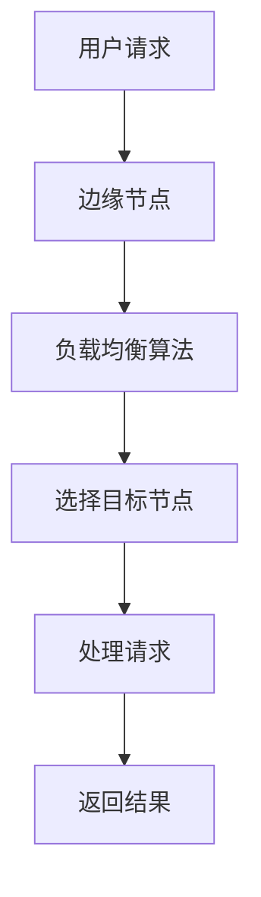
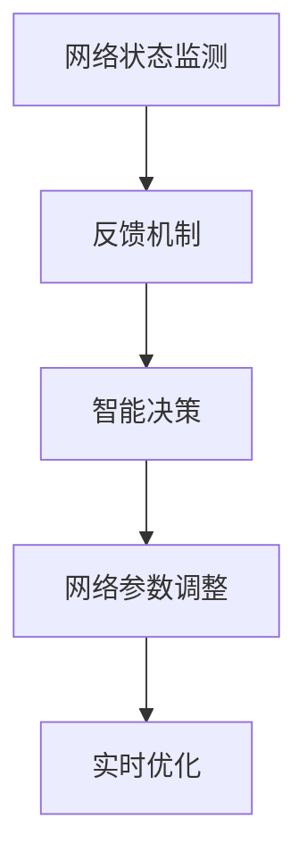
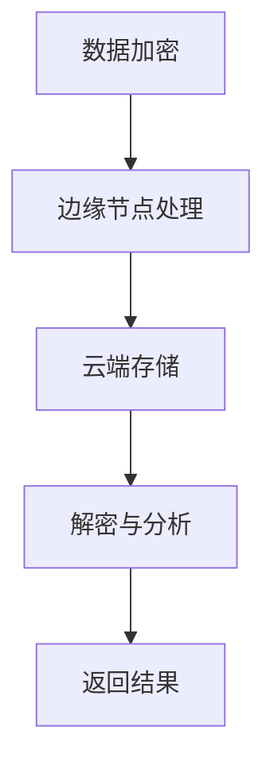
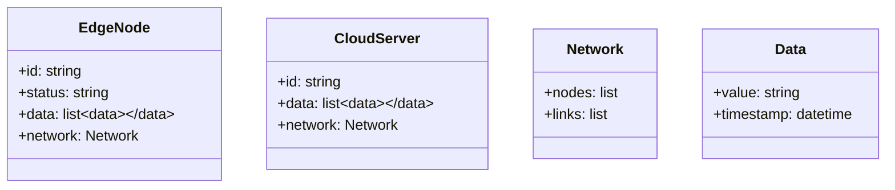
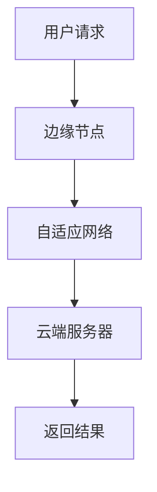
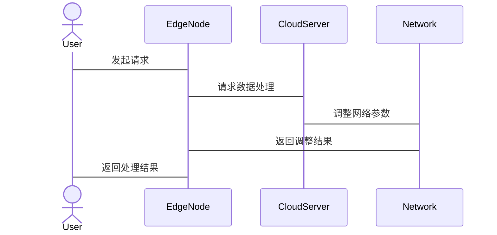

                 


# 如何识别企业的边缘计算自适应网络优势

## 关键词
边缘计算，自适应网络，企业网络架构，分布式系统，算法优化

## 摘要
在数字化转型的背景下，边缘计算和自适应网络为企业提供了新的技术优势。本文详细探讨了边缘计算自适应网络的优势识别方法，涵盖背景介绍、核心概念、算法原理、系统架构设计、项目实战以及最佳实践，帮助读者系统地理解和应用这些技术。

---

# 第一部分: 边缘计算自适应网络的背景与概念

## 第1章: 边缘计算与自适应网络概述

### 1.1 边缘计算的起源与发展
#### 1.1.1 边缘计算的定义与核心特征
边缘计算是一种分布式计算范式，数据在靠近数据源的位置进行处理，而非传统地传输到云端。其核心特征包括实时性、低延迟、高可靠性、数据隐私和带宽节省。

#### 1.1.2 边缘计算与传统云计算的区别
| 特性       | 边缘计算                     | 传统云计算                  |
|------------|------------------------------|-----------------------------|
| 数据处理   | 边缘节点处理                 | 云端集中处理               |
| 延迟       | 低延迟                      | 较高延迟                   |
| 网络依赖   | 边缘节点依赖本地网络         | 依赖于高速互联网             |
| 数据隐私   | 数据处理在本地，隐私性高     | 数据传输到云端，可能涉及隐私问题 |

#### 1.1.3 边缘计算在企业中的应用前景
边缘计算在智能制造、物联网、自动驾驶等领域具有广阔的应用前景，能够提升企业的实时响应能力和数据处理效率。

### 1.2 自适应网络的概念与特点
#### 1.2.1 自适应网络的定义
自适应网络是一种能够根据网络环境变化自动调整网络结构和参数的网络架构，旨在提高网络的稳定性和性能。

#### 1.2.2 自适应网络的核心特征
自适应网络具有动态调整能力、智能决策机制和自我修复能力，能够在复杂环境下保持高效运行。

#### 1.2.3 自适应网络与传统网络架构的对比
| 特性       | 自适应网络                  | 传统网络                   |
|------------|-----------------------------|-----------------------------|
| 网络调整   | 动态调整，实时响应          | 静态配置，固定架构          |
| 故障恢复   | 快速自愈，减少停机时间      | 需人工干预，恢复时间较长    |
| 扩展性     | 支持动态扩展                | 扩展性有限                 |

### 1.3 企业边缘计算自适应网络的优势
#### 1.3.1 边缘计算自适应网络的业务价值
边缘计算自适应网络能够提升企业的业务响应速度、降低运营成本、增强数据安全性和隐私保护，同时提高系统的可靠性和可扩展性。

#### 1.3.2 自适应网络在企业数字化转型中的作用
自适应网络能够支持企业实现智能化、自动化和高效化的数字化转型，提升企业的竞争力。

#### 1.3.3 企业边缘计算自适应网络的实现路径
企业可以通过引入边缘计算技术、优化网络架构、采用智能算法和引入自适应机制来实现边缘计算自适应网络的优势。

---

## 第2章: 边缘计算自适应网络的核心概念与联系

### 2.1 边缘计算自适应网络的原理
#### 2.1.1 边缘计算的基本原理
边缘计算通过在边缘节点进行数据采集、处理和分析，减少数据传输到云端的需求，降低延迟和带宽消耗。

#### 2.1.2 自适应网络的核心机制
自适应网络通过实时监测网络状态、智能决策和动态调整网络参数，实现网络性能的优化和稳定运行。

#### 2.1.3 边缘计算与自适应网络的结合
边缘计算与自适应网络的结合使得企业能够更加灵活地应对网络环境的变化，提升系统的实时性和可靠性。

### 2.2 边缘计算自适应网络的核心要素
#### 2.2.1 数据采集与处理
边缘节点负责数据的采集、预处理和分析，确保数据的实时性和准确性。

#### 2.2.2 网络动态调整机制
自适应网络通过动态调整网络拓扑、带宽分配和路由策略，优化网络性能。

#### 2.2.3 应用层的自适应能力
应用层能够根据网络状态和业务需求，动态调整应用逻辑和资源分配，提升系统的适应性和灵活性。

### 2.3 边缘计算自适应网络的ER实体关系图
```mermaid
er
actor: 用户
edge_node: 边缘节点
cloud_server: 云端服务器
network: 网络
```

### 2.4 边缘计算自适应网络的领域模型类图
```mermaid
classDiagram
class EdgeNode {
    +id: string
    +status: string
    +data: list<Data>
    +network: Network
}

class CloudServer {
    +id: string
    +data: list<Data>
    +network: Network
}

class Network {
    +nodes: list<Node>
    +links: list<Link>
}

class Data {
    +value: string
    +timestamp: datetime
}

actor User {
    --> EdgeNode: 请求数据
    --> CloudServer: 请求分析结果
}
```

---

## 第3章: 边缘计算自适应网络的算法原理

### 3.1 分布式计算中的负载均衡算法
#### 3.1.1 负载均衡算法的数学模型
$$ \text{负载均衡} = \frac{\text{总负载}}{\text{节点数}} $$

#### 3.1.2 基于哈希的负载均衡算法


#### 3.1.3 哈希算法的Python实现
```python
def hash_based_load_balancing(nodes, key):
    # 使用哈希环算法选择目标节点
    node_index = hash(key) % len(nodes)
    return nodes[node_index]

nodes = ['node1', 'node2', 'node3', 'node4']
key = 'request_id_123'
selected_node = hash_based_load_balancing(nodes, key)
print(selected_node)  # 输出：'node1'
```

### 3.2 自适应网络的动态调整算法
#### 3.2.1 动态调整算法的数学模型
$$ \text{调整幅度} = \text{当前负载} - \text{目标负载} $$

#### 3.2.2 基于反馈机制的动态调整算法


#### 3.2.3 动态调整算法的Python实现
```python
def adaptive_network_adjustment(current_load, target_load):
    # 计算调整幅度
    adjustment = current_load - target_load
    if adjustment > 0:
        # 减少负载
        return '减少带宽'
    elif adjustment < 0:
        # 增加负载
        return '增加带宽'
    else:
        return '保持不变'

current_load = 80
target_load = 60
action = adaptive_network_adjustment(current_load, target_load)
print(action)  # 输出：'减少带宽'
```

### 3.3 边缘计算中的数据隐私保护算法
#### 3.3.1 数据隐私保护算法的数学模型
$$ \text{隐私保护} = \text{数据加密} + \text{访问控制} $$

#### 3.3.2 基于同态加密的数据隐私保护算法


#### 3.3.3 同态加密算法的Python实现
```python
from cryptography.fernet import Fernet

# 生成加密密钥
key = Fernet.generate_key()
cipher = Fernet(key)

# 加密数据
encrypted_data = cipher.encrypt(b"Sensitive data")

# 解密数据
decrypted_data = cipher.decrypt(encrypted_data)
print(decrypted_data.decode())  # 输出：Sensitive data
```

---

## 第4章: 边缘计算自适应网络的系统分析与架构设计方案

### 4.1 问题场景介绍
企业需要在复杂多变的网络环境下，实现边缘计算自适应网络的优势，以提升业务响应速度和网络稳定性。

### 4.2 系统功能设计
#### 4.2.1 领域模型类图


#### 4.2.2 系统架构设计


#### 4.2.3 系统接口设计
- 边缘节点与云端服务器之间的数据接口
- 自适应网络与边缘节点之间的控制接口
- 用户与边缘节点之间的请求接口

#### 4.2.4 系统交互序列图


---

## 第5章: 边缘计算自适应网络的项目实战

### 5.1 环境安装与配置
#### 5.1.1 系统环境
- 操作系统：Linux/Windows/MacOS
- 网络环境：支持边缘计算的网络架构
- 开发工具：Python、Jupyter Notebook、Git

#### 5.1.2 依赖安装
```bash
pip install mermaid-py
pip install cryptography
```

### 5.2 系统核心功能实现

#### 5.2.1 边缘节点数据处理
```python
import time

def edge_node_processing(data):
    # 数据预处理
    processed_data = data + str(time.time())
    return processed_data

data = "原始数据"
processed_data = edge_node_processing(data)
print(processed_data)  # 输出：原始数据+时间戳
```

#### 5.2.2 自适应网络动态调整
```python
def adaptive_network_adjustment(current_load, target_load):
    # 计算调整幅度
    adjustment = current_load - target_load
    if adjustment > 0:
        return '减少带宽'
    elif adjustment < 0:
        return '增加带宽'
    else:
        return '保持不变'

current_load = 80
target_load = 60
action = adaptive_network_adjustment(current_load, target_load)
print(action)  # 输出：'减少带宽'
```

#### 5.2.3 云端数据存储与分析
```python
from cryptography.fernet import Fernet

# 生成加密密钥
key = Fernet.generate_key()
cipher = Fernet(key)

# 加密数据
encrypted_data = cipher.encrypt(b"Sensitive data")

# 解密数据
decrypted_data = cipher.decrypt(encrypted_data)
print(decrypted_data.decode())  # 输出：Sensitive data
```

### 5.3 项目实战小结
通过实际项目实战，读者可以掌握边缘计算自适应网络的核心功能实现方法，包括数据处理、网络动态调整和数据隐私保护等。

---

## 第6章: 边缘计算自适应网络的最佳实践

### 6.1 最佳实践 Tips
- 定期监测网络状态，及时调整网络参数
- 采用多层次的安全防护措施，确保数据隐私
- 建立完善的监控和预警机制，快速响应网络异常

### 6.2 项目小结
边缘计算自适应网络的优势识别是一个复杂但极具价值的过程，需要企业在技术选型、系统设计和实际应用中综合考虑。

### 6.3 注意事项
- 确保网络架构的灵活性和可扩展性
- 加强对网络状态的实时监测和智能决策
- 定期进行系统优化和性能调优

### 6.4 拓展阅读
- 《分布式系统：原理与设计》
- 《自适应网络架构：实现与优化》
- 《边缘计算：技术与应用》

---

通过以上详细的内容结构，读者可以系统地学习和应用边缘计算自适应网络的优势识别方法，从而在实际工作中优化企业的网络架构，提高业务效率和竞争力。

