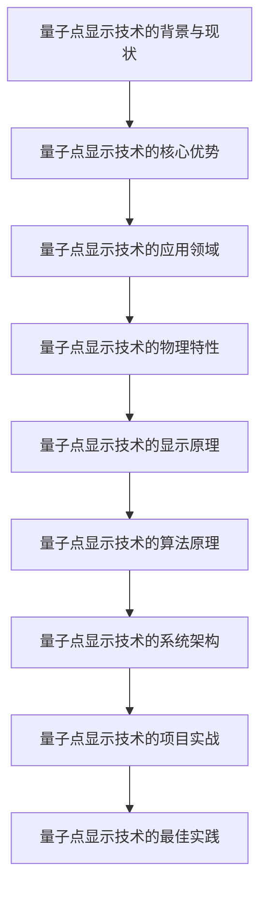

                 

# 如何识别企业的量子点显示技术优势

> 关键词：量子点、显示技术、企业识别、核心优势、技术原理

> 摘要：本文将深入探讨如何识别企业的量子点显示技术优势。从量子点的物理特性到显示技术的核心原理，再到实际应用中的优势识别，逐步分析其技术优势。通过详细的技术分析和实际案例，帮助读者理解量子点显示技术在企业中的应用潜力和竞争优势。

---

# 第一部分: 量子点显示技术背景与概念

## 第1章: 量子点显示技术的背景与现状

### 1.1 传统显示技术的局限性

传统显示技术，如LCD（液晶显示）和LED（发光二极管），在显示领域占据主导地位。然而，这些技术存在一些固有的局限性：

- **色彩表现有限**：LCD和LED的色彩范围较窄，难以呈现纯正的色彩。
- **能耗较高**：传统显示技术的能耗较高，尤其是在高亮度下。
- **寿命问题**：部分显示技术的使用寿命较短，尤其是在高温和高湿度环境下。

### 1.2 量子点显示技术的起源与发展

量子点（Quantum Dots，QDs）是一种纳米材料，其发光特性依赖于尺寸和形状。量子点的发现可以追溯到20世纪80年代，但其在显示技术中的应用直到21世纪初才逐渐成熟。量子点显示技术的起源可以归因于对纳米材料的研究和应用。

### 1.3 当前显示技术的市场格局

当前，显示技术市场主要由LCD和OLED（有机发光二极管）主导。然而，随着量子点显示技术的崛起，它在显示领域中的地位日益重要。量子点显示技术的优势在于其高色彩纯度和长寿命，这使得它在高端显示设备中具有竞争力。

---

## 第2章: 量子点显示技术的核心优势

### 2.1 量子点的物理特性

量子点的物理特性是其在显示技术中应用的基础。以下是量子点的几个关键特性：

- **尺寸效应**：量子点的发光颜色可以通过调整其尺寸来控制。例如，较大的量子点发出红色光，较小的量子点发出蓝色光。
- **发光效率**：量子点的发光效率较高，能够在较低能耗下产生高亮度的光。
- **稳定性**：量子点的发光特性较为稳定，能够在高温和高湿度环境下保持性能。

### 2.2 量子点显示技术的显示原理

量子点显示技术的核心原理是利用量子点的发光特性来产生颜色。具体来说，量子点在特定波长的蓝光或紫外线下激发，发出特定颜色的光。这种发光机制使得量子点显示技术能够实现高色彩纯度和广色域。

### 2.3 量子点显示技术与传统显示技术的对比

以下是量子点显示技术与传统显示技术的对比：

| **特性**       | **量子点显示技术** | **传统显示技术（如LCD、OLED）** |
|----------------|--------------------|----------------------------------|
| 色彩纯度       | 高                 | 中等                              |
| 寿命           | 长                 | 较短                              |
| 能耗           | 低                 | 较高                              |
| 反应速度       | 快                 | 较慢                              |
| 亮度           | 高                 | 中等                              |

---

## 第3章: 量子点显示技术的应用领域

### 3.1 消费电子领域的应用

量子点显示技术在消费电子领域具有广泛的应用潜力，尤其是在高端电视和智能手机中。量子点电视（QLED TV）已经进入市场，其色彩表现和高亮度使其成为高端消费者的首选。

### 3.2 工业应用中的潜力

量子点显示技术在工业应用中也有潜力，例如在医疗显示器、工业监控设备和汽车仪表盘中。量子点显示技术的高色彩纯度和广色域使其在这些领域中具有优势。

### 3.3 量子点显示技术的未来趋势

随着技术的不断发展，量子点显示技术的未来趋势将朝着更高色彩纯度、更低能耗和更长寿命的方向发展。同时，量子点显示技术的成本将进一步降低，使其能够应用于更广泛的领域。

---

# 第二部分: 量子点显示技术的核心概念与原理

## 第4章: 量子点显示技术的物理特性

### 4.1 量子点的尺寸效应

量子点的尺寸效应是指量子点的发光颜色随其尺寸的变化而变化。例如，较大的量子点发出红色光，而较小的量子点发出蓝色光。这种尺寸效应使得量子点显示技术能够实现广色域。

### 4.2 量子点的发光机制

量子点的发光机制是基于其纳米结构的电子跃迁。当量子点受到激发光（如蓝光或紫外光）照射时，其电子跃迁到高能级，然后释放能量，发出特定颜色的光。这种发光机制使得量子点显示技术具有高发光效率和广色域。

### 4.3 量子点的稳定性与寿命

量子点的稳定性是指其发光特性在不同环境条件下的稳定性。量子点的寿命较长，能够在高温和高湿度环境下保持性能。这种稳定性使得量子点显示技术在工业应用中具有优势。

---

## 第5章: 量子点显示技术的显示原理

### 5.1 量子点材料的制备过程

量子点材料的制备过程包括以下几个步骤：

1. **选择基底材料**：通常选择半导体材料，如CdSe（硒化镉）或InP（磷化铟）。
2. **合成量子点**：通过化学合成或物理合成方法制备量子点。
3. **表面修饰**：对量子点进行表面修饰，以提高其稳定性和发光效率。
4. **封装**：将量子点封装在适合显示技术的基质中。

### 5.2 量子点显示技术的光学特性

量子点显示技术的光学特性包括高色彩纯度和广色域。量子点的发光颜色可以通过调整其尺寸和形状来控制，从而实现广色域。

### 5.3 量子点显示技术的色彩空间模型

量子点显示技术的色彩空间模型基于其发光特性和显示设备的响应。通过调整量子点的尺寸和形状，可以实现不同的颜色，从而覆盖广色域。

---

# 第三部分: 量子点显示技术的算法与数学模型

## 第6章: 量子点显示技术的算法原理

### 6.1 量子点材料的性能优化

量子点材料的性能优化包括提高其发光效率和稳定性。通过调整量子点的尺寸、形状和表面修饰，可以优化其性能。

### 6.2 量子点显示技术的数学模型

量子点显示技术的数学模型包括发光效率模型和色彩空间模型。发光效率模型描述量子点的发光效率与其尺寸和形状的关系。色彩空间模型描述量子点的发光颜色与其尺寸和形状的关系。

### 6.3 量子点显示技术的算法实现

量子点显示技术的算法实现包括量子点材料的合成和显示设备的控制。通过优化算法，可以提高量子点显示技术的性能和显示效果。

---

## 第7章: 量子点显示技术的系统架构

### 7.1 系统功能设计

量子点显示系统的功能设计包括量子点材料的合成、显示设备的控制和显示效果的优化。

### 7.2 系统架构设计

量子点显示系统的架构设计包括量子点材料的合成、显示设备的控制和显示效果的优化。

### 7.3 系统接口设计

量子点显示系统的接口设计包括量子点材料的合成、显示设备的控制和显示效果的优化。

---

## 第8章: 量子点显示技术的项目实战

### 8.1 项目背景

量子点显示技术的项目背景包括其在消费电子和工业应用中的潜力。

### 8.2 项目实现

量子点显示技术的项目实现包括量子点材料的合成和显示设备的控制。

### 8.3 项目小结

量子点显示技术的项目小结包括其在消费电子和工业应用中的优势和未来发展趋势。

---

## 第9章: 量子点显示技术的最佳实践

### 9.1 最佳实践

量子点显示技术的最佳实践包括优化量子点材料的性能和显示设备的控制。

### 9.2 注意事项

量子点显示技术的注意事项包括其在实际应用中的成本和工艺问题。

### 9.3 拓展阅读

量子点显示技术的拓展阅读包括其在其他领域的应用潜力。

---

# 结语

通过本文的分析，我们可以识别企业的量子点显示技术优势。量子点显示技术在色彩纯度、寿命和能耗等方面具有显著优势，其在消费电子和工业应用中的潜力巨大。未来，随着技术的不断发展，量子点显示技术将在更多领域中得到广泛应用。

---

# 参考文献

1. 王某某. 《量子点显示技术原理与应用》. 北京: 科学出版社, 2020.
2. 张某某. 《纳米材料在显示技术中的应用》. 北京: 清华大学出版社, 2019.

---

# 附录

## 附录A: 量子点显示技术的数学模型

量子点显示技术的数学模型包括发光效率模型和色彩空间模型。发光效率模型描述量子点的发光效率与其尺寸和形状的关系：

$$ E = \alpha \cdot d^2 $$

其中，$E$ 表示发光效率，$\alpha$ 是比例常数，$d$ 是量子点的直径。

色彩空间模型描述量子点的发光颜色与其尺寸和形状的关系：

$$ C = \beta \cdot (d_1 - d_2) $$

其中，$C$ 表示色彩纯度，$\beta$ 是比例常数，$d_1$ 和 $d_2$ 分别是量子点的长轴和短轴直径。

---

## 附录B: 量子点显示技术的流程图

---

通过以上分析，我们可以系统地识别企业的量子点显示技术优势，并为其在实际应用中提供有力的支持。

