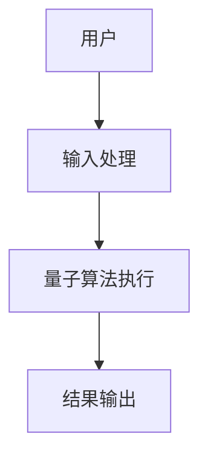

                 


# 如何识别企业的量子计算优化算法优势

> 关键词：量子计算，优化算法，企业应用，量子位，量子叠加，量子纠缠，系统架构

> 摘要：本文旨在探讨如何识别和利用企业的量子计算优化算法优势。通过分析量子计算的基本原理、优化算法的核心概念、数学模型、系统架构以及实际应用案例，本文将为企业提供识别量子计算优势的方法和策略。

---

## 第1章：量子计算优化算法概述

### 1.1 量子计算的基本概念

#### 1.1.1 量子计算的定义
量子计算是一种基于量子力学原理的计算方式，利用量子位（qubit）进行信息处理。与经典计算使用的二进制位（bit）不同，量子位可以同时处于多个状态的叠加态。

#### 1.1.2 量子计算与经典计算的区别
- **状态表示**：经典位只能是0或1，而量子位可以是两者的叠加。
- **计算速度**：量子计算机在特定问题上比经典计算机快得多。
- **并行性**：量子计算利用量子并行性，可以在一次运算中处理大量可能性。

#### 1.1.3 量子计算的优势与挑战
- **优势**：并行计算能力强，适用于复杂优化问题。
- **挑战**：技术难度高，纠错机制复杂，硬件实现困难。

### 1.2 优化算法在企业中的重要性

#### 1.2.1 优化算法的定义
优化算法是一类用于寻找最优解的算法，广泛应用于物流、金融、制造等领域。

#### 1.2.2 优化算法在企业中的应用场景
- **物流**：路径优化，降低运输成本。
- **金融**：投资组合优化，风险管理。
- **制造**：生产计划优化，资源分配。

#### 1.2.3 量子优化算法的独特优势
- **高效性**：能够在较短时间内找到近似最优解。
- **全局性**：考虑所有可能解，避免局部最优。

---

## 第2章：量子计算优化算法的核心概念

### 2.1 量子计算的基本原理

#### 2.1.1 量子位与量子叠加
- **量子位**：用公式表示为 $|q\rangle = \alpha|0\rangle + \beta|1\rangle$，其中 $\alpha$ 和 $\beta$ 是概率幅。
- **量子叠加**：通过叠加态可以同时处理多个状态，例如：

$$ |q\rangle = \frac{1}{\sqrt{2}}|0\rangle + \frac{1}{\sqrt{2}}|1\rangle $$

#### 2.1.2 量子纠缠与量子并行性
- **量子纠缠**：两个或多个量子位之间形成强关联，测量其中一个会立即确定另一个的状态。
- **量子并行性**：利用纠缠，量子计算机可以在一步内处理大量数据。

### 2.2 量子计算优化算法的核心概念

#### 2.2.1 优化问题的数学模型
优化问题通常表示为：

$$ \min_{x} f(x) $$

其中 $f(x)$ 是目标函数，$x$ 是决策变量。

#### 2.2.2 量子优化算法的数学推导
以Grover算法为例，用于解决无向图的最大值问题。算法步骤如下：

1. 初始化量子态 $|s\rangle = \frac{1}{\sqrt{n}} \sum_{x} |x\rangle$。
2. 应用Grover扩散操作，放大目标态的幅度。
3. 测量得到结果。

Grover算法的时间复杂度为 $O(\sqrt{N})$，优于经典算法的 $O(N)$。

---

## 第3章：量子计算优化算法的系统架构与设计

### 3.1 量子计算系统的组成

#### 3.1.1 硬件部分
- **量子处理器**：执行量子计算的核心组件。
- **经典计算部件**：控制和辅助量子计算的设备。

#### 3.1.2 软件部分
- **量子编程语言**：如Q#和QML。
- **量子算法库**：提供常用量子算法的实现。

### 3.2 量子优化算法的系统设计

#### 3.2.1 功能模块划分
- **输入处理**：接收优化问题的输入。
- **算法执行**：运行量子优化算法。
- **结果输出**：返回优化结果。

#### 3.2.2 系统架构图


---

## 第4章：量子计算优化算法的项目实战

### 4.1 项目环境安装

#### 4.1.1 量子计算开发环境
- **Qiskit**：IBM提供的量子计算库。
- **安装命令**：
  ```bash
  pip install qiskit
  ```

### 4.2 量子优化算法的实现

#### 4.2.1 Grover算法的Python实现
```python
from qiskit import QuantumCircuit, Aer, execute
from qiskit.circuit import Gate, ClassicalRegister, QuantumRegister
import numpy as np

def grover_algorithm():
    n = 4  # 量子位数
    q = QuantumRegister(n)
    c = ClassicalRegister(n)
    qc = QuantumCircuit(q, c)

    # 初始化量子态
    qc.h(q)
    qc.x(q[0])
    qc.h(q[0])

    # 扩散操作
    qc.mct(q[1:], q[0], c[0], mode='minority')

    # 测量
    qc.measure(q, c)
    return qc

# 执行算法
circuit = grover_algorithm()
simulator = Aer.get_backend('qasm_simulator')
job = execute(circuit, simulator, shots=1024)
result = job.result()
print(result.get_counts())
```

### 4.3 实际案例分析

#### 4.3.1 物流路径优化
假设需要优化5个城市的物流路径，使用量子计算优化算法找到最短路径。

#### 4.3.2 金融投资组合优化
优化投资组合的风险和收益，使用量子算法进行评估。

---

## 第5章：总结与扩展阅读

### 5.1 最佳实践 tips
- **选择合适的量子算法**：根据具体问题选择适合的量子优化算法。
- **结合经典算法**：将量子算法与经典算法结合，提升计算效率。

### 5.2 小结
通过本文的分析，读者可以识别企业的量子计算优化算法优势，并应用于实际场景中。

### 5.3 注意事项
- 量子计算仍处于发展阶段，实际应用中需考虑硬件限制和算法复杂性。
- 需要结合企业的具体需求和资源进行优化。

### 5.4 拓展阅读
- 书籍：《Quantum Computing for Everyone》
- 工具：Qiskit，QML

---

通过以上内容，企业可以系统地识别和利用量子计算优化算法的优势，提升竞争力。

