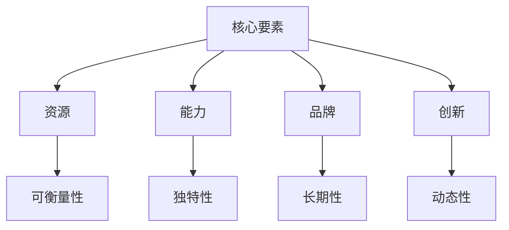
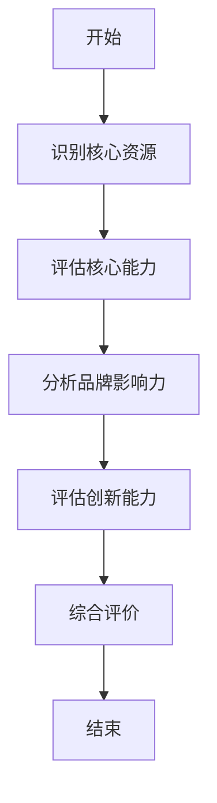
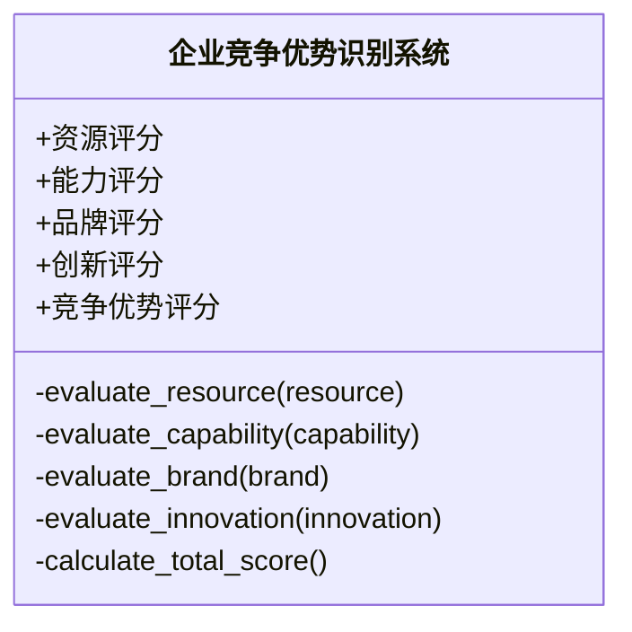
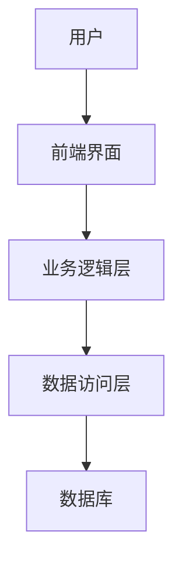
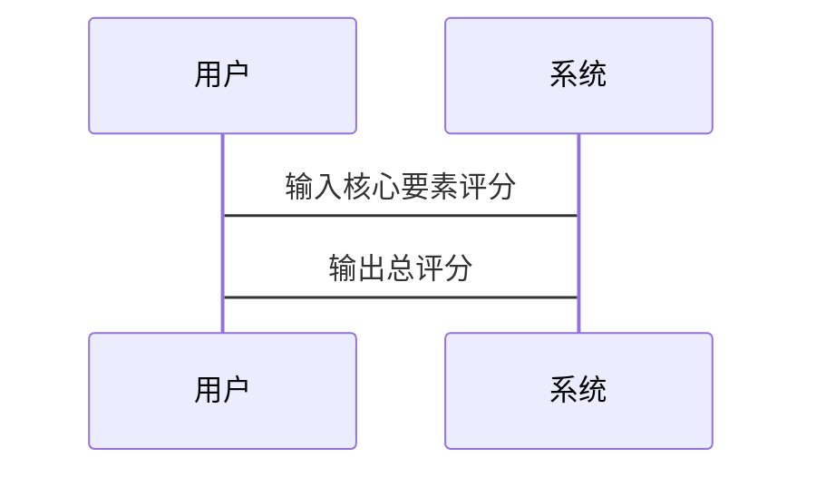

                 


# 如何识别企业的长期竞争优势

## 关键词：企业竞争优势，长期竞争优势，竞争优势识别，核心要素，竞争优势分析

## 摘要：  
本文将从企业的核心竞争力出发，系统地分析和识别企业的长期竞争优势。通过分析企业资源、能力、品牌和创新等核心要素，结合数学模型和算法，提供一套完整的竞争优势识别方法。同时，通过实际案例和系统设计，帮助读者掌握如何在实际业务中应用这些方法。

---

# 第1章: 长期竞争优势的背景与问题描述

## 1.1 企业竞争的演进历程

### 1.1.1 从短期竞争到长期竞争优势的转变
- 企业的竞争优势不再局限于短期的市场表现，而是需要关注长期的可持续发展。
- 长期竞争优势的核心在于企业的核心能力、资源和战略定位。

### 1.1.2 当前商业环境的变化对企业竞争优势的影响
- 技术进步和全球化使得市场竞争更加激烈。
- 消费者需求的变化要求企业具备更强的适应能力和创新能力。

### 1.1.3 长期竞争优势的核心要素
- 核心资源：企业的有形和无形资产。
- 核心能力：企业的核心技能和竞争力。
- 品牌影响力：企业的市场声誉和客户忠诚度。
- 创新能力：企业的技术研发和产品创新能力。

## 1.2 问题背景与问题描述

### 1.2.1 企业竞争优势的定义与分类
- 企业竞争优势是指企业在市场上相对于竞争对手的有利条件。
- 分为短期竞争优势和长期竞争优势。

### 1.2.2 当前企业竞争优势面临的挑战
- 市场竞争加剧，企业需要不断调整战略。
- 技术创新和客户需求的变化对企业提出更高要求。

### 1.2.3 长期竞争优势的重要性与必要性
- 长期竞争优势是企业持续发展的基石。
- 识别和培养长期竞争优势是企业战略管理的核心任务。

## 1.3 问题解决与边界外延

### 1.3.1 如何识别企业竞争优势的核心要素
- 通过分析企业的资源、能力和品牌影响力，识别核心竞争优势。

### 1.3.2 企业竞争优势的边界与外延
- 竞争优势的边界在于企业的核心资源和能力。
- 外延包括企业的市场定位和客户关系管理。

### 1.3.3 核心要素与竞争优势的关系
- 核心要素是竞争优势的基础，竞争优势是核心要素的外在表现。

## 1.4 概念结构与核心要素组成

### 1.4.1 核心概念的结构化分析
- 企业竞争优势由核心资源、核心能力和品牌影响力三部分组成。

### 1.4.2 核心要素的特征与属性
- 核心资源：稀缺性、不可替代性。
- 核心能力：独特性、可持续性。
- 品牌影响力：长期性、广泛性。

### 1.4.3 核心要素之间的关系与相互作用
- 核心资源是核心能力的基础。
- 核心能力是品牌影响力的核心驱动力。
- 品牌影响力反过来又增强企业的市场地位。

---

# 第2章: 核心概念与联系

## 2.1 核心概念原理

### 2.1.1 核心概念的定义与特征
- 核心资源：企业的有形资产和无形资产。
- 核心能力：企业的核心技能和竞争力。
- 品牌影响力：企业的市场声誉和客户忠诚度。
- 创新能力：企业的技术研发和产品创新能力。

### 2.1.2 核心概念的属性与特点
- 核心资源：稀缺性、不可替代性。
- 核心能力：独特性、可持续性。
- 品牌影响力：长期性、广泛性。
- 创新能力：动态性、可复制性。

### 2.1.3 核心概念的内在联系
- 核心资源是核心能力的基础。
- 核心能力是品牌影响力的核心驱动力。
- 品牌影响力反过来又增强企业的市场地位。

## 2.2 核心概念属性特征对比表格

| 核心要素 | 定义 | 特征 | 属性 |
|----------|------|------|------|
| 资源 | 企业的有形资产 | 稀缺性 | 不可替代性 |
| 能力 | 企业的核心技能 | 独特性 | 可持续性 |
| 品牌 | 企业的市场声誉 | 长期性 | 广泛性 |
| 创新 | 企业的创新能力 | 动态性 | 可复制性 |

## 2.3 ER实体关系图架构



---

# 第3章: 算法原理讲解

## 3.1 算法步骤

### 3.1.1 算法步骤说明



### 3.1.2 算法实现

```python
def identify竞争优势(resource, capability, brand, innovation):
    # 资源评估
    resource_score = evaluate_resource(resource)
    # 能力评估
    capability_score = evaluate_capability(capability)
    # 品牌评估
    brand_score = evaluate_brand(brand)
    # 创新评估
    innovation_score = evaluate_innovation(innovation)
    # 综合评价
    total_score = resource_score + capability_score + brand_score + innovation_score
    return total_score

def evaluate_resource(resource):
    # 计算资源评分
    return resource

def evaluate_capability(capability):
    # 计算能力评分
    return capability

def evaluate_brand(brand):
    # 计算品牌评分
    return brand

def evaluate_innovation(innovation):
    # 计算创新评分
    return innovation
```

### 3.1.3 数学模型与公式

$$ \text{总评分} = \text{资源评分} + \text{能力评分} + \text{品牌评分} + \text{创新评分} $$

### 3.1.4 通俗易懂的例子

例如，某企业资源评分为80，能力评分为70，品牌评分为90，创新评分为60，总评分为300。这意味着该企业在资源、品牌等方面具有较强的优势，但在能力和服务创新方面需要改进。

---

# 第4章: 数学模型与公式

## 4.1 核心公式

$$ \text{竞争优势评分} = \sum \text{各核心要素评分} $$

## 4.2 应用场景

例如，计算某企业的竞争优势评分：

$$ \text{总评分} = 80 (\text{资源}) + 70 (\text{能力}) + 90 (\text{品牌}) + 60 (\text{创新}) = 300 $$

---

# 第5章: 系统分析与架构设计方案

## 5.1 问题场景介绍

### 5.1.1 系统需求
- 需要识别企业的长期竞争优势。
- 需要对核心要素进行评分和分析。

### 5.1.2 项目介绍
- 开发一个企业竞争优势识别系统。

## 5.2 系统功能设计

### 5.2.1 领域模型



### 5.2.2 系统架构设计



### 5.2.3 系统接口设计

- 用户输入核心要素评分。
- 系统计算总评分并输出结果。

### 5.2.4 交互序列图



---

# 第6章: 项目实战

## 6.1 环境安装

- 安装Python和必要的库（如NumPy、Matplotlib）。

## 6.2 核心代码实现

```python
def calculate_total_score(resource, capability, brand, innovation):
    return resource + capability + brand + innovation

# 示例输入
resource = 80
capability = 70
brand = 90
innovation = 60

total_score = calculate_total_score(resource, capability, brand, innovation)
print(f"总评分: {total_score}")
```

## 6.3 代码解读与分析

- 代码实现了一个简单的评分计算功能。
- 用户可以输入各核心要素的评分，系统计算总评分并输出结果。

## 6.4 案例分析

- 某企业资源评分为80，能力评分为70，品牌评分为90，创新评分为60，总评分为300。
- 说明该企业在品牌方面具有优势，但在创新能力方面需要改进。

## 6.5 项目小结

通过本项目，读者可以掌握如何使用Python代码实现企业竞争优势评分的计算，并能够根据评分结果进行战略调整。

---

# 第7章: 总结与拓展阅读

## 7.1 最佳实践

- 定期评估和调整企业的核心要素。
- 加强创新能力，保持竞争优势的动态性。

## 7.2 小结

本文详细介绍了如何识别企业的长期竞争优势，并通过实际案例和系统设计展示了如何将理论应用于实践。

## 7.3 注意事项

- 竞争优势的识别需要结合企业的实际情况。
- 竞争优势的评估需要考虑市场环境的变化。

## 7.4 拓展阅读

- 《竞争优势理论》
- 《企业战略管理》
- 《创新管理》

---

通过以上目录大纲，您可以开始撰写完整的文章。每个章节的内容都需要详细展开，确保逻辑清晰、结构紧凑，语言简洁易懂。

