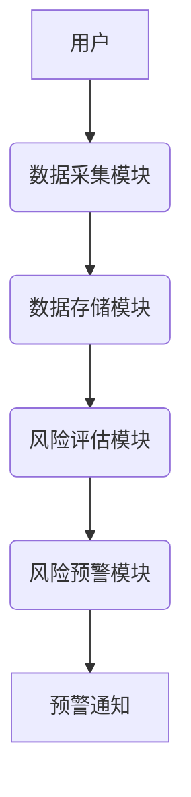
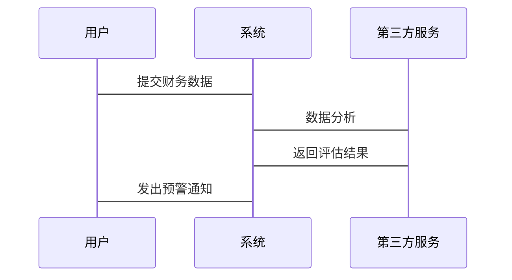

                 


# 如何识别企业的隐藏负债风险

## 关键词：企业财务风险，隐藏负债，风险评估，风险管理，财务分析，内部审计，风险预测

## 摘要：本文将深入探讨如何识别企业的隐藏负债风险，涵盖背景分析、核心概念、数学模型、系统设计和项目实战等内容，通过详细的步骤和实例分析，帮助读者掌握识别隐藏负债风险的关键方法。

## 第1章：企业隐藏负债风险的背景与问题描述

### 1.1 企业负债风险的基本概念

#### 1.1.1 负债的定义与分类
负债是指企业在过去交易或事项中形成的、预期会导致经济利益流出的现时义务。根据流动性，负债可分为流动负债和非流动负债。

- **流动负债**：如短期借款、应付账款、预收款项等，通常在一年内偿还。
- **非流动负债**：如长期借款、应付债券等，偿还期超过一年。

#### 1.1.2 隐藏负债的定义与特征
隐藏负债是指企业在财务报表中未明确列示，但可能对企业财务状况产生重大影响的潜在负债。其特征包括：

- **隐秘性**：未在财务报表中明确披露。
- **潜在性**：可能在未来触发，导致财务损失。
- **累积性**：随着时间推移逐渐积累，可能引发重大风险。

#### 1.1.3 隐藏负债对企业的影响
隐藏负债可能导致企业面临财务危机，影响信用评级，甚至引发破产。此外，隐藏负债的存在可能导致管理层决策失误，错失发展机遇。

### 1.2 隐藏负债风险的背景分析

#### 1.2.1 当前企业面临的财务风险现状
全球经济不确定性增加，企业面临复杂的内外部风险。隐藏负债风险尤为突出，涉及法律纠纷、或有负债等领域。

#### 1.2.2 隐藏负债风险的产生原因
- **管理不善**：企业未能及时识别和处理潜在负债。
- **法律环境**：法律法规变化可能导致新的或有负债。
- **业务模式**：复杂业务结构可能隐藏未记录的负债。

#### 1.2.3 隐藏负债风险的典型案例
例如，某企业因未决诉讼形成的潜在负债，导致财务状况恶化，最终影响企业信用评级。

### 1.3 识别隐藏负债风险的重要性

#### 1.3.1 保护企业财务健康的核心意义
及时识别隐藏负债，避免其对企业财务状况的冲击，确保企业稳健运营。

#### 1.3.2 风险识别在企业决策中的作用
通过识别隐藏负债，企业可以制定有效的风险管理策略，优化资本结构，提升抗风险能力。

#### 1.3.3 隐藏负债风险的早期预警机制
建立预警指标和监控体系，及时发现潜在风险，采取应对措施，将损失降到最低。

## 第2章：隐藏负债风险的核心概念与理论框架

### 2.1 隐藏负债风险的构成要素

#### 2.1.1 负债的隐性特征分析
- 隐性负债通常不在财务报表中明确反映，可能涉及或有事项，如担保、未决诉讼等。

#### 2.1.2 风险的来源与传播路径
- 来源：经营活动中产生的或有负债，如担保、债务纠纷。
- 传播路径：通过企业内部管理漏洞或外部环境变化，导致潜在负债转化为实际负债，影响企业财务健康。

#### 2.1.3 风险的量化与评估指标
- 量化指标：潜在负债的可能性、影响程度。
- 评估指标：企业信用评级、财务弹性、资本结构。

### 2.2 隐藏负债风险的识别模型

#### 2.2.1 风险识别的基本原理
通过财务数据和非财务数据的分析，识别潜在负债的存在和影响。

#### 2.2.2 基于财务数据的风险评估模型
- **模型输入**：财务报表数据，如资产负债表、利润表。
- **模型输出**：潜在负债的风险评分。

#### 2.2.3 风险识别的关键步骤与方法
1. 数据收集：收集企业财务报表、合同、法律文件等。
2. 数据分析：运用统计方法和机器学习算法识别异常。
3. 风险评估：评估潜在负债的可能性和影响。

## 第3章：隐藏负债风险的识别方法与工具

### 3.1 财务数据分析法

#### 3.1.1 财务报表分析的基本方法
- 比较分析：通过比较不同期间的财务数据，识别异常。
- 趋势分析：分析财务数据的变化趋势，预测潜在风险。

#### 3.1.2 隐藏负债的识别指标与阈值
- 指标：如应收账款增长率、应付账款异常变动。
- 阈值：设定合理的警戒线，判断是否超出正常范围。

#### 3.1.3 数据分析工具的选择与应用
- 工具：如Excel、Python（pandas库）。
- 应用：数据清洗、特征提取、风险评分计算。

### 3.2 内部审计与合规检查

#### 3.2.1 内部审计的核心流程
- 审计计划制定：明确审计目标、范围和方法。
- 审计实施：收集证据，识别潜在问题。
- 审计报告：提出改进建议。

#### 3.2.2 合规检查的关键点与注意事项
- 检查合同：识别可能的或有负债。
- 审查法律文件：识别潜在诉讼风险。
- 注意事项：保持独立性，确保审计结果客观公正。

#### 3.2.3 审计工具与技术的应用
- 工具：如审计软件、数据分析工具。
- 技术：如大数据分析、人工智能辅助审计。

### 3.3 行为分析与异常检测

#### 3.3.1 基于交易数据的行为分析
- 交易行为：识别异常交易模式。
- 模型：如序列分析、关联规则挖掘。

#### 3.3.2 异常交易的识别方法
- 统计方法：如Z-score模型。
- 机器学习：如孤立森林算法。

#### 3.3.3 数据挖掘技术在风险识别中的应用
- 数据预处理：清洗、特征选择。
- 模型训练：分类、聚类。
- 结果分析：识别异常交易，评估风险。

## 第4章：隐藏负债风险的数学模型与算法原理

### 4.1 风险评估的数学模型

#### 4.1.1 线性回归模型在风险评估中的应用
- 模型：多元线性回归。
- 应用：预测潜在负债的可能性。

#### 4.1.2 风险评分模型的构建与优化
- 构建：基于财务指标的加权评分模型。
- 优化：使用梯度下降优化模型参数。

#### 4.1.3 贝叶斯网络在风险识别中的应用
- 结构：贝叶斯网络用于表示变量之间的关系。
- 应用：计算潜在负债的后验概率。

### 4.2 异常检测算法

#### 4.2.1 基于统计的异常检测方法
- 方法：如Z-score、箱线图。
- 应用：识别财务数据中的异常值。

#### 4.2.2 基于机器学习的异常检测算法
- 算法：如孤立森林、自动编码器。
- 应用：检测隐藏负债的异常交易模式。

#### 4.2.3 随机森林与支持向量机在风险识别中的应用
- 随机森林：用于分类，识别潜在负债。
- 支持向量机：用于分类，预测潜在负债的可能性。

### 4.3 风险预测的数学公式与实现

#### 4.3.1 风险概率计算公式
$$ P(\text{潜在负债}) = \beta_0 + \beta_1 X_1 + \beta_2 X_2 + \dots + \beta_n X_n $$

#### 4.3.2 风险影响程度的量化公式
$$ I = \sum_{i=1}^{n} w_i \times R_i $$

#### 4.3.3 风险预测的数学模型实现
- 数据预处理：标准化、归一化。
- 模型训练：使用训练数据拟合模型。
- 模型评估：验证准确率、召回率。

## 第5章：系统设计与架构方案

### 5.1 系统功能设计

#### 5.1.1 风险数据采集模块
- 功能：采集企业财务数据、合同、法律文件。
- 设计：通过API接口获取数据，支持多种数据格式。

#### 5.1.2 风险评估模块
- 功能：基于模型评估潜在负债风险。
- 设计：使用机器学习模型进行实时评估。

#### 5.1.3 风险预警模块
- 功能：设定预警阈值，及时发出预警。
- 设计：通过邮件、短信通知相关人员。

### 5.2 系统架构设计

#### 5.2.1 系统架构图


#### 5.2.2 系统接口设计
- 数据接口：RESTful API，支持GET、POST请求。
- 预警接口：通过API发送预警通知。

#### 5.2.3 系统交互流程图


## 第6章：项目实战

### 6.1 环境安装

```bash
pip install pandas scikit-learn mermaid4j
```

### 6.2 系统核心实现源代码

#### 6.2.1 数据预处理代码
```python
import pandas as pd

# 读取数据
df = pd.read_csv('负债数据.csv')

# 数据清洗
df.dropna(inplace=True)
df['行业'] = df['行业'].astype('category')
```

#### 6.2.2 模型训练代码
```python
from sklearn.ensemble import IsolationForest

# 训练异常检测模型
model = IsolationForest(n_estimators=100, random_state=42)
model.fit(df[['收入', '支出']])

# 预测异常值
outliers = model.predict_outliers(df[['收入', '支出']])
```

### 6.3 代码应用解读与分析

#### 6.3.1 数据预处理解读
- 读取数据：从CSV文件中读取负债相关数据。
- 数据清洗：删除缺失值，确保数据完整性。
- 数据转换：将分类变量转换为类别类型，便于模型处理。

#### 6.3.2 模型训练解读
- 异常检测：使用孤立森林算法识别异常交易，发现潜在负债。
- 模型预测：预测异常值，标记潜在负债。

### 6.4 实际案例分析与详细讲解

#### 6.4.1 案例背景
某制造企业存在大量应收账款，但财务报表显示利润增长。通过数据分析发现，存在大量未记录的应付账款，导致潜在负债风险。

#### 6.4.2 数据分析步骤
1. 数据清洗与预处理。
2. 应用孤立森林算法识别异常应付账款。
3. 评估潜在负债风险，制定应对策略。

#### 6.4.3 风险评估与应对
- 评估结果：潜在负债金额较高，可能影响企业信用评级。
- 应对措施：协商还款计划，优化资本结构，加强内部管理。

### 6.5 项目小结

- 项目目标：识别隐藏负债风险，优化企业财务管理。
- 项目成果：开发了一套基于机器学习的隐藏负债风险识别系统，提高了风险识别效率。
- 经验总结：数据质量、模型选择、持续监控是项目成功的关键。

## 第7章：最佳实践与注意事项

### 7.1 最佳实践

#### 7.1.1 数据质量管理
- 确保数据准确性、完整性和一致性。
- 定期更新数据，反映企业最新财务状况。

#### 7.1.2 模型选择与优化
- 根据企业特点选择合适的算法。
- 定期验证模型性能，优化参数。

#### 7.1.3 持续监控
- 建立持续监控机制，实时识别潜在负债。
- 定期进行风险评估，及时调整风险管理策略。

### 7.2 小结

通过本文的系统分析和项目实战，读者可以掌握隐藏负债风险的识别方法，构建有效的风险识别系统，提升企业的财务风险管理能力。

### 7.3 注意事项

- **数据隐私**：处理企业数据时，需遵守相关法律法规，保护数据隐私。
- **模型局限性**：机器学习模型可能存在过拟合等问题，需谨慎选择和优化。
- **持续学习**：财务环境和法规不断变化，需持续学习和更新知识。

### 7.4 拓展阅读

- **书籍推荐**：《财务报表分析与企业价值评估》。
- **在线课程**：Coursera上的《风险管理与金融工程》。
- **工具推荐**：Tableau、Power BI用于数据可视化。

## 总结

识别企业的隐藏负债风险是一项复杂但至关重要的任务。通过本文的系统讲解和实战案例，读者可以掌握相关知识和技能，构建有效的风险识别系统，为企业稳健发展保驾护航。

