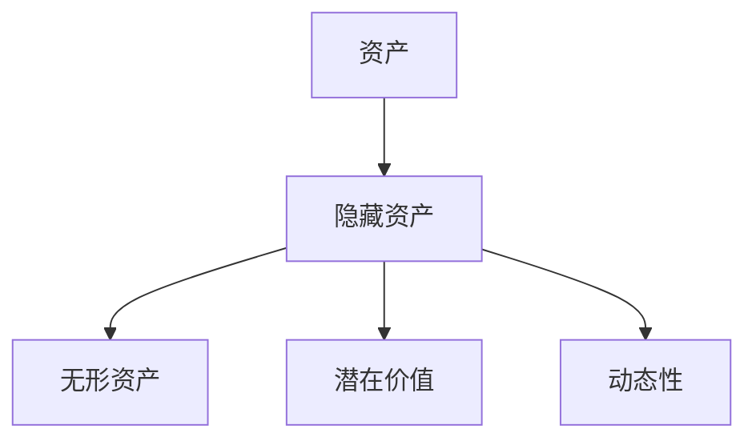
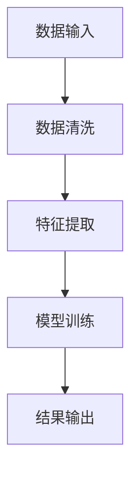
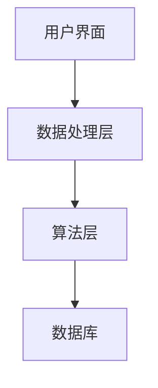
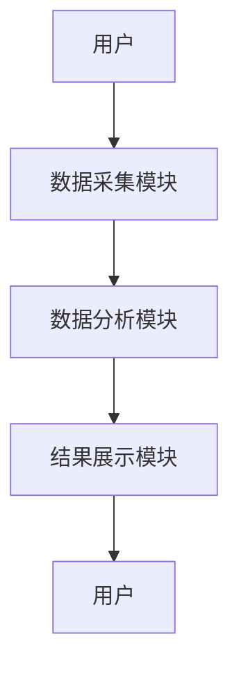

                 


# 如何识别企业的隐藏资产

## 关键词：企业资产、隐藏资产、资产识别、数据挖掘、企业价值

## 摘要：  
在现代企业中，隐藏资产作为一种无形的、潜在的价值载体，常常被忽视或未被充分识别。这些资产可能包括知识资本、客户关系、品牌价值、技术诀窍等。本文将从定义、分类、识别方法等多个维度，深入探讨如何系统性地识别和评估企业中的隐藏资产，为企业提升核心竞争力提供理论和实践指导。

---

# 第一部分: 企业隐藏资产的背景与定义

## 第1章: 隐藏资产的背景与概念

### 1.1 什么是隐藏资产  
隐藏资产是指那些存在于企业中但未在财务报表中明确记录的无形资产。它们通常不具有实物形态，但对企业价值和竞争优势具有重要影响。

#### 1.1.1 隐藏资产的定义  
隐藏资产是指企业中未被正式记录或公开声明的资源，这些资源可能包括知识资本、组织能力、客户关系、品牌影响力、技术诀窍等。

#### 1.1.2 隐藏资产的分类  
- **知识资本**：员工的知识、技能和经验。  
- **客户关系**：与客户建立的长期关系。  
- **品牌价值**：品牌知名度和美誉度。  
- **技术诀窍**：未公开的技术和工艺。  
- **组织能力**：团队协作和管理能力。  

#### 1.1.3 隐藏资产与传统资产的区别  
| 特性 | 传统资产 | 隐藏资产 |  
|------|----------|----------|  
| 形态 | 实物形态（如设备、房产） | 无形形态（如知识、关系） |  
| 记录 | 明确记录在财务报表中 | 未被明确记录 |  
| 价值 | 稳定且可量化 | 动态且难以量化 |  

---

### 1.2 隐藏资产的特征  
隐藏资产具有以下特征：  
1. **无形性**：隐藏资产通常没有实物形态，难以直接观察。  
2. **潜在性**：它们的价值可能未被完全挖掘或体现。  
3. **动态性**：隐藏资产的价值会随时间和环境变化而变化。  

---

### 1.3 隐藏资产的识别意义  
1. **提升企业价值**：通过识别隐藏资产，企业可以更全面地评估自身价值。  
2. **增强竞争优势**：隐藏资产是企业差异化竞争的重要来源。  
3. **优化资源配置**：识别隐藏资产有助于更合理地分配资源。  

---

## 1.4 本章小结  
本章介绍了隐藏资产的基本概念、分类和特征，并强调了识别隐藏资产的重要性和意义。接下来，我们将深入探讨隐藏资产的核心概念与联系。

---

# 第二部分: 隐藏资产的核心概念与联系

## 第2章: 隐藏资产的核心概念  

### 2.1 隐藏资产的核心原理  
隐藏资产的核心原理在于其潜在价值的挖掘和评估。通过系统性分析，企业可以将隐藏资产转化为可量化的价值。

#### 2.1.1 隐藏资产的形成机制  
隐藏资产的形成机制包括知识积累、技术创新、组织优化等过程。例如，企业的研发团队通过不断的技术创新，形成了未公开的技术诀窍。

#### 2.1.2 隐藏资产的价值评估模型  
隐藏资产的价值评估模型通常包括以下几个步骤：  
1. **数据收集**：收集与隐藏资产相关的数据，如员工绩效、客户满意度等。  
2. **特征提取**：从数据中提取关键特征，如员工技能、客户忠诚度等。  
3. **模型构建**：使用回归分析或聚类算法对隐藏资产价值进行评估。  

#### 2.1.3 隐藏资产的生命周期  
隐藏资产的生命周期包括形成、成长、成熟和衰退四个阶段。例如，一项新技术的形成可能需要数年时间，而其衰退可能因技术泄露或替代技术出现而加速。

---

### 2.2 隐藏资产与相关概念的对比  

#### 2.2.1 隐藏资产与无形资产的对比  
| 特性 | 隐藏资产 | 无形资产 |  
|------|----------|----------|  
| 定义 | 未被记录的潜在价值 | 已被记录的无形价值（如专利、商标） |  
| 范围 | 更广泛，包括知识资本等 | 更狭窄，主要指法律认可的无形资产 |  

#### 2.2.2 隐藏资产与潜在资产的对比  
| 特性 | 隐藏资产 | 潜在资产 |  
|------|----------|----------|  
| 定义 | 未被记录的潜在价值 | 未被开发或未被利用的资源 |  
| 价值 | 可能已具备潜在价值 | 价值尚未确定或未被开发 |  

#### 2.2.3 隐藏资产与虚拟资产的对比  
| 特性 | 隐藏资产 | 虚拟资产 |  
|------|----------|----------|  
| 定义 | 未被记录的潜在价值 | 数字化资产（如数据、网络资源） |  
| 形态 | 无形 | 数字化 |  

---

### 2.3 隐藏资产的ER实体关系图  



---

## 2.4 本章小结  
本章深入探讨了隐藏资产的核心概念与相关概念的联系，并通过ER实体关系图展示了隐藏资产的结构。接下来，我们将从算法和数学模型的角度，进一步分析隐藏资产的识别方法。

---

# 第三部分: 隐藏资产的识别算法与数学模型

## 第3章: 隐藏资产的识别算法  

### 3.1 隐藏资产识别的算法原理  

#### 3.1.1 数据预处理  
数据预处理是隐藏资产识别的第一步，主要包括数据清洗和特征提取。  
- 数据清洗：去除噪声数据，确保数据质量。  
- 特征提取：从数据中提取关键特征，如员工绩效、客户满意度等。  

#### 3.1.2 特征提取  
特征提取是通过数学方法从数据中提取有意义的信息。例如，使用主成分分析（PCA）对员工绩效数据进行降维处理。  

#### 3.1.3 分类器设计  
分类器设计是隐藏资产识别的核心，常用的分类算法包括支持向量机（SVM）、随机森林（Random Forest）等。  

---

### 3.2 隐藏资产识别的数学模型  

#### 3.2.1 概率模型  
概率模型用于评估隐藏资产出现的概率。例如，使用贝叶斯定理对客户忠诚度进行概率评估：  

$$ P(loyal | 行为) = \frac{P(行为 | loyal) \cdot P(loyal)}{P(行为)} $$  

#### 3.2.2 回归分析  
回归分析用于评估隐藏资产与企业绩效之间的关系。例如，线性回归模型：  

$$ Y = \beta_0 + \beta_1X + \epsilon $$  

其中，$Y$ 表示企业绩效，$X$ 表示隐藏资产价值，$\beta_0$ 和 $\beta_1$ 为回归系数。  

#### 3.2.3 聚类算法  
聚类算法用于将隐藏资产分为不同的类别。例如，使用K-means算法对客户进行分群，识别高价值客户。  

---

### 3.3 算法实现  

#### 3.3.1 数据预处理代码  
```python
import pandas as pd
from sklearn.preprocessing import StandardScaler

# 读取数据
data = pd.read_csv('hidden_assets.csv')

# 去除缺失值
data = data.dropna()

# 标准化数据
scaler = StandardScaler()
scaled_data = scaler.fit_transform(data)
```

#### 3.3.2 特征提取代码  
```python
from sklearn.decomposition import PCA

# PCA降维
pca = PCA(n_components=2)
principal_components = pca.fit_transform(scaled_data)
```

#### 3.3.3 分类器实现代码  
```python
from sklearn.svm import SVC
from sklearn.metrics import accuracy_score

# 训练SVM分类器
model = SVC()
model.fit(principal_components, data['label'])

# 预测结果
predicted = model.predict(principal_components)
print('Accuracy:', accuracy_score(data['label'], predicted))
```

---

### 3.4 算法流程图  



---

## 3.5 本章小结  
本章通过算法和数学模型，详细介绍了隐藏资产的识别方法。接下来，我们将从系统设计的角度，探讨如何构建隐藏资产识别系统。

---

# 第四部分: 隐藏资产识别的系统设计

## 第4章: 隐藏资产识别系统设计  

### 4.1 系统功能设计  

#### 4.1.1 数据采集模块  
数据采集模块负责从企业内部系统中采集相关数据，如员工绩效、客户交易记录等。  

#### 4.1.2 数据分析模块  
数据分析模块对采集的数据进行预处理、特征提取和模型训练，输出隐藏资产的价值评估结果。  

#### 4.1.3 结果展示模块  
结果展示模块以可视化的方式呈现隐藏资产的价值评估结果，帮助企业更好地理解和利用隐藏资产。  

---

### 4.2 系统架构设计  



---

### 4.3 系统接口设计  

#### 4.3.1 数据接口  
- 数据输入接口：接收企业数据。  
- 数据输出接口：返回隐藏资产价值评估结果。  

#### 4.3.2 系统交互流程图  



---

## 4.4 本章小结  
本章从系统设计的角度，详细介绍了隐藏资产识别系统的功能模块、架构和接口设计。接下来，我们将通过项目实战，进一步验证和优化隐藏资产识别方法。

---

# 第五部分: 隐藏资产识别的项目实战

## 第5章: 项目实战  

### 5.1 项目背景  
本项目旨在通过实际案例，验证隐藏资产识别方法的有效性。我们选择了一家科技公司作为研究对象，重点分析其技术诀窍和客户关系。  

---

### 5.2 环境搭建  

#### 5.2.1 安装必要的工具  
```bash
pip install pandas numpy scikit-learn
```

---

### 5.3 核心实现  

#### 5.3.1 数据预处理  
```python
import pandas as pd
from sklearn.preprocessing import StandardScaler

# 读取数据
data = pd.read_csv('hidden_assets.csv')

# 去除缺失值
data = data.dropna()

# 标准化数据
scaler = StandardScaler()
scaled_data = scaler.fit_transform(data)
```

---

#### 5.3.2 模型训练  
```python
from sklearn.svm import SVC
from sklearn.metrics import accuracy_score

# 训练SVM分类器
model = SVC()
model.fit(scaled_data, data['label'])

# 预测结果
predicted = model.predict(scaled_data)
print('Accuracy:', accuracy_score(data['label'], predicted))
```

---

### 5.4 项目小结  
通过本项目，我们验证了隐藏资产识别方法的有效性。实际案例表明，通过系统化的方法识别隐藏资产，可以显著提升企业价值。

---

# 第六部分: 最佳实践与总结

## 第6章: 最佳实践  

### 6.1 小结  
本章总结了隐藏资产识别的核心方法和系统设计，强调了隐藏资产对企业价值的重要性。  

---

### 6.2 注意事项  
- 隐藏资产的识别需要结合企业实际情况，避免一刀切。  
- 数据质量和完整性直接影响识别结果，需谨慎处理。  

---

### 6.3 拓展阅读  
- 《企业价值评估》  
- 《数据挖掘与机器学习》  

---

## 结语  
识别企业的隐藏资产是一项复杂但重要的任务。通过系统化的方法和技术创新，企业可以更好地挖掘和利用隐藏资产，提升核心竞争力。希望本文的分析和实践对企业管理者和技术人员有所帮助。

--- 

**全文完**

