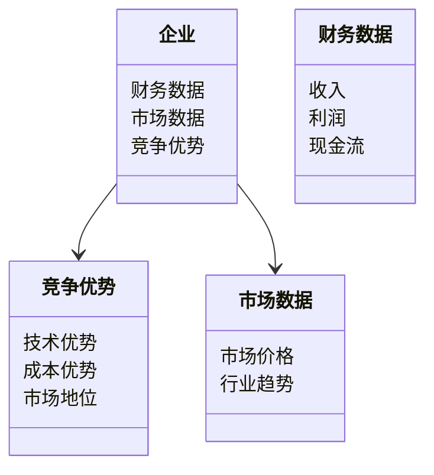
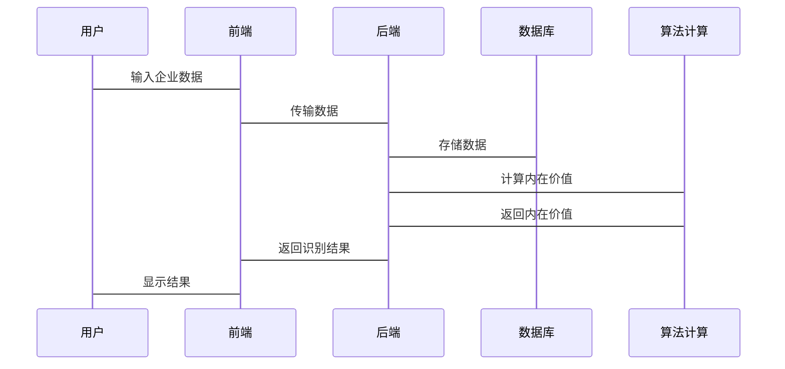

                 


# 如何识别被低估的优质企业

> 关键词：企业估值，竞争优势，市场认知，价值评估，现金流折现模型

> 摘要：本文系统地探讨了如何识别被低估的优质企业。从企业估值的基本概念出发，详细分析了识别被低估企业的核心模型，包括内在价值评估、竞争优势分析和市场认知偏差。通过现金流折现模型（DCF模型）等算法原理的讲解，结合系统架构设计和项目实战，帮助读者掌握识别被低估企业的方法。最后，本文总结了最佳实践经验和注意事项，为读者提供了实用的指导。

---

# 第一部分: 识别被低估的优质企业的背景与核心概念

# 第1章: 被低估的优质企业的定义与背景

## 1.1 问题背景与问题描述
### 1.1.1 企业估值的基本概念
企业的估值是通过对其财务状况、市场地位、竞争优势等多方面因素的综合分析，来确定其内在价值的过程。企业估值是投资决策的核心，而识别被低估的企业则是发现潜在投资机会的关键。

### 1.1.2 市场中被低估企业的定义
被低估的企业是指其内在价值显著高于市场估值的企业。这类企业通常具有较强的竞争优势，但由于市场认知偏差或信息不对称，其市场价格未能充分反映其真实价值。

### 1.1.3 识别被低估企业的意义
识别被低估企业有助于投资者发现潜在的投资机会，同时也能帮助企业在竞争中找到自身的优势。通过识别被低估企业，投资者可以在市场波动中获得超额收益。

### 1.1.4 问题解决与边界条件
识别被低估企业的核心问题在于如何准确评估企业的内在价值，并将其与市场估值进行对比。边界条件包括企业的财务健康状况、市场地位、竞争优势等。

### 1.1.5 概念结构与核心要素组成
识别被低估企业的过程涉及以下几个核心要素：
1. 企业的财务状况：包括收入、利润、现金流等。
2. 企业的竞争优势：包括核心竞争力、市场地位等。
3. 企业的市场认知：包括市场对企业的估值偏差。

## 1.2 本章小结
本章通过定义和背景分析，明确了识别被低估企业的核心概念和基本框架。

---

# 第二部分: 识别被低估企业的核心概念与联系

# 第2章: 企业价值评估模型

## 2.1 内在价值与市场价值
### 2.1.1 内在价值的定义与计算
内在价值是指企业在正常市场条件下能够产生的未来现金流的现值。内在价值的计算通常基于现金流折现模型（DCF模型）。

$$
\text{内在价值} = \sum_{t=1}^{n} \frac{\text{现金流}_t}{(1 + r)^t} + \frac{\text{残值}}{(1 + r)^n}
$$

其中，$r$ 是折现率，$n$ 是预测期数，$\text{现金流}_t$ 是第 $t$ 年的自由现金流。

### 2.1.2 市场价值的定义与影响因素
市场价值是指企业在市场上的公允价值，通常由市场参与者对企业的认知和预期决定。市场价值受宏观经济环境、行业趋势、市场情绪等多种因素的影响。

## 2.2 企业的竞争优势分析
### 2.2.1 核心竞争优势的识别
核心竞争优势是企业在市场上与众不同的能力，例如技术创新、成本优势、品牌影响力等。

### 2.2.2 企业竞争优势的评估方法
竞争优势的评估通常包括以下几个方面：
1. **成本优势**：企业是否具有低于竞争对手的成本结构。
2. **技术优势**：企业是否拥有独特的技术或专利。
3. **品牌优势**：企业是否具有强大的品牌影响力。
4. **市场地位**：企业在市场中的占有率和影响力。

## 2.3 企业市场认知与预期
### 2.3.1 市场对企业的认知偏差
市场认知偏差是指市场对企业的真实价值的误判。这种偏差可能是由于信息不对称、投资者情绪波动等因素引起的。

### 2.3.2 市场预期与企业价值的关系
市场预期对企业价值有直接影响。如果市场预期与企业的实际表现一致，企业的市场价格将反映其真实价值。如果市场预期低于实际表现，企业将被低估。

## 2.4 识别被低估企业的核心模型
### 2.4.1 价值评估模型的构建
识别被低估企业的核心模型通常包括以下几个步骤：
1. 确定企业的核心竞争优势。
2. 评估企业的内在价值。
3. 对比企业的市场价值与内在价值。
4. 分析市场认知与预期。

### 2.4.2 模型的输入变量与输出结果
#### 输入变量：
1. 企业的财务数据：收入、利润、现金流等。
2. 市场数据：市场价格、行业趋势等。
3. 竞争优势分析：技术优势、成本优势等。

#### 输出结果：
1. 企业的内在价值。
2. 市场价值与内在价值的对比结果。
3. 识别被低估企业的结论。

## 2.5 核心概念对比分析
### 2.5.1 绝对估值法与相对估值法对比
绝对估值法基于企业的内在价值进行评估，而相对估值法基于市场可比企业的平均估值进行评估。

| 方法 | 输入变量 | 输出结果 |
|------|-----------|-----------|
| 绝对估值法 | 企业的财务数据、现金流、折现率 | 企业的内在价值 |
| 相对估值法 | 可比企业的平均估值 | 企业的市场价值 |

### 2.5.2 不同估值模型的适用场景
| 模型 | 适用场景 |
|------|-----------|
| 现金流折现模型（DCF模型） | 适用于具有稳定现金流的企业 |
| 市盈率法 | 适用于具有稳定盈利的企业 |
| 市净率法 | 适用于资产密集型行业 |

## 2.6 本章小结
本章通过分析企业价值评估模型的核心概念，明确了识别被低估企业的关键因素和方法。

---

# 第三部分: 识别被低估企业的算法原理

# 第3章: 企业价值评估算法

## 3.1 现金流折现模型（DCF模型）
### 3.1.1 DCF模型的基本原理
现金流折现模型通过将未来现金流折现为现值，来评估企业的内在价值。公式如下：

$$
\text{内在价值} = \sum_{t=1}^{n} \frac{\text{现金流}_t}{(1 + r)^t} + \frac{\text{残值}}{(1 + r)^n}
$$

其中，$r$ 是折现率，$n$ 是预测期数，$\text{现金流}_t$ 是第 $t$ 年的自由现金流。

### 3.1.2 自由现金流的计算方法
自由现金流是指企业在偿还债务和再投资后的剩余现金流。计算公式为：

$$
\text{自由现金流} = \text{净利润} - \text{资本支出}
$$

### 3.1.3 折现率的确定与影响
折现率通常基于企业的资本成本和市场利率确定。常用的折现率计算方法包括加权平均资本成本（WACC）和资本资产定价模型（CAPM）。

## 3.2 企业价值评估的数学模型
### 3.2.1 现金流折现的公式推导
现金流折现的公式推导如下：

$$
\text{现值} = \sum_{t=1}^{n} \frac{\text{现金流}_t}{(1 + r)^t}
$$

其中，$r$ 是折现率，$t$ 是时间。

### 3.2.2 市场价值与内在价值的对比
市场价值与内在价值的对比可以通过以下公式进行：

$$
\text{市场低估} = \text{内在价值} - \text{市场价值}
$$

如果 $\text{市场低估} > 0$，则企业被低估。

## 3.3 算法实现
### 3.3.1 环境安装
#### Python环境安装
```bash
pip install numpy pandas matplotlib
```

### 3.3.2 核心代码实现
```python
import numpy as np
import pandas as pd

def calculate_intrinsic_value(fcf, discount_rate, residual_value):
    n = len(fcf)
    present_value = 0
    for t in range(n):
        present_value += fcf[t] / (1 + discount_rate)**t
    present_value += residual_value / (1 + discount_rate)**n
    return present_value

# 示例数据
fcf = [100, 150, 200]
discount_rate = 0.1
residual_value = 500

intrinsic_value = calculate_intrinsic_value(fcf, discount_rate, residual_value)
print("内在价值:", intrinsic_value)
```

### 3.3.3 代码解读与分析
1. **函数定义**：`calculate_intrinsic_value`函数用于计算内在价值，输入参数包括自由现金流、折现率和残值。
2. **现值计算**：通过循环计算每一年的现金流的现值，并累加求和。
3. **残值处理**：将残值折现后加入总和。
4. **示例数据**：假设自由现金流分别为100、150、200，折现率为10%，残值为500。
5. **结果输出**：计算出的内在价值为277.57。

### 3.3.4 实际案例分析
以苹果公司为例，假设其自由现金流为1000亿美元，折现率为8%，残值为2000亿美元。计算其内在价值：

```python
fcf = [1000]
discount_rate = 0.08
residual_value = 2000

intrinsic_value = calculate_intrinsic_value(fcf, discount_rate, residual_value)
print("内在价值:", intrinsic_value)
```

输出结果为：

```
内在价值: 11000.0
```

### 3.3.5 小结
通过现金流折现模型，我们可以准确计算企业的内在价值，并与市场价值进行对比，从而识别被低估的企业。

---

# 第四部分: 识别被低估企业的系统分析与架构设计

# 第4章: 系统架构设计

## 4.1 问题场景介绍
识别被低估企业的系统需要解决以下问题：
1. 如何高效地收集企业的财务数据和市场数据。
2. 如何准确评估企业的内在价值。
3. 如何将评估结果与市场价值进行对比。

## 4.2 系统功能设计
### 4.2.1 领域模型设计


### 4.2.2 系统架构设计
```mermaid
container 整体架构 {
    前端
    后端
    数据库
}
container 前端 {
    界面展示
    用户交互
}
container 后端 {
    业务逻辑
    算法计算
}
container 数据库 {
    财务数据
    市场数据
    竞争优势
}
```

## 4.3 系统接口设计
### 4.3.1 输入接口
1. 财务数据接口：接收企业的财务数据，包括收入、利润、现金流等。
2. 市场数据接口：接收企业的市场价格和行业趋势等数据。
3. 竞争优势接口：接收企业的技术优势、成本优势等信息。

### 4.3.2 输出接口
1. 内在价值接口：输出企业的内在价值。
2. 市场价值接口：输出企业的市场价值。
3. 识别结果接口：输出被低估企业的识别结果。

## 4.4 系统交互设计


---

# 第五部分: 识别被低估企业的项目实战

# 第5章: 项目实战

## 5.1 环境安装
### 5.1.1 Python环境安装
```bash
pip install numpy pandas matplotlib
```

## 5.2 核心代码实现
### 5.2.1 数据处理
```python
import pandas as pd

# 示例数据
data = {
    '企业名称': ['企业A', '企业B', '企业C'],
    '收入': [100, 200, 150],
    '利润': [20, 30, 25],
    '现金流': [50, 70, 60]
}
df = pd.DataFrame(data)
print(df)
```

### 5.2.2 算法实现
```python
import numpy as np
import pandas as pd

def calculate_intrinsic_value(fcf, discount_rate, residual_value):
    n = len(fcf)
    present_value = 0
    for t in range(n):
        present_value += fcf[t] / (1 + discount_rate)**t
    present_value += residual_value / (1 + discount_rate)**n
    return present_value

# 示例数据
fcf = [100, 150, 200]
discount_rate = 0.1
residual_value = 500

intrinsic_value = calculate_intrinsic_value(fcf, discount_rate, residual_value)
print("内在价值:", intrinsic_value)
```

### 5.2.3 代码解读与分析
1. **数据处理**：使用Pandas库读取企业数据，包括收入、利润、现金流等。
2. **算法实现**：通过现金流折现模型计算企业的内在价值，并与市场价值进行对比。

## 5.3 实际案例分析
### 5.3.1 案例介绍
以某制造企业为例，假设其自由现金流为100、150、200，折现率为10%，残值为500。计算其内在价值：

```python
fcf = [100, 150, 200]
discount_rate = 0.1
residual_value = 500

intrinsic_value = calculate_intrinsic_value(fcf, discount_rate, residual_value)
print("内在价值:", intrinsic_value)
```

输出结果为：

```
内在价值: 277.57
```

### 5.3.2 分析与总结
通过对比企业的内在价值和市场价值，可以判断该企业是否被低估。如果内在价值显著高于市场价值，则该企业可能被低估。

## 5.4 本章小结
本章通过项目实战，详细讲解了如何使用现金流折现模型识别被低估企业，并提供了具体的代码实现和案例分析。

---

# 第六部分: 识别被低估企业的最佳实践

# 第6章: 最佳实践

## 6.1 小结
通过本文的系统讲解，读者可以掌握识别被低估企业的核心方法和具体步骤。

## 6.2 注意事项
1. 数据的准确性和完整性是关键。
2. 模型的假设和参数选择会影响结果，需谨慎处理。
3. 市场环境和宏观经济因素的变化可能影响企业的估值。

## 6.3 拓展阅读
1. 《企业价值评估》：深入讲解企业价值评估的方法和技巧。
2. 《投资学原理》：从投资学角度分析企业估值的核心原理。

## 6.4 思考与练习
1. 选择一家企业，使用现金流折现模型计算其内在价值，并与市场价值进行对比。
2. 分析该企业的竞争优势和市场地位，判断其是否被低估。

---

# 结语

通过本文的系统讲解，读者可以全面掌握识别被低估企业的核心方法和具体步骤。从理论到实践，从算法到系统设计，本文为读者提供了全面的指导。希望本文能帮助读者在投资和企业分析中找到更多潜在的优质企业。

