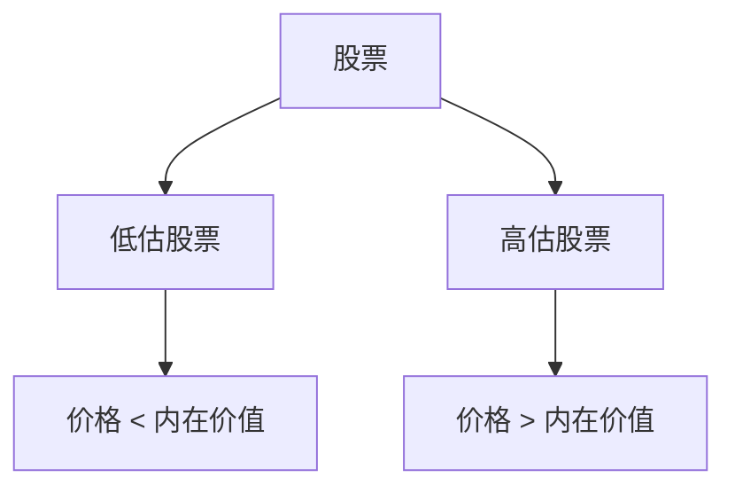
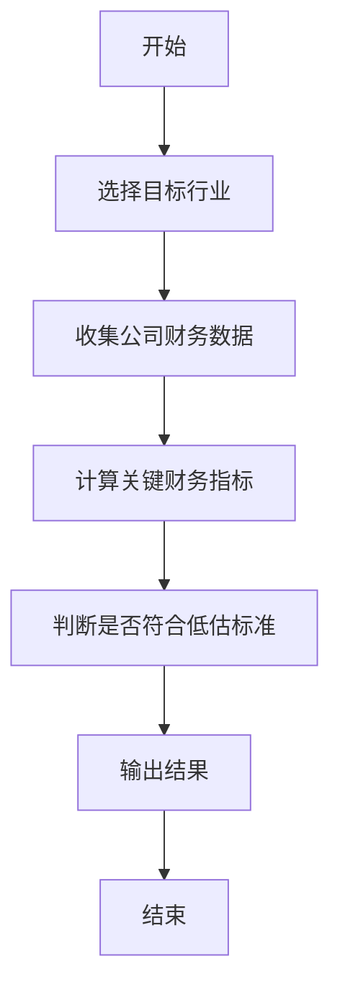
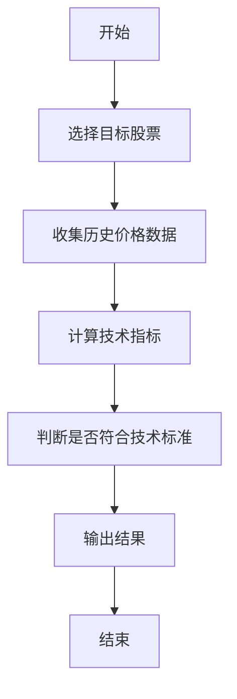

                 


# 如何识别被低估的股票

> 关键词：低估股票、股票分析、基本面分析、技术分析、投资策略

> 摘要：本文将详细介绍如何识别被低估的股票，从基本概念到数学模型，从系统设计到项目实战，全面解析识别被低估股票的方法和技巧。文章将引导读者从理论到实践，掌握如何利用基本面分析、技术分析等方法，结合数学模型和系统架构，构建有效的识别系统。

---

# 第一部分: 股票市场与低估股票概述

## 第1章: 什么是低估股票

### 1.1 股票市场的基本概念

#### 1.1.1 股票市场的定义与分类

股票市场是投资者进行股票交易的场所，分为一级市场和二级市场。一级市场是新股票发行的市场，二级市场是已发行股票交易的市场。股票市场的参与者包括投资者、公司、券商、监管机构等。股票价格受多种因素影响，包括公司业绩、市场情绪、宏观经济环境等。

#### 1.1.2 股票价格的波动机制

股票价格的波动由市场供需关系决定，同时也受公司基本面、行业趋势、宏观经济政策等因素影响。股票市场的波动性是投资者需要考虑的重要因素之一。

#### 1.1.3 股票市场的参与者与交易机制

股票市场的参与者包括个人投资者、机构投资者、券商、交易所等。交易机制包括竞价交易、撮合交易等，投资者通过委托券商进行买卖操作。

### 1.2 低估股票的定义与特征

#### 1.2.1 低估股票的定义

低估股票是指市场价格低于其内在价值的股票。通常，这类股票被认为具有较大的增长潜力，因为它们的价格被市场低估，存在较大的上涨空间。

#### 1.2.2 低估股票的核心特征对比表

| 特征               | 低估股票                | 高估股票                |
|--------------------|-------------------------|-------------------------|
| 市盈率（P/E）      | 低于行业平均水平        | 高于行业平均水平        |
| 市净率（P/B）      | 低于行业平均水平        | 高于行业平均水平        |
| 股东权益收益率（ROE）| 高于行业平均水平        | 低于行业平均水平        |
| 盈利能力           | 强劲，净利润率高          | 盈利能力较弱            |
| 市场情绪           | 投资者信心不足，交量低     | 投资者信心充足，交量高    |

#### 1.2.3 低估股票与其他类型股票的实体关系图



## 第2章: 识别低估股票的意义与方法

### 2.1 识别低估股票的重要性

#### 2.1.1 低估股票的投资价值

低估股票通常具有较高的安全边际，即市场价格远低于其内在价值。这种股票在市场回升时有较大的上涨空间，为投资者提供了较高的收益潜力。

#### 2.1.2 识别低估股票的经济意义

通过识别低估股票，投资者可以在市场低迷时期发现价值，避免盲目投资。同时，识别低估股票也有助于优化投资组合，降低风险。

#### 2.1.3 投资者如何通过低估股票实现收益最大化

投资者可以通过长期持有低估股票，等待市场重新评估其价值，从而获得资本收益。此外，低估股票通常具有较高的分红率，也可以为投资者提供稳定的现金流。

### 2.2 识别低估股票的基本方法

#### 2.2.1 基本面分析法

基本面分析法通过分析公司的财务报表，评估公司的盈利能力、成长潜力和财务健康状况。常用的基本面指标包括市盈率（P/E）、市净率（P/B）、股息率等。

#### 2.2.2 技术分析法

技术分析法通过分析股票的历史价格走势，预测未来的价格变动。常用的技术指标包括移动平均线、相对强弱指数（RSI）、MACD等。

#### 2.2.3 财务指标分析法

财务指标分析法通过分析公司的财务报表，评估公司的财务状况和盈利能力。常用的财务指标包括净利润、营业收入增长率、资产负债率等。

---

# 第二部分: 识别低估股票的核心算法与数学模型

## 第3章: 基于基本面分析的低估股票识别算法

### 3.1 基本面分析的核心原理

基本面分析的核心是通过分析公司的财务报表，评估公司的内在价值。常用的财务指标包括市盈率（P/E）、市净率（P/B）、股息率等。

#### 3.1.1 市盈率（P/E）计算公式

市盈率（P/E）是股票价格与每股收益的比率，用于衡量股票的估值。

$$ P/E = \frac{股票价格}{每股收益} $$

#### 3.1.2 市净率（P/B）计算公式

市净率（P/B）是股票价格与每股净资产的比率，用于衡量股票的估值。

$$ P/B = \frac{股票价格}{每股净资产} $$

#### 3.1.3 股东权益收益率（ROE）计算公式

股东权益收益率（ROE）是净利润与股东权益的比率，用于衡量公司的盈利能力。

$$ ROE = \frac{净利润}{股东权益} $$

### 3.2 基于基本面分析的低估股票识别流程图



### 3.3 基于基本面分析的Python实现

```python
import pandas as pd
import numpy as np

def calculate_pe_ratio(stock_price, earnings_per_share):
    return stock_price / earnings_per_share

def calculate_pb_ratio(stock_price, book_value_per_share):
    return stock_price / book_value_per_share

def identify_undervalued_stocks(stocks_data):
    undervalued_stocks = []
    for stock in stocks_data:
        pe = calculate_pe_ratio(stock['price'], stock['earnings_per_share'])
        pb = calculate_pb_ratio(stock['price'], stock['book_value_per_share'])
        if pe < stocks_data['行业平均PE'] and pb < stocks_data['行业平均PB']:
            undervalued_stocks.append(stock['股票名称'])
    return undervalued_stocks

# 示例数据
stocks_data = {
    '股票名称': ['股票A', '股票B', '股票C'],
    'price': [10, 15, 20],
    'earnings_per_share': [2, 3, 4],
    'book_value_per_share': [5, 6, 7],
    '行业平均PE': [15, 15, 15],
    '行业平均PB': [2, 2, 2]
}

result = identify_undervalued_stocks(stocks_data)
print("低估股票:", result)
```

### 3.4 基于基本面分析的数学模型

通过计算市盈率和市净率，我们可以判断股票是否被低估。假设行业平均市盈率为15，平均市净率为2，如果股票的市盈率低于15且市净率低于2，则该股票可能被低估。

---

## 第4章: 基于技术分析的低估股票识别算法

### 4.1 技术分析的核心原理

技术分析通过分析股票的历史价格走势，预测未来的价格变动。常用的指标包括移动平均线（MA）、相对强弱指数（RSI）和MACD等。

#### 4.1.1 移动平均线（MA）计算公式

移动平均线（MA）是一定时期内价格的平均值。

$$ MA_n = \frac{1}{n} \sum_{i=1}^{n} P_i $$

其中，\( P_i \) 是第i天的价格，\( n \) 是天数。

#### 4.1.2 相对强弱指数（RSI）计算公式

相对强弱指数（RSI）是衡量股票超买或超卖状态的指标。

$$ RSI = \frac{100}{1 + \frac{A}{B}} $$

其中，\( A \) 是上涨幅度的平均值，\( B \) 是下跌幅度的平均值。

#### 4.1.3 MACD计算公式

MACD是移动平均收敛散度指标，用于判断价格趋势。

$$ MACD = 均价差（短期均线 - 长期均线） $$

### 4.2 基于技术分析的低估股票识别流程图



### 4.3 基于技术分析的Python实现

```python
import pandas as pd
import numpy as np
import matplotlib.pyplot as plt

def calculate_ma(data, window):
    return data['price'].rolling(window).mean()

def calculate_rsi(data, window):
    delta = data['price'].diff()
    up = delta.where(delta > 0, 0)
    down = delta.abs().where(delta < 0, 0)
    rs = up.rolling(window).sum() / down.rolling(window).sum()
    rsi = 100 - (100 / (1 + rs))
    return rsi

def identify_undervalued_stocks_technical(stocks_data, window=14):
    undervalued_stocks = []
    for stock in stocks_data:
        # 计算移动平均线
        ma = calculate_ma(stock['price'], window)
        # 计算相对强弱指数
        rsi = calculate_rsi(stock['price'], window)
        if ma[-1] < stock['price'][-1] and rsi[-1] < 30:
            undervalued_stocks.append(stock['股票名称'])
    return undervalued_stocks

# 示例数据
stocks_data = {
    '股票名称': ['股票A', '股票B', '股票C'],
    'price': [10, 15, 20],
    '行业平均PE': [15, 15, 15],
    '行业平均PB': [2, 2, 2]
}

result = identify_undervalued_stocks_technical(stocks_data)
print("低估股票:", result)
```

---

## 第5章: 综合分析与风险控制

### 5.1 综合分析的核心原理

综合分析结合了基本面分析和技术分析，通过多维度评估股票的投资价值。常用的方法包括股息率、市盈率、市净率等基本面指标和技术指标的结合使用。

### 5.2 风险控制的重要性

在识别低估股票时，投资者需要考虑市场风险、公司风险和流动性风险。合理的风险控制策略可以降低投资组合的风险，提高投资收益。

### 5.3 综合分析的Python实现

```python
import pandas as pd
import numpy as np

def calculate_dividend_yield(stock_price, dividends_per_share):
    return stock_price / dividends_per_share

def identify_undervalued_stocks综合分析(stocks_data):
    undervalued_stocks = []
    for stock in stocks_data:
        pe = calculate_pe_ratio(stock['price'], stock['earnings_per_share'])
        pb = calculate_pb_ratio(stock['price'], stock['book_value_per_share'])
        dividend_yield = calculate_dividend_yield(stock['price'], stock['dividends_per_share'])
        if pe < stocks_data['行业平均PE'] and pb < stocks_data['行业平均PB'] and dividend_yield > 5:
            undervalued_stocks.append(stock['股票名称'])
    return undervalued_stocks

# 示例数据
stocks_data = {
    '股票名称': ['股票A', '股票B', '股票C'],
    'price': [10, 15, 20],
    'earnings_per_share': [2, 3, 4],
    'book_value_per_share': [5, 6, 7],
    'dividends_per_share': [1, 1.5, 2],
    '行业平均PE': [15, 15, 15],
    '行业平均PB': [2, 2, 2]
}

result = identify_undervalued_stocks综合分析(stocks_data)
print("低估股票:", result)
```

---

## 第6章: 实际案例分析

### 6.1 案例分析1

假设某公司的股票价格为10元，每股收益为2元，行业平均市盈率为15。计算市盈率：

$$ P/E = \frac{10}{2} = 5 $$

由于5 < 15，该股票可能被低估。

### 6.2 案例分析2

假设某公司的股票价格为15元，每股净资产为6元，行业平均市净率为2。计算市净率：

$$ P/B = \frac{15}{6} = 2.5 $$

由于2.5 > 2，该股票可能被高估。

### 6.3 案例分析3

假设某公司的股票价格为20元，股息率为5%。计算股息率：

$$ 股息率 = \frac{20 \times 0.05}{20} = 5\% $$

由于股息率较高，且市盈率和市净率低于行业平均水平，该股票可能被低估。

---

## 第7章: 最佳实践与小结

### 7.1 最佳实践

1. **分散投资**：避免将所有资金投入到一只股票中，分散投资可以降低风险。
2. **长期持有**：低估股票通常需要较长时间才能恢复其内在价值，因此需要耐心持有。
3. **定期调整**：定期评估投资组合，根据市场变化调整持仓。

### 7.2 小结

识别低估股票需要结合基本面分析和技术分析，通过多维度评估股票的投资价值。投资者需要具备扎实的财务知识和市场分析能力，同时需要注意风险控制，避免盲目投资。

### 7.3 注意事项

1. **市场风险**：市场波动可能会影响股票价格，投资者需要具备风险承受能力。
2. **公司风险**：公司业绩不佳或管理不善可能导致股票价值下降。
3. **流动性风险**：部分股票流动性较差，可能难以快速变现。

### 7.4 拓展阅读

1. **《股票投资实战策略》**：详细讲解股票投资的策略和技巧。
2. **《技术分析的进阶指南》**：深入分析技术指标和图表模式。
3. **《价值投资入门》**：介绍价值投资的基本原理和实践方法。

---

通过本文的详细介绍，读者可以系统地了解如何识别被低估的股票，并掌握相关的分析方法和技巧。从基本概念到实际操作，从理论分析到代码实现，本文为投资者提供了全面的指导，帮助他们在股票市场中找到具有投资价值的低估股票。

