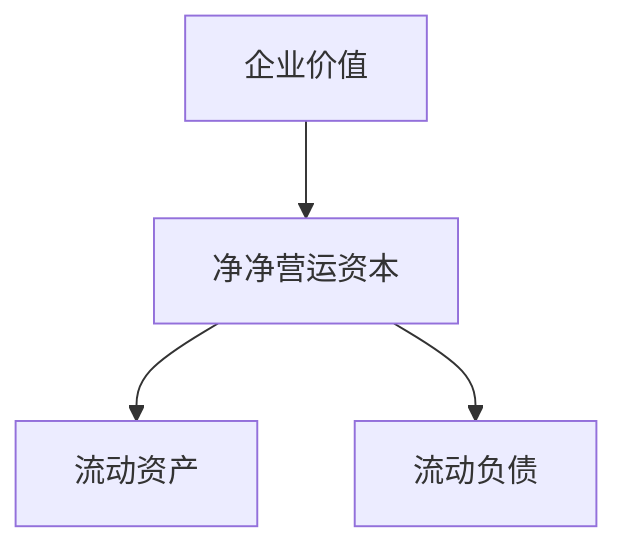
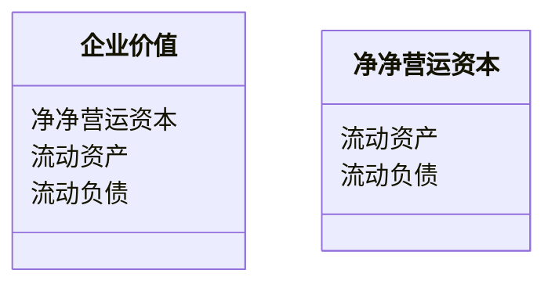
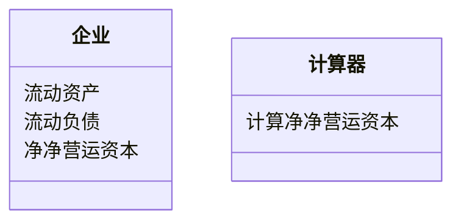
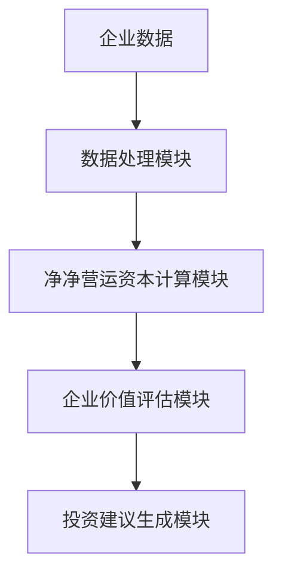
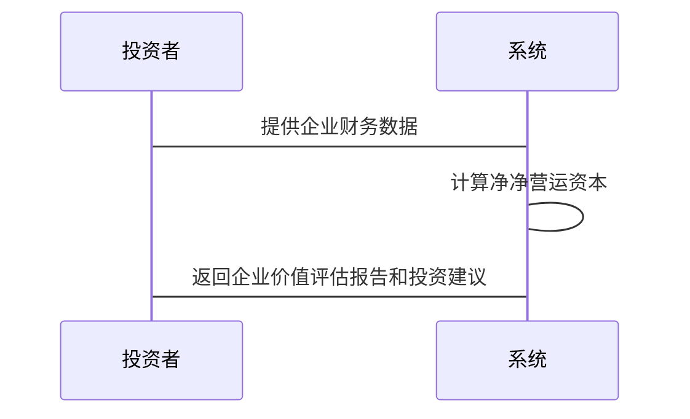

                 


# 如何运用格雷厄姆的净净营运资本策略

> 关键词：格雷厄姆，净净营运资本，价值投资，企业估值，投资策略

> 摘要：本文深入探讨了格雷厄姆的净净营运资本策略，从其核心原理、系统架构到实际应用，详细讲解了如何通过该策略进行企业估值和投资决策。通过实际案例分析，读者将掌握如何利用净净营运资本策略评估企业内在价值，并做出科学的投资决策。

---

# 第1章：格雷厄姆的净净营运资本策略背景介绍

## 1.1 格雷厄姆投资理论概述

### 1.1.1 价值投资的起源与发展

价值投资是一种以基本面分析为基础的投资策略，旨在通过识别市场定价错误的企业，实现长期稳定的超额收益。本杰明·格雷厄姆是价值投资的奠基人，他的投资理念深刻影响了包括沃伦·巴菲特在内的众多投资者。

### 1.1.2 格雷厄姆的学术贡献与投资理念

格雷厄姆在《证券分析》一书中提出了一系列基本面分析方法，强调以企业内在价值为基础进行投资决策。他认为，市场的短期波动是不可预测的，但通过深入分析企业的财务状况，投资者可以发现被市场低估的投资标的。

### 1.1.3 净净营运资本策略的核心思想

格雷厄姆的净净营运资本策略是其投资理论的重要组成部分。该策略通过计算企业的净净营运资本，评估其内在价值。这种方法强调以企业的资产质量为核心，忽略市场短期波动，寻找具有长期稳定价值的企业。

## 1.2 净净营运资本策略的背景与问题背景

### 1.2.1 传统企业估值方法的局限性

传统的企业估值方法，如市盈率（P/E）和市净率（P/B），往往受到市场情绪和短期财务数据的影响，难以准确反映企业的内在价值。特别是在市场波动剧烈的情况下，这些方法可能无法为投资者提供可靠的估值依据。

### 1.2.2 净净营运资本策略的提出动机

格雷厄姆提出净净营运资本策略的初衷是寻找那些资产质量优异、财务状况稳健的企业。他认为，企业的真正价值应基于其资产的内在价值，而非市场情绪或短期收益。

### 1.2.3 该策略在投资决策中的应用价值

通过净净营运资本策略，投资者可以识别那些资产质量高、负债可控的企业，从而在市场低估时买入，实现长期收益。这种方法特别适用于那些资产驱动型的企业，如制造业和公用事业。

## 1.3 净净营运资本策略的核心概念与定义

### 1.3.1 净净营运资本的定义与计算公式

净净营运资本（Net Net Working Capital，NNWC）是指企业的流动资产减去流动负债后的净额。其计算公式为：

$$\text{净净营运资本} = \text{流动资产} - \text{流动负债}$$

其中，流动资产包括现金、应收账款和存货等，流动负债包括应付账款和短期负债等。

### 1.3.2 核心概念的属性与特征对比

以下是净净营运资本与其他估值方法的对比：

| 方法 | 定义 | 优点 | 缺点 |
|------|------|------|------|
| 净净营运资本 | 流动资产 - 流动负债 | 突出企业资产质量，忽略市场情绪 | 忽略长期资产价值 |
| 市盈率 | 价格/收益 | 反映市场对收益的预期 | 易受利润波动影响 |
| 市净率 | 价格/净资产 | 反映资产的市场价值 | 适合重资产行业 |

### 1.3.3 净净营运资本与企业价值的关系

企业价值由其资产的内在价值决定，而净净营运资本是企业流动资产与流动负债的差额，反映了企业的短期偿债能力和流动资金的充裕性。以下是企业价值与净净营运资本的关系：



---

# 第2章：净净营运资本策略的核心原理

## 2.1 净净营运资本的计算与分析

### 2.1.1 净净营运资本的计算公式

$$\text{净净营运资本} = \text{流动资产} - \text{流动负债}$$

净净营运资本反映了企业的流动资金状况，是衡量企业短期偿债能力的重要指标。

### 2.1.2 核心要素的组成与关系

流动资产和流动负债是净净营运资本的两大核心要素。流动资产包括现金、应收账款和存货，而流动负债则包括应付账款和短期负债。以下是两者的组成与关系：



### 2.1.3 净净营运资本的正负值分析

- **正值**：流动资产大于流动负债，企业短期偿债能力强。
- **负值**：流动资产小于流动负债，企业短期偿债能力较弱。

## 2.2 净净营运资本与其他估值方法的对比

### 2.2.1 市盈率与市净率的对比

市盈率和市净率是常用的估值指标，但它们与净净营运资本有显著区别：

- **市盈率**：反映市场对收益的预期，适用于盈利稳定的公司。
- **市净率**：反映资产的市场价值，适用于重资产行业。
- **净净营运资本**：反映流动资产与流动负债的差额，适用于评估短期偿债能力。

### 2.2.2 净净营运资本与企业价值的关系

净净营运资本是企业价值的重要组成部分，但它仅反映了企业的流动资产和流动负债状况，忽略了长期资产和负债的价值。以下是企业价值与净净营运资本的关系：


## 2.3 本章小结

本章详细介绍了净净营运资本的计算方法及其与其他估值指标的对比，强调了该策略在评估企业短期偿债能力和流动资金状况中的重要性。

---

# 第3章：净净营运资本策略的系统分析与架构设计

## 3.1 问题场景介绍

### 3.1.1 投资者如何评估企业内在价值

投资者需要通过分析企业的财务状况，识别那些资产质量高、财务状况稳健的企业。净净营运资本策略可以帮助投资者评估企业的流动资产与流动负债状况，从而做出科学的投资决策。

### 3.1.2 净净营运资本策略的应用场景

净净营运资本策略适用于以下场景：

1. 评估企业的短期偿债能力。
2. 识别资产质量优异的企业。
3. 在市场低估时买入被低估的企业。

### 3.1.3 系统功能需求概述

本系统旨在通过计算企业的净净营运资本，评估其内在价值，并提供投资决策支持。系统功能包括：

1. 数据采集与处理。
2. 净净营运资本计算。
3. 企业价值评估。
4. 投资建议生成。

## 3.2 系统架构设计

### 3.2.1 领域模型设计

以下是领域模型的类图：



### 3.2.2 系统架构设计

以下是系统架构图：



### 3.2.3 系统接口设计

系统接口包括以下部分：

1. 数据输入接口：接收企业的财务数据。
2. 计算接口：计算企业的净净营运资本。
3. 输出接口：生成企业价值评估报告和投资建议。

### 3.2.4 系统交互设计

以下是系统交互图：



## 3.3 本章小结

本章通过系统分析与架构设计，详细介绍了如何利用净净营运资本策略进行企业估值，并提供了系统的功能需求和架构设计。

---

# 第4章：净净营运资本策略的项目实战

## 4.1 环境安装与配置

### 4.1.1 安装Python与相关库

```bash
pip install numpy pandas matplotlib
```

### 4.1.2 数据获取与处理

使用以下代码获取企业财务数据：

```python
import pandas as pd

# 获取企业财务数据
data = pd.read_csv('enterprise_financial.csv')
```

## 4.2 系统核心实现

### 4.2.1 净净营运资本计算代码

```python
def calculate_nnwc(current_assets, current_liabilities):
    return current_assets - current_liabilities

# 示例计算
current_assets = 500000
current_liabilities = 300000
nnwc = calculate_nnwc(current_assets, current_liabilities)
print(f"净净营运资本: {nnwc}")
```

### 4.2.2 企业价值评估代码

```python
def assess_business_value(nnwc, market_price):
    if nnwc > market_price:
        return "低估"
    elif nnwc < market_price:
        return "高估"
    else:
        return "合理"

# 示例评估
market_price = 200000
assessment = assess_business_value(nnwc, market_price)
print(f"企业价值评估: {assessment}")
```

### 4.2.3 投资建议生成代码

```python
def generate_recommendation(assessment):
    if assessment == "低估":
        return "买入"
    elif assessment == "高估":
        return "卖出"
    else:
        return "观望"

# 示例建议
recommendation = generate_recommendation(assessment)
print(f"投资建议: {recommendation}")
```

## 4.3 代码应用解读与分析

通过上述代码，我们可以计算企业的净净营运资本，并根据市场价与净净营运资本的对比，评估企业价值并生成投资建议。以下是对代码的解读：

1. **净净营运资本计算**：通过流动资产减去流动负债，得出企业的净净营运资本。
2. **企业价值评估**：将净净营运资本与市场价进行对比，判断企业是否被低估或高估。
3. **投资建议生成**：根据企业价值评估结果，生成买入、卖出或观望的投资建议。

## 4.4 实际案例分析

以某制造企业为例，假设其流动资产为50万元，流动负债为30万元，市场价为20万元。计算其净净营运资本为20万元，与市场价持平，因此评估为合理，投资建议为观望。

## 4.5 项目小结

本章通过实际案例分析，详细讲解了如何利用净净营运资本策略进行企业估值，并通过Python代码实现了投资建议的生成。读者可以将该策略应用于实际投资决策中。

---

# 第5章：最佳实践与总结

## 5.1 小结

格雷厄姆的净净营运资本策略是一种有效的投资工具，通过计算企业的净净营运资本，评估其内在价值，并据此制定投资策略。该策略特别适用于那些资产质量高、财务状况稳健的企业。

## 5.2 注意事项

1. 净净营运资本策略仅反映企业的流动资产与流动负债状况，忽略了长期资产和负债的价值。
2. 投资者应结合其他估值方法，如市盈率和市净率，进行综合评估。
3. 市场环境和宏观经济因素也会影响企业的内在价值，投资者需保持关注。

## 5.3 拓展阅读

1. 《证券分析》——本杰明·格雷厄姆
2. 《投资学基础》——查理·埃斯莱曼
3. 《价值投资实战》——沃伦·巴菲特

---

# 结语

通过本文的详细讲解，读者可以掌握格雷厄姆的净净营运资本策略的核心原理和实际应用。该策略不仅适用于企业估值，还可为投资决策提供科学依据。希望本文能为读者在投资领域提供有价值的参考和指导。

