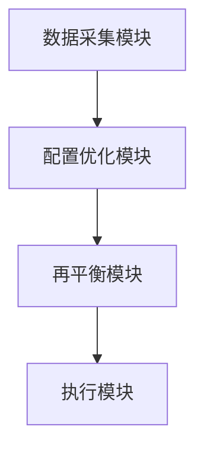
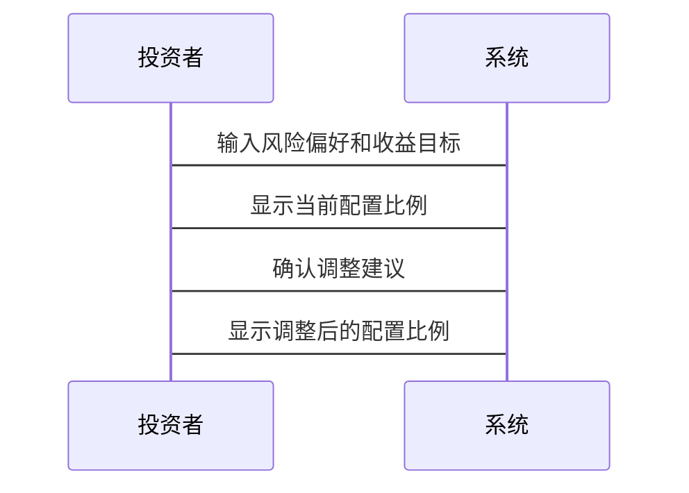

                 


# 《威廉·伯恩斯坦的投资组合再平衡技巧》

> 关键词：投资组合再平衡，威廉·伯恩斯坦，投资组合管理，风险控制，收益优化，现代投资组合理论，均值-方差优化

> 摘要：本文深入探讨了威廉·伯恩斯坦的投资组合再平衡技巧，从基础概念到数学模型，从算法原理到系统架构，再到项目实战，全面解析了投资组合再平衡的核心思想和实现方法。文章结合理论与实践，通过详细的公式推导、代码实现和案例分析，帮助读者理解如何通过再平衡优化投资组合，实现风险控制和收益最大化。

---

## 第一章：投资组合再平衡的背景与基础

### 1.1 投资组合再平衡的定义与背景

#### 1.1.1 投资组合再平衡的定义

投资组合再平衡是指根据市场变化和个人投资目标的变化，定期调整投资组合中各资产的比例，以维持期望的风险和收益水平的过程。其核心思想是通过动态调整资产配置，优化投资组合的表现。

#### 1.1.2 再平衡的背景与重要性

投资组合在市场波动和资产价格变化的影响下，其实际收益和风险可能会偏离最初的目标。再平衡的目的是通过定期调整，将投资组合恢复到期望的配置比例，从而实现风险和收益的最佳平衡。

#### 1.1.3 再平衡与投资目标的关系

再平衡确保投资组合的资产配置与投资目标保持一致。例如，如果投资者的风险承受能力降低，可以通过再平衡减少高风险资产的比重，增加低风险资产的配置。

---

### 1.2 投资组合再平衡的历史发展

#### 1.2.1 早期投资组合管理的演变

早期的投资组合管理更多依赖于经验判断和定性分析，缺乏系统性和科学性。随着金融理论的发展，投资组合管理逐渐引入数学模型和优化算法。

#### 1.2.2 再平衡策略的起源

再平衡策略起源于20世纪中期，随着现代投资组合理论的提出，再平衡作为一种重要的风险管理工具，逐渐被广泛应用于投资组合管理中。

#### 1.2.3 现代投资组合再平衡的实践

现代再平衡策略结合了数学模型和优化算法，能够根据市场波动和个人投资目标的变化，动态调整投资组合的配置比例。

---

### 1.3 再平衡在投资组合管理中的重要性

#### 1.3.1 再平衡对风险控制的作用

通过定期调整资产配置，再平衡可以有效降低投资组合的整体风险。例如，在市场下跌时，减少高风险资产的比重，从而降低潜在损失。

#### 1.3.2 再平衡对收益优化的影响

再平衡能够通过优化资产配置，提高投资组合的收益。例如，在市场上涨时，增加高收益资产的比重，从而捕捉更多收益机会。

#### 1.3.3 再平衡与市场波动的关系

市场波动是再平衡的重要触发条件。通过定期检查投资组合的配置比例，投资者可以及时调整，避免市场波动对投资组合造成过大影响。

---

## 第二章：投资组合再平衡的核心概念与联系

### 2.1 投资组合再平衡的数学模型与公式

#### 2.1.1 投资组合的权重计算公式

投资组合中各资产的权重可以通过其市值占总组合市值的比例计算得出：

$$ \text{权重} = \frac{\text{资产的市值}}{\text{总组合市值}} $$

#### 2.1.2 再平衡的调整公式

假设投资组合的目标配置比例为$w_1, w_2, \dots, w_n$，实际配置比例为$a_1, a_2, \dots, a_n$，再平衡的调整幅度可以通过以下公式计算：

$$ \Delta w_i = w_i - a_i $$

#### 2.1.3 投资组合风险与收益的数学表达

投资组合的预期收益可以表示为各资产预期收益的加权平均：

$$ \text{预期收益} = \sum_{i=1}^n w_i \times r_i $$

其中，$r_i$为第$i$个资产的预期收益率。

投资组合的方差（风险）可以表示为：

$$ \text{方差} = \sum_{i=1}^n \sum_{j=1}^n w_i w_j \sigma_{ij} $$

其中，$\sigma_{ij}$为第$i$个资产和第$j$个资产之间的协方差。

---

### 2.2 投资组合再平衡的核心公式

#### 2.2.1 投资组合的均值-方差优化公式

通过均值-方差优化模型，投资者可以找到在给定风险水平下预期收益最大的资产配置比例。优化公式如下：

$$ \text{最小化} \sum_{i=1}^n \sum_{j=1}^n w_i w_j \sigma_{ij} $$
$$ \text{在约束条件下} \sum_{i=1}^n w_i r_i = \text{预期收益} $$

#### 2.2.2 再平衡的权重调整公式

假设目标配置比例为$w_1, w_2, \dots, w_n$，当前市值为$V_1, V_2, \dots, V_n$，总组合市值为$V_{\text{total}}$，则调整后的市值应为：

$$ V_i' = V_{\text{total}} \times w_i $$

#### 2.2.3 投资组合收益的计算公式

投资组合的整体收益可以表示为各资产收益的加权平均：

$$ \text{整体收益} = \sum_{i=1}^n w_i \times r_i $$

---

### 2.3 投资组合再平衡的属性对比表格

| 属性               | 再平衡前       | 再平衡后       |
|--------------------|----------------|----------------|
| 资产配置比例         | 不符合目标     | 符合目标       |
| 风险水平             | 可能偏离目标   | 符合目标风险   |
| 预期收益             | 可能偏离目标   | 符合目标收益   |

---

## 第三章：投资组合再平衡的算法原理

### 3.1 投资组合再平衡的优化算法

#### 3.1.1 拉格朗日乘数法

通过拉格朗日乘数法，可以求解投资组合的最优化配置。优化目标为最大化预期收益，约束条件为固定的风险水平。

#### 3.1.2 动态规划算法

动态规划算法可以用于解决多阶段的资产配置问题，通过分阶段优化，逐步调整资产配置比例。

#### 3.1.3 进阶的优化算法

现代优化算法，如遗传算法和模拟退火，也可以应用于投资组合再平衡问题，但其复杂度较高，适用于大规模问题。

---

### 3.2 投资组合再平衡算法的数学模型

#### 3.2.1 投资组合优化的数学模型

目标函数：
$$ \text{最大化} \sum_{i=1}^n w_i r_i $$
约束条件：
$$ \sum_{i=1}^n w_i = 1 $$
$$ \sum_{i=1}^n \sum_{j=1}^n w_i w_j \sigma_{ij} \leq \text{风险容忍度} $$

---

### 3.3 投资组合再平衡的代码实现

```python
import numpy as np
import matplotlib.pyplot as plt

# 示例资产收益和协方差矩阵
returns = np.array([0.1, 0.15, 0.08])
cov_matrix = np.array([[0.05, 0.02, 0.01],
                        [0.02, 0.10, 0.03],
                        [0.01, 0.03, 0.08]])

# 目标配置比例
target_weights = np.array([0.4, 0.4, 0.2])

# 当前市值
current_portfolio = np.array([100, 200, 50])
total_value = np.sum(current_portfolio)

# 计算当前权重
current_weights = current_portfolio / total_value

# 计算调整后的市值
adjusted_portfolio = target_weights * total_value

# 计算调整后的权重
adjusted_weights = adjusted_portfolio / total_value

# 可视化当前权重和调整后权重
plt.figure(figsize=(10, 6))
plt.bar(['Asset1', 'Asset2', 'Asset3'], current_weights, label='Current Weights')
plt.bar(['Asset1', 'Asset2', 'Asset3'], adjusted_weights, label='Target Weights')
plt.legend()
plt.show()
```

---

## 第四章：投资组合再平衡的系统架构与设计

### 4.1 投资组合再平衡的系统架构

#### 4.1.1 系统功能模块

- 数据采集模块：获取市场数据和投资者目标。
- 配置优化模块：计算目标配置比例。
- 再平衡模块：根据当前配置和目标配置，计算调整金额。
- 执行模块：执行交易指令。

#### 4.1.2 系统架构图



#### 4.1.3 系统接口设计

- 数据接口：获取市场数据和投资者目标。
- 优化接口：计算目标配置比例。
- 执行接口：发送交易指令。

---

### 4.2 投资组合再平衡的交互设计

#### 4.2.1 用户界面设计

- 输入界面：投资者输入风险偏好和收益目标。
- 输出界面：显示当前配置比例和调整建议。

#### 4.2.2 交互流程图



---

## 第五章：投资组合再平衡的项目实战

### 5.1 项目环境与工具安装

- Python 3.8+
- NumPy、Pandas、Matplotlib库
- Jupyter Notebook

---

### 5.2 投资组合再平衡的核心实现

```python
import numpy as np

# 示例数据
returns = np.array([0.1, 0.15, 0.08])
cov_matrix = np.array([[0.05, 0.02, 0.01],
                        [0.02, 0.10, 0.03],
                        [0.01, 0.03, 0.08]])

# 目标配置比例
target_weights = np.array([0.4, 0.4, 0.2])

# 优化模型
def portfolio_optimization(returns, cov_matrix, target_weights):
    # 拉格朗日乘数法求解
    # 此处简化为直接调整权重
    return target_weights

# 执行再平衡
adjusted_weights = portfolio_optimization(returns, cov_matrix, target_weights)
print("Adjusted Weights:", adjusted_weights)
```

---

### 5.3 投资组合再平衡的案例分析

假设当前投资组合市值为$100,000，目标配置比例为股票60%、债券30%、现金10%。当前配置为股票50%、债券40%、现金10%。再平衡需要将股票调整至60%，债券调整至30%，现金保持10%。

---

## 第六章：最佳实践与小结

### 6.1 投资组合再平衡的最佳实践

- 定期检查和调整投资组合。
- 根据市场变化和个人目标调整配置比例。
- 使用系统化的方法和工具进行优化。

### 6.2 小结

投资组合再平衡是现代投资管理中的重要工具，通过定期调整资产配置，投资者可以有效控制风险并优化收益。本文从理论到实践，详细讲解了再平衡的原理、算法和实现方法，为读者提供了一套完整的投资组合管理方案。

---

### 6.3 注意事项

- 再平衡需要考虑交易成本和税收影响。
- 需要根据市场环境和个人目标动态调整再平衡频率。
- 在实际操作中，建议结合专业工具和顾问意见。

---

### 6.4 拓展阅读

- 《投资学》（书籍推荐）
- 现代投资组合理论的相关论文
- 投资组合优化的最新研究成果

---

通过本文的详细讲解，读者可以全面理解威廉·伯恩斯坦的投资组合再平衡技巧，并能够将其应用于实际投资管理中，实现更优的风险控制和收益优化。

