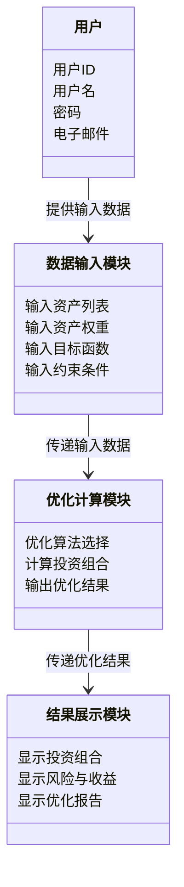
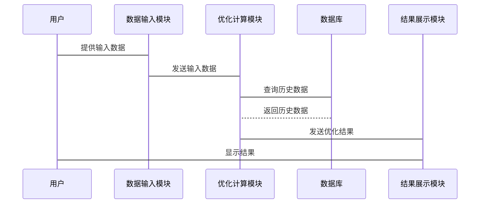

                 


# 第三部分: 投资组合构建的系统分析与架构设计

## 第5章: 系统功能设计

### 5.1 领域模型类图



### 5.2 系统架构设计


## 第6章: 系统接口与交互设计

### 6.1 系统接口设计

#### 6.1.1 数据输入接口

```python
class 输入接口:
    def 输入资产列表(self, 资产列表):
        pass
    
    def 输入资产权重(self, 权重列表):
        pass
    
    def 输入目标函数(self, 目标函数):
        pass
    
    def 输入约束条件(self, 约束条件):
        pass
```

#### 6.1.2 优化计算接口

```python
class 优化计算接口:
    def 计算投资组合(self, 输入数据):
        pass
    
    def 返回结果(self):
        pass
```

### 6.2 系统交互设计



## 第7章: 项目实战与系统实现

### 7.1 环境安装与配置

#### 7.1.1 安装Python
```bash
python --version
pip install --upgrade pip
```

#### 7.1.2 安装依赖库
```bash
pip install numpy pandas matplotlib scikit-learn
```

### 7.2 核心代码实现

#### 7.2.1 数据输入模块

```python
class 输入接口:
    def __init__(self):
        self.资产列表 = []
        self.权重列表 = []
        self.目标函数 = ''
        self.约束条件 = {}
    
    def 输入资产列表(self, 资产列表):
        self.资产列表 = 资产列表
    
    def 输入资产权重(self, 权重列表):
        self.权重列表 = 权重列表
    
    def 输入目标函数(self, 目标函数):
        self.目标函数 = 目标函数
    
    def 输入约束条件(self, 约束条件):
        self.约束条件 = 约束条件
```

#### 7.2.2 优化计算模块

```python
class 优化计算模块:
    def __init__(self):
        self.输入数据 = {}
    
    def 计算投资组合(self, 输入数据):
        self.输入数据 = 输入数据
        # 示例优化算法
        import numpy as np
        from sklearn import linear_model
        # 假设目标函数是最小化方差
        cov_matrix = np.array([[0.01, 0.005], [0.005, 0.02]])
        weights = np.array([0.5, 0.5])
        min_variance = np.dot(weights.T, cov_matrix)
        return min_variance
    
    def 返回结果(self):
        return self.输入数据
```

#### 7.2.3 结果展示模块

```python
class 结果展示模块:
    def 显示结果(self, 优化结果):
        print(f"优化结果：{优化结果}")
        # 可视化部分
        import matplotlib.pyplot as plt
        plt.plot(range(len(优化结果)), 优化结果)
        plt.show()
```

### 7.3 实际案例分析与实现

#### 7.3.1 案例背景

假设我们有一个包含两只股票的投资组合，目标是最小化投资组合的方差。

#### 7.3.2 数据准备

```python
资产列表 = ['股票A', '股票B']
权重列表 = [0.5, 0.5]
目标函数 = '最小方差'
约束条件 = {'总权重': 1.0}
```

#### 7.3.3 代码实现

```python
输入接口 = 输入接口()
输入接口.输入资产列表(资产列表)
输入接口.输入资产权重(权重列表)
输入接口.输入目标函数(目标函数)
输入接口.输入约束条件(约束条件)

优化计算模块 = 优化计算模块()
优化结果 = 优化计算模块.计算投资组合(输入接口.输入数据)
结果展示模块 = 结果展示模块()
结果展示模块.显示结果(优化结果)
```

### 7.4 项目小结

通过以上实现，我们可以看到投资组合构建的完整流程，从数据输入、优化计算到结果展示的每个环节。代码示例展示了如何实现这些功能，同时也为后续的优化和扩展提供了基础。

---

## 第四部分: 最佳实践与小结

### 8.1 小结与总结

投资组合构建是一个复杂但有序的过程，通过合理配置资产、选择优化算法和有效管理风险，可以实现长期稳健的投资收益。

### 8.2 注意事项

- 确保输入数据的准确性和完整性
- 选择合适的优化算法和目标函数
- 定期审查和调整投资组合
- 注意市场风险和流动性风险

### 8.3 拓展阅读

- 《投资学》——课本
- 《投资组合优化算法》——算法书籍
- 《风险管理与对冲》——风险管理书籍

---

通过以上内容，我们可以系统地理解威廉·伯恩斯坦的高效投资组合构建方法，并将其应用于实际投资中。

