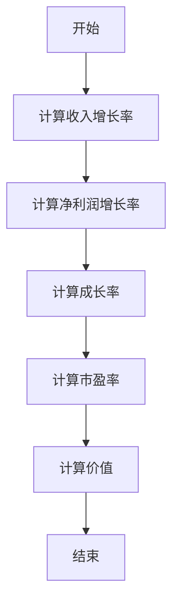
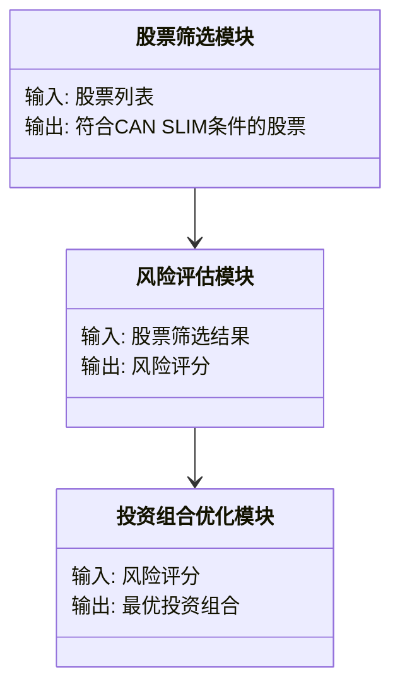
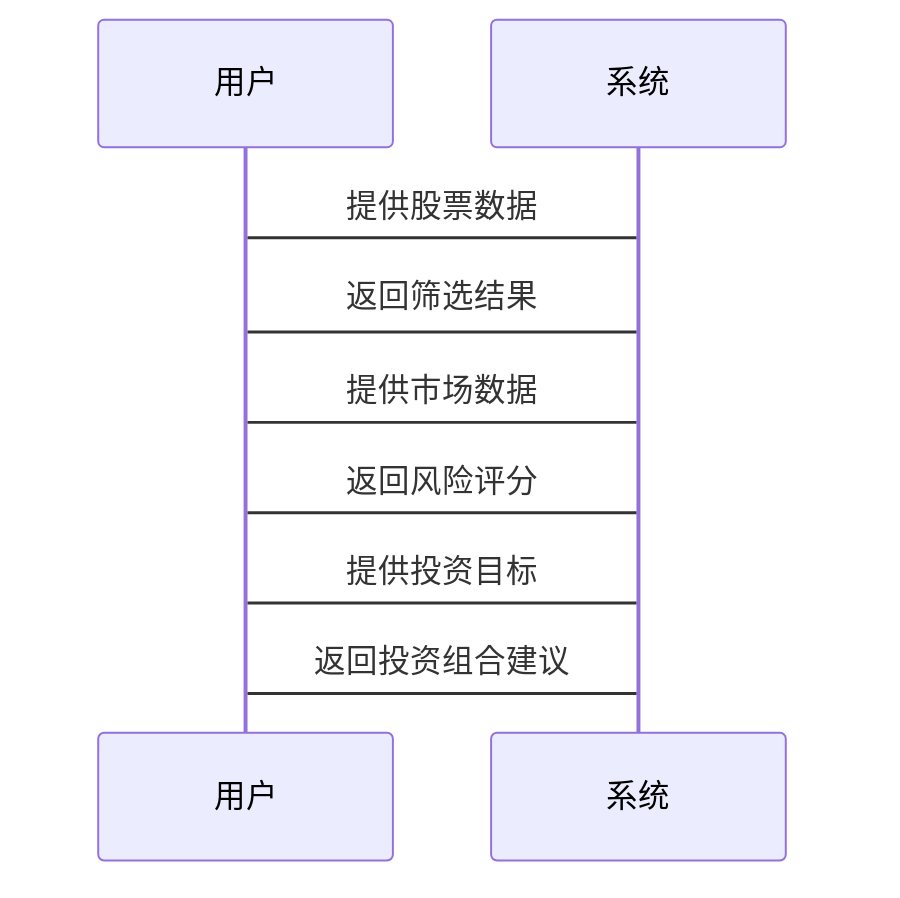

                 


# 威廉·奥尼尔的CAN SLIM：成长与价值的融合

> 关键词：威廉·奥尼尔，CAN SLIM，投资策略，成长与价值，系统架构，数学模型，Python实现

> 摘要：本文深入探讨了威廉·奥尼尔的CAN SLIM投资策略，分析了其在成长与价值融合中的应用。从策略背景到算法实现，再到系统架构设计，逐步解析CAN SLIM的核心原理，并通过实际案例展示其在投资中的应用效果。本文适合对投资策略和技术实现感兴趣的读者。

---

# 第一部分: 威廉·奥尼尔的CAN SLIM概述

## 第1章: CAN SLIM的核心概念与背景

### 1.1 CAN SLIM的起源与发展

#### 1.1.1 投资策略的演变历程

投资策略从早期的简单筛选逐步发展为基于数据和算法的复杂系统。威廉·奥尼尔提出的CAN SLIM策略是这一演变过程中的重要里程碑。

#### 1.1.2 威廉·奥尼尔的CAN SLIM策略提出背景

威廉·奥尼尔通过分析大量市场数据，发现成长与价值的结合能够有效筛选出具有长期增长潜力的股票。CAN SLIM策略因此应运而生。

#### 1.1.3 CAN SLIM在现代投资中的地位

作为成长与价值投资的结合，CAN SLIM策略在现代投资中占据重要地位，广泛应用于个股筛选和资产配置。

### 1.2 CAN SLIM的核心理念

#### 1.2.1 成长与价值的融合

CAN SLIM策略将成长（CAGR、收入增长、净利润增长）与价值（市盈率、股价与收益比率）相结合，以筛选出具有成长潜力且估值合理的股票。

#### 1.2.2 CAN SLIM的核心要素分析

- CAGR（年复合增长率）：衡量公司成长能力的核心指标。
- 市盈率（P/E）：评估股票估值合理性的重要指标。
- 收入与利润增长：公司成长性的直接体现。

#### 1.2.3 CAN SLIM与传统投资策略的对比

| 指标       | CAN SLIM                | 传统价值投资     | 传统成长投资     |
|------------|-------------------------|------------------|------------------|
| 核心指标     | CAGR、收入增长、P/E     | P/E、股息率       | 收入增长率、净利润增长率 |
| 投资目标     | 成长与价值结合          | 低估值            | 高成长性          |

---

## 第2章: CAN SLIM的核心原理

### 2.1 CAN SLIM的数学模型

#### 2.1.1 成长与价值的量化公式

$$ 成长率 = \frac{收入增长率 + 净利润增长率}{2} $$

$$ 价值 = \frac{收入}{市盈率} \times 成长率 $$

#### 2.1.2 价值评估的数学表达

$$ 价值 = \frac{收入}{市盈率} \times 成长率 $$

### 2.2 CAN SLIM的算法原理

#### 2.2.1 基于CAN SLIM的股票筛选算法



#### 2.2.2 算法实现的Python代码示例

```python
def calculate_growth_rate(revenue_growth, net_profit_growth):
    return (revenue_growth + net_profit_growth) / 2

def calculate_value(revenue, p_e, growth_rate):
    return (revenue / p_e) * growth_rate
```

### 2.3 核心概念的对比分析

#### 2.3.1 成长与价值的对比表格

| 指标       | 成长       | 价值       |
|------------|------------|------------|
| 定义       | 收入和利润的增长速度 | 市盈率和估值的合理性 |
| 重要性     | 高         | 中         |
| 应用场景     | 选股       | 资产配置   |

---

## 第3章: CAN SLIM的系统架构设计

### 3.1 系统需求分析

#### 3.1.1 项目介绍

构建一个基于CAN SLIM策略的投资系统，实现股票筛选、风险评估和投资组合优化功能。

### 3.2 系统功能设计

#### 3.2.1 领域模型



### 3.3 系统架构设计

#### 3.3.1 系统架构图


### 3.4 系统接口设计

#### 3.4.1 接口定义

- 输入接口：股票数据、市场数据
- 输出接口：筛选结果、风险评分、投资组合建议

### 3.5 系统交互设计

#### 3.5.1 交互流程



---

## 第4章: 项目实战

### 4.1 环境安装

#### 4.1.1 安装Python和相关库

```bash
pip install numpy pandas matplotlib
```

### 4.2 系统核心实现源代码

#### 4.2.1 股票筛选模块

```python
import pandas as pd

def calculate_growth_rate(revenue_growth, net_profit_growth):
    return (revenue_growth + net_profit_growth) / 2

def calculate_value(revenue, p_e, growth_rate):
    return (revenue / p_e) * growth_rate

# 示例数据
data = {
    '收入增长率': [0.2, 0.3, 0.1],
    '净利润增长率': [0.15, 0.2, 0.05],
    '市盈率': [15, 20, 25]
}

df = pd.DataFrame(data)

# 计算成长率
df['成长率'] = df.apply(lambda x: calculate_growth_rate(x['收入增长率'], x['净利润增长率']), axis=1)

# 计算价值
df['价值'] = df.apply(lambda x: calculate_value(x['收入增长率'], x['市盈率'], x['成长率']), axis=1)

print(df)
```

---

## 第5章: 最佳实践

### 5.1 小结

CAN SLIM策略通过量化成长与价值，帮助投资者筛选出具有长期增长潜力的股票，是现代投资中的重要工具。

### 5.2 注意事项

- 数据质量：确保输入数据的准确性和完整性。
- 模型优化：根据市场变化调整模型参数。
- 风险控制：结合风险评估模块进行投资决策。

### 5.3 拓展阅读

- 威廉·奥尼尔的《CAN SLIM投资法》
- 关于投资系统架构的书籍
- 机器学习在投资中的应用

---

# 第四部分: 总结

威廉·奥尼尔的CAN SLIM策略通过量化成长与价值，为投资者提供了一种科学的投资方法。本文从策略背景、算法实现到系统架构设计，逐步解析了CAN SLIM的核心原理，并通过实际案例展示了其在投资中的应用效果。未来，随着技术的发展，CAN SLIM策略将进一步与其他投资方法融合，为投资者提供更强大的工具。

