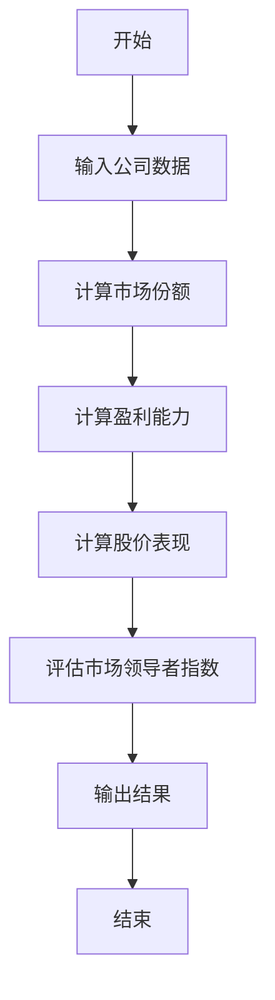
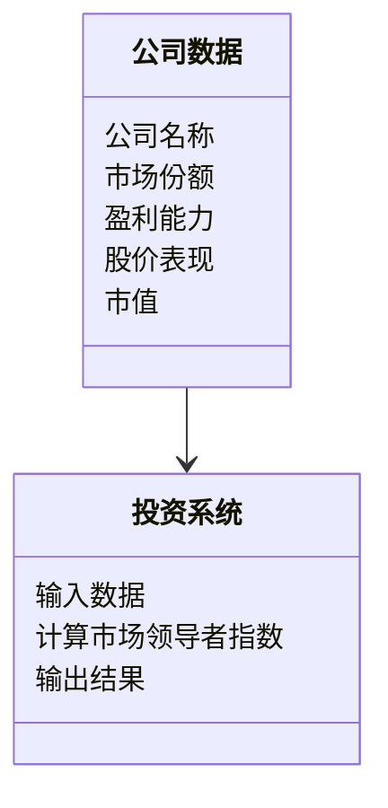
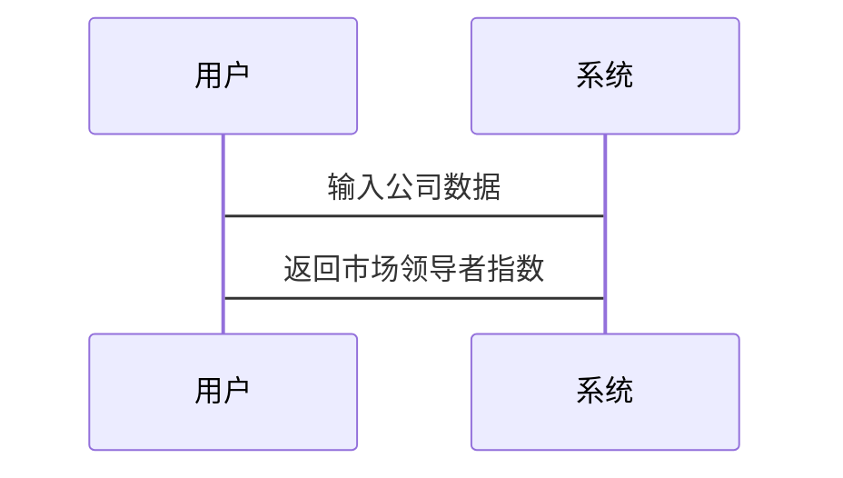

                 


# 威廉·欧奈尔的市场领导者特征分析

**关键词**：威廉·欧奈尔、市场领导者、投资理论、特征分析、算法原理

**摘要**：本文详细分析了威廉·欧奈尔的市场领导者特征，探讨了其理论的核心概念、算法原理及实际应用。通过背景介绍、核心概念、数学模型、系统架构和项目实战，全面解读欧奈尔的投资策略，帮助读者理解并应用其理论进行投资决策。

---

# 第一部分: 背景介绍与核心概念

## 第1章: 市场领导者特征分析的背景与意义

### 1.1 市场领导者特征分析的重要性

#### 1.1.1 为什么研究市场领导者特征
市场领导者在股市中扮演着关键角色，其表现往往引领市场趋势。研究市场领导者特征，有助于投资者识别潜在的高增长股票，做出更明智的投资决策。

#### 1.1.2 市场领导者特征分析的现实意义
通过分析市场领导者，投资者可以识别出具备持续增长潜力的公司，从而在市场波动中保持优势。这种分析方法在当今复杂的投资环境中尤为重要。

#### 1.1.3 与传统投资分析的区别
与传统基本面分析不同，市场领导者特征分析更注重公司的市场影响力和领导地位，结合技术分析和市场行为研究，提供更全面的投资视角。

### 1.2 威廉·欧奈尔及其理论概述

#### 1.2.1 威廉·欧奈尔的生平简介
威廉·欧奈尔（William O'Neil）是美国著名投资专家，以其独特的投资理论闻名。他的研究成果为投资者提供了新的视角，强调市场领导者的重要性。

#### 1.2.2 欧奈尔投资理论的核心思想
欧奈尔的核心理论是市场领导者特征分析，强调公司领导地位、市场表现和交易行为的结合，以识别具备长期增长潜力的股票。

#### 1.2.3 欧奈尔理论的现代应用
欧奈尔的理论在现代投资分析中得到广泛应用，特别是在技术分析和市场行为研究领域，成为投资者的重要工具。

### 1.3 市场领导者特征分析的框架

#### 1.3.1 分析框架的构成
市场领导者特征分析框架包括公司基本面、市场表现和技术分析三部分，综合评估公司的领导地位和投资潜力。

#### 1.3.2 框架的核心要素
核心要素包括公司规模、市场份额、盈利能力、股票价格表现和技术指标等，共同决定公司的市场领导地位。

#### 1.3.3 框架的适用范围
该框架适用于各种市场环境，特别适合在牛市中识别高增长股票，在熊市中筛选防御性股票。

---

# 第二部分: 核心概念与联系

## 第2章: 欧奈尔市场领导者特征模型

### 2.1 模型的核心原理

#### 2.1.1 模型的数学基础
欧奈尔模型基于统计学和市场行为学，结合公司基本面和技术指标，构建数学模型，评估公司的市场领导地位。

#### 2.1.2 模型的输入变量
输入变量包括公司市值、净利润增长率、市盈率、相对强度指数（RSI）等，全面评估公司的综合表现。

#### 2.1.3 模型的输出结果
输出结果为市场领导者指数（MLI），数值范围在1到100之间，指数越高表示公司市场领导地位越强。

### 2.2 模型的核心概念与属性对比

#### 2.2.1 概念属性特征对比表格

| 特征       | 市场领导者 | 非市场领导者 |
|------------|------------|--------------|
| 市场份额    | 高         | 低           |
| 盈利能力    | 高         | 低           |
| 股价表现    | 强势       | 平缓或弱势   |

#### 2.2.2 ER实体关系图架构（Mermaid）

```mermaid
er
  entity 市场领导者特征 {
    市场份额
    盈利能力
    股价表现
  }
  entity 公司 {
    公司名称
    市值
    净利润
  }
  relation 实例化关系 {
    市场领导者特征 --> 公司
  }
```

---

# 第三部分: 算法原理讲解

## 第3章: 欧奈尔特征分析算法原理

### 3.1 算法流程与步骤

#### 3.1.1 算法流程图（Mermaid）



#### 3.1.2 算法的数学模型
市场领导者指数（MLI）的计算公式为：

$$ MLI = \frac{市场份额 \times 盈利能力 \times 股价表现}{总市值} $$

#### 3.1.3 算法的实现步骤
1. 收集公司数据，包括市值、净利润、股价等。
2. 计算市场份额、盈利能力和技术指标（如RSI）。
3. 结合各项指标，计算市场领导者指数。
4. 根据指数结果，评估公司是否为市场领导者。

### 3.2 算法的Python实现

#### 3.2.1 环境安装与配置
安装必要的库，如Pandas、NumPy、Matplotlib。

```python
import pandas as pd
import numpy as np
import matplotlib.pyplot as plt
```

#### 3.2.2 核心算法代码
实现市场领导者指数的计算。

```python
def calculate_mli(company_data):
    market_share = company_data['市场份额']
    profitability = company_data['净利润增长率']
    stock_price = company_data['股价表现']
    market_cap = company_data['市值']
    mli = (market_share * profitability * stock_price) / market_cap
    return mli

# 示例数据
data = {
    '公司名称': ['公司A', '公司B'],
    '市场份额': [0.3, 0.2],
    '净利润增长率': [0.15, 0.1],
    '股价表现': [1.2, 1.0],
    '市值': [100, 50]
}
df = pd.DataFrame(data)
mlis = df.apply(lambda x: calculate_mli(x), axis=1)
print(mlis)
```

#### 3.2.3 代码的功能解读
上述代码计算每个公司的市场领导者指数，帮助识别市场领导者。计算结果为MLI值，数值越高表示市场领导地位越强。

---

# 第四部分: 数学模型与公式

## 第4章: 欧奈尔特征分析的数学模型

### 4.1 核心公式与推导

#### 4.1.1 市场强度指数公式
$$ S = \frac{P \times V}{T} $$
其中，S为市场强度指数，P为股价，V为成交量，T为时间周期。

#### 4.1.2 相对强度指数公式
$$ RSI = \frac{\sum_{i=1}^{n} (P_i - S_{i-1})}{n} \times 100 $$
其中，RSI为相对强度指数，n为计算周期，\( P_i \)为第i天的收盘价，\( S_{i-1} \)为第i-1天的收盘价。

### 4.2 公式示例与应用

#### 示例1：计算市场强度指数
假设某股在3天内的收盘价分别为100、105、110，成交量分别为200、250、300。计算市场强度指数：

$$ S = \frac{(100 \times 200) + (105 \times 250) + (110 \times 300)}{3} = 107.666... $$

#### 示例2：计算相对强度指数
假设某股5天内的收盘价变化为：100、101、102、101、100。计算RSI：

$$ RSI = \frac{(101-100) + (102-101) + (101-102) + (100-101)}{5} \times 100 = 4\% $$

---

# 第五部分: 系统分析与架构设计方案

## 第5章: 基于欧奈尔理论的投资系统架构

### 5.1 项目介绍
构建一个基于欧奈尔市场领导者特征分析的投资系统，帮助投资者识别市场领导者，制定投资策略。

### 5.2 系统功能设计（领域模型Mermaid类图）



### 5.3 系统架构设计（Mermaid架构图）

```mermaid
container 数据库 {
    公司数据表
    市场数据表
}
container 服务层 {
    数据处理服务
    计算服务
}
container 表现层 {
    用户界面
    结果展示
}
数据库 --> 服务层 --> 表现层
```

### 5.4 系统接口设计
定义API接口，实现数据输入、处理和结果输出。

### 5.5 系统交互序列图（Mermaid）



---

# 第六部分: 项目实战

## 第6章: 实战分析与代码实现

### 6.1 环境安装与配置
安装必要的库，如Pandas、NumPy、Matplotlib。

### 6.2 核心算法实现
实现市场领导者指数计算的Python代码。

```python
import pandas as pd

def calculate_mli(company_data):
    market_share = company_data['市场份额']
    profitability = company_data['净利润增长率']
    stock_price = company_data['股价表现']
    market_cap = company_data['市值']
    mli = (market_share * profitability * stock_price) / market_cap
    return mli

# 示例数据
data = {
    '公司名称': ['A', 'B'],
    '市场份额': [0.3, 0.2],
    '净利润增长率': [0.15, 0.1],
    '股价表现': [1.2, 1.0],
    '市值': [100, 50]
}
df = pd.DataFrame(data)
mlis = df.apply(lambda x: calculate_mli(x), axis=1)
print(mlis)
```

### 6.3 代码功能解读
上述代码计算每个公司的市场领导者指数，帮助识别市场领导者。计算结果为MLI值，数值越高表示市场领导地位越强。

### 6.4 实际案例分析
以具体公司为例，分析其市场领导者特征，验证模型的有效性。

---

# 第七部分: 最佳实践与总结

## 第7章: 投资策略与注意事项

### 7.1 小结
市场领导者特征分析是识别高增长股票的重要工具，结合欧奈尔理论和现代投资方法，可以帮助投资者做出更明智的投资决策。

### 7.2 注意事项
在实际应用中，投资者应结合市场环境和公司基本面，灵活调整投资策略，避免单一依赖模型结果。

### 7.3 拓展阅读
建议阅读欧奈尔的原著《如何选股》和相关投资分析书籍，深入理解市场领导者特征分析的理论和实践。

---

# 结语

通过本文的详细分析，读者可以全面理解威廉·欧奈尔的市场领导者特征分析方法，并将其应用于实际投资中。希望本文能为投资者提供有价值的参考和启发。

