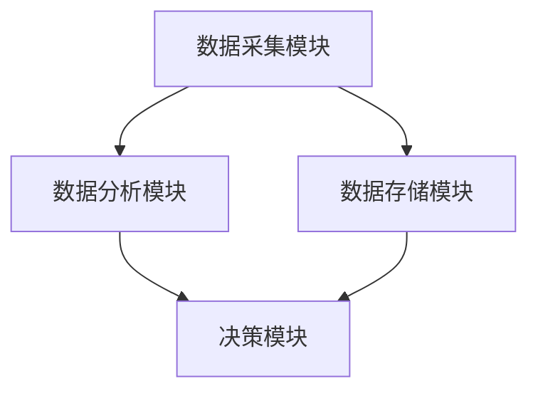

                 


# 《威廉·欧奈尔的技术面与基本面结合策略》

## 关键词：技术分析，基本面分析，股票投资，投资策略，数据分析

## 摘要：  
本文深入探讨了威廉·欧奈尔的技术面与基本面结合的投资策略，分析了其核心概念、算法原理、系统架构及实际应用案例。通过结合技术指标和基本面数据，构建了一个创新的预测模型，为投资者提供了有效的决策支持工具。本文还详细讲解了系统的实现过程，并通过实际案例展示了策略的有效性。

---

## 第一部分：技术面与基本面结合策略的背景与基础

### 第1章：技术面与基本面分析概述

#### 1.1 技术面分析的定义与特点
技术面分析是一种通过研究股票价格和成交量的历史数据，预测未来价格走势的方法。其特点包括直观性、可操作性和灵活性。技术面分析的核心是通过K线图、技术指标和形态分析来识别市场趋势和买卖信号。

#### 1.2 基本面分析的定义与特点
基本面分析是通过研究公司的财务报表、行业地位和宏观经济环境等因素，评估股票的内在价值。其特点是全面性、长期性和稳定性。基本面分析的核心是通过财务指标和估值方法，找到被低估的股票。

#### 1.3 技术面与基本面结合的必要性
技术面分析能够捕捉市场情绪和短期趋势，而基本面分析则提供了长期的投资价值判断。两者的结合能够帮助投资者在不同市场环境下做出更明智的投资决策，同时降低单一分析方法的局限性。

#### 1.4 本章小结
本章介绍了技术面分析和基本面分析的基本概念、特点及其结合的必要性，为后续策略的展开奠定了基础。

---

### 第2章：技术面分析的核心指标与方法

#### 2.1 技术指标的分类与特点
技术指标主要分为趋势指标、力度指标和体积指标三类。趋势指标如移动平均线（MA）用于识别趋势方向；力度指标如相对强度指数（RSI）用于衡量超买超卖状态；体积指标如成交量（Volume）用于验证趋势的强度。

#### 2.2 技术分析的主要方法
技术分析的主要方法包括K线图分析、形态分析和切线分析。K线图能够直观反映价格波动；形态分析帮助识别价格反转或突破信号；切线分析则通过支撑线和阻力线判断价格波动区间。

#### 2.3 技术面分析的数学模型
- 移动平均线的计算公式：
$$ MA_n = \frac{1}{n} \sum_{i=1}^{n} P_i $$
其中，\( P_i \) 为第 \( i \) 个交易日的价格，\( n \) 为计算周期。
- 相对强度指数（RSI）的计算公式：
$$ RSI = \frac{100}{1 + \frac{D}{S}} $$
其中，\( D \) 为下跌幅度，\( S \) 为上涨幅度。

#### 2.4 本章小结
本章详细讲解了技术面分析的核心指标和方法，为后续策略的构建提供了必要的工具支持。

---

### 第3章：基本面分析的核心指标与方法

#### 3.1 基本面分析的主要指标
基本面分析的核心指标包括盈利能力、成长能力、偿债能力和运营能力四类。例如，净利润率和ROE用于衡量盈利能力，营收增长率和净利润增长率用于衡量成长能力。

#### 3.2 基本面分析的主要方法
基本面分析的主要方法包括市盈率法（P/E）、市净率法（P/B）和股息率法（Dividend Yield）。这些方法通过比较股票的估值指标，帮助投资者找到具有投资价值的股票。

#### 3.3 基本面分析的数学模型
- 市盈率计算公式：
$$ P/E = \frac{Price}{Ea} $$
其中，\( Price \) 为股票价格，\( Ea \) 为每股收益。

#### 3.4 本章小结
本章详细讲解了基本面分析的核心指标和方法，为后续策略的构建提供了必要的工具支持。

---

## 第二部分：技术面与基本面结合的策略设计

### 第4章：结合技术面与基本面的预测模型

#### 4.1 策略的核心思想
通过结合技术面和基本面数据，构建一个综合预测模型。该模型将技术指标和财务指标作为输入，输出股票的买入、卖出或持有信号。

#### 4.2 策略的设计步骤
1. 数据收集：获取股票的历史价格数据和财务报表数据。
2. 数据预处理：对数据进行清洗和标准化处理。
3. 模型构建：使用回归分析或时间序列模型进行预测。
4. 信号生成：根据模型预测结果生成交易信号。

#### 4.3 算法的数学模型
- 线性回归模型：
$$ y = \beta_0 + \beta_1 x_1 + \beta_2 x_2 + \dots + \beta_n x_n + \epsilon $$
其中，\( y \) 为目标变量，\( x_i \) 为自变量，\( \beta_i \) 为回归系数，\( \epsilon \) 为误差项。

#### 4.4 本章小结
本章详细讲解了技术面与基本面结合的预测模型的设计思想和实现步骤，为后续系统的构建奠定了基础。

---

## 第三部分：系统的实现与应用

### 第5章：系统架构设计

#### 5.1 系统功能设计
系统主要包括数据采集模块、数据分析模块和决策模块三部分。数据采集模块负责获取实时数据；数据分析模块负责进行技术面和基本面分析；决策模块根据分析结果生成交易信号。

#### 5.2 系统架构图


#### 5.3 系统接口设计
系统接口包括数据接口和交易接口两部分。数据接口负责获取股票数据，交易接口负责执行交易指令。

#### 5.4 本章小结
本章详细讲解了系统的架构设计，为后续的实现提供了清晰的指导。

---

### 第6章：项目实战

#### 6.1 环境安装
需要安装Python、Pandas、NumPy、Matplotlib和相关金融数据API（如Yahoo Finance API）。

#### 6.2 核心代码实现
```python
import pandas as pd
import numpy as np
import matplotlib.pyplot as plt
import yfinance as yf

# 获取数据
data = yf.download('AAPL', start='2020-01-01', end='2023-01-01')

# 计算技术指标
data['MA_20'] = data['Close'].rolling(20).mean()
data['RSI'] = ta.RSI(data['Close'], window=14)

# 基本面分析
data['PE'] = data['Close'] / data['EPS']
```

#### 6.3 实际案例分析
以苹果公司（AAPL）为例，通过技术面和基本面分析，生成买入信号。技术面显示股价突破前期高点，同时市盈率低于行业平均水平，表明股票具有投资价值。

#### 6.4 本章小结
本章通过实际案例展示了技术面与基本面结合策略的实现过程和应用效果。

---

## 第四部分：总结与展望

### 第7章：总结与注意事项

#### 7.1 策略的优势
- 结合技术面和基本面分析，能够捕捉市场趋势和投资机会。
- 通过多指标分析，降低了单一分析方法的局限性。

#### 7.2 策略的不足
- 需要依赖大量的历史数据和实时数据，数据获取可能存在困难。
- 模型的预测精度受市场波动和数据质量的影响。

#### 7.3 注意事项
- 投资者需根据市场环境和自身风险承受能力调整策略。
- 定期更新模型参数和数据，以适应市场变化。

#### 7.4 本章小结
本章总结了策略的优势和不足，并提出了注意事项和未来改进方向。

---

## 第五部分：最佳实践与拓展阅读

### 第8章：最佳实践

#### 8.1 系统优化建议
- 引入机器学习算法，提高预测精度。
- 结合市场情绪指标，增强策略的适应性。

#### 8.2 实战技巧分享
- 合理设置止损和止盈点，控制投资风险。
- 定期回顾和分析交易记录，优化投资策略。

#### 8.3 拓展阅读推荐
- 《技术分析的真谛》——约翰·墨菲
- 《价值投资：巴菲特的方法》——查理·芒格

#### 8.4 本章小结
本章提供了系统优化建议和实战技巧，帮助投资者更好地应用策略。

---

## 结语

通过本文的详细讲解，读者可以深入了解威廉·欧奈尔的技术面与基本面结合策略，并通过实际案例掌握其应用方法。未来，随着人工智能和大数据技术的发展，这种结合策略将具有更广阔的应用前景。

---

