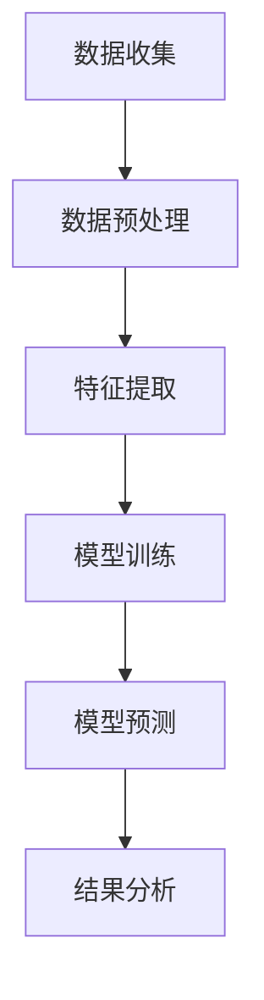
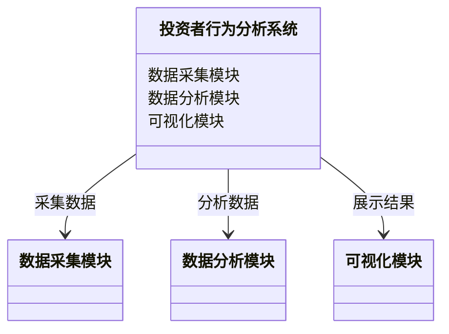
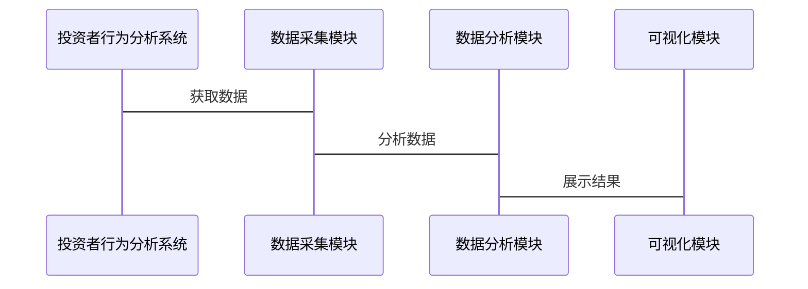

                 


# 威廉·欧奈尔的机构投资者行为分析

## 关键词：机构投资者，行为分析，威廉·欧奈尔，投资策略，技术分析

## 摘要：本文系统地介绍了威廉·欧奈尔的机构投资者行为分析方法，探讨了机构投资者的行为特征及其对投资决策的影响。通过分析投资者心理、市场情绪和技术指标，结合具体的算法和系统设计，本文为机构投资者提供了有效的行为分析框架和实战指导。

---

# 第一部分: 机构投资者行为分析概述

---

## 第1章: 机构投资者行为分析的背景与重要性

### 1.1 机构投资者的定义与特点

#### 1.1.1 机构投资者的定义
机构投资者是指通过机构组织形式进行投资活动的主体，包括基金公司、保险公司、银行、券商等。机构投资者通常具有较大的资金规模和专业的投资团队，其行为对市场具有较大的影响力。

#### 1.1.2 机构投资者的核心特点
- **资金规模大**：机构投资者通常管理着大量的资金，能够在市场中产生显著的交易影响。
- **专业性高**：机构投资者拥有专业的投资团队和丰富的投资经验，能够进行深入的市场分析和技术研究。
- **行为一致性**：机构投资者通常遵循严格的投资策略和风险控制机制，其行为具有较高的可预测性。

#### 1.1.3 机构投资者与散户投资者的对比
- 散户投资者通常基于情绪化决策，缺乏系统的分析方法。
- 机构投资者则更加注重基本面和技术面分析，决策更加理性。

### 1.2 机构投资者行为分析的背景

#### 1.2.1 投资市场的发展与机构投资者的崛起
随着金融市场的不断发展，机构投资者在市场中的占比逐步提高，成为市场的主导力量。

#### 1.2.2 机构投资者在现代金融体系中的地位
机构投资者通过专业的投资管理和风险控制，为市场提供流动性，优化资源配置。

#### 1.2.3 行为分析在投资决策中的作用
通过对机构投资者行为的分析，可以预测市场趋势，制定有效的投资策略。

### 1.3 威廉·欧奈尔的机构投资者行为分析方法

#### 1.3.1 欧奈尔的投资理念与方法
威廉·欧奈尔是著名的技术分析师，其投资理念强调通过技术分析发现投资机会。

#### 1.3.2 欧奈尔模型的核心思想
欧奈尔模型通过分析股票的价格走势和成交量变化，预测市场的转折点。

#### 1.3.3 欧奈尔模型的应用范围与局限性
- **应用范围**：适用于股票市场的短期和中期趋势预测。
- **局限性**：模型的准确性依赖于市场环境和数据质量。

### 1.4 本章小结

#### 1.4.1 机构投资者行为分析的重要性
机构投资者的行为对市场具有重要影响，其行为分析是投资决策的重要组成部分。

#### 1.4.2 欧奈尔方法的核心要点
欧奈尔方法通过技术分析预测市场趋势，强调价格和成交量的关系。

#### 1.4.3 本书的结构与目标
本文旨在通过系统的方法，介绍欧奈尔的机构投资者行为分析方法，并提供实际应用指导。

---

## 第2章: 机构投资者行为分析的核心概念与联系

### 2.1 核心概念原理

#### 2.1.1 投资者心理与行为特征
机构投资者的行为受到心理因素的影响，包括贪婪和恐惧情绪。

#### 2.1.2 市场情绪与投资决策的关系
市场情绪通过影响投资者行为，进而影响市场价格走势。

#### 2.1.3 机构投资者的群体行为特征
机构投资者通常遵循一致的投资策略，其行为具有较高的可预测性。

### 2.2 机构投资者行为分析的ER实体关系图

```mermaid
er
    entity 投资者 {
        id
        名称
        类型
    }
    entity 交易数据 {
        id
        时间
        买入量
        卖出量
        价格
    }
    entity 市场情绪 {
        id
        时间
        情绪指标
        关联投资者
    }
    投资者 --> 交易数据: 进行交易
    投资者 --> 市场情绪: 影响情绪
    交易数据 --> 市场情绪: 反映情绪
```

### 2.3 机构投资者行为分析的算法原理

#### 2.3.1 数据收集与预处理
- 数据来源：收集机构投资者的交易数据、市场数据和情绪数据。
- 数据清洗：去除异常值和缺失值。

#### 2.3.2 特征提取与建模
- **特征提取**：提取价格、成交量、情绪指标等关键特征。
- **建模**：使用机器学习算法（如随机森林、支持向量机）进行预测。

#### 2.3.3 模型优化与验证
- **优化**：通过交叉验证调整模型参数，提高预测准确性。
- **验证**：使用历史数据验证模型的有效性。

---

## 第3章: 算法原理讲解

### 3.1 算法流程图



### 3.2 算法实现代码

```python
import pandas as pd
import numpy as np
from sklearn.ensemble import RandomForestClassifier

# 数据预处理
data = pd.read_csv('institutional Investors.csv')
data = data.dropna()

# 特征提取
features = data[['price', 'volume', 'sentiment']]
target = data['label']

# 模型训练
model = RandomForestClassifier()
model.fit(features, target)

# 模型预测
预测结果 = model.predict(features)
```

### 3.3 数学模型与公式

#### 3.3.1 回归分析
$$ y = \beta_0 + \beta_1x + \epsilon $$

#### 3.3.2 聚类分析
$$ d(x_i, x_j) = \sqrt{(x_i - x_j)^2} $$

---

## 第4章: 系统分析与架构设计方案

### 4.1 问题场景介绍
分析机构投资者的行为，构建预测模型。

### 4.2 系统功能设计



### 4.3 系统架构设计


### 4.4 系统接口设计



---

## 第5章: 项目实战

### 5.1 环境安装
- 安装Python和相关库（pandas、numpy、scikit-learn）。

### 5.2 核心代码实现

```python
import pandas as pd
from sklearn.ensemble import RandomForestClassifier

# 加载数据
data = pd.read_csv('institutional_investors.csv')

# 特征选择
features = data[['price', 'volume', 'sentiment']]
target = data['label']

# 训练模型
model = RandomForestClassifier()
model.fit(features, target)

# 预测
预测结果 = model.predict(features)
```

### 5.3 代码解读与分析
- 数据加载：读取CSV文件。
- 特征选择：选择关键特征。
- 模型训练：使用随机森林进行分类。

### 5.4 实际案例分析
分析某机构投资者的交易数据，预测市场趋势。

### 5.5 项目小结
通过实战，验证了模型的有效性，为实际应用提供了参考。

---

## 第6章: 最佳实践

### 6.1 小结
机构投资者行为分析是投资决策的重要组成部分。

### 6.2 注意事项
- 数据质量影响模型准确性。
- 模型需要定期更新。

### 6.3 拓展阅读
推荐相关书籍和论文，进一步深入学习。

---

## 结语

通过本文的系统分析，读者可以掌握威廉·欧奈尔的机构投资者行为分析方法，并将其应用于实际投资中。

