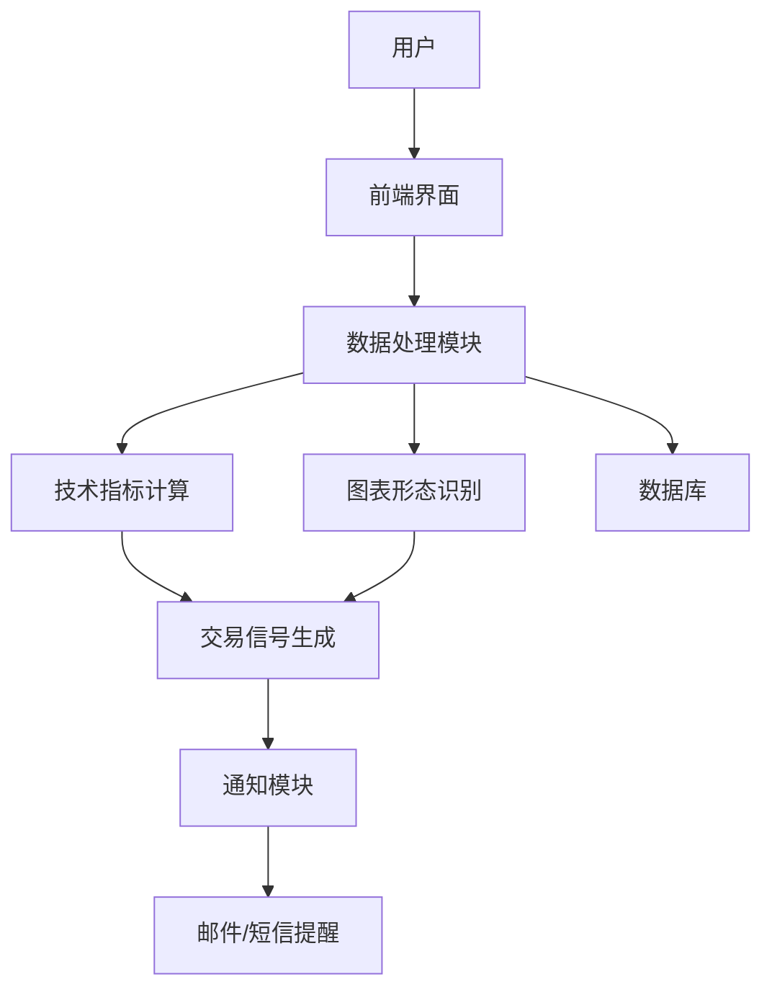
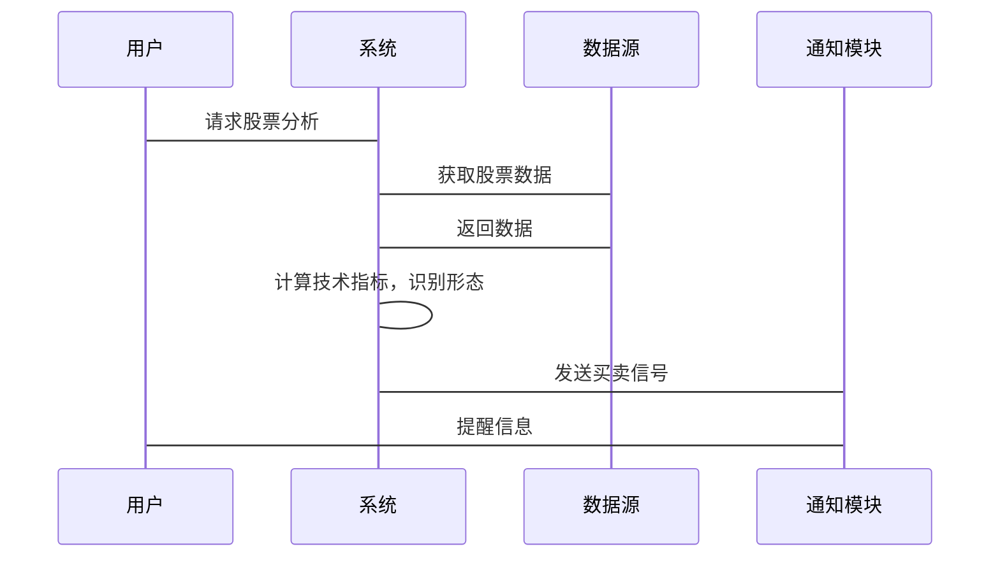

                 


---

# 威廉·欧奈尔的股票图表分析技巧

## 关键词：
- 股票图表分析
- 威廉·欧奈尔
- 技术分析
- CAN SLIM策略
- 相对强度指数
- 股票交易

## 摘要：
本文深入探讨了威廉·欧奈尔的股票图表分析技巧，重点介绍了其CAN SLIM策略、技术指标和图表形态的应用。通过系统化的分析方法，结合实际案例，为读者提供了一套科学的股票分析体系。内容涵盖背景介绍、核心概念、技术分析、数学模型、系统架构和项目实战，帮助投资者提升分析能力。

---

## 第六章: 项目实战：基于威廉·欧奈尔的股票分析系统

### 6.2 图表分析与策略应用（续）

#### 6.2.3 确定买卖时机与风险管理
##### 6.2.3.1 买入时机的选择
- 使用CAN SLIM策略筛选出符合条件的股票。
- 结合相对强度指数（RSI）判断超买或超卖状态。
- 等待股票价格突破关键阻力位或趋势线时进场。

##### 6.2.3.2 卖出时机的选择
- 当RSI显示超买，股价接近前期高点时考虑卖出。
- 股价跌破支撑位或趋势线时迅速离场。

##### 6.2.3.3 风险管理策略
- 设置止损点：通常将止损设在支撑位或趋势线下方。
- 分阶段建仓：避免一次性投入，分批建仓降低风险。
- 定期复盘：回顾交易记录，总结经验教训。

#### 6.2.4 案例分析：苹果公司（AAPL）
##### 6.2.4.1 基本面分析
- 苹果公司是全球科技巨头，具有强大的品牌影响力和市场地位。
- 公司产品创新能力强，市场需求稳定。
- 财务状况良好，盈利能力持续增长。

##### 6.2.4.2 图表分析
- 使用K线图观察苹果股价的长期趋势。
- 确定关键支撑位和阻力位，识别潜在的买入和卖出点。
- 应用相对强度指数（RSI）判断超买超卖状态。

##### 6.2.4.3 技术指标应用
- 计算20日、50日和200日移动平均线（MA），观察股价与MA的关系。
- 使用MACD指标判断市场趋势，当MACD线向上交叉时，视为买入信号。
- 相对强度指数（RSI）显示苹果股价在超卖区域时，可能是买入机会。

##### 6.2.4.4 买卖时机
- 2023年，苹果股价在100美元附近徘徊，突破100美元时考虑买入。
- 当股价接近前期高点150美元时，若RSI显示超买，考虑卖出。

---

## 第七章: 总结与最佳实践

### 7.1 章节回顾与核心内容总结
- 本文详细介绍了威廉·欧奈尔的CAN SLIM策略，涵盖从基本面分析到技术指标的应用。
- 通过系统化的分析方法，帮助投资者识别优质股票并判断买卖时机。
- 强调了风险管理的重要性，避免重大损失。

### 7.2 最佳实践与注意事项
- **坚持长期投资**：选择基本面良好、具有竞争优势的公司。
- **结合技术与基本面**：技术分析辅助决策，基本面分析提供公司价值判断。
- **严格遵守纪律**：制定明确的买卖规则，避免情绪化交易。
- **持续学习与复盘**：定期回顾交易记录，总结经验教训，优化分析策略。

### 7.3 拓展阅读与学习资源
- 推荐书籍：《股市晴雨表》、《投资者的圣经》。
- 在线资源：学习技术分析课程，参与投资论坛讨论。
- 工具推荐：使用TradingView、MetaTrader等图表分析工具。

---

## 第八章: 系统分析与架构设计

### 8.1 系统分析背景介绍
- 为了更好地应用威廉·欧奈尔的分析技巧，设计一个自动化股票分析系统。
- 系统目标：实时监控股票数据，自动触发买卖信号，管理投资组合。

### 8.2 系统功能设计
- 数据采集模块：实时获取股票数据，包括价格、成交量等。
- 数据处理模块：计算技术指标（RSI、MA），识别图表形态。
- 分析模块：基于CAN SLIM策略筛选股票，判断买卖时机。
- 用户界面：展示分析结果，提供交易提醒。

### 8.3 系统架构设计


### 8.4 系统接口设计
- 数据接口：与数据源（如Yahoo Finance）对接，获取股票数据。
- 用户接口：提供可视化界面，显示分析结果和交易信号。
- 通知接口：当触发买卖信号时，发送提醒到用户设备。

### 8.5 系统交互流程


---

## 第九章: 数学模型与算法实现

### 9.1 相对强度指数（RSI）的数学模型
$$ RSI = \frac{\text{上涨幅度总和}}{\text{上涨幅度总和} + \text{下跌幅度总和}} \times 100 $$

### 9.2 移动平均线（MA）的计算公式
$$ MA_n = \frac{\sum_{i=1}^{n} P_i}{n} $$

### 9.3 算法实现
```python
import pandas as pd
import numpy as np

def calculate_rsi(data, period=14):
    diff = data['Close'].diff(1).dropna()
    up = diff.where(diff > 0, 0)
    down = diff.where(diff < 0, 0)
    rs = up.rolling(period).mean() / down.rolling(period).mean()
    rsi = 100 - 100 * (1 - rs)
    return rsi

def calculate_ma(data, period=20):
    ma = data['Close'].rolling(period).mean()
    return ma
```

---

## 第十章: 项目实战与总结

### 10.1 环境安装与数据采集
- 安装Python、Pandas、Matplotlib等工具。
- 使用Yahoo Finance API获取股票数据。

### 10.2 核心实现与代码解读
```python
import pandas as pd
import matplotlib.pyplot as plt

# 获取数据
data = pd.read_csv('AAPL.csv')

# 计算RSI和MA
rsi = calculate_rsi(data)
ma_20 = calculate_ma(data, 20)
ma_50 = calculate_ma(data, 50)

# 绘制图表
plt.figure(figsize=(12, 6))
plt.plot(data['Date'], data['Close'], label='Close Price')
plt.plot(data['Date'], ma_20, label='20-day MA')
plt.plot(data['Date'], ma_50, label='50-day MA')
plt.legend()
plt.show()
```

### 10.3 案例分析与总结
- 使用上述代码分析苹果公司股票，观察RSI和MA的变化。
- 结合图表形态判断买卖时机，优化投资决策。

### 10.4 项目小结
- 自动化分析系统提高了股票分析的效率和准确性。
- 算法和模型的应用使技术分析更加科学化。
- 实战案例验证了威廉·欧奈尔策略的有效性。

---

## 第十一章: 最终总结与展望

### 11.1 核心观点总结
- 威廉·欧奈尔的CAN SLIM策略结合了基本面和技术分析，是有效的投资工具。
- 技术指标和图表形态的应用需要结合实际市场情况灵活运用。
- 自动化分析系统是未来股票投资的重要发展方向。

### 11.2 未来展望
- 进一步优化分析算法，引入机器学习提升预测准确性。
- 开发更多功能模块，如风险管理、组合优化等。
- 推动股票分析工具的智能化和自动化，为投资者提供更多价值。

---

通过以上章节的详细分析，读者可以全面掌握威廉·欧奈尔的股票图表分析技巧，并将其应用到实际投资中，提升分析效率和准确性。

