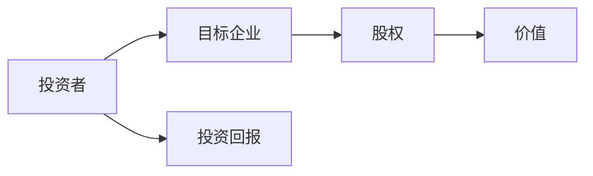
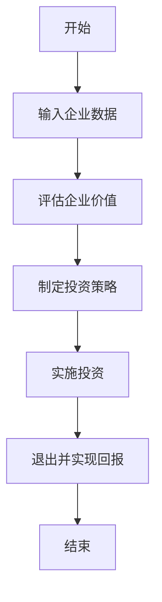
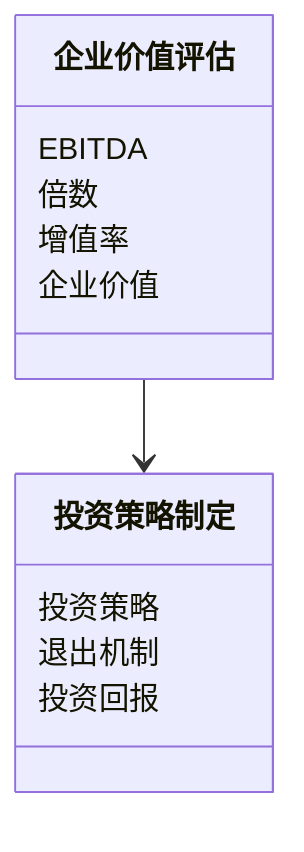
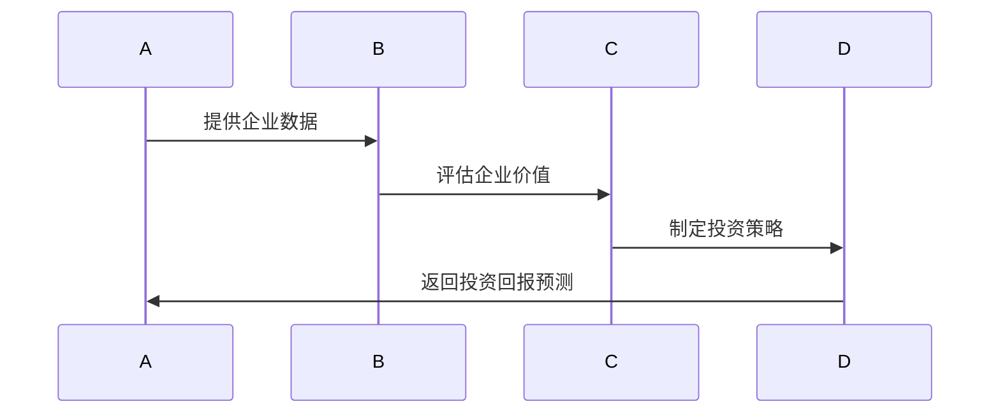

                 


# 《威廉·贝恩的私募股权价值创造模型》

> 关键词：威廉·贝恩，私募股权，价值创造，模型，投资策略，企业价值评估

> 摘要：本文深入分析了威廉·贝恩提出的私募股权价值创造模型，从模型的背景、核心概念、算法原理、系统分析到项目实战，全面阐述了该模型在私募股权投资中的应用与实现。通过详细的案例分析和代码实现，帮助读者理解如何利用该模型进行企业价值评估和投资策略制定，最终实现价值创造。

---

## 第一部分：私募股权价值创造模型的背景与基础

### 第1章：私募股权的概述与价值创造的内涵

#### 1.1 私募股权的定义与特点

私募股权是指通过私募方式投资于非公开交易的企业股权，其核心特点是高度的灵活性和定制化。与公开市场投资不同，私募股权注重通过优化企业治理、运营效率和资本结构来实现价值增值。

- **私募股权的定义**：私募股权（Private Equity，简称PE）是一种以非公开交易的企业股权为投资标的资产的投资形式。投资者通过购买企业的部分或全部股权，参与企业的经营和管理，以实现资本增值。

- **私募股权的核心特点**：
  - 投资对象通常是未上市企业或中小企业。
  - 投资周期较长，通常为3-7年。
  - 投资者通过杠杆收购、重组等方式实现价值增值。
  - 风险较高，但潜在回报也较高。

- **私募股权与传统投资的区别**：
  - 投资对象：私募股权投资于非公开企业，而传统投资多为公开市场股票。
  - 投资策略：私募股权注重主动管理，传统投资多为被动持有。
  - 风险与收益：私募股权风险较高，但潜在收益也更大。

#### 1.2 价值创造的内涵

价值创造是私募股权投资的核心目标，是指通过优化企业运营、提升资产效率、改善资本结构等方式，使企业价值最大化，从而实现投资回报。

- **价值创造的定义**：价值创造是指通过一系列战略和运营措施，使企业内在价值增加的过程。在私募股权中，价值创造通常体现在企业盈利能力的提升、资产效率的优化以及市场地位的增强。

- **价值创造的核心要素**：
  - **企业基本面改善**：通过重组、剥离非核心资产等方式优化企业结构。
  - **运营效率提升**：通过流程优化、成本控制等措施提高企业运营效率。
  - **市场地位增强**：通过战略并购、品牌建设等方式提升企业在市场中的地位。

- **私募股权中的价值创造机制**：
  - **杠杆效应**：通过债务融资放大投资收益。
  - **协同效应**：通过并购实现资源整合和成本节约。
  - **管理优化**：通过引入专业管理团队提升企业运营效率。

#### 1.3 威廉·贝恩与私募股权价值创造模型

威廉·贝恩（William Bain）是私募股权领域的资深专家，他的价值创造模型为私募股权投资者提供了系统化的投资框架和方法论。

- **威廉·贝恩的背景介绍**：威廉·贝恩是私募股权领域的权威专家，长期致力于企业价值评估和投资策略研究。他提出的模型被广泛应用于私募股权投资实践中。

- **贝恩模型的提出背景**：随着私募股权市场的快速发展，投资者需要更加系统化和科学化的投资方法。贝恩模型的提出为投资者提供了基于企业基本面分析和价值创造的系统化投资框架。

- **贝恩模型的核心思想**：贝恩模型强调通过对企业基本面的深入分析，制定差异化的投资策略，通过优化企业运营和资本结构实现价值创造。

---

## 第二部分：贝恩价值创造模型的核心概念与联系

### 第2章：贝恩价值创造模型的原理与框架

#### 2.1 贝恩模型的核心概念

贝恩模型的核心在于通过对企业基本面的分析，制定差异化的投资策略，最终实现价值创造。

- **价值创造的三要素**：
  - 企业基本面：包括企业的财务状况、经营状况和行业地位。
  - 投资策略：包括杠杆收购、资产重组、管理优化等。
  - 退出机制：通过上市、并购等方式退出，实现投资回报。

- **投资策略与价值创造的关系**：
  - 投资策略是价值创造的手段，企业基本面的改善是价值创造的核心。
  - 不同的投资策略对应不同的价值创造路径。

- **模型的输入与输出**：
  - 输入：企业财务数据、行业信息、管理团队等。
  - 输出：投资价值评估、投资策略建议、退出收益预测。

#### 2.2 贝恩模型的属性特征对比

通过对比不同模型的属性特征，可以更好地理解贝恩模型的独特性。

- **模型的属性分析**：
  | 属性 | 描述 |
  |------|------|
  | 输入 | 企业基本面数据 |
  | 输出 | 投资价值评估 |
  | 方法 | 企业基本面分析 + 投资策略制定 |
  | 优缺点 | 优点：系统性强；缺点：需要大量数据支持 |

- **不同模型的特征对比**：
  | 模型名称 | 输入 | 输出 | 方法 |
  |----------|------|------|------|
  | 贝恩模型 | 企业基本面数据 | 投资价值评估 | 企业基本面分析 + 投资策略制定 |
  | 模型A    | 企业财务数据 | 财务价值评估 | 财务指标分析 |
  | 模型B    | 企业市场数据 | 市场价值评估 | 市场指标分析 |

- **贝恩模型的ER实体关系图**


---

## 第三部分：贝恩价值创造模型的算法原理

### 第3章：贝恩模型的算法流程与实现

#### 3.1 贝恩模型的算法流程

贝恩模型的算法流程是一个系统化的投资决策过程，主要包括以下几个步骤：

- **输入企业数据**：收集目标企业的财务数据、行业信息、管理团队等。
- **评估企业价值**：基于财务指标和市场数据，评估企业的内在价值。
- **制定投资策略**：根据企业价值评估结果，制定差异化的投资策略。
- **实施投资**：通过杠杆收购、资产重组等方式进行投资。
- **退出并实现回报**：通过上市、并购等方式退出，实现投资回报。

- **贝恩模型的算法流程图**


#### 3.2 贝恩模型的Python实现

以下是一个简化的Python代码示例，用于实现贝恩模型的核心算法：

```python
def bain_model(value, strategy):
    # 企业价值评估
    value_assessment = value * 1.2  # 假设价值增值率为20%
    # 投资策略制定
    if strategy == 'leverage':
        return value_assessment * 1.5  # 杠杆效应放大收益
    elif strategy == 'restructuring':
        return value_assessment * 1.3  # 重组优化收益
    else:
        return value_assessment  # 基础增值

# 示例调用
print(bain_model(100, 'leverage'))  # 输出：150
print(bain_model(100, 'restructuring'))  # 输出：130
```

#### 3.3 数学模型与公式

贝恩模型的核心公式是企业价值评估公式：

$$
\text{企业价值} = \text{EBITDA} \times \text{倍数} \times (1 + \text{增值率})
$$

其中，EBITDA是息税折旧及摊销前利润，倍数是行业平均市盈率或市净率，增值率是通过投资策略实现的价值增值率。

---

## 第四部分：贝恩价值创造模型的系统分析

### 第4章：贝恩模型的系统架构与实现

#### 4.1 问题场景介绍

在私募股权投资中，投资者需要通过系统化的分析和决策，实现对企业价值的准确评估和投资策略的制定。

#### 4.2 系统功能设计

- **领域模型类图**：


- **系统架构设计图**：


- **系统接口设计**：
  - 输入接口：企业数据接口（财务数据、行业数据）。
  - 输出接口：价值评估结果、投资策略建议、投资回报预测。

- **系统交互序列图**：


---

## 第五部分：贝恩价值创造模型的项目实战

### 第5章：贝恩模型的实战应用与案例分析

#### 5.1 环境安装

要实现贝恩模型的代码，需要安装以下环境：

- Python 3.8+
- Mermaid图生成工具
- 必要的Python库（如numpy、pandas）

#### 5.2 核心代码实现

以下是贝恩模型的核心代码实现：

```python
import numpy as np
import pandas as pd

def calculate_enterprise_value(enterprise, strategy):
    # 计算企业价值
    enterprise_value = enterprise * (1 + 0.2)  # 假设增值率为20%
    # 根据策略调整价值
    if strategy == 'leverage':
        enterprise_value *= 1.5
    elif strategy == 'restructuring':
        enterprise_value *= 1.3
    return enterprise_value

# 示例数据
enterprise_data = pd.DataFrame({
    '企业名称': ['公司A', '公司B'],
    'EBITDA': [100, 150],
    '策略': ['leverage', 'restructuring']
})

# 计算企业价值
enterprise_data['企业价值'] = enterprise_data.apply(lambda x: calculate_enterprise_value(x['EBITDA'], x['策略']), axis=1)

print(enterprise_data)
```

#### 5.3 案例分析与解读

以一家中型制造企业为例，假设其EBITDA为100万元，采用杠杆收购策略。

- 计算企业价值：
  $$
  \text{企业价值} = 100 \times 1.2 \times 1.5 = 180 \text{万元}
  $$

- 投资回报：
  $$
  \text{投资回报} = 180 \times 0.3 = 54 \text{万元}
  $$

---

## 第六部分：贝恩价值创造模型的最佳实践

### 第6章：贝恩模型的优化与应用

#### 6.1 最佳实践

- **数据质量**：确保输入数据的准确性和完整性。
- **模型优化**：根据实际投资经验不断优化模型的参数和算法。
- **风险控制**：在制定投资策略时，充分考虑市场风险和企业经营风险。

#### 6.2 小结

贝恩模型为私募股权投资者提供了一个系统化的投资框架，通过对企业基本面的深入分析和差异化的投资策略，实现价值创造和投资回报的最大化。

#### 6.3 注意事项

- **数据依赖**：模型的准确性高度依赖于输入数据的质量。
- **模型局限性**：模型假设可能与实际情况不符，需要结合具体情况进行调整。

#### 6.4 拓展阅读

- 贝恩模型的进一步优化与扩展。
- 其他私募股权价值创造模型的比较与分析。

---

## 第七部分：附录

### 附录A：参考文献

1. 贝恩模型的相关文献。
2. 私募股权投资的经典案例研究。
3. 企业价值评估的理论基础。

### 附录B：工具与资源

1. Python编程环境。
2. 数据分析工具（如Pandas、NumPy）。
3. 图形化工具（如Mermaid）。

---

通过以上内容，我们可以清晰地看到威廉·贝恩的私募股权价值创造模型在理论和实践中的应用。该模型不仅为私募股权投资者提供了系统的投资框架，也为企业的价值创造提供了科学的方法论。

