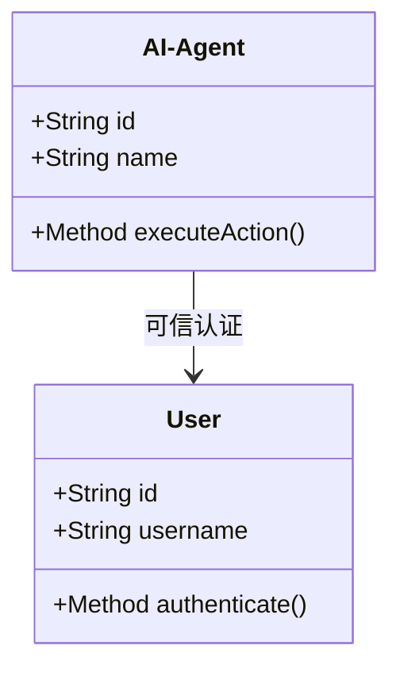
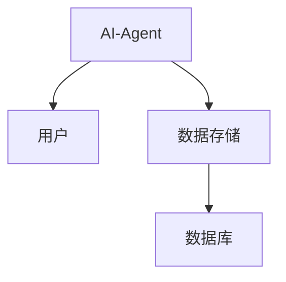
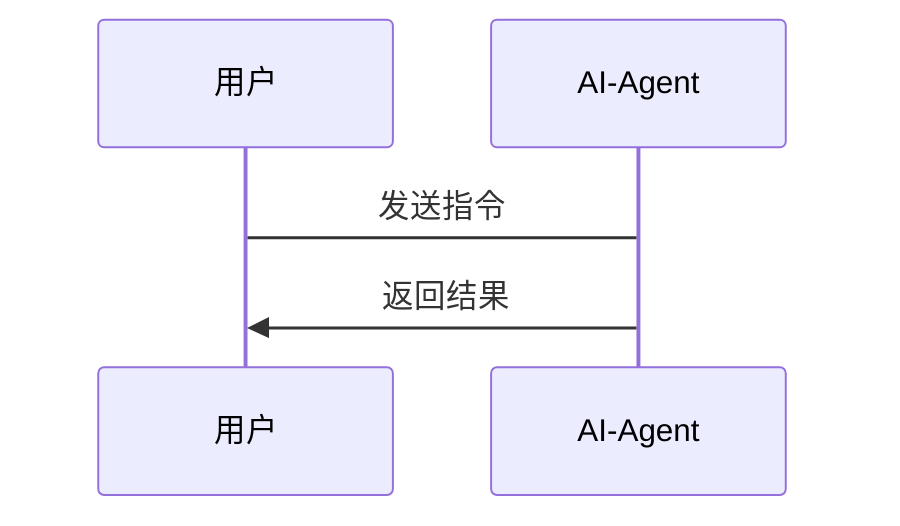

                 


# 安全与隐私保护：构建可信赖的AI Agent

> 关键词：AI Agent, 安全与隐私保护, 可信赖系统, 加密算法, 隐私增强技术, 系统架构设计

> 摘要：在AI Agent快速发展的背景下，安全与隐私保护成为构建可信赖系统的基石。本文从AI Agent的基本概念出发，深入探讨安全与隐私保护的核心概念、算法原理、系统架构设计以及实际项目实现。通过详细分析加密算法、隐私增强技术等关键点，结合实际案例，为构建可信赖的AI Agent提供全面的技术指导。

---

## 第1章 AI Agent与安全隐私概述

### 1.1 AI Agent的基本概念

AI Agent（人工智能代理）是指能够感知环境并采取行动以实现目标的智能实体。它通常具备以下特点：
- **自主性**：能够独立决策和行动。
- **反应性**：能够实时感知环境并做出反应。
- **目标导向**：通过行动实现特定目标。
- **社交能力**：能够与其他系统或人类进行交互。

AI Agent的应用场景广泛，包括智能助手、推荐系统、自动驾驶等。然而，随着AI Agent的普及，安全与隐私问题日益突出。

### 1.2 安全与隐私保护的背景

#### 1.2.1 当前AI技术的应用场景
AI Agent的应用场景包括但不限于：
- **智能助手**：如Siri、Alexa等，能够处理用户的语音指令。
- **推荐系统**：基于用户行为推荐商品或内容。
- **自动驾驶**：通过感知环境做出驾驶决策。

#### 1.2.2 安全与隐私问题的突出性
AI Agent的广泛应用带来了以下安全与隐私问题：
- **数据泄露**：AI Agent需要处理大量用户数据，存在被恶意攻击的风险。
- **隐私侵犯**：用户数据可能被滥用，导致隐私泄露。
- **算法滥用**：攻击者可能利用AI算法的漏洞进行攻击。

#### 1.2.3 构建可信赖AI Agent的目标
构建可信赖的AI Agent需要实现以下目标：
- **数据安全**：确保数据在采集、存储和传输过程中的安全性。
- **隐私保护**：防止用户隐私被未经授权的主体获取或使用。
- **算法安全**：确保AI算法的鲁棒性，防止被攻击者操纵。

### 1.3 可信赖AI Agent的核心要素

#### 1.3.1 可信赖的定义与内涵
可信赖的AI Agent需要满足以下条件：
- **透明性**：用户能够理解AI Agent的行为和决策过程。
- **可控性**：用户能够控制AI Agent的行为，防止滥用。
- **可靠性**：AI Agent能够在各种环境下稳定运行。

#### 1.3.2 安全性与隐私保护的关系
安全性是隐私保护的前提，而隐私保护是安全性的重要组成部分。两者相辅相成，共同构建可信赖的AI Agent。

#### 1.3.3 可信赖AI Agent的实现路径
实现可信赖的AI Agent需要从以下几个方面入手：
- **数据安全**：采用加密技术保护数据。
- **隐私保护**：通过隐私增强技术（如差分隐私）保护用户隐私。
- **算法安全**：确保AI算法的鲁棒性和不可被滥用性。

---

## 第2章 安全与隐私保护的核心概念

### 2.1 安全与隐私保护的基本原理

#### 2.1.1 安全性与隐私保护的定义
- **安全性**：指系统在面对攻击或意外事件时仍能正常运行的能力。
- **隐私保护**：指保护用户数据不被未经授权的主体获取或使用的措施。

#### 2.1.2 安全与隐私保护的原则与框架
- **最小权限原则**：用户权限应与其任务需求最小化。
- **数据最小化原则**：仅收集实现目标所需的最小数据。

#### 2.1.3 核心概念的对比分析
以下是安全性与隐私保护的核心概念对比：

| 概念        | 安全性            | 隐私保护          |
|-------------|-------------------|-------------------|
| 定义        | 防御攻击的能力    | 数据保护          |
| 实现方式    | 加密、访问控制    | 数据脱敏、匿名化   |
| 关注点      | 防止数据泄露      | 防止数据被滥用    |

### 2.2 安全与隐私保护的技术体系

#### 2.2.1 数据安全技术
数据安全技术包括：
- **加密技术**：对数据进行加密，防止未经授权的访问。
- **访问控制**：通过权限管理控制数据访问范围。

#### 2.2.2 隐私保护技术
隐私保护技术包括：
- **数据脱敏**：对敏感数据进行变形处理，使其无法还原。
- **差分隐私**：通过在数据中添加噪声，保护个体隐私。

#### 2.2.3 安全与隐私保护的整合
安全与隐私保护需要在系统设计中有机结合，例如：
- 在数据存储时使用加密技术。
- 在数据处理时使用差分隐私技术。

### 2.3 安全与隐私保护的伦理与法律问题

#### 2.3.1 隐私保护的伦理框架
隐私保护需要遵循以下伦理原则：
- **尊重用户隐私**：在设计和实现AI Agent时，必须尊重用户的隐私权。
- **透明性**：用户应被告知其数据的使用方式。

#### 2.3.2 安全与隐私保护的法律要求
各国和地区对数据安全和隐私保护有不同的法律要求，例如：
- **欧盟GDPR**：要求企业保护用户数据，并在数据泄露时及时通知用户。
- **中国《个人信息保护法》**：要求企业合法收集和使用个人信息。

#### 2.3.3 技术与法律的平衡
技术手段需要符合法律要求，同时法律也需要适应技术的发展。例如，AI Agent的设计需要考虑GDPR或《个人信息保护法》的要求。

---

## 第3章 安全与隐私保护的算法原理

### 3.1 加密算法在安全与隐私保护中的应用

#### 3.1.1 对称加密与非对称加密
- **对称加密**：加密和解密使用相同的密钥，速度快，适用于大量数据加密。
- **非对称加密**：加密和解密使用不同的密钥，适用于数字签名和身份认证。

#### 3.1.2 加密算法的优缺点对比

| 算法类型      | 优点                     | 缺点                     |
|---------------|--------------------------|--------------------------|
| 对称加密      | 加密速度快               | 密钥管理复杂             |
| 非对称加密    | 密钥管理简单             | 加密速度较慢             |

### 3.2 隐私增强技术

#### 3.2.1 数据脱敏技术
数据脱敏是通过对敏感数据进行变形处理，使其无法还原的过程。例如：
- 将姓名替换为XX。
- 将年龄替换为年龄范围。

#### 3.2.2 差分隐私技术
差分隐私是一种通过在数据中添加噪声来保护个体隐私的技术。其数学模型如下：

$$ P(\text{发布} D) = P(\text{发布} D' \mid D) $$

其中，D是真实数据，D'是发布数据。

### 3.3 安全与隐私保护的算法实现

#### 3.3.1 算法选择与优化
算法选择需要考虑以下因素：
- **安全性**：算法必须能够抵御常见的攻击。
- **效率**：算法必须能够在合理时间内完成。

#### 3.3.2 算法实现的步骤与流程
1. 确定需求：明确数据安全和隐私保护的具体要求。
2. 选择算法：根据需求选择合适的加密算法或隐私增强技术。
3. 实现算法：编写代码实现算法。
4. 测试验证：对算法进行测试，确保其安全性和有效性。

#### 3.3.3 算法实现的案例分析
以下是一个简单的差分隐私实现案例：

```python
import numpy as np

def add_noise(data, epsilon):
    n = len(data)
    noise = np.random.laplace(0, 1/epsilon, n)
    noisy_data = data + noise
    return noisy_data
```

其中，`epsilon`是隐私参数，控制噪声的大小。

---

## 第4章 安全与隐私保护的系统架构设计

### 4.1 系统功能设计

#### 4.1.1 领域模型
领域模型是一个系统的概念化表示，通常以类图形式展示。以下是一个简单的领域模型：



### 4.2 系统架构设计

#### 4.2.1 系统架构图
系统架构图展示了系统的各个部分及其关系。以下是一个简单的系统架构图：



### 4.3 系统接口设计
系统接口设计需要考虑以下几点：
- **输入接口**：用户输入指令。
- **输出接口**：AI Agent的输出结果。
- **数据接口**：数据的存储和检索。

### 4.4 系统交互流程

#### 4.4.1 交互流程
系统交互流程通常包括以下步骤：
1. 用户向AI Agent发送指令。
2. AI Agent处理指令并生成响应。
3. AI Agent将响应返回给用户。

#### 4.4.2 交互流程图
以下是一个简单的交互流程图：



---

## 第5章 项目实战：构建可信赖的AI Agent

### 5.1 环境配置

#### 5.1.1 安装依赖
需要安装以下依赖：
- Python 3.8+
- Scikit-learn
- TensorFlow

### 5.2 核心代码实现

#### 5.2.1 数据加密模块

```python
import cryptography
from cryptography.fernet import Fernet

def generate_key():
    key = Fernet.generate_key()
    return key

def encrypt_data(data, key):
    cipher = Fernet(key)
    encrypted_data = cipher.encrypt(data)
    return encrypted_data

def decrypt_data(encrypted_data, key):
    cipher = Fernet(key)
    decrypted_data = cipher.decrypt(encrypted_data)
    return decrypted_data
```

#### 5.2.2 隐私增强模块

```python
import numpy as np

def add_noise(data, epsilon):
    n = len(data)
    noise = np.random.laplace(0, 1/epsilon, n)
    noisy_data = data + noise
    return noisy_data
```

### 5.3 案例分析

#### 5.3.1 数据加密案例
```python
key = generate_key()
data = b"Sensitive information"
encrypted_data = encrypt_data(data, key)
decrypted_data = decrypt_data(encrypted_data, key)
print(decrypted_data.decode())
```

#### 5.3.2 隐私增强案例
```python
data = np.array([1, 2, 3, 4, 5])
epsilon = 0.1
noisy_data = add_noise(data, epsilon)
print(noisy_data)
```

### 5.4 项目小结
通过本项目，我们实现了一个可信赖的AI Agent，能够有效保护数据安全和用户隐私。

---

## 第6章 最佳实践与总结

### 6.1 最佳实践

#### 6.1.1 安全性原则
- **最小权限原则**：确保每个用户只拥有完成任务所需的最小权限。
- **数据最小化原则**：仅收集实现目标所需的最小数据。

#### 6.1.2 隐私保护原则
- **透明性**：向用户明示数据的收集和使用方式。
- **可选择性**：用户应有权选择是否共享数据。

### 6.2 小结
构建可信赖的AI Agent需要从安全性、隐私保护、算法实现等多个方面综合考虑。通过合理的系统设计和最佳实践，可以有效保护用户数据和隐私。

### 6.3 注意事项
- **定期更新**：安全威胁不断变化，需要定期更新安全策略和算法。
- **用户教育**：提高用户的隐私保护意识。

### 6.4 拓展阅读
- **《Data Privacy: A Comprehensive Guide》**
- **《Secure Software Engineering》**

---

通过以上内容，我们详细探讨了安全与隐私保护在构建可信赖AI Agent中的重要性，并提供了具体的实现方法和最佳实践。希望本文能够为相关领域的研究和实践提供有价值的参考。

