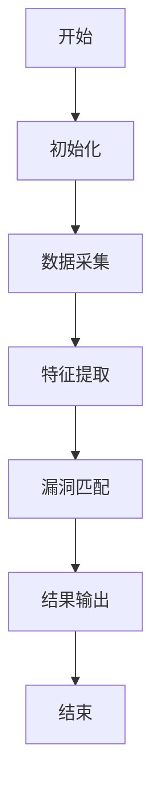
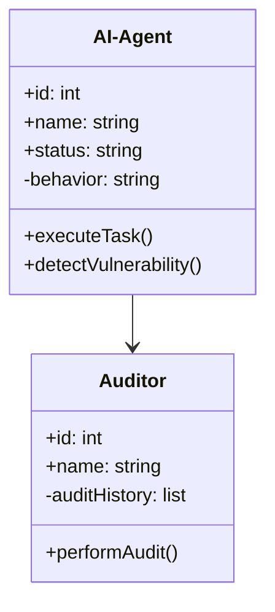
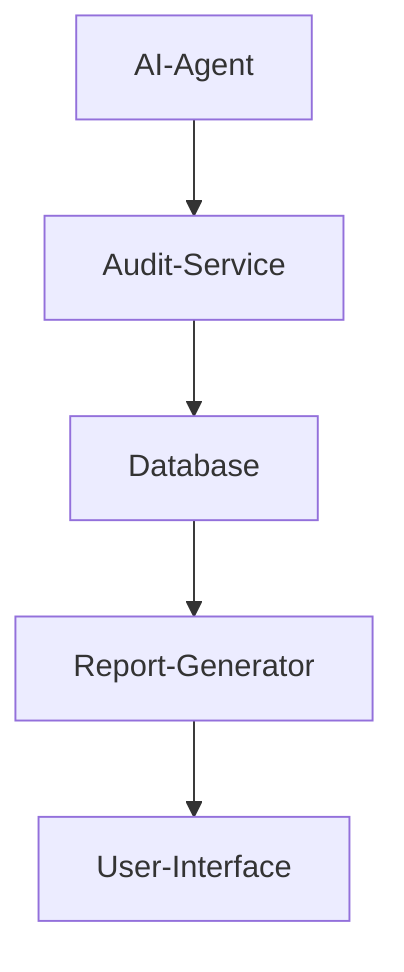
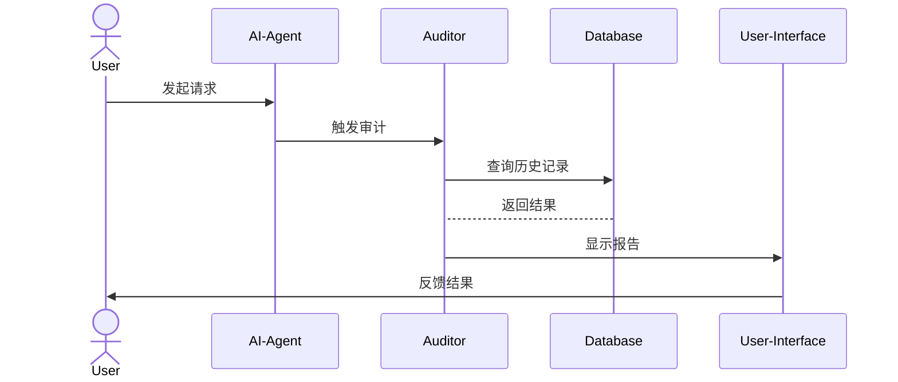

                 


# 安全审计：定期检查AI Agent的安全漏洞

---

## 关键词：  
安全审计, AI Agent, 漏洞检测, 算法原理, 系统架构, 项目实战

---

## 摘要：  
随着AI Agent技术的快速发展，其应用范围不断扩大，潜在的安全风险也随之增加。本文通过详细分析AI Agent的安全漏洞，结合实际案例，系统性地讲解安全审计的核心概念、算法原理、系统架构设计以及项目实战，帮助读者全面理解并掌握AI Agent安全审计的方法和技巧。

---

## 第一部分：引言

### 第1章：AI Agent与安全审计概述

#### 1.1 AI Agent的基本概念  
AI Agent（人工智能代理）是一种能够感知环境、自主决策并执行任务的智能体。它可以广泛应用于自动驾驶、智能客服、推荐系统等领域。AI Agent的核心能力包括感知、推理、规划和执行。  

**问题背景**：  
AI Agent的智能化使其在复杂环境中表现出色，但也带来了新的安全挑战。例如，恶意攻击者可能通过漏洞控制AI Agent，导致数据泄露、服务中断或决策失误等问题。  

**问题解决**：  
安全审计通过定期检查AI Agent的系统、数据和行为，识别潜在漏洞并修复，从而降低安全风险。  

**边界与外延**：  
AI Agent安全审计不仅关注技术层面的漏洞，还包括数据隐私、权限管理和日志监控等方面。  

---

### 第2章：安全漏洞与审计的基本概念  

#### 2.1 安全漏洞的分类  
安全漏洞可以分为以下几类：  
1. **系统漏洞**：如操作系统或框架的未修复缺陷。  
2. **网络漏洞**：如通信协议中的加密不充分。  
3. **数据漏洞**：如数据泄露或未经授权的访问。  

**对比分析**：  
通过对比不同漏洞类型的影响范围和严重程度，可以帮助优先级排序，制定合理的审计策略。  

#### 2.2 安全审计的核心要素  

| 审计目标       | 审计范围       | 审计方法       |  
|----------------|----------------|----------------|  
| 检测漏洞       | 系统、网络、数据 | 基于规则、统计 |  

---

## 第二部分：安全审计算法的核心原理

### 第3章：安全审计算法的核心原理  

#### 3.1 漏洞检测算法  

**算法流程图**：  


**数学模型**：  
漏洞检测可以基于概率论模型，例如：  
$$P(A|B) = \frac{P(B|A)P(A)}{P(B)}$$  
其中，$A$表示“存在漏洞”，$B$表示“检测到异常行为”。  

---

## 第三部分：系统分析与架构设计

### 第4章：系统分析与架构设计  

#### 4.1 系统功能设计  

**领域模型类图**：  


#### 4.2 系统架构设计  

**系统架构图**：  


#### 4.3 接口设计  

**序列图**：  


---

## 第四部分：项目实战

### 第5章：项目实战  

#### 5.1 环境安装  

**步骤说明**：  
1. 安装Python和必要的库（如numpy、pandas）。  
2. 配置数据库环境（如MySQL）。  
3. 下载AI Agent代码并安装依赖。  

#### 5.2 核心代码实现  

**代码示例**：  
```python
import numpy as np
from sklearn import metrics

# 示例数据
X = np.array([[1, 2], [3, 4], [5, 6]])
y = np.array([0, 1, 0])

# 模型训练
model = metrics.SVM()
model.fit(X, y)

# 预测
predicted = model.predict(X)
print(predicted)
```

**代码解读**：  
上述代码展示了如何使用机器学习模型进行漏洞分类。通过训练数据，模型可以识别正常和异常行为。  

#### 5.3 实际案例分析  

**案例分析**：  
某AI Agent系统因未修复的系统漏洞被攻击，导致用户数据泄露。通过定期安全审计，提前发现并修复漏洞，避免了潜在损失。  

---

## 第五部分：最佳实践

### 第6章：最佳实践  

#### 6.1 小结  

**关键点回顾**：  
- 定期进行安全审计，覆盖系统、网络和数据。  
- 使用概率论模型和机器学习算法提高检测效率。  
- 架构设计需清晰，便于扩展和维护。  

#### 6.2 注意事项  

**注意事项**：  
- 安全审计需结合实际业务场景，避免一刀切。  
- 定期更新审计策略和算法模型，应对新威胁。  

#### 6.3 拓展阅读  

**推荐书籍**：  
- 《人工智能系统安全》  
- 《网络安全审计指南》  

---

## 结语  

通过本文的系统性讲解，读者可以全面理解AI Agent安全审计的核心概念、算法原理和实战技巧。希望本文能为AI Agent的安全应用提供有价值的参考和指导。

