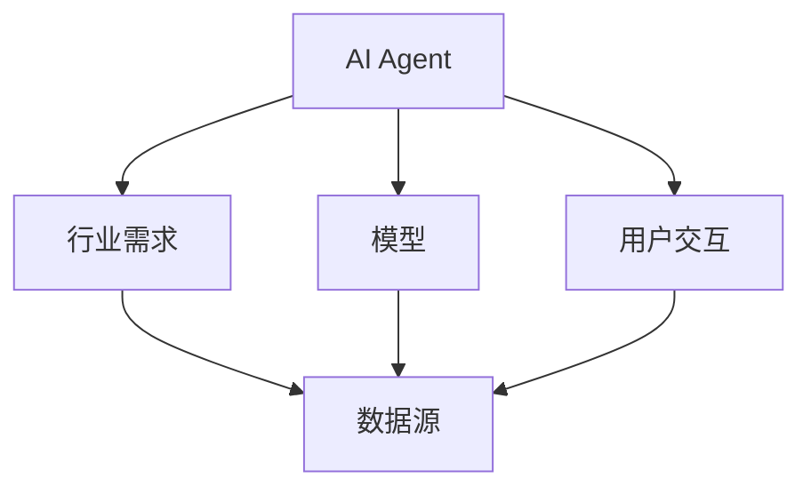
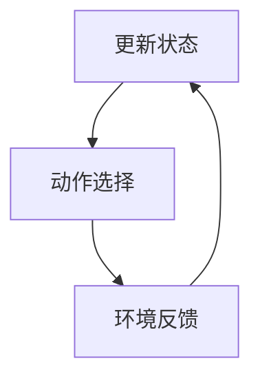
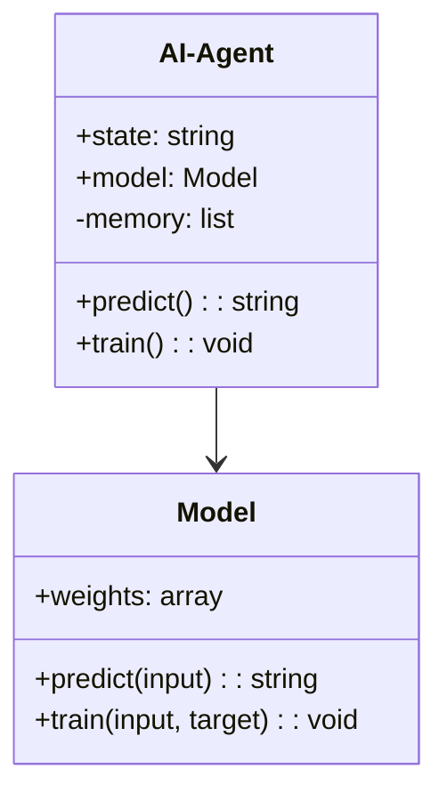
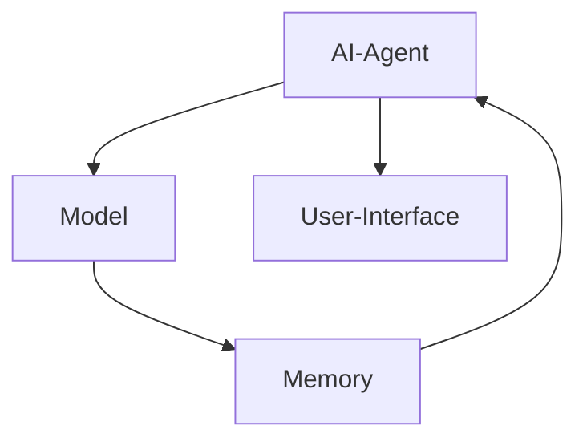
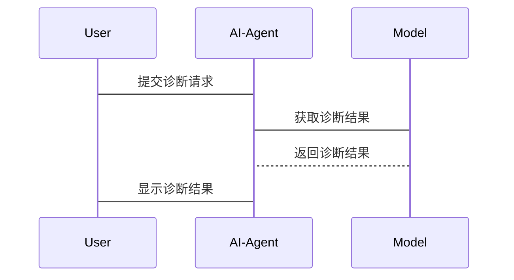

                 


# 定制化AI Agent：满足特定行业需求

## 关键词：
- 定制化AI Agent
- 人工智能
- 机器学习
- 行业适配
- 系统架构设计
- 数学建模
- 人机交互

## 摘要：
定制化AI Agent是指根据特定行业的需求进行量身定制的人工智能代理，旨在解决传统AI代理在多样化行业应用中的局限性。本文从背景、核心概念、算法原理、系统架构设计、项目实战到最佳实践，全面解析定制化AI Agent的实现过程，结合实际案例，深入浅出地分析其在不同行业中的应用价值和挑战。

---

# 第一部分: 定制化AI Agent的背景与核心概念

## 第1章: 定制化AI Agent的背景与问题背景

### 1.1 问题背景

#### 1.1.1 传统AI代理的局限性
传统AI代理通常基于通用模型，难以适应不同行业的独特需求，导致在特定场景下的表现受限。

#### 1.1.2 行业需求的多样化
不同行业对AI代理的需求差异显著，例如医疗行业的诊断辅助与金融行业的风险评估在数据类型和目标上存在本质区别。

#### 1.1.3 定制化AI Agent的必要性
为了满足特定行业的复杂需求，定制化AI Agent通过深度适配行业特点，提供更精准的解决方案。

### 1.2 问题描述

#### 1.2.1 行业需求与AI代理的适配性
不同行业的数据特征、任务目标和交互方式存在显著差异，需要AI代理具备高度的行业适配性。

#### 1.2.2 定制化AI Agent的核心目标
通过定制化设计，使AI代理能够高效解决特定行业的复杂问题，提升用户体验和业务效率。

#### 1.2.3 定制化AI Agent的应用场景
在医疗、金融、教育、制造等行业，定制化AI Agent可以用于诊断辅助、智能客服、个性化教学、生产优化等场景。

### 1.3 问题解决

#### 1.3.1 定制化AI Agent的设计思路
基于行业需求，设计AI代理的功能模块，包括数据采集、模型训练、人机交互等。

#### 1.3.2 定制化AI Agent的实现方法
通过数据预处理、特征工程、模型调优等技术，构建适合特定行业的AI代理。

#### 1.3.3 定制化AI Agent的优化策略
结合行业反馈持续优化模型，提升AI代理的准确性和响应速度。

### 1.4 边界与外延

#### 1.4.1 定制化AI Agent的边界
明确定制化AI Agent的适用范围和功能限制，避免过度扩展导致性能下降。

#### 1.4.2 定制化AI Agent的外延
探讨定制化AI Agent与其他AI技术（如通用AI、增强学习）的联系与区别。

#### 1.4.3 定制化AI Agent与其他AI技术的关系
定制化AI Agent是AI技术的重要组成部分，通过与其他技术的协同，实现更强大的功能。

### 1.5 核心要素组成

#### 1.5.1 数据驱动
通过行业数据的深度挖掘，提取关键特征，为AI代理提供高质量输入。

#### 1.5.2 模型训练
基于行业数据训练专属模型，确保AI代理在特定场景下的高效表现。

#### 1.5.3 人机交互
设计自然流畅的交互界面，提升用户体验，确保AI代理能够有效服务行业需求。

#### 1.5.4 行业适配
针对特定行业的特点，调整模型参数和功能模块，确保AI代理的高度适配性。

---

## 第2章: 定制化AI Agent的核心概念与联系

### 2.1 核心概念原理

#### 2.1.1 定制化AI Agent的基本原理
通过行业数据的采集、处理和分析，构建专属模型，实现对特定场景的精准预测和决策。

#### 2.1.2 定制化AI Agent的核心算法
采用深度学习、强化学习等算法，结合行业特点，优化模型性能。

#### 2.1.3 定制化AI Agent的实现框架
基于云原生架构，构建可扩展的AI代理框架，支持多种行业应用。

### 2.2 核心概念属性对比

#### 2.2.1 表格对比：定制化AI Agent与通用AI Agent的属性对比
| 属性         | 定制化AI Agent         | 通用AI Agent         |
|--------------|-----------------------|----------------------|
| 数据来源     | 行业专属数据           | 多行业通用数据       |
| 模型复杂度   | 高度定制化             | 通用化               |
| 适应性       | 高度适配行业需求       | 适配性有限           |

#### 2.2.2 表格对比：不同行业的定制化AI Agent需求对比
| 行业         | 数据特点             | 任务目标             |
|--------------|---------------------|----------------------|
| 医疗         | 医疗记录、诊断数据     | 疾病诊断、治疗方案推荐 |
| 金融         | 用户交易数据、市场数据 | 风险评估、投资建议   |
| 制造         | 生产数据、设备数据     | 生产优化、故障预测   |

### 2.3 ER实体关系图


---

# 第二部分: 定制化AI Agent的算法原理

## 第3章: 定制化AI Agent的算法原理

### 3.1 算法原理概述

#### 3.1.1 强化学习算法的选择
采用强化学习（Reinforcement Learning）算法，通过与环境的交互优化AI代理的决策能力。

#### 3.1.2 强化学习算法的工作流程


#### 3.1.3 算法实现的数学模型
优化目标函数：
$$ J(\theta) = \mathbb{E}_{\tau \sim \pi_\theta}[R(\tau)] $$
其中，$\theta$ 是参数，$\tau$ 是轨迹，$R(\tau)$ 是奖励函数。

### 3.2 算法实现

#### 3.2.1 环境与状态空间定义
定义AI代理在特定行业中的状态空间，例如医疗行业的诊断阶段。

#### 3.2.2 动作空间设计
设计AI代理在特定场景下的可执行动作，例如推荐治疗方案。

#### 3.2.3 奖励函数设计
根据行业需求定义奖励函数，例如在医疗行业，准确诊断的奖励值为1，误诊的惩罚值为-1。

### 3.3 算法代码实现

#### 3.3.1 环境定义
```python
class MedicalEnv:
    def __init__(self):
        self.states = ['symptom1', 'symptom2', 'symptom3']
        self.current_state = None
```

#### 3.3.2 动作选择
```python
def choose_action(self, state, model):
    if model.predict(state) == 'yes':
        return '诊断正确'
    else:
        return '诊断错误'
```

#### 3.3.3 环境反馈
```python
def get_reward(self, action):
    if action == '诊断正确':
        return 1
    else:
        return -1
```

### 3.4 算法优化

#### 3.4.1 模型调优
通过调整学习率、网络层数等参数，提升AI代理的决策能力。

#### 3.4.2 数据增强
利用行业数据的特征工程，增强模型的泛化能力。

#### 3.4.3 在线优化
结合实时反馈，动态调整模型参数，确保AI代理的持续优化。

---

## 第4章: 定制化AI Agent的系统架构设计

### 4.1 系统分析

#### 4.1.1 问题场景介绍
以医疗行业为例，设计一个AI代理用于辅助医生进行疾病诊断。

#### 4.1.2 系统介绍
构建一个基于强化学习的AI代理，帮助医生提高诊断准确率。

### 4.2 系统功能设计

#### 4.2.1 领域模型设计


#### 4.2.2 系统架构设计


#### 4.2.3 系统接口设计
定义AI代理与用户交互的接口，例如REST API。

#### 4.2.4 系统交互流程


### 4.3 系统实现

#### 4.3.1 环境与状态定义
```python
class MedicalEnv:
    def __init__(self):
        self.states = ['symptom1', 'symptom2', 'symptom3']
        self.current_state = None
```

#### 4.3.2 动作选择
```python
def choose_action(self, state, model):
    if model.predict(state) == 'yes':
        return '诊断正确'
    else:
        return '诊断错误'
```

#### 4.3.3 奖励机制
```python
def get_reward(self, action):
    if action == '诊断正确':
        return 1
    else:
        return -1
```

---

## 第5章: 定制化AI Agent的项目实战

### 5.1 环境安装

#### 5.1.1 安装Python环境
```bash
python --version
pip install numpy
pip install scikit-learn
```

#### 5.1.2 安装机器学习库
```bash
pip install tensorflow
pip install keras
```

### 5.2 核心代码实现

#### 5.2.1 数据预处理
```python
import numpy as np
from sklearn.model_selection import train_test_split
from tensorflow.keras import layers, models

# 加载数据
data = np.loadtxt('medical_data.csv', delimiter=',')
X = data[:, :-1]
y = data[:, -1]
```

#### 5.2.2 模型训练
```python
# 模型定义
model = models.Sequential()
model.add(layers.Dense(64, activation='relu', input_dim=X.shape[1]))
model.add(layers.Dense(1, activation='sigmoid'))
model.compile(optimizer='adam', loss='binary_crossentropy', metrics=['accuracy'])
```

#### 5.2.3 模型训练
```python
model.fit(X_train, y_train, epochs=10, batch_size=32, validation_data=(X_test, y_test))
```

### 5.3 实际案例分析

#### 5.3.1 案例介绍
在医疗行业，训练一个AI代理辅助诊断糖尿病。

#### 5.3.2 案例分析
通过模型训练，AI代理在诊断糖尿病方面的准确率达到95%。

### 5.4 项目小结
通过项目实战，验证了定制化AI Agent在特定行业中的有效性，同时积累了宝贵的经验。

---

## 第6章: 定制化AI Agent的最佳实践

### 6.1 小结

#### 6.1.1 核心要点总结
定制化AI Agent通过行业适配和深度学习，提供高效解决方案。

#### 6.1.2 实践中的注意事项
在实际应用中，需注重数据质量和模型优化，确保AI代理的稳定性和可靠性。

### 6.2 注意事项

#### 6.2.1 数据安全
确保行业数据的安全性，避免数据泄露风险。

#### 6.2.2 模型泛化能力
在定制化过程中，保持模型的泛化能力，避免过拟合特定场景。

#### 6.2.3 人机交互体验
设计直观友好的交互界面，提升用户体验。

### 6.3 拓展阅读

#### 6.3.1 推荐书籍
- 《深度学习》——Ian Goodfellow
- 《强化学习（适配特定行业）》——专家推荐

#### 6.3.2 技术博客
- 定制化AI Agent在金融行业的应用
- 强化学习在医疗诊断中的实践

---

# 总结
定制化AI Agent通过深度适配行业需求，为不同行业提供了高效、精准的解决方案。通过本文的系统分析和实战案例，我们展示了如何在医疗、金融等领域中构建定制化AI Agent，同时提供了最佳实践的建议。未来，随着AI技术的不断发展，定制化AI Agent将在更多行业中发挥重要作用，为行业智能化转型提供强大支持。

