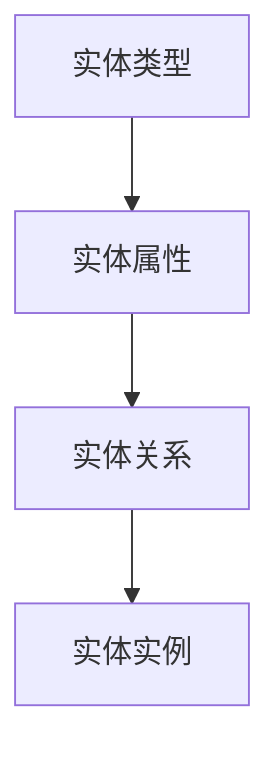
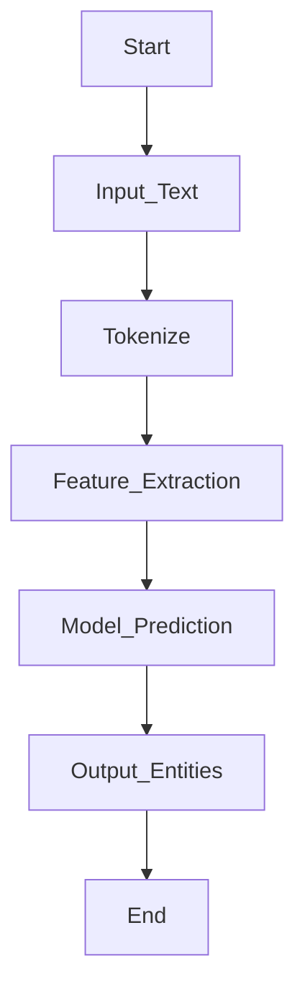
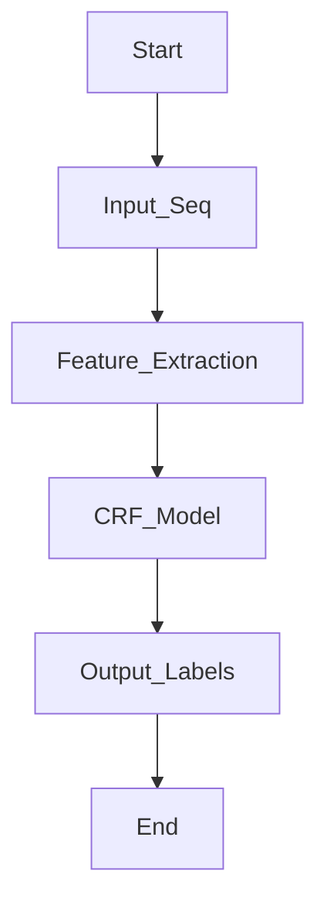
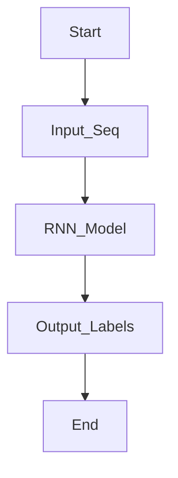
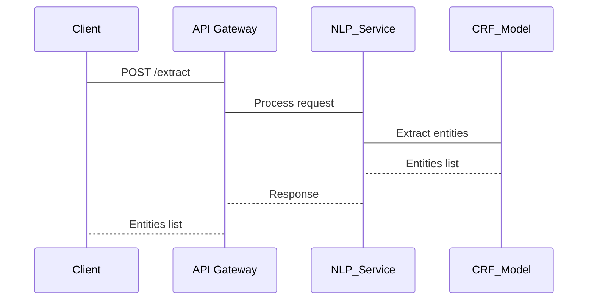

                 


# 实体提取：增强AI Agent的信息处理能力

## 关键词：
实体提取，自然语言处理，AI Agent，信息抽取，知识图谱，机器学习，条件随机场

## 摘要：
实体提取是自然语言处理中的关键任务，用于从文本中识别和抽取命名实体，从而增强AI Agent的信息处理能力。本文系统地介绍实体提取的核心概念、算法原理、系统架构以及实战项目，深入探讨其在AI Agent中的应用，帮助读者全面理解和掌握这一技术。

---

# 第一部分: 实体提取概述

## 第1章: 实体提取的背景与概念

### 1.1 实体提取的定义与背景
实体提取（Entity Extraction）是从文本中识别和抽取命名实体（如人名、组织名、地点、日期等）的过程。它是自然语言处理（NLP）的核心任务之一，广泛应用于信息抽取、问答系统、知识图谱构建等领域。

#### 1.1.1 实体提取的定义
实体提取的目标是从非结构化的文本中识别出特定的实体，并标注其类型和属性。例如，从新闻文章中提取“张三”（人名）和“谷歌”（公司名）。

#### 1.1.2 实体提取的背景与重要性
随着AI Agent的需求增加，实体提取的重要性日益凸显。AI Agent需要从海量文本中快速获取关键信息，实体提取为其提供了高效的信息处理能力。例如，在客服机器人中，提取客户的问题关键词（如“订单号”）可以提高响应效率。

#### 1.1.3 实体提取与AI Agent的关系
AI Agent需要理解用户输入的自然语言文本，并执行相应操作。实体提取帮助AI Agent从文本中提取关键信息，例如从用户的问题中提取日期、地点或人名，从而提高处理效率和准确性。

### 1.2 实体提取的核心概念
实体提取涉及多个核心概念，包括实体类型、实体属性和实体关系。

#### 1.2.1 实体类型与属性
- **实体类型**：常见的实体类型包括人名（PER）、组织名（ORG）、地点（LOC）、时间（TIME）等。
- **实体属性**：实体的属性描述了其实体的额外信息，例如“张三是工程师”。

#### 1.2.2 实体提取的关键特征
- **准确性**：正确识别实体。
- **可扩展性**：支持多种实体类型。
- **上下文感知**：考虑文本的上下文信息。

#### 1.2.3 实体提取的边界与外延
- **边界**：实体提取通常在单文档或短文本范围内进行。
- **外延**：扩展到跨文档实体链接和知识图谱构建。

### 1.3 实体提取与相关技术的联系
实体提取与其他NLP技术密切相关。

#### 1.3.1 实体提取与信息抽取
信息抽取是从文本中提取结构化信息，实体提取是其核心步骤之一。

#### 1.3.2 实体提取与信息检索
实体提取帮助信息检索系统更好地理解查询意图，提高检索准确性。

#### 1.3.3 实体提取与知识图谱
实体提取是构建知识图谱的基础，用于从文本中提取实体及其关系。

---

## 第2章: 实体提取的核心概念与联系

### 2.1 实体提取的原理
实体提取的实现依赖于模式匹配和机器学习两种方法。

#### 2.1.1 基于模式匹配的实体提取
基于规则的方法通过预定义的正则表达式匹配文本中的实体。例如，匹配日期的模式可以是`\d{4}-\d{2}-\d{2}`。

#### 2.1.2 基于机器学习的实体提取
基于机器学习的方法（如CRF和RNN）通过训练数据学习实体的特征，自动识别实体。

#### 2.1.3 实体提取的模式对比
| 方法 | 优点 | 缺点 |
|------|------|------|
| 基于规则 | 实现简单 | 需手动编写规则，难以扩展 |
| 基于机器学习 | 高准确性 | 需大量标注数据，实现复杂 |

### 2.2 实体提取的ER实体关系图


### 2.3 实体提取的算法流程


---

## 第3章: 实体提取的算法原理

### 3.1 基于条件随机场（CRF）的实体提取
CRF是一种常用的实体提取算法，适用于序列标注任务。

#### 3.1.1 CRF算法的数学模型
CRF的条件概率公式如下：
$$ P(y|x) = \frac{1}{Z(x)} \exp\left(\sum_{i=1}^n \sum_{j=1}^k w_{y_{i-1}y_i} x_{ij}\right) $$
其中，$x_{ij}$是特征向量，$y_i$是标签。

#### 3.1.2 CRF算法的流程图


### 3.2 基于循环神经网络（RNN）的实体提取
RNN通过序列建模实现实体提取。

#### 3.2.1 RNN算法的流程图


---

## 第4章: 系统分析与架构设计

### 4.1 项目介绍
我们设计了一个基于CRF的实体提取系统，用于从新闻文本中提取人名、组织名和地点。

#### 4.1.1 项目功能
- 文本输入
- 实体抽取
- 结果输出

#### 4.1.2 系统架构
```mermaid
graph TD
    Client --> HTTP_Request
    HTTP_Request --> API Gateway
    API Gateway --> NLP_Service
    NLP_Service --> CRF_Model
    CRF_Model --> Output
    Output --> HTTP_Response
    HTTP_Response --> Client
```

#### 4.1.3 接口设计
系统提供RESTful API接口，支持POST请求，输入文本，返回实体列表。

#### 4.1.4 交互序列图


---

## 第5章: 项目实战

### 5.1 环境安装
安装Python和相关库：
```bash
pip install python-crfsuite
pip install numpy
pip install scikit-learn
```

### 5.2 系统核心实现源代码
```python
import crfsuite

def main():
    # 示例文本
    text = "张三是中国的著名科学家。"
    
    # 分词
    tokens = text.split()
    
    # 特征提取
    features = []
    for i, token in enumerate(tokens):
        feature = {
            'word': token,
            'position': i
        }
        features.append(feature)
    
    # 使用CRF模型预测
    model = crfsuite.CRF()
    model.train(features)
    
    # 预测结果
    predicted_labels = model.predict(features)
    
    # 提取实体
    entities = []
    for i, (token, label) in enumerate(zip(tokens, predicted_labels)):
        if label == 'PER':
            entities.append(token)
    
    print("提取的实体：", entities)

if __name__ == "__main__":
    main()
```

### 5.3 代码实现与分析
- **分词**：将文本分割为单词。
- **特征提取**：为每个单词提取位置特征。
- **模型训练**：使用CRF模型训练特征。
- **实体提取**：根据预测标签提取实体。

### 5.4 案例分析
输入文本：“李四是北京的市长。”
输出实体：李四（人名）

### 5.5 项目小结
通过该项目，我们展示了实体提取的实际应用，验证了CRF模型的有效性。

---

## 第6章: 最佳实践

### 6.1 小结
实体提取是AI Agent的关键技术，通过模式匹配和机器学习算法实现。

### 6.2 注意事项
- 数据标注需要高质量。
- 模型调参会影响性能。
- 实体关系提取需要额外的语义分析。

### 6.3 拓展阅读
- 《自然语言处理实战》
- 《深度学习中的序列模型》

---

# 结语
实体提取是AI Agent增强信息处理能力的核心技术。通过本文的系统讲解，读者可以全面掌握实体提取的概念、算法和应用。希望本文能为读者在AI Agent开发中提供有价值的参考。

--- 

如果需要更详细的内容，可以进一步扩展每个部分的具体实现细节和应用场景。

