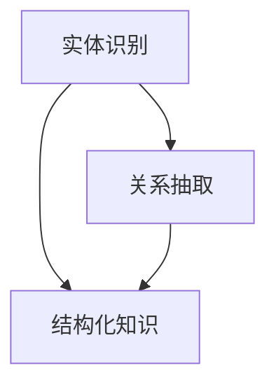
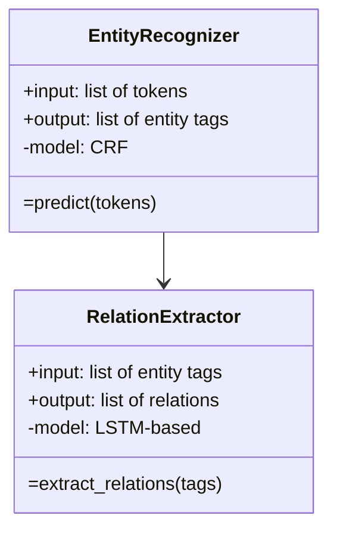

                 


# 实体识别与关系抽取：增强AI Agent的理解深度

**关键词**：实体识别，关系抽取，自然语言处理，AI Agent，深度学习

**摘要**：  
实体识别（NER）和关系抽取（RE）是自然语言处理中的两项关键技术，旨在帮助AI Agent从文本中提取结构化的信息。本文深入探讨了实体识别和关系抽取的背景、核心概念、算法原理、系统架构设计、项目实战以及高级应用，结合实际案例和代码示例，全面解析如何通过这两项技术提升AI Agent的理解深度。文章还总结了最佳实践和注意事项，为读者提供实用的指导。

---

## 第1章: 实体识别与关系抽取的背景与概念

### 1.1 问题背景与概念结构

#### 1.1.1 当前AI Agent的发展现状
AI Agent需要在复杂环境中理解、推理和执行任务。然而，文本信息的复杂性和歧义性使得AI Agent难以准确理解输入的内容。实体识别（NER）和关系抽取（RE）技术能够从非结构化文本中提取结构化的信息，为AI Agent提供更精确的输入，从而增强其理解和执行任务的能力。

#### 1.1.2 实体识别与关系抽取的重要性
- **实体识别**：通过识别文本中的实体（如人名、地名、组织名等），帮助AI Agent理解文本中的关键对象。
- **关系抽取**：通过识别实体之间的关系（如“是”、“属于”、“导致”等），帮助AI Agent理解实体之间的联系。
- **重要性**：这两项技术能够将非结构化的文本信息转化为结构化的知识，为后续的分析和推理提供基础。

#### 1.1.3 解决思路与边界
- **解决思路**：首先通过实体识别提取文本中的关键实体，然后通过关系抽取分析这些实体之间的关系，最终构建出一个结构化的知识图谱。
- **边界**：实体识别主要关注实体的识别，不涉及实体的分类或属性提取；关系抽取关注实体之间的关系，不涉及关系的分类或权重计算。

### 1.2 实体识别与关系抽取的核心概念

#### 1.2.1 实体识别的核心原理
- **基于规则的方法**：通过预定义的规则（如正则表达式）匹配特定的实体模式。
- **基于统计的方法**：利用机器学习模型（如CRF）从上下文中学习实体的特征。
- **基于深度学习的方法**：使用神经网络模型（如LSTM、BERT）从上下文中提取特征。

#### 1.2.2 关系抽取的核心原理
- **基于模式匹配的方法**：通过预定义的关系模式匹配文本中的关系。
- **基于语义角色标注的方法**：通过分析句子的语义结构提取关系。
- **基于深度学习的方法**：使用神经网络模型（如LSTM、Transformer）从上下文中学习关系的特征。

#### 1.2.3 实体识别与关系抽取的关系图


---

## 第2章: 实体识别与关系抽取的核心算法原理

### 2.1 实体识别的算法原理

#### 2.1.1 基于CRF的实体识别算法
CRF（Conditional Random Field）是一种用于序列标注的无向图模型，常用于实体识别任务。其核心思想是将每个位置的标签与相邻位置的标签进行条件依赖，从而提高模型的准确性。

**数学模型**：
$$
P(y_i | y_{i-1}, x) = \frac{1}{Z} \exp\left(\sum_{k=1}^n w_k f_k(y_{i-1}, y_i, x)\right)
$$
其中，$w_k$ 是权重，$f_k$ 是特征函数，$Z$ 是归一化因子。

**代码示例**：
```python
import numpy as np
from sklearn_crfsuite import CRF
from sklearn_crfsuite import features

# 示例数据
X = [[...], [...], ...]
y = ['O', 'B-LOC', 'I-LOC', ...]

# 模型训练
crf = CRF(feature_extractor=features.ExactFeatureExtractor(), 
          model parms={'max_iterations': 100})
crf.fit(X, y)
```

### 2.2 关系抽取的算法原理

#### 2.2.1 基于注意力机制的关系抽取算法
注意力机制能够帮助模型关注文本中重要的部分，从而提高关系抽取的准确性。其核心思想是通过计算每个位置的注意力权重，将上下文的信息聚合起来，用于关系分类。

**数学模型**：
$$
\alpha_i = \frac{\exp(e_i)}{\sum_{j=1}^n \exp(e_j)}
$$
其中，$e_i$ 是第i个位置的注意力得分。

**代码示例**：
```python
import tensorflow as tf
from tensorflow.keras.layers import Dense, Dropout, GlobalAveragePooling1D, Attention

# 示例数据
input_word_embeddings = tf.keras.Input(shape=(None, embedding_dim))
x = GlobalAveragePooling1D()(input_word_embeddings)
x = Dropout(0.2)(x)
x = Dense(128, activation='relu')(x)
x = Attention(use_masking=False)(x)
output = Dense(num_classes, activation='softmax')(x)

model = tf.keras.Model(inputs=input_word_embeddings, outputs=output)
model.compile(optimizer='adam', loss='sparse_categorical_crossentropy', metrics=['accuracy'])
```

---

## 第3章: 实体识别与关系抽取的系统分析与架构设计

### 3.1 系统功能设计

#### 3.1.1 领域模型设计


#### 3.1.2 系统架构设计
```mermaid
architecturalDiagram
    component Web Frontend {
        - User Interface
        - API calls
    }
    component EntityRecognizer {
        - Input Processor
        - CRF Model
    }
    component RelationExtractor {
        - Input Processor
        - LSTM Model
    }
    Web Frontend --> EntityRecognizer
    Web Frontend --> RelationExtractor
```

---

## 第4章: 实体识别与关系抽取的项目实战

### 4.1 环境安装与数据准备

#### 4.1.1 环境安装
```bash
pip install numpy scikit-learn tensorflow keras
pip install spacy
pip install graphviz
```

#### 4.1.2 数据准备
```python
import spacy

nlp = spacy.load("en_core_web_sm")
text = "Apple is looking to buy a startup company in California."
doc = nlp(text)
```

---

## 第5章: 实体识别与关系抽取的高级应用与最佳实践

### 5.1 高级应用

#### 5.1.1 实体识别与关系抽取的联合学习
联合学习可以同时优化实体识别和关系抽取的任务，从而提高整体性能。

#### 5.1.2 预训练模型的迁移学习
使用预训练的BERT模型进行实体识别和关系抽取，可以利用其强大的上下文理解能力。

---

### 5.2 最佳实践 tips

- **数据预处理**：在实体识别和关系抽取任务中，数据预处理是关键。需要进行分词、停用词处理、词干提取等操作。
- **模型调优**：通过网格搜索或自动调参工具（如Hyperopt）优化模型参数。
- **结果评估**：使用准确率、召回率、F1分数等指标评估模型性能。
- **实时处理**：为了实现实时处理，可以将模型部署到云平台上，并使用API接口进行调用。

---

### 5.3 项目小结

通过本文的详细讲解，读者可以深入了解实体识别和关系抽取的核心概念、算法原理、系统架构设计以及项目实战。这些技术不仅能够帮助AI Agent更好地理解文本信息，还能够为后续的分析和推理提供坚实的基础。

---

## 附录: 参考文献与扩展阅读

1.《自然语言处理入门》
2.《深度学习入门》
3.《命名实体识别的算法与实现》
4.《关系抽取的算法与应用》

---

通过以上目录和内容的详细阐述，希望读者能够全面理解实体识别与关系抽取的技术细节，并能够在实际项目中灵活应用这些技术。

