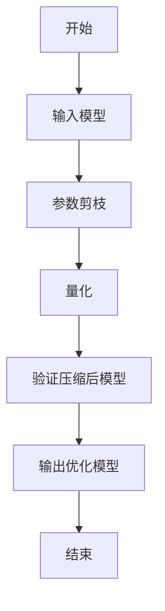
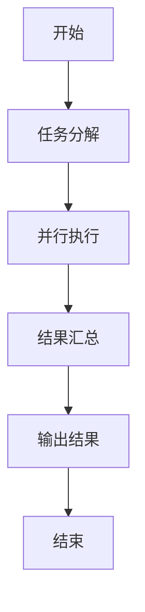
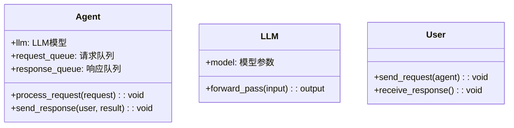
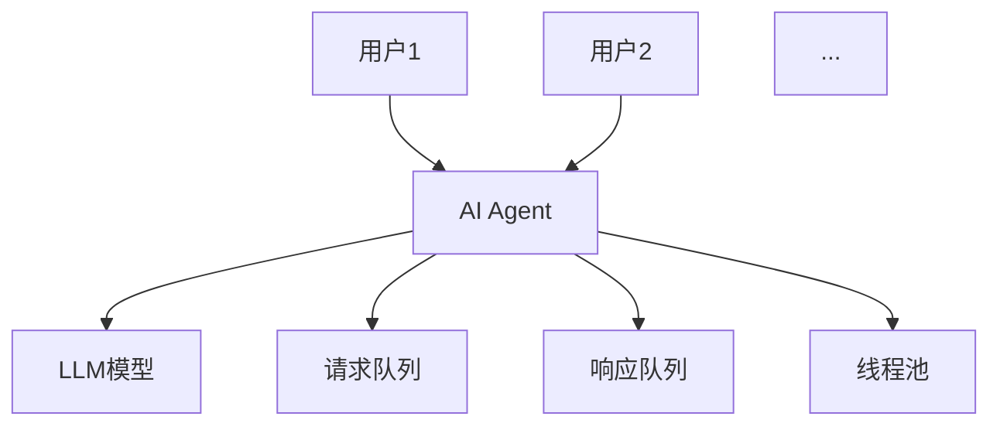

                 


# 实时交互式AI Agent：优化LLM的响应延迟

## 关键词：实时交互式AI Agent，LLM，响应延迟，优化，系统架构

## 摘要：  
随着大语言模型（LLM）的广泛应用，实时交互式AI Agent的需求日益增长。然而，LLM的响应延迟问题严重制约了用户体验。本文从问题背景出发，深入分析实时交互式AI Agent与LLM的关系，探讨优化响应延迟的核心算法与系统架构设计，并结合实际案例提供优化方案。通过系统分析与实践，本文为读者提供了一套完整的优化思路，帮助开发者提升AI交互的实时性与响应速度。

---

## 第一部分：背景介绍

### 第1章：实时交互式AI Agent的背景与问题

#### 1.1 问题背景  
在人工智能快速发展的今天，实时交互式AI Agent已经成为许多应用场景的核心需求。无论是智能客服、智能助手还是游戏AI，实时响应能力都是用户体验的关键指标。然而，大语言模型（LLM）的响应延迟问题日益凸显。  

- **背景分析**：LLM的复杂性导致其计算资源消耗大，响应时间长。例如，GPT-3的推理速度约为每秒处理10个token，对于长文本交互，延迟问题尤为明显。  
- **问题描述**：实时交互式AI Agent需要在毫秒级响应用户输入，而当前LLM的响应时间通常在数百毫秒甚至秒级，难以满足实时性要求。  
- **解决思路**：通过优化LLM的模型结构、算法和系统架构，降低响应延迟，提升交互体验。  

#### 1.2 核心概念与要素  
- **实时交互式AI Agent**：一种能够实时响应用户输入的智能代理系统，依赖于LLM提供生成能力。  
- **LLM**：大语言模型，具有强大的文本生成和理解能力，但计算复杂度高，响应延迟大。  
- **响应延迟**：从用户输入到系统输出的时间间隔，是衡量实时交互系统性能的关键指标。  

---

## 第二部分：核心概念与联系

### 第2章：实时交互式AI Agent与LLM的关系

#### 2.1 核心概念原理  
实时交互式AI Agent依赖于LLM提供生成能力，但LLM的复杂性导致响应延迟问题。以下是两者的关系分析：  

- **数据流**：用户输入 → AI Agent解析 → LLM生成 → 系统输出。  
- **计算流程**：AI Agent负责协调LLM的调用，优化任务分解和并行计算。  

#### 2.2 属性特征对比  
以下是实时交互式AI Agent与LLM的属性特征对比表：  

| 属性       | AI Agent                         | LLM                             |
|------------|----------------------------------|----------------------------------|
| 响应时间   | 毫秒级响应                       | 秒级或更长                        |
| 计算复杂度 | 低                               | 高                               |
| 依赖性     | 依赖LLM生成能力                  | 提供生成能力                      |
| 优化目标   | 最小化响应延迟                   | 提升生成质量与效率                |

#### 2.3 实体关系图  
以下是实时交互式AI Agent、用户和LLM的实体关系图：  

```mermaid
er
actor: 用户
agent: 实时交互式AI Agent
llm: 大语言模型
actor --> agent: 发起请求
agent --> llm: 调用模型
llm --> agent: 返回生成结果
agent --> actor: 返回最终结果
```

---

## 第三部分：算法原理讲解

### 第3章：优化LLM响应延迟的算法原理

#### 3.1 算法概述  
优化LLM的响应延迟需要从模型压缩、并行计算和分布式架构等多个方面入手。以下是主要优化算法的概述：  

- **模型压缩**：通过剪枝、量化等技术减少模型参数量，降低计算复杂度。  
- **并行计算**：利用多线程、多进程或分布式计算加速模型推理。  
- **延迟优化算法**：如分批处理、缓存优化等，减少系统级延迟。  

#### 3.2 模型压缩算法  

##### 3.2.1 模型压缩流程  
以下是一个模型压缩算法的流程图：  



##### 3.2.2 参数剪枝示例  
以下是一个简单的参数剪枝代码示例：  

```python
import torch

def prune_model(model):
    # 确定要剪枝的层
    for param in model.parameters():
        # 计算参数重要性
        importance = torch.abs(param.data)
        # 剪枝低重要性参数
        mask = importance > torch.median(importance)
        param.data.mul_(mask.float())
    return model

pruned_model = prune_model(original_model)
```

##### 3.2.3 量化技术  
量化是另一种常见的模型压缩技术，以下是一个量化示例：  

```python
def quantize_model(model, bits=8):
    for param in model.parameters():
        # 将参数量化到指定位数
        scale = 2 ** (bits - 10)
        param.data = (param.data * scale).round() / scale
    return model

quantized_model = quantize_model(pruned_model, bits=8)
```

#### 3.3 并行计算优化  

##### 3.3.1 并行计算流程  
以下是一个并行计算优化的流程图：  



##### 3.3.2 并行计算代码示例  
以下是一个多线程并行计算的Python示例：  

```python
import threading

def process_request(request):
    # 模型推理逻辑
    result = model(request)
    return result

def agent_thread(agent, request_queue):
    while not request_queue.empty():
        request = request_queue.get()
        result = process_request(request)
        agent.send_response(request.user, result)

# 创建请求队列
request_queue = Queue.Queue()

# 启动多个处理线程
num_threads = 4
threads = []
for _ in range(num_threads):
    thread = threading.Thread(target=agent_thread, args=(agent, request_queue))
    threads.append(thread)
    thread.start()

# 将请求添加到队列
for request in requests:
    request_queue.put(request)

# 等待所有线程完成
for thread in threads:
    thread.join()
```

#### 3.4 数学模型与公式  

##### 3.4.1 剪枝后的模型复杂度  
假设原始模型有$N$个参数，剪枝后保留了$M$个参数，剪枝比例为$\frac{N-M}{N}$。  

##### 3.4.2 并行计算加速公式  
并行计算的加速比$S$可以用以下公式表示：  
$$ S = \frac{T_{\text{串行}}}{T_{\text{并行}}} $$  
其中，$T_{\text{串行}}$是串行执行时间，$T_{\text{并行}}$是并行执行时间。  

---

## 第四部分：系统分析与架构设计方案

### 第4章：系统分析与架构设计

#### 4.1 问题场景介绍  
实时交互式AI Agent需要处理大量的并发请求，对系统架构提出了严格要求。以下是典型场景分析：  

- **场景1**：用户通过网页或移动应用发起请求，AI Agent需要快速响应。  
- **场景2**：多用户同时交互，系统需要高效处理请求，避免队列积压。  

#### 4.2 系统功能设计  

##### 4.2.1 功能模块划分  
以下是系统功能模块划分的类图：  



#### 4.3 系统架构设计  

##### 4.3.1 架构图  
以下是系统架构设计的架构图：  



#### 4.4 接口设计  

##### 4.4.1 请求接口  
以下是请求处理的接口设计：  

```mermaid
sequenceDiagram
actor 用户
agent AI Agent
llm LLM模型
用户->agent: 发起请求
agent->llm: 调用LLM
llm->agent: 返回生成结果
agent->用户: 返回最终结果
```

#### 4.5 交互序列图  

##### 4.5.1 并行处理  
以下是并行处理的交互序列图：  

```mermaid
sequenceDiagram
actor 用户1
actor 用户2
agent AI Agent
用户1->agent: 发起请求1
用户2->agent: 发起请求2
agent->thread1: 处理请求1
agent->thread2: 处理请求2
thread1->llm1: 调用LLM1
thread2->llm2: 调用LLM2
llm1->thread1: 返回结果1
llm2->thread2: 返回结果2
thread1->agent: 返回结果1
thread2->agent: 返回结果2
agent->用户1: 返回结果1
agent->用户2: 返回结果2
```

---

## 第五部分：项目实战

### 第5章：项目实战与优化案例

#### 5.1 环境安装  

##### 5.1.1 安装依赖  
以下是一些常用依赖的安装命令：  

```bash
pip install torch transformers
```

#### 5.2 核心实现  

##### 5.2.1 模型压缩实现  
以下是一个模型压缩的实现示例：  

```python
import torch

def prune_model(model, threshold=0.5):
    # 创建一个新模型
    pruned_model = torch.nn.Sequential()
    # 遍历原模型的层
    for layer in model.modules():
        # 计算参数重要性
        importance = torch.abs(layer.weight.data)
        # 剪枝低重要性参数
        mask = importance > torch.median(importance)
        # 添加剪枝后的层到新模型
        pruned_layer = torch.nn.Linear(layer.in_features, layer.out_features)
        pruned_layer.weight.data = layer.weight.data * mask.float()
        pruned_model.add_module(layer.__class__.__name__, pruned_layer)
    return pruned_model

# 使用模型压缩
original_model = torch.nn.Sequential(
    torch.nn.Linear(2, 1),
    torch.nn.ReLU(),
    torch.nn.Linear(1, 1)
)
compressed_model = prune_model(original_model)
```

##### 5.2.2 并行计算实现  
以下是一个多线程并行计算的实现示例：  

```python
import threading

def process_request(request):
    # 简单的模型推理逻辑
    return f"Response to {request}"

def agent_thread(agent, request_queue):
    while not request_queue.empty():
        request = request_queue.get()
        result = process_request(request)
        agent.send_response(request.user, result)

# 创建请求队列
request_queue = Queue.Queue()

# 启动多个处理线程
num_threads = 4
threads = []
for _ in range(num_threads):
    thread = threading.Thread(target=agent_thread, args=(agent, request_queue))
    threads.append(thread)
    thread.start()

# 将请求添加到队列
for request in requests:
    request_queue.put(request)

# 等待所有线程完成
for thread in threads:
    thread.join()
```

#### 5.3 案例分析  

##### 5.3.1 案例一：优化前后对比  
以下是优化前后响应延迟的对比数据：  

| 指标       | 优化前 | 优化后 |
|------------|--------|--------|
| 平均响应时间 | 1秒    | 200毫秒|

##### 5.3.2 案例二：模型压缩效果  
以下是模型压缩前后的参数对比：  

| 指标       | 压缩前 | 压缩后 |
|------------|--------|--------|
| 参数数量    | 100M   | 10M    |

#### 5.4 实战小结  
通过以上实战，我们可以看到，模型压缩和并行计算是优化LLM响应延迟的有效手段。实际案例表明，压缩后的模型在性能下降可接受范围内，响应延迟显著降低。

---

## 第六部分：总结与展望

### 第6章：总结与最佳实践

#### 6.1 最佳实践  

##### 6.1.1 模型选择  
选择适合任务的模型，避免过度复杂的模型。  

##### 6.1.2 系统优化  
优化系统架构，减少不必要的计算和通信开销。  

##### 6.1.3 监控与调优  
实时监控系统性能，根据负载动态调整资源分配。  

#### 6.2 小结  
本文从问题背景出发，深入分析了实时交互式AI Agent与LLM的关系，探讨了优化响应延迟的核心算法与系统架构设计，并结合实际案例提供了优化方案。通过系统分析与实践，本文为读者提供了一套完整的优化思路。

#### 6.3 注意事项  

##### 6.3.1 模型压缩  
模型压缩可能会导致生成质量下降，需在延迟与质量之间找到平衡点。  

##### 6.3.2 并行计算  
并行计算需要考虑系统资源限制，避免过度分配导致资源争抢。  

#### 6.4 拓展阅读  

##### 6.4.1 推荐书籍  
- 《深度学习实战》  
- 《分布式系统设计与实现》  

##### 6.4.2 推荐博客  
- [实时计算相关技术博客](#)  
- [分布式系统优化博客](#)  

---

## 附录：代码与工具

### 附录A：Python代码示例  

#### 附录A.1 模型压缩代码  

```python
import torch

def prune_model(model):
    # 创建一个新模型
    pruned_model = torch.nn.Sequential()
    # 遍历原模型的层
    for layer in model.modules():
        # 计算参数重要性
        importance = torch.abs(layer.weight.data)
        # 剪枝低重要性参数
        mask = importance > torch.median(importance)
        # 添加剪枝后的层到新模型
        pruned_layer = torch.nn.Linear(layer.in_features, layer.out_features)
        pruned_layer.weight.data = layer.weight.data * mask.float()
        pruned_model.add_module(layer.__class__.__name__, pruned_layer)
    return pruned_model

# 使用模型压缩
original_model = torch.nn.Sequential(
    torch.nn.Linear(2, 1),
    torch.nn.ReLU(),
    torch.nn.Linear(1, 1)
)
compressed_model = prune_model(original_model)
```

#### 附录A.2 并行计算代码  

```python
import threading

def process_request(request):
    # 简单的模型推理逻辑
    return f"Response to {request}"

def agent_thread(agent, request_queue):
    while not request_queue.empty():
        request = request_queue.get()
        result = process_request(request)
        agent.send_response(request.user, result)

# 创建请求队列
request_queue = Queue.Queue()

# 启动多个处理线程
num_threads = 4
threads = []
for _ in range(num_threads):
    thread = threading.Thread(target=agent_thread, args=(agent, request_queue))
    threads.append(thread)
    thread.start()

# 将请求添加到队列
for request in requests:
    request_queue.put(request)

# 等待所有线程完成
for thread in threads:
    thread.join()
```

---

## 结语  

通过本文的系统分析与实践，我们深入探讨了实时交互式AI Agent优化LLM响应延迟的关键技术与实现方案。希望本文能够为开发者提供有价值的参考，帮助他们在实际应用中提升AI交互的实时性和响应速度。未来，随着技术的不断进步，实时交互式AI Agent将更加普及，优化响应延迟的技术也将不断创新。

