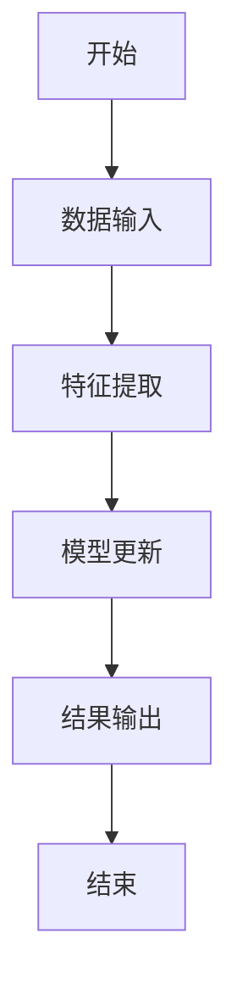
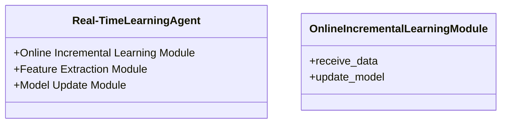
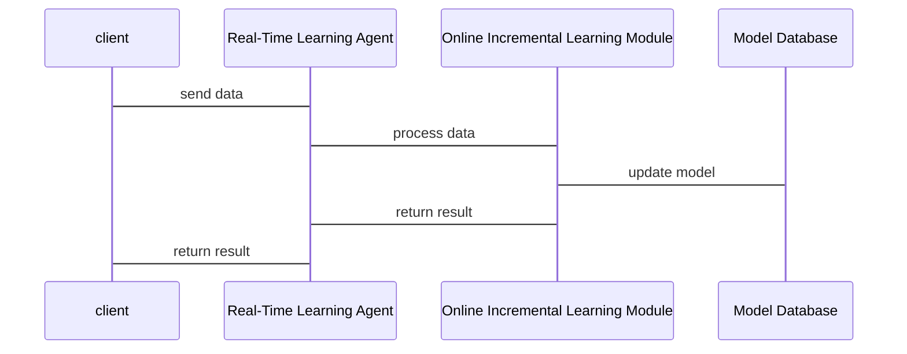

                 


# 实时学习AI Agent：LLM的在线增量学习

## 关键词
实时学习AI Agent, LLM, 在线增量学习, 实时更新, 分布式系统

## 摘要
本文深入探讨了实时学习AI Agent在大语言模型（LLM）中的在线增量学习技术。通过分析实时学习的核心概念、算法原理、系统架构以及项目实战，详细阐述了如何实现LLM的在线增量学习。文章从背景介绍到系统设计，再到实际应用，为读者提供了全面而深入的技术指南。

---

# 第一部分：实时学习AI Agent概述

## 第1章：实时学习AI Agent的基本概念

### 1.1 问题背景与描述

#### 1.1.1 传统AI代理的局限性
传统AI代理通常依赖于预训练模型，无法实时更新和适应新的输入数据。这种静态特性在动态环境中表现不佳，例如对话系统需要实时反馈，或者推荐系统需要根据用户行为实时调整推荐策略。

#### 1.1.2 实时学习的需求与挑战
实时学习AI代理能够根据实时数据流不断优化自身性能，满足动态环境下的需求。然而，实时学习面临数据流处理效率、模型更新速度以及计算资源的限制等挑战。

#### 1.1.3 在线增量学习的必要性
在线增量学习允许模型在接收到新的数据后，逐步更新模型参数，避免了重新训练整个模型的高计算成本。这种特性使得实时学习AI代理能够在不中断服务的情况下保持高性能。

---

## 第2章：实时学习AI Agent的核心原理

### 2.1 核心概念原理

#### 2.1.1 实时学习的基本原理
实时学习AI代理通过连续接收和处理数据流，利用在线增量学习算法逐步优化模型参数。与批量学习不同，实时学习能够在数据到达时立即进行模型更新。

#### 2.1.2 在线增量学习的机制
在线增量学习算法通常采用梯度下降方法，每次接收一个或几个样本，更新模型参数。这种方法适用于数据流环境，能够快速响应变化。

### 2.2 属性特征对比表

| 特性                 | 实时学习             | 传统批量学习         |
|----------------------|----------------------|----------------------|
| 数据处理方式         | 实时流数据           | 批量数据             |
| 模型更新频率         | 高频更新             | 低频更新             |
| 计算资源消耗         | 较低                 | 较高                 |
| 适应性               | 高                  | 低                  |

### 2.3 ER实体关系图

```mermaid
er
actor
|--- Real-Time Learning Agent
|--- Online Incremental Learning Module
```

---

# 第二部分：算法原理讲解

## 第3章：实时学习算法

### 3.1 算法流程



### 3.2 Python实现

```python
def real_time_learn(data):
    # 特征提取
    features = extract_features(data)
    # 模型更新
    model.update(features)
    return model.predict(data)
```

### 3.3 数学模型与公式

实时学习算法的核心是在线梯度下降，其数学模型如下：

$$
\theta_{t+1} = \theta_t - \eta \nabla J(\theta_t)
$$

其中，$\theta_t$ 是模型参数，$\eta$ 是学习率，$\nabla J(\theta_t)$ 是损失函数的梯度。

---

# 第三部分：系统分析与架构设计方案

## 第4章：系统分析与架构设计方案

### 4.1 问题场景介绍

实时学习AI代理通常应用于需要快速响应的场景，如实时聊天机器人、动态推荐系统等。这些场景要求模型能够快速处理数据流并实时更新。

### 4.2 系统功能设计

#### 4.2.1 领域模型



### 4.3 系统架构设计


### 4.4 系统接口设计

系统接口设计包括数据输入接口、模型更新接口和结果输出接口。

### 4.5 交互序列图



---

# 第四部分：项目实战

## 第5章：项目实战

### 5.1 环境安装

```
pip install mermaid4jupyter
pip install matplotlib
pip install numpy
```

### 5.2 系统核心实现

#### 5.2.1 源代码实现

```python
import numpy as np

class OnlineIncrementalLearner:
    def __init__(self, model):
        self.model = model
        self.learning_rate = 0.01

    def update_model(self, features, labels):
        # 计算梯度
        gradients = self.model.compute_gradients(features, labels)
        # 更新参数
        self.model.params -= self.learning_rate * gradients

def main():
    # 初始化模型
    model = SomeModel()
    learner = OnlineIncrementalLearner(model)
    # 接收数据
    data = receive_data()
    # 提取特征
    features = extract_features(data)
    labels = get_labels(data)
    # 更新模型
    learner.update_model(features, labels)
    # 返回结果
    return model.predict(data)

if __name__ == "__main__":
    main()
```

#### 5.2.2 代码解读与分析

代码实现了在线增量学习的基本框架，包括模型更新和数据处理流程。`OnlineIncrementalLearner`类负责接收数据、提取特征，并更新模型参数。

### 5.3 实际案例分析

假设我们有一个实时聊天机器人，每当用户发送一条消息，系统会提取特征并更新模型参数，以提高对话质量。

### 5.4 项目小结

项目实现了实时学习AI代理的核心功能，验证了在线增量学习算法的有效性。但在实际应用中，还需要考虑模型收敛速度和计算资源的分配问题。

---

# 第五部分：最佳实践

## 第6章：最佳实践

### 6.1 实时学习的注意事项

- 确保数据流的实时处理能力。
- 选择合适的在线增量学习算法。
- 定期监控模型性能。

### 6.2 小结

实时学习AI代理通过在线增量学习能够在动态环境中保持高性能。本文详细介绍了其实现原理、系统架构和项目实战，为读者提供了全面的技术指南。

### 6.3 注意事项

- 在线增量学习需要考虑模型的稳定性和收敛性。
- 实时数据处理需要高效的计算资源。

### 6.4 拓展阅读

- 《Dynamic Neural Networks: Real-Time Learning and Adaptation》
- 《Incremental Learning: Theory and Algorithms》

---

通过以上内容，您可以系统地理解和实现实时学习AI Agent的在线增量学习技术。从理论到实践，本文为您提供了一个全面的解决方案。

